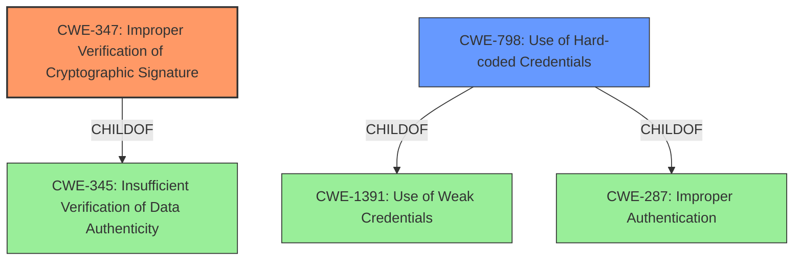

# Analysis Report for CVE-2020-23533

# Vulnerability Analysis Report: CVE-2020-23533

## Description


## Analysis (with Relationship Data)

# Summary
| CWE ID | CWE Name | Confidence | CWE Abstraction Level | CWE Vulnerability Mapping Label | CWE-Vulnerability Mapping Notes |
|---|---|---|---|---|---|
| CWE-347 | Improper Verification of Cryptographic Signature | 1.0 | Base | Allowed | Primary CWE |
| CWE-798 | Use of Hard-coded Credentials | 0.7 | Base | Allowed | Secondary Candidate |

## Evidence and Confidence

*   **Confidence Score:** 0.85
*   **Evidence Strength:** HIGH

## Relationship Analysis
The primary CWE is CWE-347, which is a Base level CWE. It is a child of CWE-345, Insufficient Verification of Data Authenticity, indicating a more general category of weakness. While CWE-345 is a Class, CWE-347 provides a more specific description of the vulnerability.
CWE-798 is also considered because the authentication code is generated based on a secret key which is NULL; this means the secret key can be considered hardcoded. CWE-798 is a peer of CWE-257 Storing Passwords in Recoverable Format. It is a child of CWE-1391 Use of Weak Credentials and CWE-287 Improper Authentication.



## Vulnerability Chain
The vulnerability chain starts with the **Improper Verification of Cryptographic Signature (CWE-347)**, specifically because the secret key is NULL, possibly leading to a **Use of Hard-coded Credentials (CWE-798)**. This allows attackers to craft authentication codes and shop for free.
Root Cause: **Improper Verification of Cryptographic Signature (CWE-347)**
Impact: Attackers can shop for free.

## Summary of Analysis
The initial analysis correctly identified CWE-347 as the primary weakness, supported by the vulnerability description which explicitly states "**Improper Verification of Cryptographic Signature**". The crafted authentication code (MAC) also aligns with the characteristics of CWE-347, further solidifying this mapping.

The retriever results also ranked CWE-347 as the top match, reinforcing the initial assessment.

The relationship analysis, particularly the parent-child relationship between CWE-347 and CWE-345, was crucial in confirming the specificity of the chosen CWE.

The final decision is based on the direct evidence from the vulnerability description, the retriever results, and the relationship analysis. CWE-347 is at the optimal level of specificity, as it directly addresses the improper verification of the cryptographic signature. CWE-798 is added as a secondary candidate because the authentication code is generated based on a secret key which is NULL; this means the secret key can be considered hardcoded.

Relevant CWE Information:

# Enhanced Context (25 CWEs)
The following CWEs were identified as potentially relevant to this vulnerability:

## CWE-330: Use of Insufficiently Random Values
**Abstraction Level**: Class
**Similarity Score**: 0.78
**Source**: dense

**Description**:
The product uses insufficiently random numbers or values in a security context that depends on unpredictable numbers.

**Mapping Guidance**:
- Usage: Discouraged
- Rationale: This CWE entry is a level-1 Class (i.e., a child of a Pillar). It might have lower-level children that would be more appropriate

## CWE-208: Observable Timing Discrepancy
**Abstraction Level**: Base
**Similarity Score**: 0.77
**Source**: dense

**Description**:
Two separate operations in a product require different amounts of time to complete, in a way that is observable to an actor and reveals security-relevant information about the state of the product, such as whether a particular operation was successful or not.

**Mapping Guidance**:
- Usage: Allowed
- Rationale: This CWE entry is at the Base level of abstraction, which is a preferred level of abstraction for mapping to the root causes of vulnerabilities.

## CWE-1391: Use of Weak Credentials
**Abstraction Level**: Class
**Similarity Score**: 0.77
**Source**: dense

**Description**:
The product uses weak credentials (such as a default key or hard-coded password) that can be calculated, derived, reused, or guessed by an attacker.

**Mapping Guidance**:
- Usage: Allowed-with-Review
- Rationale: This CWE entry is a Class and might have Base-level children that would be more appropriate

## CWE-345: Insufficient Verification of Data Authenticity
**Abstraction Level**: Class
**Similarity Score**: 0.77
**Source**: dense

**Description**:
The product does not sufficiently verify the origin or authenticity of data, in a way that causes it to accept invalid data.

**Mapping Guidance**:
- Usage: Discouraged
- Rationale: This CWE entry is a level-1 Class (i.e., a child of a Pillar). It might have lower-level children that would be more appropriate

## CWE-331: Insufficient Entropy
**Abstraction Level**: Base
**Similarity Score**: 0.76
**Source**: dense

**Description**:
The product uses an algorithm or scheme that produces insufficient entropy, leaving patterns or clusters of values that are more likely to occur than others.

**Mapping Guidance**:
- Usage: Allowed
- Rationale: This CWE entry is at the Base level of abstraction, which is a preferred level of abstraction for mapping to the root causes of vulnerabilities.

## CWE-341: Predictable from Observable State
**Abstraction Level**: Base
**Similarity Score**: 0.76
**Source**: dense

**Description**:
A number or object is predictable based on observations that the attacker can make about the state of the system or network, such as time, process ID, etc.

**Mapping Guidance**:
- Usage: Allowed
- Rationale: This CWE entry is at the Base level of abstraction, which is a preferred level of abstraction for mapping to the root causes of vulnerabilities.

## CWE-203: Observable Discrepancy
**Abstraction Level**: Base
**Similarity Score**: 0.76
**Source**: dense

**Description**:
The product behaves differently or sends different responses under different circumstances in a way that is observable to an unauthorized actor, which exposes security-relevant information about the state of the product, such as whether a particular operation was successful or not.

**Mapping Guidance**:
- Usage: Allowed
- Rationale: This CWE entry is at the Base level of abstraction, which is a preferred level of abstraction for mapping to the root causes of vulnerabilities.

## CWE-340: Generation of Predictable Numbers or Identifiers
**Abstraction Level**: Class
**Similarity Score**: 0.75
**Source**: dense

**Description**:
The product uses a scheme that generates numbers or identifiers that are more predictable than required.

**Mapping Guidance**:
- Usage: Allowed-with-Review
- Rationale: This CWE entry is a Class and might have Base-level children that would be more appropriate

## CWE-656: Reliance on Security Through Obscurity
**Abstraction Level**: Class
**Similarity Score**: 0.75
**Source**: dense

**Description**:
The product uses a protection mechanism whose strength depends heavily on its obscurity, such that knowledge of its algorithms or key data is sufficient to defeat the mechanism.

**Mapping Guidance**:
- Usage: Allowed-with-Review
- Rationale: This CWE entry is a Class and might have Base-level children that would be more appropriate

## CWE-807: Reliance on Untrusted Inputs in a Security Decision
**Abstraction Level**: Base
**Similarity Score**: 0.75
**Source**: dense

**Description**:
The product uses a protection mechanism that relies on the existence or values of an input, but the input can be modified by an untrusted actor in a way that bypasses the protection mechanism.

**Mapping Guidance**:
- Usage: Allowed
- Rationale: This CWE entry is at the Base level of abstraction, which is a preferred level of abstraction for mapping to the root causes of vulnerabilities.

## CWE-203: Observable Discrepancy
**Abstraction Level**: Base
**Similarity Score**: 5245.85
**Source**: sparse

**Description


## CWE Relationship Analysis

Current CWEs represent these abstraction levels: .


### Vulnerability Chain Analysis

**Chain starting from CWE-331:**
- 331 (Insufficient Entropy) - ROOT


**Chain starting from CWE-807:**
- 807 (Reliance on Untrusted Inputs in a Security Decision) - ROOT


### CWE Relationship Diagram

```mermaid
graph TD
    classDef primary fill:#f96,stroke:#333,stroke-width:2px
    classDef secondary fill:#69f,stroke:#333
    classDef tertiary fill:#9e9,stroke:#333
```


*Report generated on 2025-04-02 08:07:13*
