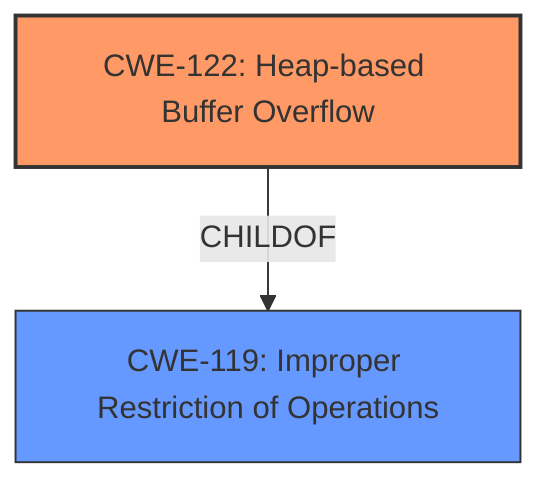

# Analysis Report for CVE-2020-23706

# Vulnerability Analysis Report: CVE-2020-23706

## Description


## Analysis (with Relationship Data)

# Summary
| CWE ID  | CWE Name                                                                    | Confidence | CWE Abstraction Level | CWE Vulnerability Mapping Label | CWE-Vulnerability Mapping Notes |
| :-------- | :-------------------------------------------------------------------------- | :--------- | :---------------------- | :------------------------------ | :------------------------------ |
| CWE-122   | Heap-based Buffer Overflow                                                    | 1.0        | Variant                 | Primary                       | Allowed                       |
| CWE-119   | Improper Restriction of Operations within the Bounds of a Memory Buffer | 0.75       | Class                   | Secondary                     | Discouraged                    |

## Evidence and Confidence

*   **Confidence Score:** 0.9
*   **Evidence Strength:** HIGH

## Relationship Analysis
The primary relationship that influenced my decision was the parent-child relationship between CWE-119 and CWE-122. CWE-122 is a variant (child) of CWE-119, making it a more specific classification for a heap-based buffer overflow. While CWE-119 is a broader class, the description clearly indicates the overflow occurs on the heap, warranting the use of CWE-122.



## Vulnerability Chain
The vulnerability chain starts with a crafted JPEG file that, when processed by the `ok_jpg_decode_block_subsequent_scan` function, leads to a **heap-based buffer overflow**. This results in a Denial of Service (DoS). The chain is:

1.  Crafted JPEG file (Input)
2.  `ok_jpg_decode_block_subsequent_scan` function (**Root Cause:** Heap-based Buffer Overflow - CWE-122)
3.  Denial of Service (DoS) (Impact)

## Summary of Analysis
The initial analysis focused on identifying the **heap-based buffer overflow** as the primary weakness. The evidence from the vulnerability description and CVE reference links content summary clearly supports this classification. The relationship analysis confirmed that CWE-122 is a specific variant of the more general CWE-119, which is **Improper Restriction of Operations within the Bounds of a Memory Buffer**.

The decision to use CWE-122 is strongly supported by the evidence. The vulnerability description explicitly states "A **heap-based buffer overflow** vulnerability". The CVE Reference Links Content Summary confirms the root cause is a **heap-buffer-overflow**.

The selection of CWE-122 is at the optimal level of specificity because it precisely describes the location of the overflow (heap) and the type of weakness (buffer overflow).

Relevant CWE Information:

# Enhanced Context (25 CWEs)

## CWE-131: Incorrect Calculation of Buffer Size
**Abstraction Level**: Base
**Similarity Score**: 0.79
**Source**: dense

**Description**:
The product does not correctly calculate the size to be used when allocating a buffer, which could lead to a buffer overflow.

**Mapping Guidance**:
- Usage: Allowed
- Rationale: This CWE entry is at the Base level of abstraction, which is a preferred level of abstraction for mapping to the root causes of vulnerabilities.

*This CWE was considered but not selected. While an incorrect calculation of buffer size could lead to a buffer overflow, there's no explicit evidence in the description to suggest this is the root cause. The description directly points to a heap-based buffer overflow, making CWE-122 a more accurate fit.*

## CWE-191: Integer Underflow (Wrap or Wraparound)
**Abstraction Level**: Base
**Similarity Score**: 0.79
**Source**: dense

**Description**:
The product subtracts one value from another, such that the result is less than the minimum allowable integer value, which produces a value that is not equal to the correct result.

**Mapping Guidance**:
- Usage: Allowed
- Rationale: This CWE entry is at the Base level of abstraction, which is a preferred level of abstraction for mapping to the root causes of vulnerabilities.

*This CWE was considered but not selected. Integer underflow is not mentioned or implied in the vulnerability description or reference summary. This CWE is not relevant.*

## CWE-805: Buffer Access with Incorrect Length Value
**Abstraction Level**: Base
**Similarity Score**: 0.78
**Source**: dense

**Description**:
The product uses a sequential operation to read or write a buffer, but it uses an incorrect length value that causes it to access memory that is outside of the bounds of the buffer.

**Mapping Guidance**:
- Usage: Allowed
- Rationale: This CWE entry is at the Base level of abstraction, which is a preferred level of abstraction for mapping to the root causes of vulnerabilities.

*This CWE was considered but not selected. The description mentions the function attempts to read data beyond the allocated buffer, but it's presented as a direct overflow rather than being explicitly tied to an incorrect length value used during access.*

## CWE-124: Buffer Underwrite ('Buffer Underflow')
**Abstraction Level**: Base
**Similarity Score**: 0.77
**Source**: dense

**Description**:
The product writes to a buffer using an index or pointer that references a memory location prior to the beginning of the buffer.

**Mapping Guidance**:
- Usage: Allowed
- Rationale: This CWE entry is at the Base level of abstraction, which is a preferred level of abstraction for mapping to the root causes of vulnerabilities.

*This CWE was considered but not selected. The vulnerability is a heap-based buffer overflow (overwrite), not an underflow.*

## CWE-681: Incorrect Conversion between Numeric Types
**Abstraction Level**: Base
**Similarity Score**: 0.76
**Source**: dense

**Description**:
When converting from one data type to another, such as long to integer, data can be omitted or translated in a way that produces unexpected values. If the resulting values are used in a sensitive context, then dangerous behaviors may occur.

**Mapping Guidance**:
- Usage: Allowed
- Rationale: This CWE entry is at the Base level of abstraction, which is a preferred level of abstraction for mapping to the root causes of vulnerabilities.

*This CWE was considered but not selected. There's no mention of incorrect conversion between numeric types in the vulnerability details. This CWE is not relevant.*

## CWE-126: Buffer Over-read
**Abstraction Level**: Variant
**Similarity Score**: 0.76
**Source**: dense

**Description**:
The product reads from a buffer using buffer access mechanisms such as indexes or pointers that reference memory locations after the targeted buffer.

**Mapping Guidance**:
- Usage: Allowed
- Rationale: This CWE entry is at the Variant level of abstraction, which is a preferred level of abstraction for mapping to the root causes of vulnerabilities.

*This CWE was considered but not selected. While "read data beyond the allocated buffer" is present in the description, the primary issue is a **heap-based buffer overflow** which implies a write operation past the buffer.*

## CWE-680: Integer Overflow to Buffer Overflow
**Abstraction Level**: Compound
**Similarity Score**: 0.76
**Source**: dense

**Description**:
The product performs a calculation to determine how much memory to allocate, but an integer overflow can occur that causes less memory to be allocated than expected, leading to a buffer overflow.

**Mapping Guidance**:
- Usage: Discouraged
- Rationale: This CWE entry is a named chain, which combines multiple weaknesses.

*This CWE was considered but not selected. This is a compound CWE. There is no evidence pointing to an integer overflow being the cause of the buffer overflow.*

## CWE-130: Improper Handling of Length Parameter Inconsistency
**Abstraction Level**: Base
**Similarity Score**: 0.76
**Source**: dense

**Description**:
The product parses a formatted message or structure, but it does not handle or incorrectly handles a length field that is inconsistent with the actual length of the associated data.

**Mapping Guidance**:
- Usage: Allowed
- Rationale: This CWE entry is at the Base level of abstraction, which is a preferred level of abstraction for mapping to the root causes of vulnerabilities.

*This CWE was considered but not selected. There is no evidence to suggest an issue with handling an inconsistent length parameter.*

## CWE-197: Numeric Truncation Error
**Abstraction Level**: Base
**Similarity Score**: 0.76
**Source**: dense

**Description**:
Truncation errors occur when a primitive is cast to a primitive of a smaller size and data is lost in the conversion.

**Mapping Guidance**:
- Usage: Allowed
- Rationale: This CWE entry is at the Base level of abstraction, which is a preferred level of abstraction for mapping to the root causes of vulnerabilities.

*This CWE was considered but not selected. This CWE is not relevant, there is no mention of numeric truncation.*

## CWE-193: Off-by-one Error
**Abstraction Level**: Base
**Similarity Score


## CWE Relationship Analysis

Current CWEs represent these abstraction levels: .


### Vulnerability Chain Analysis

**Chain starting from CWE-680:**
- 680 (Integer Overflow to Buffer Overflow) - ROOT


**Chain starting from CWE-805:**
- 805 (Buffer Access with Incorrect Length Value) - ROOT


### CWE Relationship Diagram

```mermaid
graph TD
    classDef primary fill:#f96,stroke:#333,stroke-width:2px
    classDef secondary fill:#69f,stroke:#333
    classDef tertiary fill:#9e9,stroke:#333
```


*Report generated on 2025-04-01 22:31:14*
