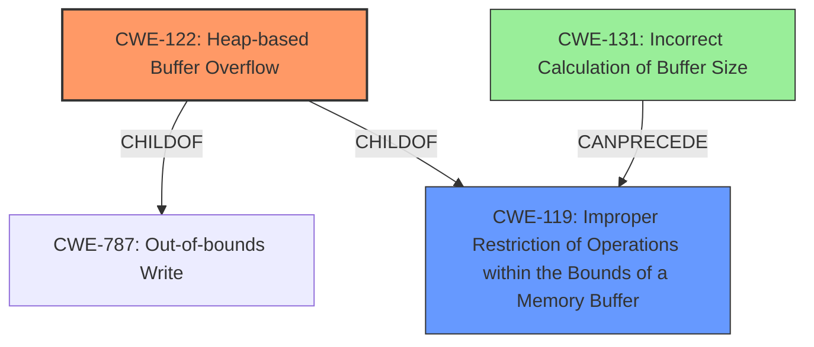

# Analysis for CVE-2020-23707

# Summary
| CWE ID | CWE Name | Confidence | CWE Abstraction Level | CWE Vulnerability Mapping Label | CWE-Vulnerability Mapping Notes |
|---|---|---|---|---|---|
| CWE-122 | Heap-based Buffer Overflow | 1.0 | Variant | Allowed | Primary CWE |
| CWE-119 | Improper Restriction of Operations within the Bounds of a Memory Buffer | 0.7 | Class | Discouraged | Secondary Candidate |
| CWE-131 | Incorrect Calculation of Buffer Size | 0.6 | Base | Allowed | Secondary Candidate |

## Evidence and Confidence

*   **Confidence Score:** 0.9
*   **Evidence Strength:** HIGH

## Relationship Analysis
The primary CWE is CWE-122, a Variant of CWE-787 (Out-of-bounds Write) and CWE-119 (Improper Restriction of Operations within the Bounds of a Memory Buffer). CWE-119 is a Class-level CWE, making CWE-122 a more specific and appropriate choice given the evidence. CWE-131 (Incorrect Calculation of Buffer Size) can precede CWE-119 and contribute to buffer overflows, but is not explicitly mentioned in the vulnerability description.

## Vulnerability Chain
The vulnerability chain involves a **heap-based buffer overflow** due to an unspecified error within the `ok_jpg_decode_block_progressive` function when processing a crafted JPEG file, leading to a denial of service. The root cause is likely an **improper** calculation or handling of buffer sizes (potentially CWE-131), which leads to the **buffer overflow** (CWE-122), ultimately resulting in a denial of service.

## Summary of Analysis
The initial assessment identifies a **heap-based buffer overflow** in the `ok_jpg_decode_block_progressive` function of ok-file-formats. This is supported by the "Vulnerability Description Key Phrases" which lists "**heap-based buffer overflow**" as a weakness and the "CVE Reference Links Content Summary" explicitly stating "The primary vulnerability is a heap-buffer-overflow." This evidence strongly supports CWE-122 as the primary CWE.

CWE-119 is a broader category, and while applicable, CWE-122 provides a more specific classification. The retriever results also show CWE-122 as a relevant option. The relationship graph shows CWE-122 as a child of CWE-119, further reinforcing the selection of the more specific variant.

CWE-131 (Incorrect Calculation of Buffer Size) is also considered, as it could be a contributing factor to the **buffer overflow**, but there is no direct evidence to confirm this. Therefore, it is a secondary candidate.

The final decision to classify the vulnerability as CWE-122 is based on the direct evidence of a **heap-based buffer overflow**, the hierarchical relationship between CWE-122 and CWE-119, and the mapping guidance favoring more specific variants. The evidence is clear and supports the selection of CWE-122 as the most accurate representation of the vulnerability.

Relevant CWE Information:

**CWE-122: Heap-based Buffer Overflow**

A heap overflow condition is a buffer overflow, where the buffer that can be overwritten is allocated in the heap portion of memory, generally meaning that the buffer was allocated using a routine such as malloc(). In this case, the vulnerability occurs in the `ok_jpg_decode_block_progressive` function, indicating that the buffer is likely allocated on the heap. This aligns perfectly with the definition of CWE-122. The impact of a heap-based buffer overflow can include program crash, potential arbitrary code execution, and denial of service, as stated in the "CVE Reference Links Content Summary".

**CWE-119: Improper Restriction of Operations within the Bounds of a Memory Buffer**

The product performs operations on a memory buffer, but it reads from or writes to a memory location outside the buffer's intended boundary. While this is true and a more general case of CWE-122, it is less specific.

**CWE-131: Incorrect Calculation of Buffer Size**

The product does not correctly calculate the size to be used when allocating a buffer, which could lead to a buffer overflow. This is a plausible root cause for the observed buffer overflow. While the description doesn't explicitly state an incorrect calculation, it's a reasonable assumption.