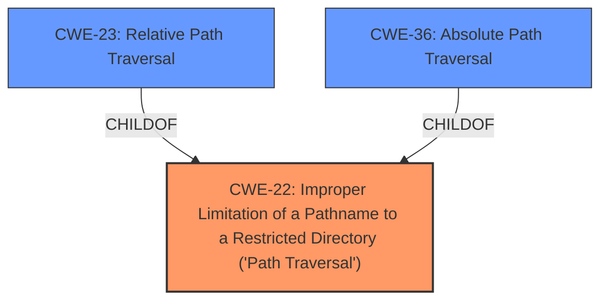

# Raw Analyzer Response for CVE-2020-23766

# Summary
| CWE ID | CWE Name | Confidence | CWE Abstraction Level | CWE Vulnerability Mapping Label | CWE-Vulnerability Mapping Notes |
|---|---|---|---|---|---|
| CWE-22 | Improper Limitation of a Pathname to a Restricted Directory ('Path Traversal') | 0.9 | Base | Allowed | Primary CWE |
| CWE-23 | Relative Path Traversal | 0.7 | Base | Allowed | Secondary Candidate |
| CWE-36 | Absolute Path Traversal | 0.6 | Base | Allowed | Secondary Candidate |

## Evidence and Confidence

*   **Confidence Score:** 0.9
*   **Evidence Strength:** HIGH

## Relationship Analysis
The primary CWE is CWE-22, which represents the core weakness of improper path limitation. CWE-23 and CWE-36 are both children of CWE-22, representing more specific types of path traversal. Specifically, CWE-23 focuses on relative path traversal using sequences like "..", while CWE-36 focuses on absolute path traversal using absolute paths.

## Vulnerability Chain
The vulnerability chain starts with the **improper validation** of user-supplied file paths, leading to path traversal. The attacker crafts a malicious request with an absolute path, which is then used by the application in the `unlink` function, resulting in **arbitrary file deletion**.

## Summary of Analysis
The initial analysis identified **CWE-22** as the primary weakness due to the **improper limitation of a pathname to a restricted directory**. The vulnerability description and the CVE Reference Links Content Summary support this, stating that the application **does not properly validate user-supplied file paths** and allows an attacker to use an absolute path to delete any file.

*Evidence: "The application does not properly validate user-supplied file paths before using them in the `unlink` function. Specifically, the `unlink` function is called on the user-provided `$_GET['file']` without any checks to ensure that the file is within the intended backup directory or that it exists."*

CWE-23 and CWE-36 were also considered because the description mentions absolute paths and the possibility of using ".." sequences for traversal. However, since the primary issue is the lack of proper validation and restriction of the path, CWE-22 is the most accurate and general representation of the vulnerability.

The selected CWEs are at the optimal level of specificity, with CWE-22 providing a general overview of the path traversal issue and CWE-23 and CWE-36 offering more specific details about the types of path traversal that could be exploited.

Relevant CWE Information:

# Enhanced Context (25 CWEs)

## CWE-274: Improper Handling of Insufficient Privileges
**Abstraction Level**: Base
**Similarity Score**: 0.77
**Source**: dense

**Description**:
The product does not handle or incorrectly handles when it has insufficient privileges to perform an operation, leading to resultant weaknesses.

**Mapping Guidance**:
- Usage: Discouraged
- Rationale: This CWE entry could be deprecated in a future version of CWE.

*Not Selected*: This is not about handling privileges, but about path traversal.

## CWE-280: Improper Handling of Insufficient Permissions or Privileges 
**Abstraction Level**: Base
**Similarity Score**: 0.77
**Source**: dense

**Description**:
The product does not handle or incorrectly handles when it has insufficient privileges to access resources or functionality as specified by their permissions. This may cause it to follow unexpected code paths that may leave the product in an invalid state.

**Mapping Guidance**:
- Usage: Allowed
- Rationale: This CWE entry is at the Base level of abstraction, which is a preferred level of abstraction for mapping to the root causes of vulnerabilities.

*Not Selected*: This is not about handling permissions, but about path traversal.

## CWE-23: Relative Path Traversal
**Abstraction Level**: Base
**Similarity Score**: 0.77
**Source**: dense

**Description**:
The product uses external input to construct a pathname that should be within a restricted directory, but it does not properly neutralize sequences such as ".." that can resolve to a location that is outside of that directory.

**Mapping Guidance**:
- Usage: Allowed
- Rationale: This CWE entry is at the Base level of abstraction, which is a preferred level of abstraction for mapping to the root causes of vulnerabilities.

*Selected as Secondary*: The vulnerability could involve relative path traversal, but the primary weakness is the lack of any path restriction.

## CWE-266: Incorrect Privilege Assignment
**Abstraction Level**: Base
**Similarity Score**: 0.77
**Source**: dense

**Description**:
A product incorrectly assigns a privilege to a particular actor, creating an unintended sphere of control for that actor.

**Mapping Guidance**:
- Usage: Allowed
- Rationale: This CWE entry is at the Base level of abstraction, which is a preferred level of abstraction for mapping to the root causes of vulnerabilities.

*Not Selected*: This is not about privilege assignment, but about path traversal.

## CWE-267: Privilege Defined With Unsafe Actions
**Abstraction Level**: Base
**Similarity Score**: 0.76
**Source**: dense

**Description**:
A particular privilege, role, capability, or right can be used to perform unsafe actions that were not intended, even when it is assigned to the correct entity.

**Mapping Guidance**:
- Usage: Allowed
- Rationale: This CWE entry is at the Base level of abstraction, which is a preferred level of abstraction for mapping to the root causes of vulnerabilities.

*Not Selected*: This is not about privileges, but about path traversal.

## CWE-59: Improper Link Resolution Before File Access ('Link Following')
**Abstraction Level**: Base
**Similarity Score**: 0.76
**Source**: dense

**Description**:
The product attempts to access a file based on the filename, but it does not properly prevent that filename from identifying a link or shortcut that resolves to an unintended resource.

**Mapping Guidance**:
- Usage: Allowed
- Rationale: This CWE entry is at the Base level of abstraction, which is a preferred level of abstraction for mapping to the root causes of vulnerabilities.

*Not Selected*: This is not about link following, but about path traversal.

## CWE-41: Improper Resolution of Path Equivalence
**Abstraction Level**: Base
**Similarity Score**: 0.76
**Source**: dense

**Description**:
The product is vulnerable to file system contents disclosure through path equivalence. Path equivalence involves the use of special characters in file and directory names. The associated manipulations are intended to generate multiple names for the same object.

**Mapping Guidance**:
- Usage: Allowed
- Rationale: This CWE entry is at the Base level of abstraction, which is a preferred level of abstraction for mapping to the root causes of vulnerabilities.

*Not Selected*: This is not about path equivalence, but about path traversal.

## CWE-552: Files or Directories Accessible to External Parties
**Abstraction Level**: Base
**Similarity Score**: 0.76
**Source**: dense

**Description**:
The product makes files or directories accessible to unauthorized actors, even though they should not be.

**Mapping Guidance**:
- Usage: Allowed
- Rationale: This CWE entry is at the Base level of abstraction, which is a preferred level of abstraction for mapping to the root causes of vulnerabilities.

*Not Selected*: This is not about file accessibility, but about path traversal leading to arbitrary file deletion.

## CWE-424: Improper Protection of Alternate Path
**Abstraction Level**: Class
**Similarity Score**: 0.75
**Source**: dense

**Description**:
The product does not sufficiently protect all possible paths that a user can take to access restricted functionality or resources.

**Mapping Guidance**:
- Usage: Allowed-with-Review
- Rationale: This CWE entry is a Class and might have Base-level children that would be more appropriate

*Not Selected*: Too general; CWE-22 is more specific.

## CWE-653: Improper Isolation or Compartmentalization
**Abstraction Level**: Class
**Similarity Score**: 0.75
**Source**: dense

**Description**:
The product does not properly compartmentalize or isolate functionality, processes, or resources that require different privilege levels, rights, or permissions.

**Mapping Guidance**:
- Usage: Allowed
- Rationale: This CWE entry is at the Base level of abstraction, which is a preferred level of abstraction for mapping to the root causes of vulnerabilities.

*Not Selected*: This is not about isolation or compartmentalization, but about path traversal.

## CWE-59: Improper Link Resolution Before File Access