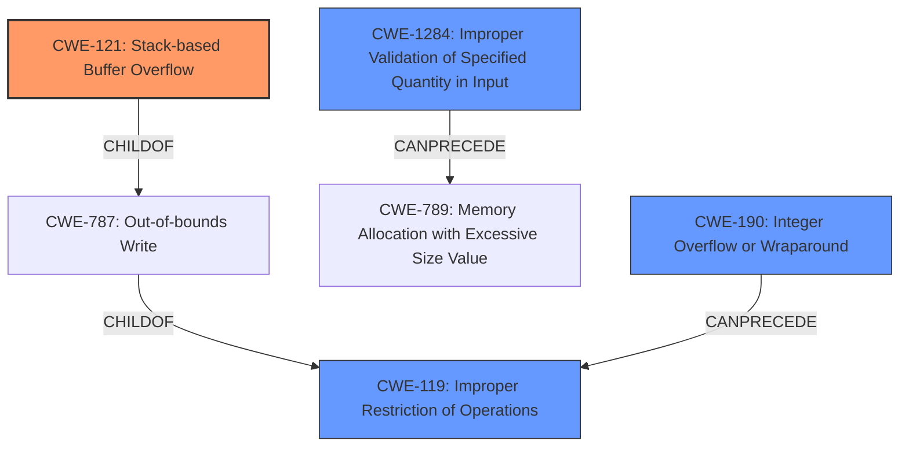

# Analysis Report for CVE-2020-23851

# Vulnerability Analysis Report: CVE-2020-23851

## Description


## Analysis (with Relationship Data)

# Summary
| CWE ID | CWE Name | Confidence | CWE Abstraction Level | CWE Vulnerability Mapping Label | CWE-Vulnerability Mapping Notes |
|---|---|---|---|---|---|
| CWE-121 | Stack-based Buffer Overflow | 1.0 | Variant | Allowed | Primary CWE |
| CWE-119 | Improper Restriction of Operations within the Bounds of a Memory Buffer | 0.7 | Class | Discouraged | Secondary Candidate |
| CWE-1284 | Improper Validation of Specified Quantity in Input | 0.6 | Base | Allowed | Secondary Candidate |
| CWE-190 | Integer Overflow or Wraparound | 0.5 | Base | Allowed | Secondary Candidate |

## Evidence and Confidence

*   **Confidence Score:** 0.9
*   **Evidence Strength:** HIGH

## Relationship Analysis
The primary CWE is CWE-121, a **Variant** of CWE-787 (Out-of-bounds Write) and CWE-788 (Access of Memory Location After the End of a Buffer). CWE-121 is a child of CWE-119 (Improper Restriction of Operations within the Bounds of a Memory Buffer), a more general **Class**-level CWE. CWE-1284 (Improper Validation of Specified Quantity in Input) can **precede** CWE-789 (Memory Allocation with Excessive Size Value), which can then lead to a buffer overflow. CWE-190 (Integer Overflow or Wraparound) can also **precede** CWE-119, leading to a buffer overflow if the overflowed value is used in a buffer size calculation.



## Vulnerability Chain
The vulnerability chain starts with potentially **Improper Validation of Specified Quantity in Input (CWE-1284)** or an **Integer Overflow (CWE-190)**, either of which leads to **Improper Restriction of Operations within the Bounds of a Memory Buffer (CWE-119)**, culminating in a **Stack-based Buffer Overflow (CWE-121)**.

## Summary of Analysis
The initial analysis correctly identified the vulnerability as a **stack-based buffer overflow**. The evidence provided strongly supports this classification. The key phrases clearly state "**stack-based buffer overflow**" as the **weakness**. The CVE Reference Links Content Summary confirms this by detailing how the `yuv_datbuf` array, allocated on the stack, is written to without proper bounds checking, leading to a stack overflow. The vulnerable code snippet reinforces this by showing the calculation of `x` and `y` indices used to access the `yuv_datbuf` array, and how these indices can be manipulated to cause an out-of-bounds write.

The decision to select CWE-121 is based on the clear evidence of a buffer overflow occurring on the stack. While CWE-119 is a broader category, CWE-121 provides a more specific classification. CWE-1284 and CWE-190 were considered as potential contributing factors, as the lack of input validation or an integer overflow could lead to the buffer overflow, but the core issue is the stack-based buffer overflow itself. Therefore, CWE-121 is the most appropriate primary CWE.

The selection of CWE-121 (Stack-based Buffer Overflow) is at the **Variant** level, which is the most specific level supported by the evidence. This aligns with the principle of preferring more detailed CWEs when the evidence supports it.

Relevant CWE Information:

# Enhanced Context (25 CWEs)
The following CWEs were identified as potentially relevant to this vulnerability:

## CWE-124: Buffer Underwrite ('Buffer Underflow')
**Abstraction Level**: Base
**Similarity Score**: 0.77
**Source**: dense

**Description**:
The product writes to a buffer using an index or pointer that references a memory location prior to the beginning of the buffer.

**Mapping Guidance**:
- Usage: Allowed
- Rationale: This CWE entry is at the Base level of abstraction, which is a preferred level of abstraction for mapping to the root causes of vulnerabilities.

**Why Not Used:** This CWE describes writing *before* the buffer, but the vulnerability is writing *after* the buffer, so it is not applicable.

## CWE-191: Integer Underflow (Wrap or Wraparound)
**Abstraction Level**: Base
**Similarity Score**: 0.76
**Source**: dense

**Description**:
The product subtracts one value from another, such that the result is less than the minimum allowable integer value, which produces a value that is not equal to the correct result.

**Mapping Guidance**:
- Usage: Allowed
- Rationale: This CWE entry is at the Base level of abstraction, which is a preferred level of abstraction for mapping to the root causes of vulnerabilities.

**Why Not Used:** While an integer issue *could* be present, there isn't direct evidence of an integer *underflow*, specifically.

## CWE-131: Incorrect Calculation of Buffer Size
**Abstraction Level**: Base
**Similarity Score**: 0.75
**Source**: dense

**Description**:
The product does not correctly calculate the size to be used when allocating a buffer, which could lead to a buffer overflow.

**Mapping Guidance**:
- Usage: Allowed
- Rationale: This CWE entry is at the Base level of abstraction, which is a preferred level of abstraction for mapping to the root causes of vulnerabilities.

**Why Not Used:** There is no explicit information about the buffer size calculation being incorrect, only that the input values are not validated before use in the buffer access, so this is not applicable.

## CWE-126: Buffer Over-read
**Abstraction Level**: Variant
**Similarity Score**: 0.75
**Source**: dense

**Description**:
The product reads from a buffer using buffer access mechanisms such as indexes or pointers that reference memory locations after the targeted buffer.

**Mapping Guidance**:
- Usage: Allowed
- Rationale: This CWE entry is at the Variant level of abstraction, which is a preferred level of abstraction for mapping to the root causes of vulnerabilities.

**Why Not Used:** This CWE describes reading out of bounds, but the vulnerability is writing out of bounds, so it is not applicable.

## CWE-805: Buffer Access with Incorrect Length Value
**Abstraction Level**: Base
**Similarity Score**: 0.74
**Source**: dense

**Description**:
The product uses a sequential operation to read or write a buffer, but it uses an incorrect length value that causes it to access memory that is outside of the bounds of the buffer.

**Mapping Guidance**:
- Usage: Allowed
- Rationale: This CWE entry is at the Base level of abstraction, which is a preferred level of abstraction for mapping to the root causes of vulnerabilities.

**Why Not Used:** There isn't sufficient evidence to say there is an explicit incorrect length value, but the length is based on unvalidated inputs, so this is not applicable.

## CWE-680: Integer Overflow to Buffer Overflow
**Abstraction Level**: Compound
**Similarity Score**: 0.74
**Source**: dense

**Description**:
The product performs a calculation to determine how much memory to allocate, but an integer overflow can occur that causes less memory to be allocated than expected, leading to a buffer overflow.

**Mapping Guidance**:
- Usage: Discouraged
- Rationale: This CWE entry is a named chain, which combines multiple weaknesses.

**Why Not Used:** This is a compound CWE, and there isn't clear evidence that an integer overflow leads to *memory allocation* issues. The integer overflow is only a potential issue, so this is not applicable.

## CWE-190: Integer Overflow or Wraparound
**Abstraction Level**: Base
**Similarity Score**: 0.74
**Source**: dense

**Description**:
The product performs a calculation that can
         produce an integer overflow or wraparound when the logic
         assumes that the resulting value will always be larger than
         the original value. This occurs when an integer value is
         incremented to a value that is too large to store in the
         associated representation. When


## CWE Relationship Analysis

Current CWEs represent these abstraction levels: .


### Vulnerability Chain Analysis

**Chain starting from CWE-121:**
- 121 (Stack-based Buffer Overflow) - ROOT


**Chain starting from CWE-787:**
- 787 (Out-of-bounds Write) - ROOT


### CWE Relationship Diagram

```mermaid
graph TD
    classDef primary fill:#f96,stroke:#333,stroke-width:2px
    classDef secondary fill:#69f,stroke:#333
    classDef tertiary fill:#9e9,stroke:#333
```


*Report generated on 2025-04-02 10:12:39*
