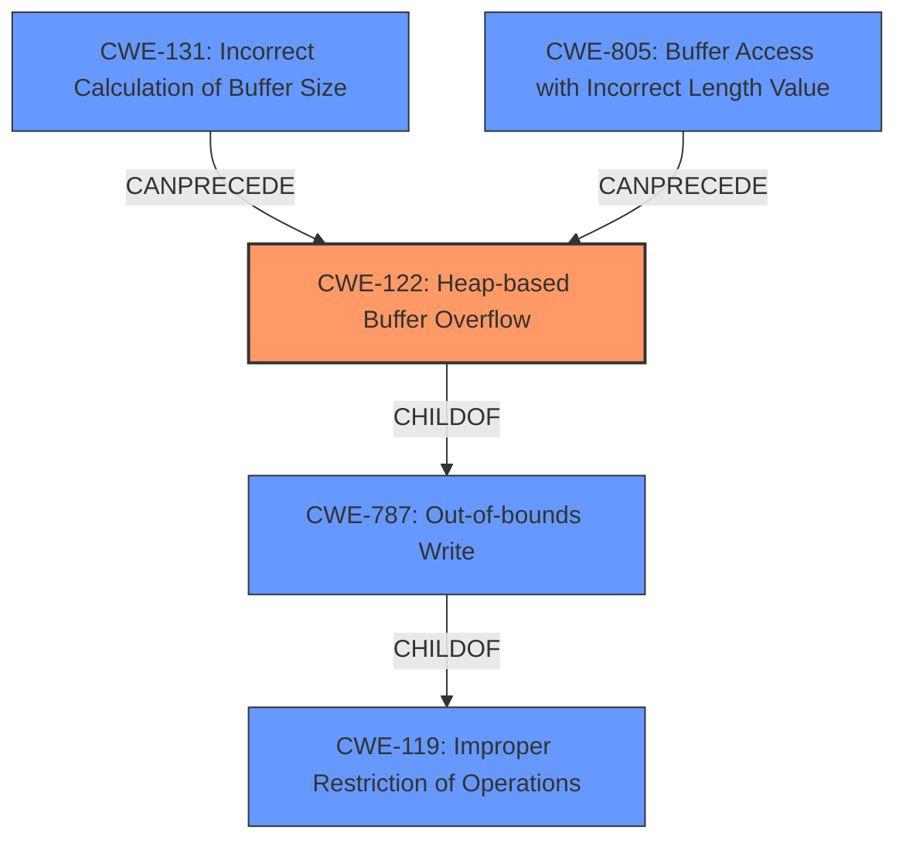

# Raw Analyzer Response for CVE-2020-23873

# Summary
| CWE ID    | CWE Name                                                                           | Confidence | CWE Abstraction Level | CWE Vulnerability Mapping Label | CWE-Vulnerability Mapping Notes |
| :-------- | :--------------------------------------------------------------------------------- | :--------- | :---------------------- | :------------------------------ | :------------------------------ |
| CWE-122   | Heap-based Buffer Overflow                                                         | 0.9        | Variant                 | Allowed                       | Primary CWE                     |
| CWE-119   | Improper Restriction of Operations within the Bounds of a Memory Buffer            | 0.6        | Class                   | Discouraged                     | Secondary Candidate             |
| CWE-787   | Out-of-bounds Write                                                                | 0.5        | Base                    | Allowed                       | Secondary Candidate             |
| CWE-131   | Incorrect Calculation of Buffer Size                                               | 0.4        | Base                    | Allowed                       | Secondary Candidate             |
| CWE-805   | Buffer Access with Incorrect Length Value                                          | 0.3        | Base                    | Allowed                       | Secondary Candidate             |

## Evidence and Confidence

*   **Confidence Score:** 0.9
*   **Evidence Strength:** HIGH

## Relationship Analysis
The primary relationship is that CWE-122 (Heap-based Buffer Overflow) is a variant of CWE-787 (Out-of-bounds Write), which in turn is a child of CWE-119 (Improper Restriction of Operations within the Bounds of a Memory Buffer). This hierarchical structure guided the selection of the most specific CWE available, which is CWE-122. CWE-131 and CWE-805 are related to the root cause of the heap overflow, which is **incorrect buffer size calculation or usage**, which is why these were considered.

## Vulnerability Chain
The vulnerability chain starts with an **incorrect calculation of the buffer size or incorrect length value** (CWE-131, CWE-805), leading to an out-of-bounds write (CWE-787) specifically on the heap (CWE-122). The impact is a crash and potential arbitrary code execution.

## Summary of Analysis
The initial description indicates a **heap-buffer overflow** in the function `TextPagedump`. The `CVE Reference Links Content Summary` provides more detailed information, specifying a "Heap Buffer Overflow in `TextPage::dump` due to insufficient size allocated for a buffer". This evidence strongly supports classifying the vulnerability as CWE-122 (Heap-based Buffer Overflow).

The Retriever Results list CWE-119 (Improper Restriction of Operations within the Bounds of a Memory Buffer) as the top result. However, the mapping guidance for CWE-119 discourages its use when more specific CWEs are available. Since the vulnerability is explicitly a heap-based buffer overflow, CWE-122 is more appropriate.

CWE-787 (Out-of-bounds Write) is a parent of CWE-122 and could be considered, but CWE-122 provides a more specific classification.

CWE-131 (Incorrect Calculation of Buffer Size) and CWE-805 (Buffer Access with Incorrect Length Value) are likely root causes that lead to the overflow, but are not the overflow itself.

Therefore, based on the evidence and relationship analysis, CWE-122 is the most accurate and specific classification for this vulnerability.

Relevant CWE Information:

# Enhanced Context (25 CWEs)
## CWE-191: Integer Underflow (Wrap or Wraparound)
**Abstraction Level**: Base
**Similarity Score**: 0.76
**Source**: dense

**Description**:
The product subtracts one value from another, such that the result is less than the minimum allowable integer value, which produces a value that is not equal to the correct result.

**Mapping Guidance**:
- Usage: Allowed
- Rationale: This CWE entry is at the Base level of abstraction, which is a preferred level of abstraction for mapping to the root causes of vulnerabilities.

**Why not used:** Integer underflow is not directly related to the description of a heap buffer overflow. The issue is insufficient buffer size not an arithmetic underflow.

## CWE-131: Incorrect Calculation of Buffer Size
**Abstraction Level**: Base
**Similarity Score**: 0.76
**Source**: dense

**Description**:
The product does not correctly calculate the size to be used when allocating a buffer, which could lead to a buffer overflow.

**Mapping Guidance**:
- Usage: Allowed
- Rationale: This CWE entry is at the Base level of abstraction, which is a preferred level of abstraction for mapping to the root causes of vulnerabilities.

**Why considered**: Considered as a contributing factor to the overflow.

## CWE-681: Incorrect Conversion between Numeric Types
**Abstraction Level**: Base
**Similarity Score**: 0.74
**Source**: dense

**Description**:
When converting from one data type to another, such as long to integer, data can be omitted or translated in a way that produces unexpected values. If the resulting values are used in a sensitive context, then dangerous behaviors may occur.

**Mapping Guidance**:
- Usage: Allowed
- Rationale: This CWE entry is at the Base level of abstraction, which is a preferred level of abstraction for mapping to the root causes of vulnerabilities.

**Why not used**: There's no evidence to suggest numeric type conversion issues.

## CWE-125: Out-of-bounds Read
**Abstraction Level**: Base
**Similarity Score**: 0.74
**Source**: dense

**Description**:
The product reads data past the end, or before the beginning, of the intended buffer.

**Mapping Guidance**:
- Usage: Allowed
- Rationale: This CWE entry is at the Base level of abstraction, which is a preferred level of abstraction for mapping to the root causes of vulnerabilities.

**Why not used**: The vulnerability is a **heap-based buffer overflow**, meaning it involves writing past the end of a buffer, not reading.

## CWE-126: Buffer Over-read
**Abstraction Level**: Variant
**Similarity Score**: 0.74
**Source**: dense

**Description**:
The product reads from a buffer using buffer access mechanisms such as indexes or pointers that reference memory locations after the targeted buffer.

**Mapping Guidance**:
- Usage: Allowed
- Rationale: This CWE entry is at the Variant level of abstraction, which is a preferred level of abstraction for mapping to the root causes of vulnerabilities.

**Why not used**: The vulnerability is a **heap-based buffer overflow**, meaning it involves writing past the end of a buffer, not reading.

## CWE-124: Buffer Underwrite ('Buffer Underflow')
**Abstraction Level**: Base
**Similarity Score**: 0.74
**Source**: dense

**Description**:
The product writes to a buffer using an index or pointer that references a memory location prior to the beginning of the buffer.

**Mapping Guidance**:
- Usage: Allowed
- Rationale: This CWE entry is at the Base level of abstraction, which is a preferred level of abstraction for mapping to the root causes of vulnerabilities.

**Why not used**: The vulnerability is a **heap-based buffer overflow**. It involves writing beyond the end of the buffer, not before the beginning.

## CWE-197: Numeric Truncation Error
**Abstraction Level**: Base
**Similarity Score**: 0.73
**Source**: dense

**Description**:
Truncation errors occur when a primitive is cast to a primitive of a smaller size and data is lost in the conversion.

**Mapping Guidance**:
- Usage: Allowed
- Rationale: This CWE entry is at the Base level of abstraction, which is a preferred level of abstraction for mapping to the root causes of vulnerabilities.

**Why not used**: There is no information provided to suggest numeric truncation.

## CWE-129: Improper Validation of Array Index
**Abstraction Level**: Variant
**Similarity Score**: 0.73
**Source**: dense

**Description**:
The product uses untrusted input when calculating or using an array index, but the product does not validate or incorrectly validates the index to ensure the index references a valid position within the array.

**Mapping Guidance**: