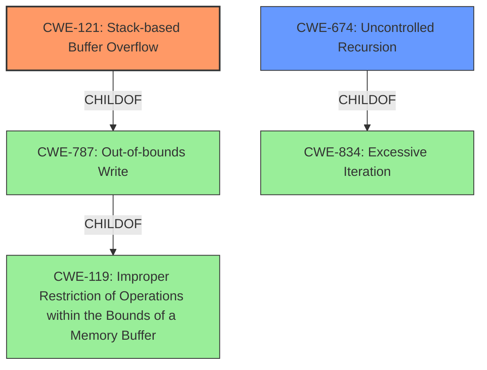

# Enhanced Analysis for CVE-2020-23878

# Summary
| CWE ID | CWE Name | Confidence | CWE Abstraction Level | CWE Vulnerability Mapping Label | CWE-Vulnerability Mapping Notes |
|---|---|---|---|---|---|
| CWE-121 | Stack-based Buffer Overflow | 1.0 | Variant | Allowed | Primary CWE |
| CWE-674 | Uncontrolled Recursion | 0.7 | Class | Allowed-with-Review | Secondary Candidate |

## Evidence and Confidence

*   **Confidence Score:** 0.9
*   **Evidence Strength:** HIGH

## Relationship Analysis
The primary CWE selected is CWE-121 (Stack-based Buffer Overflow), a variant of CWE-787 (Out-of-bounds Write) and CWE-119 (Improper Restriction of Operations within the Bounds of a Memory Buffer). CWE-674 (Uncontrolled Recursion) is a related class-level CWE that describes a potential cause of stack exhaustion. The relationship analysis indicates that the vulnerability is most accurately described by the specific type of buffer overflow (stack-based) and could be triggered by uncontrolled recursion leading to stack exhaustion.



## Vulnerability Chain
The vulnerability chain starts with the **stack buffer overflow** in the `XReffetch` component, potentially caused by uncontrolled recursion in the `XRef::fetch` function and the `ObjectStream` constructor. The final impact is a program crash due to stack overflow.
  - Root Cause: **Stack Buffer Overflow**, Potentially **Uncontrolled Recursion**
  - Weakness: Writing beyond buffer boundary on the stack
  - Impact: Program crash (stack overflow)

## Summary of Analysis
The initial analysis focused on the provided vulnerability description, which explicitly mentions a **stack buffer overflow**. The CVE Reference Links Content Summary confirms this, stating that the `XRef::fetch` function leads to a stack overflow due to excessive recursion.

The retriever results listed CWE-119 (Improper Restriction of Operations within the Bounds of a Memory Buffer), CWE-190 (Integer Overflow or Wraparound), and CWE-121 (Stack-based Buffer Overflow) as top candidates. While CWE-119 is a broader class, the description specifically mentions a stack-based overflow, making CWE-121 the most appropriate choice. CWE-674 (Uncontrolled Recursion) was considered as a possible contributing factor.

The final decision is based on the clear evidence of a **stack buffer overflow**, supported by both the vulnerability description and the CVE Reference Links Content Summary. The selection of CWE-121 as the primary CWE provides the optimal level of specificity, and it is a variant which is the preferred level of abstraction. CWE-674 could be considered as a contributing factor and may be present.

Relevant CWE Information:

# Enhanced Context (25 CWEs)
The following CWEs were identified as potentially relevant to this vulnerability:

## Vulnerability Description
pdf2json v0.71 was discovered to contain a **stack buffer overflow** in the component XReffetch.

### Vulnerability Description Key Phrases
- **weakness:** **stack buffer overflow**
- **product:** pdf2json
- **version:** v0.71
- **component:** XReffetch

## CVE Reference Links Content Summary
Based on the provided content, here's an analysis of the vulnerabilities found in the `pdf2json` tool:

**Vulnerabilities:**

2.  **Stack Buffer Overflow**

    *   **Root Cause:** The `XRef::fetch` function, along with the `ObjectStream` constructor, leads to a stack overflow due to excessive recursion. This occurs when processing a specific PDF file.
    *   **Vulnerability:** Stack buffer overflow.
    *   **Impact:**  The program crashes (stack overflow).
    *   **Attack vector:** Maliciously crafted PDF file (`01-Stack-buffer-overflow-XRef-fetch.pdf`).
    *   **Required attacker capabilities/position:** Attacker needs to provide a specially crafted PDF file.

## Retriever Results

### Top Combined Results

| Rank | CWE ID | Name | Abstraction | Usage  | Retrievers | Individual Scores |
|------|--------|------|-------------|-------|------------|-------------------|
| 1 | 119 | Improper Restriction of Operations within the Bounds of a Memory Buffer | Class | Discouraged | alternate_terms | 0.800 |
| 2 | 190 | Integer Overflow or Wraparound | Base | Allowed | alternate_terms | 0.800 |
| 3 | 121 | Stack-based Buffer Overflow | Variant | Allowed | sparse | 0.158 |
| 4 | 125 | Out-of-bounds Read | Base | Allowed | sparse | 0.140 |
| 5 | 122 | Heap-based Buffer Overflow | Variant | Allowed | sparse | 0.136 |
| 6 | 674 | Uncontrolled Recursion | Class | Allowed-with-Review | dense | 0.558 |

## CWE-121: Stack-based Buffer Overflow
**Technical Explanation:** The vulnerability occurs when data written to a buffer on the stack exceeds the buffer's allocated size, overwriting adjacent memory locations. In this case, the `XReffetch` component of `pdf2json` is susceptible to this weakness.

**Security Implications:** This can lead to arbitrary code execution if the attacker can overwrite critical data on the stack, such as the return address.

**Relationship and Chain:** CWE-121 is a variant of CWE-787 (Out-of-bounds Write) and CWE-119 (Improper Restriction of Operations within the Bounds of a Memory Buffer). It may be caused by uncontrolled recursion (CWE-674).

**Mapping Guidance:** CWE-121 is a variant and therefore a good fit for the vulnerability.

## CWE-674: Uncontrolled Recursion
**Technical Explanation:** The `XRef::fetch` function and `ObjectStream` constructor lead to a stack overflow due to excessive recursion. This consumes excessive resources, such as allocated memory or the program stack.

**Security Implications:** Can cause a denial-of-service condition due to stack exhaustion.

**Relationship and Chain:** CWE-674 can lead to CWE-121 as excessive recursion consumes stack space, potentially leading to a buffer overflow.

**Mapping Guidance:** CWE-674 is a Class-level CWE, and while it may contribute to the vulnerability, it is not as specific as CWE-121. It is marked as Allowed-with-Review.

## Other CWEs Considered but Not Used:
- CWE-119 (Improper Restriction of Operations within the Bounds of a Memory Buffer): This is a class-level CWE and too general. CWE-121 is a more specific variant.
- CWE-190 (Integer Overflow or Wraparound): There is no evidence of integer overflow in the description.
- CWE-125 (Out-of-bounds Read): The vulnerability is a buffer overflow (write), not a read.
- CWE-122 (Heap-based Buffer Overflow): The vulnerability is specifically a stack-based overflow.
- CWE-120 (Buffer Copy without Checking Size of Input ('Classic Buffer Overflow')): While a buffer overflow, it is not clear that it is due to a copy without checking size. The description specifies stack buffer overflow, making CWE-121 a better fit.


## CWE Relationship Analysis

Current CWEs represent these abstraction levels: .


### Vulnerability Chain Analysis

**Chain starting from CWE-121:**
- 121 (Stack-based Buffer Overflow) - ROOT


**Chain starting from CWE-787:**
- 787 (Out-of-bounds Write) - ROOT


### CWE Relationship Diagram

```mermaid
graph TD
    classDef primary fill:#f96,stroke:#333,stroke-width:2px
    classDef secondary fill:#69f,stroke:#333
    classDef tertiary fill:#9e9,stroke:#333
```