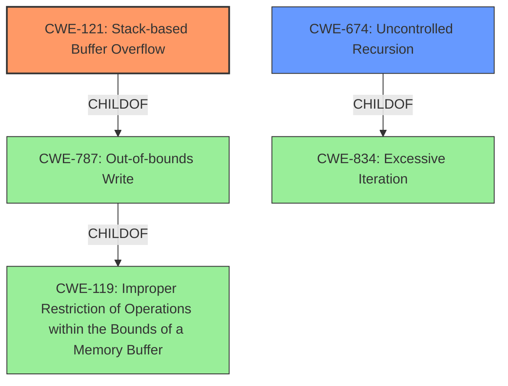

# Analysis for CVE-2020-23878

# Summary
| CWE ID | CWE Name | Confidence | CWE Abstraction Level | CWE Vulnerability Mapping Label | CWE-Vulnerability Mapping Notes |
|---|---|---|---|---|---|
| CWE-121 | Stack-based Buffer Overflow | 1.0 | Variant | Allowed | Primary CWE |
| CWE-674 | Uncontrolled Recursion | 0.7 | Class | Allowed-with-Review | Secondary Candidate |

## Evidence and Confidence

*   **Confidence Score:** 0.9
*   **Evidence Strength:** HIGH

## Relationship Analysis
The primary CWE selected is CWE-121 (Stack-based Buffer Overflow), a variant of CWE-787 (Out-of-bounds Write) and CWE-119 (Improper Restriction of Operations within the Bounds of a Memory Buffer). CWE-674 (Uncontrolled Recursion) is a related class-level CWE that describes a potential cause of stack exhaustion. The relationship analysis indicates that the vulnerability is most accurately described by the specific type of buffer overflow (stack-based) and could be triggered by uncontrolled recursion leading to stack exhaustion.

## Vulnerability Chain
The vulnerability chain starts with the **stack buffer overflow** in the `XReffetch` component, potentially caused by uncontrolled recursion in the `XRef::fetch` function and the `ObjectStream` constructor. The final impact is a program crash due to stack overflow.
  - Root Cause: **Stack Buffer Overflow**, Potentially **Uncontrolled Recursion**
  - Weakness: Writing beyond buffer boundary on the stack
  - Impact: Program crash (stack overflow)

## Summary of Analysis
The initial analysis focused on the provided vulnerability description, which explicitly mentions a **stack buffer overflow**. The CVE Reference Links Content Summary confirms this, stating that the `XRef::fetch` function leads to a stack overflow due to excessive recursion.

The retriever results listed CWE-119 (Improper Restriction of Operations within the Bounds of a Memory Buffer), CWE-190 (Integer Overflow or Wraparound), and CWE-121 (Stack-based Buffer Overflow) as top candidates. While CWE-119 is a broader class, the description specifically mentions a stack-based overflow, making CWE-121 the most appropriate choice. CWE-674 (Uncontrolled Recursion) was considered as a possible contributing factor.

The final decision is based on the clear evidence of a **stack buffer overflow**, supported by both the vulnerability description and the CVE Reference Links Content Summary. The selection of CWE-121 as the primary CWE provides the optimal level of specificity, and it is a variant which is the preferred level of abstraction. CWE-674 could be considered as a contributing factor and may be present.

Relevant CWE Information:

# Enhanced Context (25 CWEs)
The following CWEs were identified as potentially relevant to this vulnerability:

## Vulnerability Description
pdf2json v0.71 was discovered to contain a **stack buffer overflow** in the component XReffetch.

### Vulnerability Description Key Phrases
- **weakness:** **stack buffer overflow**
- **product:** pdf2json
- **version:** v0.71
- **component:** XReffetch

## CVE Reference Links Content Summary
Based on the provided content, here's an analysis of the vulnerabilities found in the `pdf2json` tool:

**Vulnerabilities:**

2.  **Stack Buffer Overflow**

    *   **Root Cause:** The `XRef::fetch` function, along with the `ObjectStream` constructor, leads to a stack overflow due to excessive recursion. This occurs when processing a specific PDF file.
    *   **Vulnerability:** Stack buffer overflow.
    *   **Impact:**  The program crashes (stack overflow).
    *   **Attack vector:** Maliciously crafted PDF file (`01-Stack-buffer-overflow-XRef-fetch.pdf`).
    *   **Required attacker capabilities/position:** Attacker needs to provide a specially crafted PDF file.

## Retriever Results

### Top Combined Results

| Rank | CWE ID | Name | Abstraction | Usage  | Retrievers | Individual Scores |
|------|--------|------|-------------|-------|------------|-------------------|
| 1 | 119 | Improper Restriction of Operations within the Bounds of a Memory Buffer | Class | Discouraged | alternate_terms | 0.800 |
| 2 | 190 | Integer Overflow or Wraparound | Base | Allowed | alternate_terms | 0.800 |
| 3 | 121 | Stack-based Buffer Overflow | Variant | Allowed | sparse | 0.158 |
| 4 | 125 | Out-of-bounds Read | Base | Allowed | sparse | 0.140 |
| 5 | 122 | Heap-based Buffer Overflow | Variant | Allowed | sparse | 0.136 |
| 6 | 674 | Uncontrolled Recursion | Class | Allowed-with-Review | dense | 0.558 |

## CWE-121: Stack-based Buffer Overflow
**Technical Explanation:** The vulnerability occurs when data written to a buffer on the stack exceeds the buffer's allocated size, overwriting adjacent memory locations. In this case, the `XReffetch` component of `pdf2json` is susceptible to this weakness.

**Security Implications:** This can lead to arbitrary code execution if the attacker can overwrite critical data on the stack, such as the return address.

**Relationship and Chain:** CWE-121 is a variant of CWE-787 (Out-of-bounds Write) and CWE-119 (Improper Restriction of Operations within the Bounds of a Memory Buffer). It may be caused by uncontrolled recursion (CWE-674).

**Mapping Guidance:** CWE-121 is a variant and therefore a good fit for the vulnerability.

## CWE-674: Uncontrolled Recursion
**Technical Explanation:** The `XRef::fetch` function and `ObjectStream` constructor lead to a stack overflow due to excessive recursion. This consumes excessive resources, such as allocated memory or the program stack.

**Security Implications:** Can cause a denial-of-service condition due to stack exhaustion.

**Relationship and Chain:** CWE-674 can lead to CWE-121 as excessive recursion consumes stack space, potentially leading to a buffer overflow.

**Mapping Guidance:** CWE-674 is a Class-level CWE, and while it may contribute to the vulnerability, it is not as specific as CWE-121. It is marked as Allowed-with-Review.

## Other CWEs Considered but Not Used:
- CWE-119 (Improper Restriction of Operations within the Bounds of a Memory Buffer): This is a class-level CWE and too general. CWE-121 is a more specific variant.
- CWE-190 (Integer Overflow or Wraparound): There is no evidence of integer overflow in the description.
- CWE-125 (Out-of-bounds Read): The vulnerability is a buffer overflow (write), not a read.
- CWE-122 (Heap-based Buffer Overflow): The vulnerability is specifically a stack-based overflow.
- CWE-120 (Buffer Copy without Checking Size of Input ('Classic Buffer Overflow')): While a buffer overflow, it is not clear that it is due to a copy without checking size. The description specifies stack buffer overflow, making CWE-121 a better fit.

# Enhanced Query for CVE-2020-23878

## Vulnerability Description
pdf2json v0.71 was discovered to contain a **stack buffer overflow** in the component XReffetch.

### Vulnerability Description Key Phrases
- **weakness:** **stack buffer overflow**
- **product:** pdf2json
- **version:** v0.71
- **component:** XReffetch

## CVE Reference Links Content Summary
Based on the provided content, here's an analysis of the vulnerabilities found in the `pdf2json` tool:

**Vulnerabilities:**

1.  **NULL Pointer Dereference**

    *   **Root cause:** A NULL pointer dereference occurs in the `ObjectStream::getObject` function. This happens when the function attempts to access an object via a NULL pointer.
    *   **Vulnerability:** Null pointer dereference
    *   **Impact:**  The program crashes (segmentation fault).
    *   **Attack vector:**  Maliciously crafted PDF file (`00-NULL-pointer-dereference-ObjectStream-getObject.pdf`)
    *   **Required attacker capabilities/position:**  Attacker needs to provide a specially crafted PDF file.

2.  **Stack Buffer Overflow**

    *  **Root Cause:** The `XRef::fetch` function, along with the `ObjectStream` constructor, leads to a stack overflow due to excessive recursion. This occurs when processing a specific PDF file.
    *   **Vulnerability:** Stack buffer overflow.
    *   **Impact:**  The program crashes (stack overflow).
    *   **Attack vector:** Maliciously crafted PDF file (`01-Stack-buffer-overflow-XRef-fetch.pdf`).
    *   **Required attacker capabilities/position:** Attacker needs to provide a specially crafted PDF file.

**Additional Notes:**

*   The provided github content shows two different PoCs for the `pdf2json` tool, both found in the same repository. The first one leads to a NULL pointer dereference, while the second one leads to a stack buffer overflow.
*   The AddressSanitizer (ASAN) output in the provided content highlights the specific locations of the issues.

The content provides more details than a typical CVE description would. It includes the exact function calls and locations where the vulnerabilities occur.

## Retriever Results

### Top Combined Results

| Rank | CWE ID | Name | Abstraction | Usage  | Retrievers | Individual Scores |
|------|--------|------|-------------|-------|------------|-------------------|
| 1 | 119 | Improper Restriction of Operations within the Bounds of a Memory Buffer | Class | Discouraged | alternate_terms | 0.800 |
| 2 | 190 | Integer Overflow or Wraparound | Base | Allowed | alternate_terms | 0.800 |
| 3 | 121 | Stack-based Buffer Overflow | Variant | Allowed | sparse | 0.158 |
| 4 | 125 | Out-of-bounds Read | Base | Allowed | sparse | 0.140 |
| 5 | 122 | Heap-based Buffer Overflow | Variant | Allowed | sparse | 0.136 |
| 6 | 674 | Uncontrolled Recursion | Class | Allowed-with-Review | dense | 0.558 |
| 7 | 128 | Wrap-around Error | Base | Allowed | graph | 0.003 |
| 8 | 120 | Buffer Copy without Checking Size of Input ('Classic Buffer Overflow') | Base | Allowed-with-Review | sparse | 0.130 |
| 9 | 770 | Allocation of Resources Without Limits or Throttling | Base | Allowed | sparse | 0.127 |
| 10 | 124 | Buffer Underwrite ('Buffer Underflow') | Base | Allowed | sparse | 0.127 |

# Complete CWE Specifications

## CWE-119: Improper Restriction of Operations within the Bounds of a Memory Buffer
**Abstraction:** Class
**Status:** Stable

### Description
The product performs operations on a memory buffer, but it reads from or writes to a memory location outside the buffer's intended boundary. This may result in read or write operations on unexpected memory locations that could be linked to other variables, data structures, or internal program data.

### Extended Description
Not provided

### Alternative Terms
Buffer Overflow: This term has many different meanings to different audiences. From a CWE mapping perspective, this term should be avoided where possible. Some researchers, developers, and tools intend for it to mean "write past the end of a buffer," whereas others use the same term to mean "any read or write outside the boundaries of a buffer, whether before the beginning of the buffer or after the end of the buffer." Others could mean "any action after the end of a buffer, whether it is a read or write." Since the term is commonly used for exploitation and for vulnerabilities, it further confuses things.
buffer overrun: Some prominent vendors and researchers use the term "buffer overrun," but most people use "buffer overflow." See the alternate term for "buffer overflow" for context.
memory safety: Generally used for techniques that avoid weaknesses related to memory access, such as those identified by CWE-119 and its descendants. However, the term is not formal, and there is likely disagreement between practitioners as to which weaknesses are implicitly covered by the "memory safety" term.

### Relationships
ChildOf -> CWE-118
ChildOf -> CWE-20

### Mapping Guidance
**Usage:** Discouraged
**Rationale:** CWE-119 is commonly misused in low-information vulnerability reports when lower-level CWEs could be used instead, or when more details about the vulnerability are available.
**Comments:** Look at CWE-119's children and consider mapping to CWEs such as CWE-787: Out-of-bounds Write, CWE-125: Out-of-bounds Read, or others.
**Reasons:**
- Frequent Misuse

### Additional Notes
**[Applicable Platform]** 

It is possible in any programming languages without memory management support to attempt an operation outside of the bounds of a memory buffer, but the consequences will vary widely depending on the language, platform, and chip architecture.

### Observed Examples
- **CVE-2021-22991:** Incorrect URI normalization in application traffic product leads to buffer overflow, as exploited in the wild per CISA KEV.
- **CVE-2020-29557:** Buffer overflow in Wi-Fi router web interface, as exploited in the wild per CISA KEV.
- **CVE-2009-2550:** Classic stack-based buffer overflow in media player using a long entry in a playlist

## CWE-190: Integer Overflow or Wraparound
**Abstraction:** Base
**Status:** Stable

### Description
The product performs a calculation that can
         produce an integer overflow or wraparound when the logic
         assumes that the resulting value will always be larger than
         the original value. This occurs when an integer value is
         incremented to a value that is too large to store in the
         associated representation. When this occurs, the value may
         become a very small or negative number.

### Extended Description
Not provided

### Alternative Terms
Overflow: The terms "overflow" and "wraparound" are used interchangeably by some people, but they can have more precise distinctions by others. See Terminology Notes.
Wraparound: The terms "overflow" and "wraparound" are used interchangeably by some people, but they can have more precise distinctions by others. See Terminology Notes.
wrap, wrap-around, wrap around: Alternate spellings of "wraparound"

### Relationships
ChildOf -> CWE-682
ChildOf -> CWE-682
ChildOf -> CWE-20
CanPrecede -> CWE-119

### Mapping Guidance
**Usage:** Allowed
**Rationale:** This CWE entry is at the Base level of abstraction, which is a preferred level of abstraction for mapping to the root causes of vulnerabilities.
**Comments:** Be careful of terminology problems with "overflow," "underflow," and "wraparound" - see Terminology Notes. Carefully read both the name and description to ensure that this mapping is an appropriate fit. Do not try to 'force' a mapping to a lower-level Base/Variant simply to comply with this preferred level of abstraction.
**Reasons:**
- Acceptable-Use
**Suggested Alternatives:**
- CWE-191: Integer Underflow (Wrap or Wraparound). Consider CWE-191 when the result is less than the minimum value that can be represented (sometimes called "underflows").

### Additional Notes
**[Relationship]** Integer overflows can be primary to buffer overflows when they cause less memory to be allocated than expected.

**[Terminology]** 

"Integer overflow" is sometimes used to cover several types of errors, including signedness errors, or buffer overflows that involve manipulation of integer data types instead of characters. Part of the confusion results from the fact that 0xffffffff is -1 in a signed context. Other confusion also arises because of the role that integer overflows have in chains.

A "wraparound" is a well-defined, standard behavior that follows specific rules for how to handle situations when the intended numeric value is too large or too small to be represented, as specified in standards such as C11.

"Overflow" is sometimes conflated with "wraparound" but typically indicates a non-standard or undefined behavior.

The "overflow" term is sometimes used to indicate cases where either the maximum or the minimum is exceeded, but others might only use "overflow" to indicate exceeding the maximum while using "underflow" for exceeding the minimum.

Some people use "overflow" to mean any value outside the representable range - whether greater than the maximum, or less than the minimum - but CWE uses "underflow" for cases in which the intended result is less than the minimum.

See [REF-1440] for additional explanation of the ambiguity of terminology.

**[Other]** While there may be circumstances in which the logic intentionally relies on wrapping - such as with modular arithmetic in timers or counters - it can have security consequences if the wrap is unexpected. This is especially the case if the integer overflow can be triggered using user-supplied inputs.

### Observed Examples
- **CVE-2021-43537:** Chain: in a web browser, an unsigned 64-bit integer is forcibly cast to a 32-bit integer (CWE-681) and potentially leading to an integer overflow (CWE-190). If an integer overflow occurs, this can cause heap memory corruption (CWE-122)
- **CVE-2022-21668:** Chain: Python library does not limit the resources used to process images that specify a very large number of bands (CWE-1284), leading to excessive memory consumption (CWE-789) or an integer overflow (CWE-190).
- **CVE-2022-0545:** Chain: 3D renderer has an integer overflow (CWE-190) leading to write-what-where condition (CWE-123) using a crafted image.

## CWE-121: Stack-based Buffer Overflow
**Abstraction:** Variant
**Status:** Draft

### Description
A stack-based buffer overflow condition is a condition where the buffer being overwritten is allocated on the stack (i.e., is a local variable or, rarely, a parameter to a function).

### Extended Description
Not provided

### Alternative Terms
Stack Overflow: "Stack Overflow" is often used to mean the same thing as stack-based buffer overflow, however it is also used on occasion to mean stack exhaustion, usually a result from an excessively recursive function call. Due to the ambiguity of the term, use of stack overflow to describe either circumstance is discouraged.

### Relationships
ChildOf -> CWE-788
ChildOf -> CWE-787

### Mapping Guidance
**Usage:** Allowed
**Rationale:** This CWE entry is at the Variant level of abstraction, which is a preferred level of abstraction for mapping to the root causes of vulnerabilities.
**Comments:** Carefully read both the name and description to ensure that this mapping is an appropriate fit. Do not try to 'force' a mapping to a lower-level Base/Variant simply to comply with this preferred level of abstraction.
**Reasons:**
- Acceptable-Use

### Additional Notes
**[Other]** Stack-based buffer overflows can instantiate in return address overwrites, stack pointer overwrites or frame pointer overwrites. They can also be considered function pointer overwrites, array indexer overwrites or write-what-where condition, etc.

### Observed Examples
- **CVE-2021-35395:** Stack-based buffer overflows in SFK for wifi chipset used for IoT/embedded devices, as exploited in the wild per CISA KEV.

## CWE-125: Out-of-bounds Read
**Abstraction:** Base
**Status:** Draft

### Description
The product reads data past the end, or before the beginning, of the intended buffer.

### Extended Description
Not provided

### Alternative Terms
OOB read: Shorthand for "Out of bounds" read

### Relationships
ChildOf -> CWE-119
ChildOf -> CWE-119
ChildOf -> CWE-119
ChildOf -> CWE-119

### Mapping Guidance
**Usage:** Allowed
**Rationale:** This CWE entry is at the Base level of abstraction, which is a preferred level of abstraction for mapping to the root causes of vulnerabilities.
**Comments:** Carefully read both the name and description to ensure that this mapping is an appropriate fit. Do not try to 'force' a mapping to a lower-level Base/Variant simply to comply with this preferred level of abstraction.
**Reasons:**
- Acceptable-Use

### Observed Examples
- **CVE-2023-1018:** The reference implementation code for a Trusted Platform Module does not implement length checks on data, allowing for an attacker to read 2 bytes past the end of a buffer.
- **CVE-2020-11899:** Out-of-bounds read in IP stack used in embedded systems, as exploited in the wild per CISA KEV.
- **CVE-2014-0160:** Chain: "Heartbleed" bug receives an inconsistent length parameter (CWE-130) enabling an out-of-bounds read (CWE-126), returning memory that could include private cryptographic keys and other sensitive data.

## CWE-122: Heap-based Buffer Overflow
**Abstraction:** Variant
**Status:** Draft

### Description
A heap overflow condition is a buffer overflow, where the buffer that can be overwritten is allocated in the heap portion of memory, generally meaning that the buffer was allocated using a routine such as malloc().

### Extended Description
Not provided

### Alternative Terms
None

### Relationships
ChildOf -> CWE-788
ChildOf -> CWE-787

### Mapping Guidance
**Usage:** Allowed
**Rationale:** This CWE entry is at the Variant level of abstraction, which is a preferred level of abstraction for mapping to the root causes of vulnerabilities.
**Comments:** Carefully read both the name and description to ensure that this mapping is an appropriate fit. Do not try to 'force' a mapping to a lower-level Base/Variant simply to comply with this preferred level of abstraction.
**Reasons:**
- Acceptable-Use

### Additional Notes
**[Relationship]** Heap-based buffer overflows are usually just as dangerous as stack-based buffer overflows.

### Observed Examples
- **CVE-2021-43537:** Chain: in a web browser, an unsigned 64-bit integer is forcibly cast to a 32-bit integer (CWE-681) and potentially leading to an integer overflow (CWE-190). If an integer overflow occurs, this can cause heap memory corruption (CWE-122)
- **CVE-2007-4268:** Chain: integer signedness error (CWE-195) passes signed comparison, leading to heap overflow (CWE-122)
- **CVE-2009-2523:** Chain: product does not handle when an input string is not NULL terminated (CWE-170), leading to buffer over-read (CWE-125) or heap-based buffer overflow (CWE-122).

## CWE-674: Uncontrolled Recursion
**Abstraction:** Class
**Status:** Draft

### Description
The product does not properly control the amount of recursion that takes place,  consuming excessive resources, such as allocated memory or the program stack.

### Extended Description
Not provided

### Alternative Terms
Stack Exhaustion

### Relationships
ChildOf -> CWE-834

### Mapping Guidance
**Usage:** Allowed-with-Review
**Rationale:** This CWE entry is a Class and might have Base-level children that would be more appropriate
**Comments:** Examine children of this entry to see if there is a better fit
**Reasons:**
- Abstraction

### Observed Examples
- **CVE-2007-1285:** Deeply nested arrays trigger stack exhaustion.
- **CVE-2007-3409:** Self-referencing pointers create infinite loop and resultant stack exhaustion.
- **CVE-2016-10707:** Javascript application accidentally changes input in a way that prevents a recursive call from detecting an exit condition.

## CWE-128: Wrap-around Error
**Abstraction:** Base
**Status:** Incomplete

### Description
Wrap around errors occur whenever a value is incremented past the maximum value for its type and therefore "wraps around" to a very small, negative, or undefined value.

### Extended Description
Not provided

### Alternative Terms
None

### Relationships
ChildOf -> CWE-682
CanPrecede -> CWE-119
PeerOf -> CWE-190

### Mapping Guidance
**Usage:** Allowed
**Rationale:** This CWE entry is at the Base level of abstraction, which is a preferred level of abstraction for mapping to the root causes of vulnerabilities.
**Comments:** Carefully read both the name and description to ensure that this mapping is an appropriate fit. Do not try to 'force' a mapping to a lower-level Base/Variant simply to comply with this preferred level of abstraction.
**Reasons:**
- Acceptable-Use

### Additional Notes
**[Relationship]** The relationship between overflow and wrap-around needs to be examined more closely, since several entries (including CWE-190) are closely related.

## CWE-120: Buffer Copy without Checking Size of Input ('Classic Buffer Overflow')
**Abstraction:** Base
**Status:** Incomplete

### Description
The product copies an input buffer to an output buffer without verifying that the size of the input buffer is less than the size of the output buffer, leading to a buffer overflow.

### Extended Description
A buffer overflow condition exists when a product attempts to put more data in a buffer than it can hold, or when it attempts to put data in a memory area outside of the boundaries of a buffer. The simplest type of error, and the most common cause of buffer overflows, is the "classic" case in which the product copies the buffer without restricting how much is copied. Other variants exist, but the existence of a classic overflow strongly suggests that the programmer is not considering even the most basic of security protections.

### Alternative Terms
Classic Buffer Overflow: This term was frequently used by vulnerability researchers during approximately 1995 to 2005 to differentiate buffer copies without length checks (which had been known about for decades) from other emerging weaknesses that still involved invalid accesses of buffers, as vulnerability researchers began to develop advanced exploitation techniques.
Unbounded Transfer

### Relationships
ChildOf -> CWE-119
ChildOf -> CWE-119
ChildOf -> CWE-119
ChildOf -> CWE-119
CanPrecede -> CWE-123
ChildOf -> CWE-20

### Mapping Guidance
**Usage:** Allowed-with-Review
**Rationale:** There are some indications that this CWE ID might be misused and selected simply because it mentions "buffer overflow" - an increasingly vague term. This CWE entry is only appropriate for "Buffer Copy" operations (not buffer reads), in which where there is no "Checking [the] Size of Input", and (by implication of the copy) writing past the end of the buffer.
**Comments:** If the vulnerability being analyzed involves out-of-bounds reads, then consider CWE-125 or descendants. For root cause analysis: if there is any input validation, consider children of CWE-20 such as CWE-1284. If there is a calculation error for buffer sizes, consider CWE-131 or similar.
**Reasons:**
- Frequent Misuse

### Additional Notes
**[Relationship]** At the code level, stack-based and heap-based overflows do not differ significantly, so there usually is not a need to distinguish them. From the attacker perspective, they can be quite different, since different techniques are required to exploit them.

**[Terminology]** Many issues that are now called "buffer overflows" are substantively different than the "classic" overflow, including entirely different bug types that rely on overflow exploit techniques, such as integer signedness errors, integer overflows, and format string bugs. This imprecise terminology can make it difficult to determine which variant is being reported.

### Observed Examples
- **CVE-2000-1094:** buffer overflow using command with long argument
- **CVE-1999-0046:** buffer overflow in local program using long environment variable
- **CVE-2002-1337:** buffer overflow in comment characters, when product increments a counter for a ">" but does not decrement for "<"

## CWE-770: Allocation of Resources Without Limits or Throttling
**Abstraction:** Base
**Status:** Incomplete

### Description
The product allocates a reusable resource or group of resources on behalf of an actor without imposing any restrictions on the size or number of resources that can be allocated, in violation of the intended security policy for that actor.

### Extended Description

Code frequently has to work with limited resources, so programmers must be careful to ensure that resources are not consumed too quickly, or too easily. Without use of quotas, resource limits, or other protection mechanisms, it can be easy for an attacker to consume many resources by rapidly making many requests, or causing larger resources to be used than is needed. When too many resources are allocated, or if a single resource is too large, then it can prevent the code from working correctly, possibly leading to a denial of service.

### Alternative Terms
None

### Relationships
ChildOf -> CWE-400
ChildOf -> CWE-665
ChildOf -> CWE-400

### Mapping Guidance
**Usage:** Allowed
**Rationale:** This CWE entry is at the Base level of abstraction, which is a preferred level of abstraction for mapping to the root causes of vulnerabilities.
**Comments:** Carefully read both the name and description to ensure that this mapping is an appropriate fit. Do not try to 'force' a mapping to a lower-level Base/Variant simply to comply with this preferred level of abstraction.
**Reasons:**
- Acceptable-Use

### Additional Notes
**[Relationship]** This entry is different from uncontrolled resource consumption (CWE-400) in that there are other weaknesses that are related to inability to control resource consumption, such as holding on to a resource too long after use, or not correctly keeping track of active resources so that they can be managed and released when they are finished (CWE-771).

**[Theoretical]** Vulnerability theory is largely about how behaviors and resources interact. "Resource exhaustion" can be regarded as either a consequence or an attack, depending on the perspective. This entry is an attempt to reflect one of the underlying weaknesses that enable these attacks (or consequences) to take place.

### Observed Examples
- **CVE-2022-21668:** Chain: Python library does not limit the resources used to process images that specify a very large number of bands (CWE-1284), leading to excessive memory consumption (CWE-789) or an integer overflow (CWE-190).
- **CVE-2009-4017:** Language interpreter does not restrict the number of temporary files being created when handling a MIME request with a large number of parts..
- **CVE-2009-2726:** Driver does not use a maximum width when invoking sscanf style functions, causing stack consumption.

## CWE-124: Buffer Underwrite ('Buffer Underflow')
**Abstraction:** Base
**Status:** Incomplete

### Description
The product writes to a buffer using an index or pointer that references a memory location prior to the beginning of the buffer.

### Extended Description
This typically occurs when a pointer or its index is decremented to a position before the buffer, when pointer arithmetic results in a position before the beginning of the valid memory location, or when a negative index is used.

### Alternative Terms
buffer underrun: Some prominent vendors and researchers use the term "buffer underrun". "Buffer underflow" is more commonly used, although both terms are also sometimes used to describe a buffer under-read (CWE-127).

### Relationships
ChildOf -> CWE-786
ChildOf -> CWE-787

### Mapping Guidance
**Usage:** Allowed
**Rationale:** This CWE entry is at the Base level of abstraction, which is a preferred level of abstraction for mapping to the root causes of vulnerabilities.
**Comments:** Carefully read both the name and description to ensure that this mapping is an appropriate fit. Do not try to 'force' a mapping to a lower-level Base/Variant simply to comply with this preferred level of abstraction.
**Reasons:**
- Acceptable-Use

### Additional Notes
**[Relationship]** This could be resultant from several errors, including a bad offset or an array index that decrements before the beginning of the buffer (see CWE-129).

### Observed Examples
- **CVE-2021-24018:** buffer underwrite in firmware verification routine allows code execution via a crafted firmware image
- **CVE-2002-2227:** Unchecked length of SSLv2 challenge value leads to buffer underflow.
- **CVE-2007-4580:** Buffer underflow from a small size value with a large buffer (length parameter inconsistency, CWE-130)

