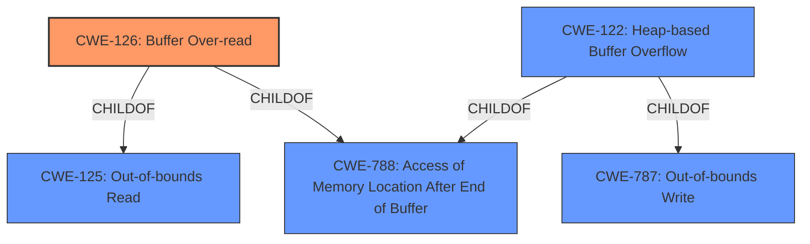

# Analysis for CVE-2020-23915

# Summary
| CWE ID | CWE Name | Confidence | CWE Abstraction Level | CWE Vulnerability Mapping Label | CWE-Vulnerability Mapping Notes |
|---|---|---|---|---|---|
| CWE-126 | Buffer Over-read | 0.9 | Variant | Allowed | Primary CWE |
| CWE-122 | Heap-based Buffer Overflow | 0.7 | Variant | Allowed | Secondary Candidate |
| CWE-125 | Out-of-bounds Read | 0.6 | Base | Allowed | Secondary Candidate |

## Evidence and Confidence

*   **Confidence Score:** 0.8
*   **Evidence Strength:** HIGH

## Relationship Analysis
The primary CWE, CWE-126 (Buffer Over-read), is a variant of CWE-125 (Out-of-bounds Read) and CWE-788 (Access of Memory Location After End of Buffer). CWE-122 (Heap-based Buffer Overflow) is also a variant of CWE-787 (Out-of-bounds Write) and CWE-788 (Access of Memory Location After End of Buffer). The selection of CWE-126 is favored due to the explicit description of a **heap-based buffer over-read**, indicating the read operation going beyond the allocated buffer.

## Vulnerability Chain
The vulnerability chain begins with an improper calculation or validation of input, leading to a buffer over-read.
1.  **Root Cause:** Improper input validation and/or calculation within `peg::resolve_escape_sequence` leads to an incorrect length calculation.
2.  **Weakness:** **Heap-based buffer over-read** (CWE-126). The code attempts to read beyond the allocated buffer.
3.  **Impact:** Crash or potential arbitrary code execution.

## Summary of Analysis
The primary assessment is based on the provided vulnerability description and CVE reference. The description explicitly mentions a **heap-based buffer over-read** in `pegresolve_escape_sequence()`, making CWE-126 (Buffer Over-read) the most appropriate primary CWE. The CVE reference further confirms that the `resolve_escape_sequence` function attempts to read beyond the allocated buffer due to an incorrect length calculation.

> Vulnerability Description Key Phrases
> - **weakness:** **heap-based buffer over-read**

The hierarchical relationships support the selection of CWE-126 as a more specific variant of CWE-125 (Out-of-bounds Read). The retriever results also list CWE-126 and CWE-122 (Heap-based Buffer Overflow) as top candidates.

CWE-126 is at the optimal level of specificity because it accurately represents the **heap-based buffer over-read** condition, aligning with the vulnerability's characteristics and impact.

CWE-122 (Heap-based Buffer Overflow) was considered, as the buffer is allocated on the heap. However, the description explicitly states an over-read, making CWE-126 a more precise fit than CWE-122 which implies a write.

CWE-125 (Out-of-bounds Read) was also considered, but it is a more general case of reading beyond buffer boundaries. Since "over-read" is specifically mentioned and there is a more specific CWE for it, CWE-126 is preferred.

CWE-193 (Off-by-one Error) and CWE-190 (Integer Overflow or Wraparound) were also considered, but they represent potential causes of the over-read rather than the over-read itself.

CWE-170 (Improper Null Termination) was considered, but it describes a missing null terminator which is not the cause of the over-read.

CWE-1284 (Improper Validation of Specified Quantity in Input) was considered because it could be related to the incorrect length calculation. However, the primary issue is the over-read, and CWE-126 directly addresses that.