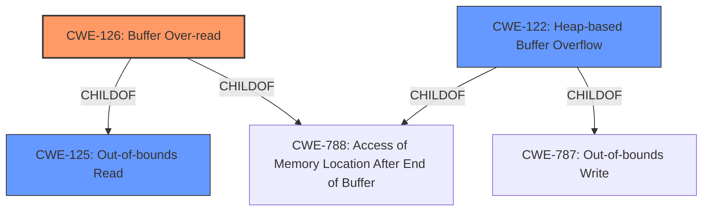

# Analysis Report for CVE-2020-23921

# Vulnerability Analysis Report: CVE-2020-23921

## Description


## Analysis (with Relationship Data)

# Summary
| CWE ID    | CWE Name                         | Confidence | CWE Abstraction Level | CWE Vulnerability Mapping Label | CWE-Vulnerability Mapping Notes |
| :-------- | :------------------------------- | :--------- | :-------------------- | :------------------------------ | :------------------------------ |
| CWE-126   | Buffer Over-read                 | 0.9        | Variant               | Allowed                       | Primary CWE                     |
| CWE-125   | Out-of-bounds Read               | 0.7        | Base                  | Allowed                       | Secondary Candidate             |
| CWE-122   | Heap-based Buffer Overflow       | 0.6        | Variant               | Allowed                       | Secondary Candidate             |

## Evidence and Confidence

*   **Confidence Score:** 0.8
*   **Evidence Strength:** HIGH

## Relationship Analysis
The primary relationship influencing the CWE selection is the ChildOf relationship between CWE-126 (Buffer Over-read) and CWE-125 (Out-of-bounds Read). Since CWE-126 is a more specific variant of CWE-125, it is chosen as the primary CWE. CWE-122 (Heap-based Buffer Overflow) is also considered due to the heap allocation mentioned in the description. The abstraction levels are important as they guide the selection of the most specific and appropriate CWE.



## Vulnerability Chain
The vulnerability chain involves an out-of-bounds read in a heap-allocated buffer, leading to a crash and potential code execution.
  - **Root Cause:** Heap-based **buffer over-read** due to improper handling of input
  - **Weakness:** **Out-of-bounds Read** (CWE-125), more specifically **Buffer Over-read** (CWE-126).
  - **Impact:** Crash, memory corruption, potential arbitrary code execution.

## Summary of Analysis
The analysis indicates a **heap-based buffer over-read** vulnerability in fast_ber. The primary CWE selected is CWE-126 (Buffer Over-read), which is a variant of CWE-125 (Out-of-bounds Read). The vulnerability occurs due to reading data past the end of a heap-allocated buffer. This assessment is based on the vulnerability description stating a **heap-based buffer over-read**, and the CVE Reference Links Content Summary confirms an out-of-bounds read in the `yy::yylex(Context&)` function, leading to a crash.

The selection of CWE-126 is justified by the fact that it is a more specific variant of CWE-125 and accurately describes the **buffer over-read**. While CWE-122 (Heap-based Buffer Overflow) was considered, it was deemed less appropriate as the primary weakness is the read operation, not the write operation associated with overflows.

The evidence from the "Vulnerability Description Key Phrases" section clearly identifies the **weakness** as a "**heap-based buffer over-read**". Furthermore, the "CVE Reference Links Content Summary" section supports this by stating: "A heap-buffer-overflow occurs within the `yy::yylex(Context&)` function at `asn_compiler.hpp:11676` due to an out-of-bounds read during parsing."

The graph relationships influenced the final selection by highlighting the parent-child relationship between CWE-126 and CWE-125, guiding the choice towards the more specific variant.

The selected CWEs are at the optimal level of specificity as they accurately represent the nature of the vulnerability, with CWE-126 providing a precise description of the **buffer over-read** condition.

Relevant CWE Information:

# Enhanced Context (25 CWEs)

## CWE-131: Incorrect Calculation of Buffer Size
**Abstraction Level**: Base
**Similarity Score**: 0.75
**Source**: dense

**Description**:
The product does not correctly calculate the size to be used when allocating a buffer, which could lead to a buffer overflow.

**Mapping Guidance**:
- Usage: Allowed
- Rationale: This CWE entry is at the Base level of abstraction, which is a preferred level of abstraction for mapping to the root causes of vulnerabilities.

*Not Selected*: While an incorrect calculation of buffer size could lead to a buffer over-read, the provided information does not specifically indicate this as the root cause. Therefore, this CWE is not selected.

## CWE-226: Sensitive Information in Resource Not Removed Before Reuse
**Abstraction Level**: Base
**Similarity Score**: 0.75
**Source**: dense

**Description**:
The product releases a resource such as memory or a file so that it can be made available for reuse, but it does not clear or "zeroize" the information contained in the resource before the product performs a critical state transition or makes the resource available for reuse by other entities.

**Mapping Guidance**:
- Usage: Allowed
- Rationale: This CWE entry is at the Base level of abstraction, which is a preferred level of abstraction for mapping to the root causes of vulnerabilities.

*Not Selected*: This CWE is not relevant as the vulnerability is related to a **buffer over-read**, not the reuse of resources containing sensitive information.

## CWE-191: Integer Underflow (Wrap or Wraparound)
**Abstraction Level**: Base
**Similarity Score**: 0.75
**Source**: dense

**Description**:
The product subtracts one value from another, such that the result is less than the minimum allowable integer value, which produces a value that is not equal to the correct result.

**Mapping Guidance**:
- Usage: Allowed
- Rationale: This CWE entry is at the Base level of abstraction, which is a preferred level of abstraction for mapping to the root causes of vulnerabilities.

*Not Selected*: Integer underflow is not indicated in the vulnerability description.

## CWE-170: Improper Null Termination
**Abstraction Level**: Base
**Similarity Score**: 0.74
**Source**: dense

**Description**:
The product does not terminate or incorrectly terminates a string or array with a null character or equivalent terminator.

**Mapping Guidance**:
- Usage: Allowed
- Rationale: This CWE entry is at the Base level of abstraction, which is a preferred level of abstraction for mapping to the root causes of vulnerabilities.

*Not Selected*: Improper null termination is not indicated in the vulnerability description.

## CWE-404: Improper Resource Shutdown or Release
**Abstraction Level**: Class
**Similarity Score**: 0.74
**Source**: dense

**Description**:
The product does not release or incorrectly releases a resource before it is made available for re-use.

**Mapping Guidance**:
- Usage: Allowed-with-Review
- Rationale: This CWE entry is a Class and might have Base-level children that would be more appropriate

*Not Selected*: This CWE is not relevant as the vulnerability is related to a **buffer over-read**, not resource management.

## CWE-909: Missing Initialization of Resource
**Abstraction Level**: Class
**Similarity Score**: 0.74
**Source**: dense

**Description**:
The product does not initialize a critical resource.

**Mapping Guidance**:
- Usage: Allowed-with-Review
- Rationale: This CWE entry is a Class and might have Base-level children that would be more appropriate

*Not Selected*: This CWE is not relevant as the vulnerability is related to a **buffer over-read**, not resource initialization.

## CWE-805: Buffer Access with Incorrect Length Value
**Abstraction Level**: Base
**Similarity Score**: 0.74
**Source**: dense

**Description**:
The product uses a sequential operation to read or write a buffer, but it uses an incorrect length value that causes it to access memory that is outside of the bounds of the buffer.

**Mapping Guidance**:
- Usage: Allowed
- Rationale: This CWE entry is at the Base level of abstraction, which is a preferred level of abstraction for mapping to the root causes of vulnerabilities.

*Not Selected*: While this CWE is related to incorrect length values and buffer access, the primary issue in the vulnerability is the **over-read** itself.

## CWE-124: Buffer Underwrite ('Buffer Underflow')
**Abstraction Level**: Base
**Similarity Score**: 0.74
**


## CWE Relationship Analysis

Current CWEs represent these abstraction levels: .


### Vulnerability Chain Analysis

**Chain starting from CWE-787:**
- 787 (Out-of-bounds Write) - ROOT


**Chain starting from CWE-805:**
- 805 (Buffer Access with Incorrect Length Value) - ROOT


### CWE Relationship Diagram

```mermaid
graph TD
    classDef primary fill:#f96,stroke:#333,stroke-width:2px
    classDef secondary fill:#69f,stroke:#333
    classDef tertiary fill:#9e9,stroke:#333
```


*Report generated on 2025-04-02 06:07:11*
