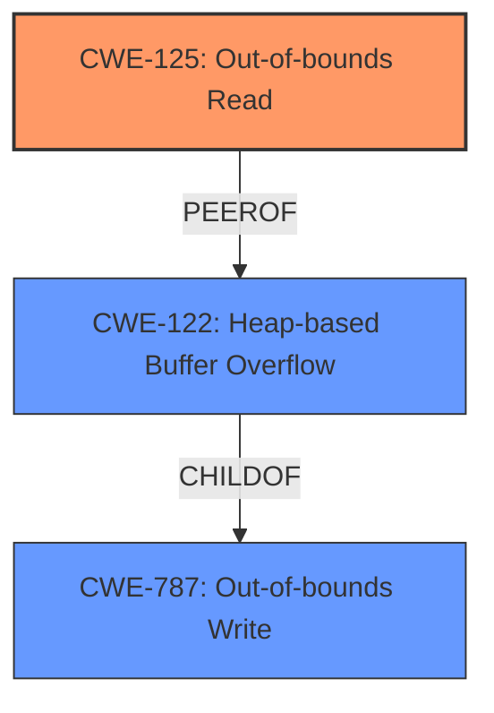

# Analysis Report for CVE-2020-23928

# Vulnerability Analysis Report: CVE-2020-23928

## Description


## Analysis (with Relationship Data)

# Summary
| CWE ID  | CWE Name                  | Confidence | CWE Abstraction Level | CWE Vulnerability Mapping Label | CWE-Vulnerability Mapping Notes |
|---------|---------------------------|------------|-----------------------|---------------------------------|---------------------------------|
| CWE-125 | Out-of-bounds Read        | 0.9        | Base                  | Primary                         | Allowed                         |
| CWE-122 | Heap-based Buffer Overflow | 0.8        | Variant               | Secondary                       | Allowed                         |
| CWE-787 | Out-of-bounds Write       | 0.7        | Base                  | Secondary                       | Allowed                         |

## Evidence and Confidence

*   **Confidence Score:** 0.9
*   **Evidence Strength:** HIGH

## Relationship Analysis
The primary relationship influencing my decision is the hierarchical connection. CWE-125 **(Out-of-bounds Read)** is chosen as the primary CWE due to the vulnerability description explicitly stating "**heap-based buffer over-read**." This directly aligns with the description of CWE-125: "The product reads data past the end, or before the beginning, of the intended buffer."

CWE-122 **(Heap-based Buffer Overflow)** is considered as a secondary CWE because a buffer over-read often leads to a buffer overflow when the data is being copied. It is a variant of CWE-787.

CWE-787 **(Out-of-bounds Write)** is also considered because an over-read can often be a precursor to an out-of-bounds write if the read data is then used in a write operation. It is a parent of CWE-122.



## Vulnerability Chain
The vulnerability chain starts with the **incorrect calculation** of the buffer size, leading to a **heap-based buffer over-read** (CWE-125). This over-read then leads to memory corruption, potentially enabling arbitrary code execution if the attacker has sufficient control.
1.  Incorrect calculation of `tmp_strsize`
2.  `strdup` attempts to read beyond allocated buffer (CWE-125)
3.  Heap-based buffer overflow and memory corruption (CWE-122)

## Summary of Analysis
The initial assessment, focusing on the "**heap-based buffer over-read**" in the vulnerability description, led to the primary selection of CWE-125 **(Out-of-bounds Read)**. This is supported by the CVE Reference Links Content Summary, specifically highlighting the `strdup` function attempting to read more bytes than available in the heap-allocated memory: "When `strdup` tries to read 5 bytes from the heap-allocated memory (which only has 4 bytes available), resulting in a heap-buffer-overflow." The Retriever Results also list CWE-125 and CWE-122 as the top matches.

The graph relationships confirm that CWE-125 can lead to CWE-122 **(Heap-based Buffer Overflow)**. Therefore, I have included CWE-122 as a secondary weakness.

The selection of CWE-125 as the primary CWE is at the optimal level of specificity, as it accurately reflects the **root cause** described in the vulnerability description and related information.


## CWE Relationship Analysis

Current CWEs represent these abstraction levels: .


### Vulnerability Chain Analysis

**Chain starting from CWE-125:**
- 125 (Out-of-bounds Read) - ROOT


**Chain starting from CWE-787:**
- 787 (Out-of-bounds Write) - ROOT


### CWE Relationship Diagram

```mermaid
graph TD
    classDef primary fill:#f96,stroke:#333,stroke-width:2px
    classDef secondary fill:#69f,stroke:#333
    classDef tertiary fill:#9e9,stroke:#333
```


*Report generated on 2025-04-01 22:30:59*
