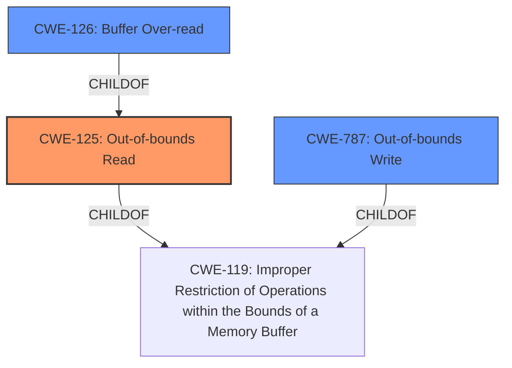

# Raw Analyzer Response for CVE-2020-23931

# Summary
| CWE ID    | CWE Name                                                   | Confidence | CWE Abstraction Level | CWE Vulnerability Mapping Label | CWE-Vulnerability Mapping Notes |
| :--------- | :--------------------------------------------------------- | :--------- | :-------------------- | :------------------------------ | :------------------------------ |
| CWE-125     | Out-of-bounds Read                                         | 1.0        | Base                  | Primary                         | Allowed                       |
| CWE-126     | Buffer Over-read                                           | 0.7        | Variant               | Secondary                       | Allowed                       |
| CWE-787     | Out-of-bounds Write                                        | 0.6        | Base                  | Secondary                       | Allowed                       |

## Evidence and Confidence

*   **Confidence Score:** 0.9
*   **Evidence Strength:** HIGH

## Relationship Analysis
The primary CWE is CWE-125 **Out-of-bounds Read** which is a base class. CWE-126 **Buffer Over-read** is a variant of CWE-125 and is more specific. CWE-787 **Out-of-bounds Write** is a related CWE, since a write past the allocated buffer can also result from reading past the end of the valid data, so it is included as a secondary CWE. CWE-119 **Improper Restriction of Operations within the Bounds of a Memory Buffer** is a parent of both CWE-125 and CWE-787.

## Vulnerability Chain
The vulnerability chain starts with the **heap-based buffer over-read** in the `abst_box_read` function (CWE-125, Out-of-bounds Read). The function reads data from a bitstream, but a size-related issue leads to reading past the end of the allocated buffer when calling `strdup`. This out-of-bounds read might lead to a buffer overflow (CWE-787, Out-of-bounds Write) when `strdup` is used to duplicate the string. A malformed MP4 file triggers the vulnerability.

## Summary of Analysis
Initially, the vulnerability was assessed as a **heap-based buffer over-read**, indicating CWE-125 **Out-of-bounds Read**. The analysis of the provided information, including the "**heap-based buffer over-read**" key phrase, CVE Reference Links Content Summary, and retriever results, strongly supports this classification. The CVE Reference Links Content Summary clearly states a heap-buffer-overflow vulnerability. The root cause is a size-related issue when the `abst_box_read` function reads strings from a bitstream, leading to a read past the end of the allocated buffer.

The retriever results listed CWE-125 **Out-of-bounds Read** and CWE-126 **Buffer Over-read** and CWE-787 **Out-of-bounds Write** as possible candidates.

The final decision is primarily based on the explicit mention of "**heap-based buffer over-read**" in the vulnerability description and the details provided in the CVE Reference Links Content Summary: "The `abst_box_read` function reads strings from a bitstream, and a size-related issue leads to a heap-based buffer overflow when calling `strdup`, which is used to duplicate the read string. The code reads a size, allocates memory with malloc, and reads the specified number of bytes. However the size can be larger than the remaining data, causing the overflow."

The selected CWEs are at the optimal level of specificity because CWE-125 **Out-of-bounds Read** directly reflects the **weakness** and the root cause of the vulnerability. The related CWE-126 **Buffer Over-read** and CWE-787 **Out-of-bounds Write** are included to reflect that reading past the buffer can lead to an out-of-bounds write.

Relevant CWE Information:

# Enhanced Context (25 CWEs)
The following CWEs were identified as potentially relevant to this vulnerability:

## CWE-197: Numeric Truncation Error
**Abstraction Level**: Base
**Similarity Score**: 0.78
**Source**: dense

**Description**:
Truncation errors occur when a primitive is cast to a primitive of a smaller size and data is lost in the conversion.

**Mapping Guidance**:
- Usage: Allowed
- Rationale: This CWE entry is at the Base level of abstraction, which is a preferred level of abstraction for mapping to the root causes of vulnerabilities.

## CWE-191: Integer Underflow (Wrap or Wraparound)
**Abstraction Level**: Base
**Similarity Score**: 0.78
**Source**: dense

**Description**:
The product subtracts one value from another, such that the result is less than the minimum allowable integer value, which produces a value that is not equal to the correct result.

**Mapping Guidance**:
- Usage: Allowed
- Rationale: This CWE entry is at the Base level of abstraction, which is a preferred level of abstraction for mapping to the root causes of vulnerabilities.

## CWE-131: Incorrect Calculation of Buffer Size
**Abstraction Level**: Base
**Similarity Score**: 0.78
**Source**: dense

**Description**:
The product does not correctly calculate the size to be used when allocating a buffer, which could lead to a buffer overflow.

**Mapping Guidance**:
- Usage: Allowed
- Rationale: This CWE entry is at the Base level of abstraction, which is a preferred level of abstraction for mapping to the root causes of vulnerabilities.

## CWE-125: Out-of-bounds Read
**Abstraction Level**: Base
**Similarity Score**: 0.77
**Source**: dense

**Description**:
The product reads data past the end, or before the beginning, of the intended buffer.

**Mapping Guidance**:
- Usage: Allowed
- Rationale: This CWE entry is at the Base level of abstraction, which is a preferred level of abstraction for mapping to the root causes of vulnerabilities.

## CWE-681: Incorrect Conversion between Numeric Types
**Abstraction Level**: Base
**Similarity Score**: 0.76
**Source**: dense

**Description**:
When converting from one data type to another, such as long to integer, data can be omitted or translated in a way that produces unexpected values. If the resulting values are used in a sensitive context, then dangerous behaviors may occur.

**Mapping Guidance**:
- Usage: Allowed
- Rationale: This CWE entry is at the Base level of abstraction, which is a preferred level of abstraction for mapping to the root causes of vulnerabilities.

## CWE-170: Improper Null Termination
**Abstraction Level**: Base
**Similarity Score**: 0.76
**Source**: dense

**Description**:
The product does not terminate or incorrectly terminates a string or array with a null character or equivalent terminator.

**Mapping Guidance**:
- Usage: Allowed
- Rationale: This CWE entry is at the Base level of abstraction, which is a preferred level of abstraction for mapping to the root causes of vulnerabilities.

## CWE-126: Buffer Over-read
**Abstraction Level**: Variant
**Similarity Score**: 0.76
**Source**: dense

**Description**:
The product reads from a buffer using buffer access mechanisms such as indexes or pointers that reference memory locations after the targeted buffer.

**Mapping Guidance**:
- Usage: Allowed
- Rationale: This CWE entry is at the Variant level of abstraction, which is a preferred level of abstraction for mapping to the root causes of vulnerabilities.

## CWE-805: Buffer Access with Incorrect Length Value
**Abstraction Level**: Base
**Similarity Score**: 0.76
**Source**: dense

**Description**:
The product uses a sequential operation to read or write a buffer, but it uses an incorrect length value that causes it to access memory that is outside of the bounds of the buffer.

**Mapping Guidance**:
- Usage: Allowed
- Rationale: This CWE entry is at the Base level of abstraction, which is a preferred level of abstraction for mapping to the root causes of vulnerabilities.

## CWE-193: Off-by-one Error
**Abstraction Level**: Base
**Similarity Score**: 0.75
**Source**: dense

**Description**:
A product calculates or uses an incorrect maximum or minimum value that is 1 more, or 1 less, than the correct value.

**Mapping Guidance**:
- Usage: Allowed
- Rationale: This