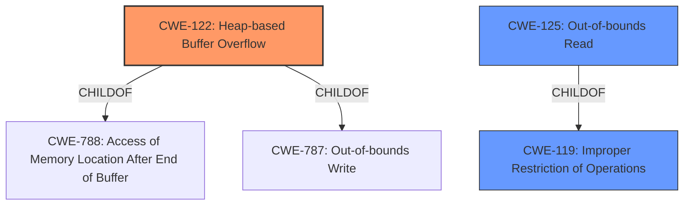

# Analysis for CVE-2020-24119

# Summary
| CWE ID | CWE Name | Confidence | CWE Abstraction Level | CWE Vulnerability Mapping Label | CWE-Vulnerability Mapping Notes |
|---|---|---|---|---|---|
| CWE-122 | Heap-based Buffer Overflow | 1.0 | Variant | Allowed | Primary CWE |
| CWE-125 | Out-of-bounds Read | 0.7 | Base | Allowed | Secondary Candidate |
| CWE-119 | Improper Restriction of Operations within the Bounds of a Memory Buffer | 0.5 | Class | Discouraged | Secondary Candidate |

## Evidence and Confidence

*   **Confidence Score:** 0.9
*   **Evidence Strength:** HIGH

## Relationship Analysis
The primary CWE selected is CWE-122, a Variant of CWE-788 (Access of Memory Location After End of Buffer) and CWE-787 (Out-of-bounds Write). CWE-122 specifically describes a heap-based buffer overflow. CWE-125, Out-of-bounds Read, is a Base level CWE and a child of CWE-119, which is a Class level CWE. The relationships guided the selection towards the most specific CWE, CWE-122, while acknowledging CWE-125 as a possible contributing factor or related weakness, though the description specifies an overflow (write), not just a read.

## Vulnerability Chain
The chain starts with the **improper** or **insufficient** input validation, leading to a **heap buffer overflow** read, which can then lead to arbitrary code execution or a crash.

## Summary of Analysis
The initial assessment identified CWE-122 as the most likely candidate due to the explicit mention of a **heap buffer overflow** in the vulnerability description and the CVE summary. The retriever results also list CWE-122, but with a lower score than CWE-119 and CWE-190. However, CWE-119 is discouraged for use, and CWE-190 does not seem relevant because there is no mention of an integer overflow or wraparound. The CVE summary confirms that the root cause is an insufficient boundary check, leading to a heap buffer overflow read.

The selection of CWE-122 is based on the following evidence:
* Vulnerability Description: "A **heap buffer overflow** read was discovered in upx 4.0.0, because the check in p_lx_elf.cpp is not perfect."
* CVE Reference Links Content Summary: "The vulnerability is a heap buffer overflow that occurs within the `get_le32()` function" and "A heap buffer overflow read vulnerability exists due to **insufficient** boundary checks"

CWE-122 is a Variant that is more specific than its parents CWE-788 and CWE-787. It accurately reflects the vulnerability where a buffer allocated on the heap is overflowed.

CWE-125 was considered because the vulnerability description mentions a "heap buffer overflow read". CWE-125 describes the situation where the product reads data past the end, or before the beginning, of the intended buffer. However, the primary issue is the overflow, which is a write operation, so CWE-122 is a better fit, and the overflow is a read operation.

CWE-119 was also considered, but the mapping guidance discourages its use when more specific CWEs are available. Since CWE-122 and CWE-125 are more specific and relevant, CWE-119 is not the best choice.

Relevant CWE Information:

# Enhanced Context (25 CWEs)

## CWE-191: Integer Underflow (Wrap or Wraparound)
**Abstraction Level**: Base
**Similarity Score**: 0.80
**Source**: dense

**Description**:
The product subtracts one value from another, such that the result is less than the minimum allowable integer value, which produces a value that is not equal to the correct result.

**Mapping Guidance**:
- Usage: Allowed
- Rationale: This CWE entry is at the Base level of abstraction, which is a preferred level of abstraction for mapping to the root causes of vulnerabilities.

## CWE-131: Incorrect Calculation of Buffer Size
**Abstraction Level**: Base
**Similarity Score**: 0.79
**Source**: dense

**Description**:
The product does not correctly calculate the size to be used when allocating a buffer, which could lead to a buffer overflow.

**Mapping Guidance**:
- Usage: Allowed
- Rationale: This CWE entry is at the Base level of abstraction, which is a preferred level of abstraction for mapping to the root causes of vulnerabilities.

## CWE-805: Buffer Access with Incorrect Length Value
**Abstraction Level**: Base
**Similarity Score**: 0.78
**Source**: dense

**Description**:
The product uses a sequential operation to read or write a buffer, but it uses an incorrect length value that causes it to access memory that is outside of the bounds of the buffer.

**Mapping Guidance**:
- Usage: Allowed
- Rationale: This CWE entry is at the Base level of abstraction, which is a preferred level of abstraction for mapping to the root causes of vulnerabilities.

## CWE-124: Buffer Underwrite ('Buffer Underflow')
**Abstraction Level**: Base
**Similarity Score**: 0.78
**Source**: dense

**Description**:
The product writes to a buffer using an index or pointer that references a memory location prior to the beginning of the buffer.

**Mapping Guidance**:
- Usage: Allowed
- Rationale: This CWE entry is at the Base level of abstraction, which is a preferred level of abstraction for mapping to the root causes of vulnerabilities.

## CWE-680: Integer Overflow to Buffer Overflow
**Abstraction Level**: Compound
**Similarity Score**: 0.77
**Source**: dense

**Description**:
The product performs a calculation to determine how much memory to allocate, but an integer overflow can occur that causes less memory to be allocated than expected, leading to a buffer overflow.

**Mapping Guidance**:
- Usage: Discouraged
- Rationale: This CWE entry is a named chain, which combines multiple weaknesses.

## CWE-197: Numeric Truncation Error
**Abstraction Level**: Base
**Similarity Score**: 0.77
**Source**: dense

**Description**:
Truncation errors occur when a primitive is cast to a primitive of a smaller size and data is lost in the conversion.

**Mapping Guidance**:
- Usage: Allowed
- Rationale: This CWE entry is at the Base level of abstraction, which is a preferred level of abstraction for mapping to the root causes of vulnerabilities.

## CWE-681: Incorrect Conversion between Numeric Types
**Abstraction Level**: Base
**Similarity Score**: 0.77
**Source**: dense

**Description**:
When converting from one data type to another, such as long to integer, data can be omitted or translated in a way that produces unexpected values. If the resulting values are used in a sensitive context, then dangerous behaviors may occur.

**Mapping Guidance**:
- Usage: Allowed
- Rationale: This CWE entry is at the Base level of abstraction, which is a preferred level of abstraction for mapping to the root causes of vulnerabilities.

## CWE-190: Integer Overflow or Wraparound
**Abstraction Level**: Base
**Similarity Score**: 0.76
**Source**: dense

**Description**:
The product performs a calculation that can
         produce an integer overflow or wraparound when the logic
         assumes that the resulting value will always be larger than
         the original value. This occurs when an integer value is
         incremented to a value that is too large to store in the
         associated representation. When this occurs, the value may
         become a very small or negative number.

**Mapping Guidance**:
- Usage: Allowed
- Rationale: This CWE entry is at the Base level of abstraction, which is a preferred level of abstraction for mapping to the root causes of vulnerabilities.

## CWE-126: Buffer Over-read
**Abstraction Level**: Variant
**Similarity Score**: 0.76
**Source**: dense

**Description**:
The product reads from a buffer using buffer access mechanisms such as indexes or pointers that reference memory locations after the targeted buffer.

**Mapping Guidance**:
- Usage: Allowed
- Rationale: This CWE