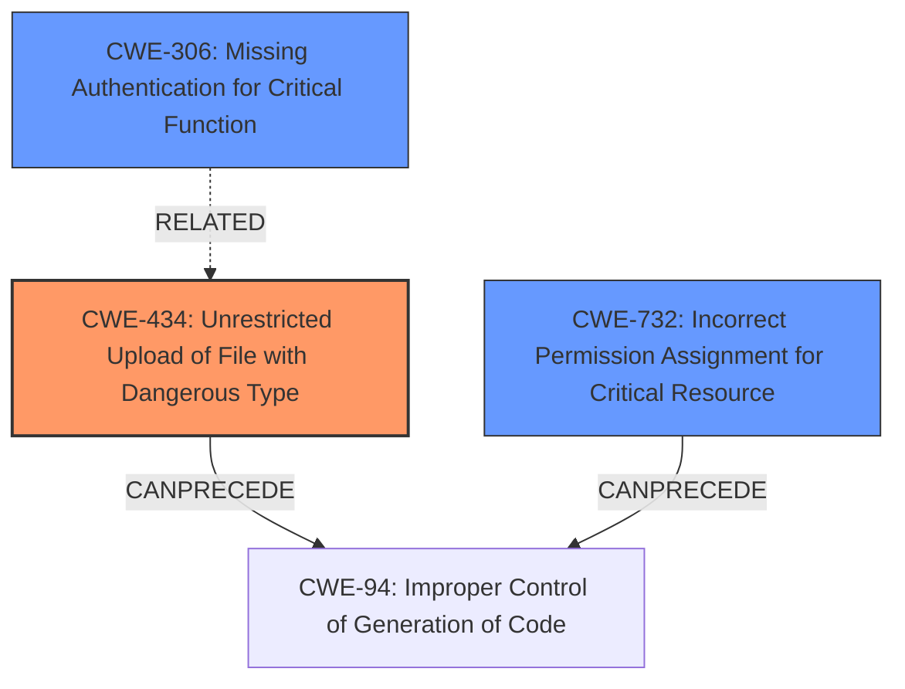

# Raw Analyzer Response for CVE-2020-24203

# Summary
| CWE ID | CWE Name | Confidence | CWE Abstraction Level | CWE Vulnerability Mapping Label | CWE-Vulnerability Mapping Notes |
|---|---|---|---|---|---|
| CWE-434 | Unrestricted Upload of File with Dangerous Type | 0.9 | Base | Allowed | Primary CWE |
| CWE-732 | Incorrect Permission Assignment for Critical Resource | 0.7 | Class | Allowed-with-Review | Secondary CWE |
| CWE-306 | Missing Authentication for Critical Function | 0.6 | Base | Allowed | Secondary CWE |

## Evidence and Confidence

*   **Confidence Score:** 0.8
*   **Evidence Strength:** MEDIUM

## Relationship Analysis
The primary weakness is **CWE-434 (Unrestricted Upload of File with Dangerous Type)**, which can lead to remote code execution. **CWE-732 (Incorrect Permission Assignment for Critical Resource)** is a secondary weakness given the description mentions **Insecure File Permissions**. The vulnerability can be exploited by remote unauthenticated attackers implying **CWE-306 (Missing Authentication for Critical Function)**. The relationships show a progression from a flawed upload process and insecure permissions to potential exploitation.

## Vulnerability Chain
The vulnerability chain starts with:
1.  **CWE-306 (Missing Authentication for Critical Function)**, allowing unauthenticated access.
2.  **CWE-434 (Unrestricted Upload of File with Dangerous Type)**, allowing the upload of malicious files.
3.  **CWE-732 (Incorrect Permission Assignment for Critical Resource)**, making uploaded files executable.
4.  **CWE-94 (Improper Control of Generation of Code)**, resulting in Remote Code Execution.

## Summary of Analysis
The initial assessment identified **CWE-434 (Unrestricted Upload of File with Dangerous Type)** as the primary vulnerability because the description explicitly mentions "Arbitrary File Upload". The rootcause is **Insecure File Permissions**, hence the selection of **CWE-732 (Incorrect Permission Assignment for Critical Resource)**. The content also mentions "remote unauthenticated attackers" which indicates **CWE-306 (Missing Authentication for Critical Function)**.

The evidence supports the selection of **CWE-434 (Unrestricted Upload of File with Dangerous Type)** as the primary CWE, with the root cause from "Insecure File Permissions and Arbitrary File Upload". This is based on the vulnerability description: "**Insecure File Permissions and Arbitrary File Upload** in the upload pic function in updatesubcategory.php in Projects World Travel Management System v1.0 allows remote unauthenticated attackers to gain remote code execution."

The evidence also supports **CWE-732 (Incorrect Permission Assignment for Critical Resource)** since "**Insecure File Permissions**" is mentioned in the Vulnerability Description.

The evidence supports **CWE-306 (Missing Authentication for Critical Function)** as well: "allows remote **unauthenticated** attackers".

These CWEs are at the appropriate level of specificity because they accurately represent the **root causes** contributing to the vulnerability.

**CWEs Considered But Not Used:**

*   **CWE-22 (Improper Limitation of a Pathname to a Restricted Directory ('Path Traversal')) and CWE-23 (Relative Path Traversal):** While path traversal could be a factor in exploiting the file upload, the primary issue is the unrestricted upload of dangerous file types. These are related but less direct.
*   **CWE-94 (Improper Control of Generation of Code ('Code Injection')):** This is the likely impact, but we want to focus on the root cause, which is the file upload.
*   **CWE-79 (Improper Neutralization of Input During Web Page Generation ('Cross-site Scripting')) and CWE-89 (Improper Neutralization of Special Elements used in an SQL Command ('SQL Injection')):** These are not directly relevant to the described vulnerability.
*   **CWE-425 (Direct Request ('Forced Browsing'))**: While it's possible that bypassing authorization leads to the upload function, the absence of authentication is a clearer issue (CWE-306) than forced browsing.
*   **CWE-639 (Authorization Bypass Through User-Controlled Key)**: There's no clear indication of bypassing authorization through user-controlled keys; missing authentication is more direct.
*   **CWE-616 (Incomplete Identification of Uploaded File Variables (PHP))**: Although this is a PHP application, the description does not explicitly focus on the uploaded file variables being exploited.