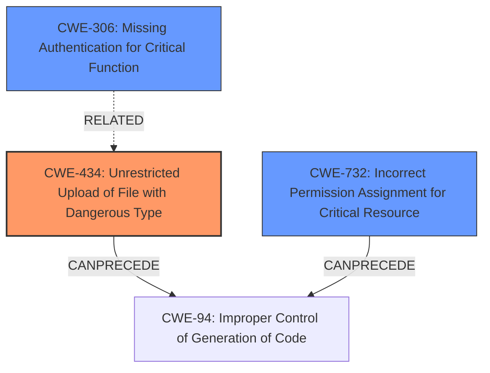

# Analysis for CVE-2020-24203

# Summary
| CWE ID | CWE Name | Confidence | CWE Abstraction Level | CWE Vulnerability Mapping Label | CWE-Vulnerability Mapping Notes |
|---|---|---|---|---|---|
| CWE-434 | Unrestricted Upload of File with Dangerous Type | 0.9 | Base | Allowed | Primary CWE |
| CWE-732 | Incorrect Permission Assignment for Critical Resource | 0.7 | Class | Allowed-with-Review | Secondary CWE |
| CWE-306 | Missing Authentication for Critical Function | 0.6 | Base | Allowed | Secondary CWE |

## Evidence and Confidence

*   **Confidence Score:** 0.8
*   **Evidence Strength:** MEDIUM

## Relationship Analysis
The primary weakness is **CWE-434 (Unrestricted Upload of File with Dangerous Type)**, which can lead to remote code execution. **CWE-732 (Incorrect Permission Assignment for Critical Resource)** is a secondary weakness given the description mentions **Insecure File Permissions**. The vulnerability can be exploited by remote unauthenticated attackers implying **CWE-306 (Missing Authentication for Critical Function)**. The relationships show a progression from a flawed upload process and insecure permissions to potential exploitation.

## Vulnerability Chain
The vulnerability chain starts with:
1.  **CWE-306 (Missing Authentication for Critical Function)**, allowing unauthenticated access.
2.  **CWE-434 (Unrestricted Upload of File with Dangerous Type)**, allowing the upload of malicious files.
3.  **CWE-732 (Incorrect Permission Assignment for Critical Resource)**, making uploaded files executable.
4.  **CWE-94 (Improper Control of Generation of Code)**, resulting in Remote Code Execution.

## Summary of Analysis
The initial assessment identified **CWE-434 (Unrestricted Upload of File with Dangerous Type)** as the primary vulnerability because the description explicitly mentions "Arbitrary File Upload". The rootcause is **Insecure File Permissions**, hence the selection of **CWE-732 (Incorrect Permission Assignment for Critical Resource)**. The content also mentions "remote unauthenticated attackers" which indicates **CWE-306 (Missing Authentication for Critical Function)**.

The evidence supports the selection of **CWE-434 (Unrestricted Upload of File with Dangerous Type)** as the primary CWE, with the root cause from "Insecure File Permissions and Arbitrary File Upload". This is based on the vulnerability description: "**Insecure File Permissions and Arbitrary File Upload** in the upload pic function in updatesubcategory.php in Projects World Travel Management System v1.0 allows remote unauthenticated attackers to gain remote code execution."

The evidence also supports **CWE-732 (Incorrect Permission Assignment for Critical Resource)** since "**Insecure File Permissions**" is mentioned in the Vulnerability Description.

The evidence supports **CWE-306 (Missing Authentication for Critical Function)** as well: "allows remote **unauthenticated** attackers".

These CWEs are at the appropriate level of specificity because they accurately represent the **root causes** contributing to the vulnerability.

**CWEs Considered But Not Used:**

*   **CWE-22 (Improper Limitation of a Pathname to a Restricted Directory ('Path Traversal')) and CWE-23 (Relative Path Traversal):** While path traversal could be a factor in exploiting the file upload, the primary issue is the unrestricted upload of dangerous file types. These are related but less direct.
*   **CWE-94 (Improper Control of Generation of Code ('Code Injection')):** This is the likely impact, but we want to focus on the root cause, which is the file upload.
*   **CWE-79 (Improper Neutralization of Input During Web Page Generation ('Cross-site Scripting')) and CWE-89 (Improper Neutralization of Special Elements used in an SQL Command ('SQL Injection')):** These are not directly relevant to the described vulnerability.
*   **CWE-425 (Direct Request ('Forced Browsing'))**: While it's possible that bypassing authorization leads to the upload function, the absence of authentication is a clearer issue (CWE-306) than forced browsing.
*   **CWE-639 (Authorization Bypass Through User-Controlled Key)**: There's no clear indication of bypassing authorization through user-controlled keys; missing authentication is more direct.
*   **CWE-616 (Incomplete Identification of Uploaded File Variables (PHP))**: Although this is a PHP application, the description does not explicitly focus on the uploaded file variables being exploited.

# Enhanced Query for CVE-2020-24203

## Vulnerability Description
**Insecure File Permissions and Arbitrary File Upload** in the upload pic function in updatesubcategory.php in Projects World Travel Management System v1.0 allows remote unauthenticated attackers to gain remote code execution.

### Vulnerability Description Key Phrases
- **rootcause:** **Insecure File Permissions and Arbitrary File Upload**
- **impact:** remote code execution
- **attacker:** remote unauthenticated attackers
- **product:** Projects World Travel Management System
- **version:** v1.0
- **component:** upload pic function in updatesubcategory.php

## CVE Reference Links Content Summary
Based on the provided information, here's an analysis related to CVE-2020-24203:

**Summary:**

The provided content details a Travel Management System project and an associated exploit, `TravelManagementSystem_Unauth_RCE`, found on GitHub. This exploit targets an unauthenticated Remote Code Execution (RCE) vulnerability in version 1.0 of the Travel Management System.

**Root cause of vulnerability:**
The root cause is not explicitly stated but the existence of an unauthenticated RCE exploit implies a flaw in the application where user-supplied input is not properly sanitized or validated, which can be exploited to execute arbitrary code on the server.

**Weaknesses/vulnerabilities present:**

*   **Unauthenticated Remote Code Execution (RCE):** The primary vulnerability is the ability to execute arbitrary code on the server without authentication.

**Impact of exploitation:**
*   **Full system compromise:** An attacker could gain complete control of the server, potentially leading to data theft, malware installation, or denial of service.

**Attack vectors:**
*   **Network-based:** The exploit can be triggered remotely over the network, as indicated by the mention of a Python exploit script.

**Required attacker capabilities/position:**
*   **Network access:** The attacker needs to have network connectivity to the server running the vulnerable Travel Management System.
*   **No authentication required:** The vulnerability can be exploited without needing to authenticate or log in to the application.

**Additional Notes:**
*   The project's description on Projectworlds indicates it uses PHP and MySQL.
*   The provided exploit code `TravelManagementRCE.py` suggests that a Python script is used to exploit the vulnerability.

**In summary:**
The provided content describes a critical RCE vulnerability in a Travel Management System which can be exploited remotely without authentication. The vulnerability allows an attacker to execute arbitrary code on the server.

**Relevance to CVE-2020-24203:**
While the provided content details an RCE vulnerability, it does not explicitly mention CVE-2020-24203, or make direct reference to an official CVE. It is possible that this vulnerability could be assigned this CVE number if it matches the description, but it is not currently mentioned. Further investigation of the actual vulnerability and confirmation from a trusted source like NVD would be required to confirm the association.

## Retriever Results

### Top Combined Results

| Rank | CWE ID | Name | Abstraction | Usage  | Retrievers | Individual Scores |
|------|--------|------|-------------|-------|------------|-------------------|
| 1 | 425 | Direct Request ('Forced Browsing') | Base | Allowed | sparse | 0.235 |
| 2 | 434 | Unrestricted Upload of File with Dangerous Type | Base | Allowed | sparse | 0.197 |
| 3 | 23 | Relative Path Traversal | Base | Allowed | sparse | 0.178 |
| 4 | 732 | Incorrect Permission Assignment for Critical Resource | Class | Allowed-with-Review | sparse | 0.170 |
| 5 | 639 | Authorization Bypass Through User-Controlled Key | Base | Allowed | sparse | 0.169 |
| 6 | 616 | Incomplete Identification of Uploaded File Variables (PHP) | Variant | Allowed | dense | 0.616 |
| 7 | 183 | Permissive List of Allowed Inputs | Base | Allowed | graph | 0.002 |
| 8 | 96 | Improper Neutralization of Directives in Statically Saved Code ('Static Code Injection') | Base | Allowed | sparse | 0.168 |
| 9 | 306 | Missing Authentication for Critical Function | Base | Allowed | sparse | 0.166 |
| 10 | 89 | Improper Neutralization of Special Elements used in an SQL Command ('SQL Injection') | Base | Allowed | sparse | 0.164 |

# Complete CWE Specifications

## CWE-425: Direct Request ('Forced Browsing')
**Abstraction:** Base
**Status:** Incomplete

### Description
The web application does not adequately enforce appropriate authorization on all restricted URLs, scripts, or files.

### Extended Description
Web applications susceptible to direct request attacks often make the false assumption that such resources can only be reached through a given navigation path and so only apply authorization at certain points in the path.

### Alternative Terms
forced browsing: The "forced browsing" term could be misinterpreted to include weaknesses such as CSRF or XSS, so its use is discouraged.

### Relationships
ChildOf -> CWE-862
ChildOf -> CWE-862
ChildOf -> CWE-288
ChildOf -> CWE-424
CanPrecede -> CWE-471
CanPrecede -> CWE-98

### Mapping Guidance
**Usage:** Allowed
**Rationale:** This CWE entry is at the Base level of abstraction, which is a preferred level of abstraction for mapping to the root causes of vulnerabilities.
**Comments:** Carefully read both the name and description to ensure that this mapping is an appropriate fit. Do not try to 'force' a mapping to a lower-level Base/Variant simply to comply with this preferred level of abstraction.
**Reasons:**
- Acceptable-Use

### Additional Notes
**[Relationship]** Overlaps Modification of Assumed-Immutable Data (MAID), authorization errors, container errors; often primary to other weaknesses such as XSS and SQL injection.

**[Theoretical]** "Forced browsing" is a step-based manipulation involving the omission of one or more steps, whose order is assumed to be immutable. The application does not verify that the first step was performed successfully before the second step. The consequence is typically "authentication bypass" or "path disclosure," although it can be primary to all kinds of weaknesses, especially in languages such as PHP, which allow external modification of assumed-immutable variables.

### Observed Examples
- **CVE-2022-29238:** Access-control setting in web-based document collaboration tool is not properly implemented by the code, which prevents listing hidden directories but does not prevent direct requests to files in those directories.
- **CVE-2022-23607:** Python-based HTTP library did not scope cookies to a particular domain such that "supercookies" could be sent to any domain on redirect.
- **CVE-2004-2144:** Bypass authentication via direct request.

## CWE-434: Unrestricted Upload of File with Dangerous Type
**Abstraction:** Base
**Status:** Draft

### Description
The product allows the upload or transfer of dangerous file types that are automatically processed within its environment.

### Extended Description
Not provided

### Alternative Terms
Unrestricted File Upload: Used in vulnerability databases and elsewhere, but it is insufficiently precise. The phrase could be interpreted as the lack of restrictions on the size or number of uploaded files, which is a resource consumption issue.

### Relationships
ChildOf -> CWE-669
ChildOf -> CWE-669
PeerOf -> CWE-351
PeerOf -> CWE-436
PeerOf -> CWE-430

### Mapping Guidance
**Usage:** Allowed
**Rationale:** This CWE entry is at the Base level of abstraction, which is a preferred level of abstraction for mapping to the root causes of vulnerabilities.
**Comments:** Carefully read both the name and description to ensure that this mapping is an appropriate fit. Do not try to 'force' a mapping to a lower-level Base/Variant simply to comply with this preferred level of abstraction.
**Reasons:**
- Acceptable-Use

### Additional Notes
**[Relationship]** 

This can have a chaining relationship with incomplete denylist / permissive allowlist errors when the product tries, but fails, to properly limit which types of files are allowed (CWE-183, CWE-184).

This can also overlap multiple interpretation errors for intermediaries, e.g. anti-virus products that do not remove or quarantine attachments with certain file extensions that can be processed by client systems.

### Observed Examples
- **CVE-2023-5227:** PHP-based FAQ management app does not check the MIME type for uploaded images
- **CVE-2001-0901:** Web-based mail product stores ".shtml" attachments that could contain SSI
- **CVE-2002-1841:** PHP upload does not restrict file types

## CWE-23: Relative Path Traversal
**Abstraction:** Base
**Status:** Draft

### Description
The product uses external input to construct a pathname that should be within a restricted directory, but it does not properly neutralize sequences such as ".." that can resolve to a location that is outside of that directory.

### Extended Description
This allows attackers to traverse the file system to access files or directories that are outside of the restricted directory.

### Alternative Terms
Zip Slip: "Zip slip" is an attack that uses file archives (e.g., ZIP, tar, rar, etc.) that contain filenames with path traversal sequences that cause the files to be written outside of the directory under which the archive is expected to be extracted [REF-1282]. It is most commonly used for relative path traversal (CWE-23) and link following (CWE-59).

### Relationships
ChildOf -> CWE-22
ChildOf -> CWE-22
ChildOf -> CWE-22

### Mapping Guidance
**Usage:** Allowed
**Rationale:** This CWE entry is at the Base level of abstraction, which is a preferred level of abstraction for mapping to the root causes of vulnerabilities.
**Comments:** Carefully read both the name and description to ensure that this mapping is an appropriate fit. Do not try to 'force' a mapping to a lower-level Base/Variant simply to comply with this preferred level of abstraction.
**Reasons:**
- Acceptable-Use

### Observed Examples
- **CVE-2024-37032:** Large language model (LLM) management tool does not validate the format of a digest value (CWE-1287) from a private, untrusted model registry, enabling relative path traversal (CWE-23), a.k.a. Probllama
- **CVE-2022-45918:** Chain: a learning management tool debugger uses external input to locate previous session logs (CWE-73) and does not properly validate the given path (CWE-20), allowing for filesystem path traversal using "../" sequences (CWE-24)
- **CVE-2019-20916:** Python package manager does not correctly restrict the filename specified in a Content-Disposition header, allowing arbitrary file read using path traversal sequences such as "../"

## CWE-732: Incorrect Permission Assignment for Critical Resource
**Abstraction:** Class
**Status:** Draft

### Description
The product specifies permissions for a security-critical resource in a way that allows that resource to be read or modified by unintended actors.

### Extended Description
When a resource is given a permission setting that provides access to a wider range of actors than required, it could lead to the exposure of sensitive information, or the modification of that resource by unintended parties. This is especially dangerous when the resource is related to program configuration, execution, or sensitive user data. For example, consider a misconfigured storage account for the cloud that can be read or written by a public or anonymous user.

### Alternative Terms
None

### Relationships
ChildOf -> CWE-285
ChildOf -> CWE-668

### Mapping Guidance
**Usage:** Allowed-with-Review
**Rationale:** While the name itself indicates an assignment of permissions for resources, this is often misused for vulnerabilities in which "permissions" are not checked, which is an "authorization" weakness (CWE-285 or descendants) within CWE's model [REF-1287].
**Comments:** Closely analyze the specific mistake that is allowing the resource to be exposed, and perform a CWE mapping for that mistake.
**Reasons:**
- Frequent Misuse

### Additional Notes
**[Maintenance]** The relationships between privileges, permissions, and actors (e.g. users and groups) need further refinement within the Research view. One complication is that these concepts apply to two different pillars, related to control of resources (CWE-664) and protection mechanism failures (CWE-693).

### Observed Examples
- **CVE-2022-29527:** Go application for cloud management creates a world-writable sudoers file that allows local attackers to inject sudo rules and escalate privileges to root by winning a race condition.
- **CVE-2009-3482:** Anti-virus product sets insecure "Everyone: Full Control" permissions for files under the "Program Files" folder, allowing attackers to replace executables with Trojan horses.
- **CVE-2009-3897:** Product creates directories with 0777 permissions at installation, allowing users to gain privileges and access a socket used for authentication.

## CWE-639: Authorization Bypass Through User-Controlled Key
**Abstraction:** Base
**Status:** Incomplete

### Description
The system's authorization functionality does not prevent one user from gaining access to another user's data or record by modifying the key value identifying the data.

### Extended Description

Retrieval of a user record occurs in the system based on some key value that is under user control. The key would typically identify a user-related record stored in the system and would be used to lookup that record for presentation to the user. It is likely that an attacker would have to be an authenticated user in the system. However, the authorization process would not properly check the data access operation to ensure that the authenticated user performing the operation has sufficient entitlements to perform the requested data access, hence bypassing any other authorization checks present in the system.

For example, attackers can look at places where user specific data is retrieved (e.g. search screens) and determine whether the key for the item being looked up is controllable externally. The key may be a hidden field in the HTML form field, might be passed as a URL parameter or as an unencrypted cookie variable, then in each of these cases it will be possible to tamper with the key value.

One manifestation of this weakness is when a system uses sequential or otherwise easily-guessable session IDs that would allow one user to easily switch to another user's session and read/modify their data.

### Alternative Terms
Insecure Direct Object Reference / IDOR: The "Insecure Direct Object Reference" term, as described in the OWASP Top Ten, is broader than this CWE because it also covers path traversal (CWE-22). Within the context of vulnerability theory, there is a similarity between the OWASP concept and CWE-706: Use of Incorrectly-Resolved Name or Reference.
Broken Object Level Authorization / BOLA: BOLA is used in the 2019 OWASP API Security Top 10 and is said to be the same as IDOR.
Horizontal Authorization: "Horizontal Authorization" is used to describe situations in which two users have the same privilege level, but must be prevented from accessing each other's resources. This is fairly common when using key-based access to resources in a multi-user context.

### Relationships
ChildOf -> CWE-863
ChildOf -> CWE-863
ChildOf -> CWE-284

### Mapping Guidance
**Usage:** Allowed
**Rationale:** This CWE entry is at the Base level of abstraction, which is a preferred level of abstraction for mapping to the root causes of vulnerabilities.
**Comments:** Carefully read both the name and description to ensure that this mapping is an appropriate fit. Do not try to 'force' a mapping to a lower-level Base/Variant simply to comply with this preferred level of abstraction.
**Reasons:**
- Acceptable-Use

### Observed Examples
- **CVE-2021-36539:** An educational application does not appropriately restrict file IDs to a particular user. The attacker can brute-force guess IDs, indicating IDOR.

## CWE-616: Incomplete Identification of Uploaded File Variables (PHP)
**Abstraction:** Variant
**Status:** Incomplete

### Description
The PHP application uses an old method for processing uploaded files by referencing the four global variables that are set for each file (e.g. $varname, $varname_size, $varname_name, $varname_type). These variables could be overwritten by attackers, causing the application to process unauthorized files.

### Extended Description
These global variables could be overwritten by POST requests, cookies, or other methods of populating or overwriting these variables. This could be used to read or process arbitrary files by providing values such as "/etc/passwd".

### Alternative Terms
None

### Relationships
ChildOf -> CWE-345
PeerOf -> CWE-473

### Mapping Guidance
**Usage:** Allowed
**Rationale:** This CWE entry is at the Variant level of abstraction, which is a preferred level of abstraction for mapping to the root causes of vulnerabilities.
**Comments:** Carefully read both the name and description to ensure that this mapping is an appropriate fit. Do not try to 'force' a mapping to a lower-level Base/Variant simply to comply with this preferred level of abstraction.
**Reasons:**
- Acceptable-Use

### Observed Examples
- **CVE-2002-1460:** Forum does not properly verify whether a file was uploaded or if the associated variables were set by POST, allowing remote attackers to read arbitrary files.
- **CVE-2002-1759:** Product doesn't check if the variables for an upload were set by uploading the file, or other methods such as $_POST.
- **CVE-2002-1710:** Product does not distinguish uploaded file from other files.

## CWE-183: Permissive List of Allowed Inputs
**Abstraction:** Base
**Status:** Draft

### Description
The product implements a protection mechanism that relies on a list of inputs (or properties of inputs) that are explicitly allowed by policy because the inputs are assumed to be safe, but the list is too permissive - that is, it allows an input that is unsafe, leading to resultant weaknesses.

### Extended Description
Not provided

### Alternative Terms
Allowlist / Allow List: This is used by CWE and CAPEC instead of other commonly-used terms. Its counterpart is denylist.
Safelist / Safe List: This is often used by security tools such as firewalls, email or web gateways, proxies, etc.
Whitelist / White List: This term is frequently used, but usage has been declining as organizations have started to adopt other terms.

### Relationships
ChildOf -> CWE-697
CanPrecede -> CWE-434

### Mapping Guidance
**Usage:** Allowed
**Rationale:** This CWE entry is at the Base level of abstraction, which is a preferred level of abstraction for mapping to the root causes of vulnerabilities.
**Comments:** Carefully read both the name and description to ensure that this mapping is an appropriate fit. Do not try to 'force' a mapping to a lower-level Base/Variant simply to comply with this preferred level of abstraction.
**Reasons:**
- Acceptable-Use

### Observed Examples
- **CVE-2019-12799:** chain: bypass of untrusted deserialization issue (CWE-502) by using an assumed-trusted class (CWE-183)
- **CVE-2019-10458:** sandbox bypass using a method that is on an allowlist
- **CVE-2017-1000095:** sandbox bypass using unsafe methods that are on an allowlist

## CWE-96: Improper Neutralization of Directives in Statically Saved Code ('Static Code Injection')
**Abstraction:** Base
**Status:** Draft

### Description
The product receives input from an upstream component, but it does not neutralize or incorrectly neutralizes code syntax before inserting the input into an executable resource, such as a library, configuration file, or template.

### Extended Description
Not provided

### Alternative Terms
None

### Relationships
ChildOf -> CWE-94

### Mapping Guidance
**Usage:** Allowed
**Rationale:** This CWE entry is at the Base level of abstraction, which is a preferred level of abstraction for mapping to the root causes of vulnerabilities.
**Comments:** Carefully read both the name and description to ensure that this mapping is an appropriate fit. Do not try to 'force' a mapping to a lower-level Base/Variant simply to comply with this preferred level of abstraction.
**Reasons:**
- Acceptable-Use

### Additional Notes
**[Relationship]** "HTML injection" (see CWE-79: XSS) could be thought of as an example of this, but the code is injected and executed on the client side, not the server side. Server-Side Includes (SSI) are an example of direct static code injection.

### Observed Examples
- **CVE-2002-0495:** Perl code directly injected into CGI library file from parameters to another CGI program.
- **CVE-2005-1876:** Direct PHP code injection into supporting template file.
- **CVE-2005-1894:** Direct code injection into PHP script that can be accessed by attacker.

## CWE-306: Missing Authentication for Critical Function
**Abstraction:** Base
**Status:** Draft

### Description
The product does not perform any authentication for functionality that requires a provable user identity or consumes a significant amount of resources.

### Extended Description
Not provided

### Alternative Terms
None

### Relationships
ChildOf -> CWE-287
ChildOf -> CWE-287

### Mapping Guidance
**Usage:** Allowed
**Rationale:** This CWE entry is at the Base level of abstraction, which is a preferred level of abstraction for mapping to the root causes of vulnerabilities.
**Comments:** Carefully read both the name and description to ensure that this mapping is an appropriate fit. Do not try to 'force' a mapping to a lower-level Base/Variant simply to comply with this preferred level of abstraction.
**Reasons:**
- Acceptable-Use

### Observed Examples
- **CVE-2022-31260:** Chain: a digital asset management program has an undisclosed backdoor in the legacy version of a PHP script (CWE-912) that could allow an unauthenticated user to export metadata (CWE-306)
- **CVE-2022-29951:** TCP-based protocol in Programmable Logic Controller (PLC) has no authentication.
- **CVE-2022-29952:** Condition Monitor firmware uses a protocol that does not require authentication.

## CWE-89: Improper Neutralization of Special Elements used in an SQL Command ('SQL Injection')
**Abstraction:** Base
**Status:** Stable

### Description
The product constructs all or part of an SQL command using externally-influenced input from an upstream component, but it does not neutralize or incorrectly neutralizes special elements that could modify the intended SQL command when it is sent to a downstream component. Without sufficient removal or quoting of SQL syntax in user-controllable inputs, the generated SQL query can cause those inputs to be interpreted as SQL instead of ordinary user data.

### Extended Description
Not provided

### Alternative Terms
SQL injection: a common attack-oriented phrase
SQLi: a common abbreviation for "SQL injection"

### Relationships
ChildOf -> CWE-943
ChildOf -> CWE-74

### Mapping Guidance
**Usage:** Allowed
**Rationale:** This CWE entry is at the Base level of abstraction, which is a preferred level of abstraction for mapping to the root causes of vulnerabilities.
**Comments:** Carefully read both the name and description to ensure that this mapping is an appropriate fit. Do not try to 'force' a mapping to a lower-level Base/Variant simply to comply with this preferred level of abstraction.
**Reasons:**
- Acceptable-Use

### Additional Notes
**[Relationship]** SQL injection can be resultant from special character mismanagement, MAID, or denylist/allowlist problems. It can be primary to authentication errors.

### Observed Examples
- **CVE-2023-32530:** SQL injection in security product dashboard using crafted certificate fields
- **CVE-2021-42258:** SQL injection in time and billing software, as exploited in the wild per CISA KEV.
- **CVE-2021-27101:** SQL injection in file-transfer system via a crafted Host header, as exploited in the wild per CISA KEV.

