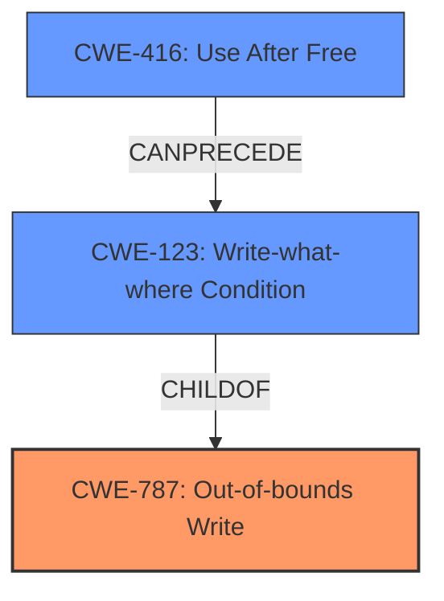

# Analysis Report for CVE-2020-24349

# Vulnerability Analysis Report: CVE-2020-24349

## Description


## Analysis (with Relationship Data)

# Summary
| CWE ID | CWE Name | Confidence | CWE Abstraction Level | CWE Vulnerability Mapping Label | CWE-Vulnerability Mapping Notes |
|---|---|---|---|---|---|
| CWE-787 | Out-of-bounds Write | 0.75 | Base | Allowed | Primary CWE |
| CWE-123 | Write-what-where Condition | 0.60 | Base | Allowed | Secondary CWE |
| CWE-416 | Use After Free | 0.50 | Variant | Allowed | Secondary CWE |

## Evidence and Confidence

*   **Confidence Score:** 0.70
*   **Evidence Strength:** MEDIUM

## Relationship Analysis
The primary CWE is CWE-787 (**Out-of-bounds Write**) because the vulnerability description indicates a **control-flow hijack** in `njs_value_property` in `njs_value.c`, suggesting memory corruption. CWE-123 (**Write-what-where Condition**) is considered as a condition where the attacker has the ability to write an arbitrary value to an arbitrary location, often as the result of a buffer overflow, which could lead to a **control-flow hijack**. CWE-416 (**Use After Free**) is considered since improper handling of object properties can lead to use of freed memory. These weaknesses are related, as a **write-what-where** can be caused by a **use-after-free**, and both can lead to memory corruption.



## Vulnerability Chain
The vulnerability chain starts with a crafted JSON input processed using `JSON.parse` with a malicious callback function which leads to improper property handling in `njs_value_property`. This results in a **control-flow hijack**, potentially leading to **out-of-bounds write**, **write-what-where** or **use-after-free**.

## Summary of Analysis
The initial assessment was based on the **Vulnerability Description Key Phrases** and the **CVE Reference Links Content Summary**. The key phrase "**control-flow hijack**" pointed towards memory corruption vulnerabilities. The **CVE Reference Links Content Summary** confirmed this with details of how crafted JSON input can lead to a **control-flow hijack** in the `njs_value_property` function. The graph relationships highlight how these weaknesses can be interconnected. Specifically, `JSON.parse` with a crafted callback can cause improper property handling leading to memory corruption (**out-of-bounds write**, **write-what-where**, or **use-after-free**). The selected CWEs are at the optimal level of specificity because they describe the specific type of memory corruption that can occur due to the vulnerability. The evidence supports these classifications, although the exact nature of the memory corruption (whether it is primarily an **out-of-bounds write**, **write-what-where**, or **use-after-free**) is not definitively stated in the provided information.

Relevant CWE Information:

# Enhanced Context (25 CWEs)

## CWE-538: Insertion of Sensitive Information into Externally-Accessible File or Directory
**Abstraction Level**: Base
**Similarity Score**: 0.78
**Source**: dense
**Reason for Exclusion**: This CWE is not relevant as the vulnerability is about **control-flow hijack** rather than insertion of sensitive information.

## CWE-23: Relative Path Traversal
**Abstraction Level**: Base
**Similarity Score**: 0.77
**Source**: dense
**Reason for Exclusion**: This CWE is not relevant as the vulnerability is about **control-flow hijack** rather than path traversal.

## CWE-41: Improper Resolution of Path Equivalence
**Abstraction Level**: Base
**Similarity Score**: 0.77
**Source**: dense
**Reason for Exclusion**: This CWE is not relevant as the vulnerability is about **control-flow hijack** rather than path equivalence issues.

## CWE-212: Improper Removal of Sensitive Information Before Storage or Transfer
**Abstraction Level**: Base
**Similarity Score**: 0.77
**Source**: dense
**Reason for Exclusion**: This CWE is not relevant as the vulnerability is about **control-flow hijack** rather than removal of sensitive information.

## CWE-74: Improper Neutralization of Special Elements in Output Used by a Downstream Component ('Injection')
**Abstraction Level**: Class
**Similarity Score**: 0.76
**Source**: dense
**Reason for Exclusion**: This CWE is too high-level and injection is not the primary issue.

## CWE-73: External Control of File Name or Path
**Abstraction Level**: Base
**Similarity Score**: 0.76
**Source**: dense
**Reason for Exclusion**: This CWE is not relevant as the vulnerability is about **control-flow hijack** rather than external control of file names.

## CWE-668: Exposure of Resource to Wrong Sphere
**Abstraction Level**: Class
**Similarity Score**: 0.76
**Source**: dense
**Reason for Exclusion**: This CWE is too high-level and doesn't accurately describe the root cause.

## CWE-59: Improper Link Resolution Before File Access ('Link Following')
**Abstraction Level**: Base
**Similarity Score**: 0.75
**Source**: dense
**Reason for Exclusion**: This CWE is not relevant as the vulnerability is about **control-flow hijack** rather than link following.

## CWE-552: Files or Directories Accessible to External Parties
**Abstraction Level**: Base
**Similarity Score**: 0.75
**Source**: dense
**Reason for Exclusion**: This CWE is not relevant as the vulnerability is about **control-flow hijack** rather than file accessibility.

## CWE-226: Sensitive Information in Resource Not Removed Before Reuse
**Abstraction Level**: Base
**Similarity Score**: 0.75
**Source**: dense
**Reason for Exclusion**: This CWE is not relevant as the vulnerability is about **control-flow hijack** rather than sensitive information in reused resources.

## CWE-427: Uncontrolled Search Path Element
**Abstraction Level**: Base
**Similarity Score**: 9101.17
**Source**: sparse
**Reason for Exclusion**: This CWE is not relevant as the vulnerability is about **control-flow hijack** rather than search path issues.

## CWE-22: Improper Limitation of a Pathname to a Restricted Directory ('Path Traversal')
**Abstraction Level**: Base
**Similarity Score**: 8527.64
**Source**: sparse
**Reason for Exclusion**: This CWE is not relevant as the vulnerability is about **control-flow hijack** rather than path traversal.

## CWE-79: Improper Neutralization of Input During Web Page Generation ('Cross-site Scripting')
**Abstraction Level**: Base
**Similarity Score**: 8435.46
**Source**: sparse
**Reason for Exclusion**: This CWE is not relevant as the vulnerability is about **control-flow hijack** rather than cross-site scripting.

## CWE-23: Relative Path Traversal
**Abstraction Level**: Base
**Similarity Score**: 8191.05
**Source**: sparse
**Reason for Exclusion**: This CWE is not relevant as the vulnerability is about **control-flow hijack** rather than path traversal.

## CWE-125: Out-of-bounds Read
**Abstraction Level**: Base
**Similarity Score**: 8091.06
**Source**: sparse
**Reason for Exclusion**: This CWE is related to memory corruption but focuses on reading, not writing.

## CWE-79: Improper Neutralization of Input During Web Page Generation ('Cross-site Scripting')
**Abstraction Level**: base
**Similarity Score**: 5.03
**Source**: graph
**Reason for Exclusion**: This CWE is not relevant as the vulnerability is about **control-flow hijack** rather than cross-site scripting.

## CWE-201: Insertion of Sensitive Information Into Sent Data
**Abstraction Level**: base
**Similarity Score**: 5.03
**Source**: graph
**Reason for Exclusion**: This CWE is not relevant as the vulnerability is about **control-flow hijack** rather than sensitive data insertion.

## CWE-123: Write-what-where Condition
**Abstraction Level**: base
**Similarity Score**: 4.82
**Source**: graph
**Reason for Inclusion**: This CWE describes a condition where an attacker can write arbitrary values to arbitrary locations, which could lead to control flow hijack.

## CWE-416: Use After Free
**Abstraction Level**: variant
**Similarity Score**: 4.33
**Source**: graph
**Reason for Inclusion**: The vulnerability may lead to use-after-free if the improper property handling allows the


## CWE Relationship Analysis

Current CWEs represent these abstraction levels: .


### Vulnerability Chain Analysis

**Chain starting from CWE-787:**
- 787 (Out-of-bounds Write) - ROOT


**Chain starting from CWE-123:**
- 123 (Write-what-where Condition) - ROOT


### CWE Relationship Diagram

```mermaid
graph TD
    classDef primary fill:#f96,stroke:#333,stroke-width:2px
    classDef secondary fill:#69f,stroke:#333
    classDef tertiary fill:#9e9,stroke:#333
```


*Report generated on 2025-04-02 05:01:08*
