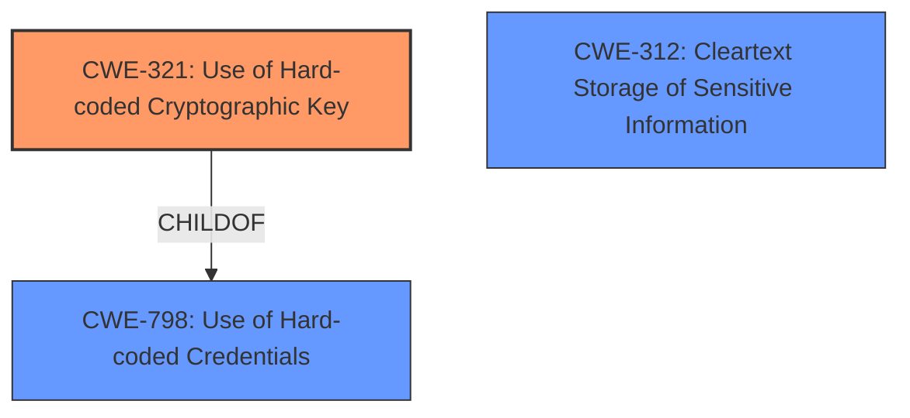

# Raw Analyzer Response for CVE-2020-24396

# Summary
| CWE ID | CWE Name | Confidence | CWE Abstraction Level | CWE Vulnerability Mapping Label | CWE-Vulnerability Mapping Notes |
|---|---|---|---|---|---|
| CWE-321 | Use of Hard-coded Cryptographic Key | 1 | Variant | Allowed | Primary CWE |
| CWE-312 | Cleartext Storage of Sensitive Information | 0.8 | Base | Allowed | Secondary Candidate |
| CWE-798 | Use of Hard-coded Credentials | 0.7 | Base | Allowed | Secondary Candidate |

## Evidence and Confidence

*   **Confidence Score:** 0.9
*   **Evidence Strength:** HIGH

## Relationship Analysis
The primary CWE is CWE-321, a Variant of CWE-798. CWE-312 and CWE-798 are considered as secondary candidates due to the sensitive information being stored in cleartext within the firmware image and the broad nature of credentials potentially including cryptographic keys. The relationships guided selection of more specific variant over broader base or class.

## Vulnerability Chain
The vulnerability chain starts with the **sensitive SSH keys within downloadable and unencrypted firmware images**, which allows remote attackers to use the support server as a SOCKS proxy. The root cause is the **missing encryption** and the presence of the key, leading to the exposure.

## Summary of Analysis
The analysis is primarily based on the provided evidence from the vulnerability description and the CVE Reference Links Content Summary.

The vulnerability description clearly states: "homee Brain Cube v2 (2.28.2 and 2.28.4) devices have **sensitive SSH keys within downloadable and unencrypted firmware images**."
The CVE Reference Links Content Summary states: "The firmware of the homee Brain Cube includes a private SSH key for the root user of the server support.codeatelier.com without encryption."

This indicates a hard-coded cryptographic key (SSH private key) being stored without encryption in the firmware image. This leads directly to the selection of CWE-321 (Use of Hard-coded Cryptographic Key) as the primary CWE because it's a **rootcause**. The `Retriever Results` also show CWE-321 as a potential match.

CWE-312 (Cleartext Storage of Sensitive Information) is a relevant secondary concern since the key is unencrypted within the firmware image. CWE-798 (Use of Hard-coded Credentials) is also a reasonable, albeit less specific, alternative.

The selection of CWE-321 is optimal because it is at the Variant level of abstraction, providing a precise representation of the weakness as it involves a cryptographic key specifically.

Relevant CWE Information:

# Enhanced Context (25 CWEs)
The following CWEs were identified as potentially relevant to this vulnerability:

## CWE-312: Cleartext Storage of Sensitive Information
**Abstraction Level**: Base
**Similarity Score**: 0.80
**Source**: dense

**Description**:
The product stores sensitive information in cleartext within a resource that might be accessible to another control sphere.

**Mapping Guidance**:
- Usage: Allowed
- Rationale: This CWE entry is at the Base level of abstraction, which is a preferred level of abstraction for mapping to the root causes of vulnerabilities.

## CWE-321: Use of Hard-coded Cryptographic Key
**Abstraction Level**: Variant
**Similarity Score**: 5213.73
**Source**: sparse

**Description**:
The use of a hard-coded cryptographic key significantly increases the possibility that encrypted data may be recovered.

**Mapping Guidance**:
- Usage: Allowed
- Rationale: This CWE entry is at the Variant level of abstraction, which is a preferred level of abstraction for mapping to the root causes of vulnerabilities.

## CWE-798: Use of Hard-coded Credentials
**Abstraction Level**: Base
**Similarity Score**: 5334.45
**Source**: sparse

**Description**:
The product contains hard-coded credentials, such as a password or cryptographic key.

**Mapping Guidance**:
- Usage: Allowed
- Rationale: This CWE entry is at the Base level of abstraction, which is a preferred level of abstraction for mapping to the root causes of vulnerabilities.