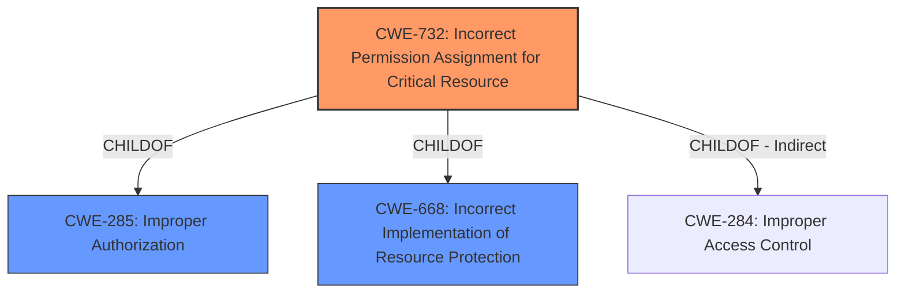

# Analysis for CVE-2020-24433

# Summary
| CWE ID | CWE Name | Confidence | CWE Abstraction Level | CWE Vulnerability Mapping Label | CWE-Vulnerability Mapping Notes |
|---|---|---|---|---|---|
| CWE-732 | Incorrect Permission Assignment for Critical Resource | 0.9 | Class | Allowed-with-Review | Primary CWE |
| CWE-284 | Improper Access Control | 0.7 | Pillar | Discouraged | Secondary Candidate |

## Evidence and Confidence

*   **Confidence Score:** 0.9
*   **Evidence Strength:** HIGH

## Relationship Analysis
The primary CWE selected is CWE-732, which falls under the Class abstraction level. It is a child of CWE-285 (Improper Authorization) and CWE-668 (Incorrect Implementation of Resource Protection). The vulnerability involves **incorrect permission assignment** for a critical resource, allowing unauthorized access. CWE-284 is a Pillar level of abstraction and is a parent to many other CWEs and is therefore too general.

## Vulnerability Chain
The chain of events is as follows:
1.  **Root Cause:** **Incorrect permission assignment** for a critical resource (CWE-732).
2.  **Weakness:** **Local privilege escalation** due to the **improper access control**.
3.  **Impact:** Deletion of arbitrary files and potential execution of arbitrary code as SYSTEM.

## Summary of Analysis
The initial analysis focused on identifying the root cause of the vulnerability. The vulnerability description key phrases highlight a **local privilege escalation** due to **improper access control**. The CVE reference links content summary explicitly states that the **root cause of the vulnerability** is **improper access control**, leading to **local privilege escalation**.

The retriever results suggest CWE-787 (Out-of-bounds Write), CWE-367 (Time-of-check Time-of-use (TOCTOU) Race Condition), and CWE-284 (Improper Access Control) as potential candidates. However, CWE-732 (Incorrect Permission Assignment for Critical Resource) is more specific to the given vulnerability, aligning with the description of **incorrect permission assignments** that allows a user to delete arbitrary files or run code as SYSTEM.

CWE-284 is a high-level "Pillar" and is discouraged. While **improper access control** is mentioned, CWE-732 provides a more precise description of **incorrect permission assignments** as the root cause.

CWE-732 is chosen as the primary CWE because it accurately reflects the root cause, where the product incorrectly assigns permissions to a critical resource, enabling unauthorized actions. The confidence level is high because the evidence directly supports this classification.

Relevant CWE Information:

# Enhanced Context (25 CWEs)
The following CWEs were identified as potentially relevant to this vulnerability:

## CWE-131: Incorrect Calculation of Buffer Size
**Abstraction Level**: Base
**Similarity Score**: 0.75
**Source**: dense

**Description**:
The product does not correctly calculate the size to be used when allocating a buffer, which could lead to a buffer overflow.

**Mapping Guidance**:
- Usage: Allowed
- Rationale: This CWE entry is at the Base level of abstraction, which is a preferred level of abstraction for mapping to the root causes of vulnerabilities.

**Why Not Selected**: This CWE relates to buffer overflows, which is not the nature of this vulnerability. This vulnerability is about **improper access control** due to **incorrect permission assignment**.

## CWE-788: Access of Memory Location After End of Buffer
**Abstraction Level**: Base
**Similarity Score**: 0.74
**Source**: dense

**Description**:
The product reads or writes to a buffer using an index or pointer that references a memory location after the end of the buffer.

**Mapping Guidance**:
- Usage: Discouraged
- Rationale: The CWE entry might be misused when lower-level CWE entries might be available. It also overlaps existing CWE entries and might be deprecated in the future.

**Why Not Selected**: This CWE relates to out-of-bounds memory access, which is not the nature of this vulnerability.

## CWE-125: Out-of-bounds Read
**Abstraction Level**: Base
**Similarity Score**: 0.74
**Source**: dense

**Description**:
The product reads data past the end, or before the beginning, of the intended buffer.

**Mapping Guidance**:
- Usage: Allowed
- Rationale: This CWE entry is at the Base level of abstraction, which is a preferred level of abstraction for mapping to the root causes of vulnerabilities.

**Why Not Selected**: This CWE relates to out-of-bounds memory access, which is not the nature of this vulnerability.

## CWE-191: Integer Underflow (Wrap or Wraparound)
**Abstraction Level**: Base
**Similarity Score**: 0.74
**Source**: dense

**Description**:
The product subtracts one value from another, such that the result is less than the minimum allowable integer value, which produces a value that is not equal to the correct result.

**Mapping Guidance**:
- Usage: Allowed
- Rationale: This CWE entry is at the Base level of abstraction, which is a preferred level of abstraction for mapping to the root causes of vulnerabilities.

**Why Not Selected**: This CWE relates to integer underflow, which is not the nature of this vulnerability.

## CWE-226: Sensitive Information in Resource Not Removed Before Reuse
**Abstraction Level**: Base
**Similarity Score**: 0.74
**Source**: dense

**Description**:
The product releases a resource such as memory or a file so that it can be made available for reuse, but it does not clear or "zeroize" the information contained in the resource before the product performs a critical state transition or makes the resource available for reuse by other entities.

**Mapping Guidance**:
- Usage: Allowed
- Rationale: This CWE entry is at the Base level of abstraction, which is a preferred level of abstraction for mapping to the root causes of vulnerabilities.

**Why Not Selected**: This CWE relates to sensitive information not being removed before reuse, which is not the nature of this vulnerability.

## CWE-126: Buffer Over-read
**Abstraction Level**: Variant
**Similarity Score**: 0.73
**Source**: dense

**Description**:
The product reads from a buffer using buffer access mechanisms such as indexes or pointers that reference memory locations after the targeted buffer.

**Mapping Guidance**:
- Usage: Allowed
- Rationale: This CWE entry is at the Variant level of abstraction, which is a preferred level of abstraction for mapping to the root causes of vulnerabilities.

**Why Not Selected**: This CWE relates to out-of-bounds memory access, which is not the nature of this vulnerability.

## CWE-1325: Improperly Controlled Sequential Memory Allocation
**Abstraction Level**: Base
**Similarity Score**: 0.73
**Source**: dense

**Description**:
The product manages a group of objects or resources and performs a separate memory allocation for each object, but it does not properly limit the total amount of memory that is consumed by all of the combined objects.

**Mapping Guidance**:
- Usage: Allowed
- Rationale: This CWE entry is at the Base level of abstraction, which is a preferred level of abstraction for mapping to the root causes of vulnerabilities.

**Why Not Selected**: This CWE relates to memory allocation issues, which is not the nature of this vulnerability.

## CWE-667: Improper Locking
**Abstraction Level**: Class
**Similarity Score**: 0.73
**Source**: dense

**Description**:
The product does not properly acquire or release a lock on a resource, leading to unexpected resource state changes and behaviors.

**Mapping Guidance**:
- Usage: Allowed-with-Review
- Rationale: This CWE entry is a Class and might have Base-level children that would be more appropriate

**Why Not Selected**: This CWE relates to improper locking, which is not the nature of this vulnerability.

## CWE-805: Buffer Access with Incorrect Length Value
**Abstraction Level**: Base
**Similarity Score**: 0.73
**Source**: dense

**Description**:
The product uses a sequential operation to read or write a buffer, but it uses an incorrect length value that causes it to access memory that is outside of the bounds of the buffer.

**Mapping Guidance**:
- Usage: Allowed
- Rationale: This CWE entry is at the Base level of abstraction, which is a preferred level of abstraction for mapping