# Analysis Report for CVE-2020-24486

# Vulnerability Analysis Report: CVE-2020-24486

## Description


## Analysis (with Relationship Data)

# Summary
| CWE ID | CWE Name | Confidence | CWE Abstraction Level | CWE Vulnerability Mapping Label | CWE-Vulnerability Mapping Notes |
|---|---|---|---|---|---|
| CWE-20 | Improper Input Validation | 0.9 | Class | Primary | Discouraged |

## Evidence and Confidence

*   **Confidence Score:** 0.9
*   **Evidence Strength:** HIGH

## Relationship Analysis
The primary relationship impacting this decision is the parent-child relationship, where CWE-20 is a Class-level CWE with several more specific child CWEs. Due to the limited information available, the higher-level CWE-20 is used, although a more specific child CWE would be preferred with more information.

```mermaid
graph TD
    cwe20["CWE-20: Improper Input Validation"]
    cwe707["CWE-707: Improper Neutralization of Special Elements"]
    cwe22["CWE-22: Improper Limitation of a Pathname to a Restricted Directory"]
    cwe41["CWE-41: Improper Resolution of Path Equivalence"]
    cwe74["CWE-74: Improper Neutralization of Special Elements in Output Used as an Argument"]
    cwe119["CWE-119: Improper Restriction of Operations within the Bounds of a Memory Buffer"]
    cwe770["CWE-770: Allocation of Resources Without Limits or Throttling"]
    cwe1284["CWE-1284: Improper Validation of Specified Quantity in Input"]
    cwe1285["CWE-1285: Improper Validation of Specified Index, Position, or Offset"]
    cwe1286["CWE-1286: Improper Validation of Syntactic Correctness of Input"]
    cwe1287["CWE-1287: Improper Validation of Data Type"]
    cwe1288["CWE-1288: Improper Validation of Consistency within Input"]
    cwe1289["CWE-1289: Improper Validation of Unsafe Equivalence"]
    cwe1173["CWE-1173: Improper Use of Validation Framework"]

    cwe22 -->|CANPRECEDE| cwe20
    cwe41 -->|CANPRECEDE| cwe20
    cwe74 -->|CANPRECEDE| cwe20
    cwe119 -->|CANPRECEDE| cwe20
    cwe770 -->|CANPRECEDE| cwe20
    cwe1284 -->|CANPRECEDE| cwe20
    cwe1285 -->|CHILDOF| cwe20
    cwe1286 -->|CHILDOF| cwe20
    cwe1287 -->|CHILDOF| cwe20
    cwe1288 -->|CHILDOF| cwe20
    cwe1289 -->|CHILDOF| cwe20
    cwe1173 -->|CHILDOF| cwe20

    classDef primary fill:#f96,stroke:#333,stroke-width:2px
    classDef secondary fill:#69f,stroke:#333
    classDef tertiary fill:#9e9,stroke:#333
    class cwe20 primary
    class cwe22,cwe41,cwe74,cwe119,cwe770,cwe1284,cwe1285,cwe1286,cwe1287,cwe1288,cwe1289,cwe1173 secondary
```



## Vulnerability Chain
The vulnerability chain starts with the **improper input validation**, which leads to a denial-of-service condition.

## Summary of Analysis
The initial analysis identified CWE-20 as the primary candidate due to the explicit mention of "**Improper input validation**" in the vulnerability description and key phrases.

The vulnerability description clearly states: "**Improper input validation** in the firmware for some Intel(R) Processors may allow an authenticated user to potentially enable denial of service via local access." The key phrase also highlights "**Improper input validation**" as the root cause. The CVE Reference Links Content Summary reinforces this by stating the "**Root Cause:** Improper input validation in the firmware for some Intel processors."

CWE-20 (Improper Input Validation) is a Class-level CWE that describes the scenario where a product receives input but does not validate or incorrectly validates that the input has the properties required to process the data safely and correctly.

The MITRE mapping guidance for CWE-20 discourages its use when more specific CWEs are available. However, the provided information does not offer enough detail to pinpoint a more specific weakness. Therefore, while acknowledging the general guidance, CWE-20 is chosen as the best fit given the available evidence.

The retriever results list several other CWEs, including CWE-691, CWE-1288, and CWE-1173, but these are not as directly supported by the provided evidence as CWE-20.

Relevant CWE Information:

# Enhanced Context (25 CWEs)

## CWE-20: Improper Input Validation
**Abstraction:** Class
**Status:** Stable

### Description
The product receives input or data, but it does
        not validate or incorrectly validates that the input has the
        properties that are required to process the data safely and
        correctly.

### Mapping Guidance
**Usage:** Discouraged
**Rationale:** CWE-20 is commonly misused in low-information vulnerability reports when lower-level CWEs could be used instead, or when more details about the vulnerability are available [REF-1287]. It is not useful for trend analysis. It is also a level-1 Class (i.e., a child of a Pillar).
**Comments:** Consider lower-level children such as Improper Use of Validation Framework (CWE-1173) or improper validation involving specific types or properties of input such as Specified Quantity (CWE-1284); Specified Index, Position, or Offset (CWE-1285); Syntactic Correctness (CWE-1286); Specified Type (CWE-1287); Consistency within Input (CWE-1288); or Unsafe Equivalence (CWE-1289).

### Summary of Analysis
The analysis and resulting conclusion are heavily based on the explicit evidence provided in the vulnerability description and key phrases. While the MITRE mapping guidance discourages the use of CWE-20 when more specific CWEs are available, the lack of detailed information prevents a more precise classification. The decision to use CWE-20 is justified by the direct mention of **improper input validation** as the root cause of the denial-of-service vulnerability.

CWE-1173 (Improper Use of Validation Framework), CWE-1284 (Improper Validation of Specified Quantity in Input), CWE-1288 (Improper Validation of Consistency within Input), and CWE-691 (Insufficient Control Flow Management) were considered. However, the provided vulnerability description does not give enough information to support using them, because it does not specify *how* the input validation was improper, nor does it suggest any control flow problems.


## CWE Relationship Analysis

Current CWEs represent these abstraction levels: .


### Vulnerability Chain Analysis

**Chain starting from CWE-691:**
- 691 (Insufficient Control Flow Management) - ROOT


**Chain starting from CWE-1286:**
- 1286 (Improper Validation of Syntactic Correctness of Input) - ROOT


### CWE Relationship Diagram

```mermaid
graph TD
    classDef primary fill:#f96,stroke:#333,stroke-width:2px
    classDef secondary fill:#69f,stroke:#333
    classDef tertiary fill:#9e9,stroke:#333
```


*Report generated on 2025-04-01 21:55:19*
