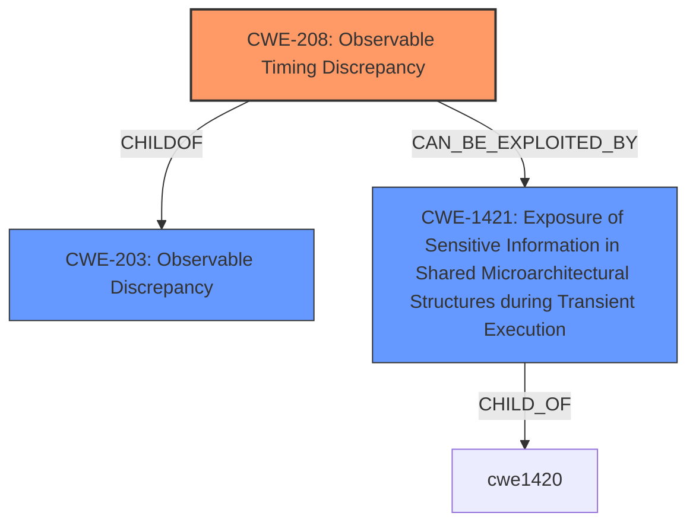

# Enhanced Analysis for CVE-2020-24512

# Summary
| CWE ID | CWE Name | Confidence | CWE Abstraction Level | CWE Vulnerability Mapping Label | CWE-Vulnerability Mapping Notes |
|---|---|---|---|---|---|
| CWE-208 | Observable Timing Discrepancy | 1.0 | Base | Allowed | Primary CWE |
| CWE-203 | Observable Discrepancy | 0.7 | Base | Allowed | Secondary Candidate |
| CWE-1421 | Exposure of Sensitive Information in Shared Microarchitectural Structures during Transient Execution | 0.6 | Base | Allowed | Secondary Candidate |

## Evidence and Confidence

*   **Confidence Score:** 0.9
*   **Evidence Strength:** HIGH

## Relationship Analysis
The primary CWE, CWE-208, is a child of CWE-203, indicating a hierarchical relationship where timing discrepancies are a specific type of observable discrepancy. CWE-1421, related to transient execution and exposure of sensitive information, is related to timing attacks since transient execution vulnerabilities often manifest as timing side channels. The relationships influenced the selection by ensuring the most specific CWE was chosen while acknowledging related weaknesses.



## Vulnerability Chain
The vulnerability chain starts with an **observable timing discrepancy** (CWE-208) in Intel processors, which allows an attacker with local access to potentially disclose sensitive information. The chain progresses from the timing discrepancy to information disclosure.

## Summary of Analysis
The initial analysis identified CWE-208 as the primary candidate due to the **rootcause** being an **"observable timing discrepancy."** The description explicitly mentions that this discrepancy can lead to information disclosure. This aligns well with CWE-208, which describes vulnerabilities where timing differences in operations reveal security-relevant information.

The "CVE Reference Links Content Summary" confirms the presence of a timing discrepancy: "The core issue is that the timing of certain operations within the processor can be observed, creating a side-channel that can be exploited." This strengthens the case for CWE-208.

CWE-203 (Observable Discrepancy) was considered, but CWE-208 is more specific and therefore a better fit. The retriever results also support this, with CWE-208 having the highest score.

CWE-1421 (Exposure of Sensitive Information in Shared Microarchitectural Structures during Transient Execution) was also considered because transient execution vulnerabilities are often related to timing side channels. While the description doesn't explicitly mention transient execution, it's a plausible mechanism for the timing discrepancy.

The selected CWEs are at the optimal level of specificity, with CWE-208 being a base-level CWE that directly addresses the **rootcause** of the vulnerability. The decision is based on the provided evidence and supported by the relationships between CWEs.

Relevant CWE Information:

# Enhanced Context (25 CWEs)
The following CWEs were identified as potentially relevant to this vulnerability:

## CWE-653: Improper Isolation or Compartmentalization
**Abstraction Level**: Class
**Similarity Score**: 0.77
**Source**: dense

**Description**:
The product does not properly compartmentalize or isolate functionality, processes, or resources that require different privilege levels, rights, or permissions.

**Mapping Guidance**:
- Usage: Allowed
- Rationale: This CWE entry is at the Base level of abstraction, which is a preferred level of abstraction for mapping to the root causes of vulnerabilities.

## CWE-691: Insufficient Control Flow Management
**Abstraction Level**: Pillar
**Similarity Score**: 0.77
**Source**: dense

**Description**:
The code does not sufficiently manage its control flow during execution, creating conditions in which the control flow can be modified in unexpected ways.

**Mapping Guidance**:
- Usage: Discouraged
- Rationale: This CWE entry is extremely high-level, a Pillar. However, classification research is limited for weaknesses of this type, so there can be gaps or organizational difficulties within CWE that force use of this weakness, even at such a high level of abstraction.

## CWE-668: Exposure of Resource to Wrong Sphere
**Abstraction Level**: Class
**Similarity Score**: 0.77
**Source**: dense

**Description**:
The product exposes a resource to the wrong control sphere, providing unintended actors with inappropriate access to the resource.

**Mapping Guidance**:
- Usage: Discouraged
- Rationale: CWE-668 is high-level and is often misused as a catch-all when lower-level CWE IDs might be applicable. It is sometimes used for low-information vulnerability reports [REF-1287]. It is a level-1 Class (i.e., a child of a Pillar). It is not useful for trend analysis.

## CWE-703: Improper Check or Handling of Exceptional Conditions
**Abstraction Level**: Pillar
**Similarity Score**: 0.76
**Source**: dense

**Description**:
The product does not properly anticipate or handle exceptional conditions that rarely occur during normal operation of the product.

**Mapping Guidance**:
- Usage: Discouraged
- Rationale: This CWE entry is extremely high-level, a Pillar.

## CWE-667: Improper Locking
**Abstraction Level**: Class
**Similarity Score**: 0.76
**Source**: dense

**Description**:
The product does not properly acquire or release a lock on a resource, leading to unexpected resource state changes and behaviors.

**Mapping Guidance**:
- Usage: Allowed-with-Review
- Rationale: This CWE entry is a Class and might have Base-level children that would be more appropriate

## CWE-404: Improper Resource Shutdown or Release
**Abstraction Level**: Class
**Similarity Score**: 0.75
**Source**: dense

**Description**:
The product does not release or incorrectly releases a resource before it is made available for re-use.

**Mapping Guidance**:
- Usage: Allowed-with-Review
- Rationale: This CWE entry is a Class and might have Base-level children that would be more appropriate

## CWE-664: Improper Control of a Resource Through its Lifetime
**Abstraction Level**: Pillar
**Similarity Score**: 0.75
**Source**: dense

**Description**:
The product does not maintain or incorrectly maintains control over a resource throughout its lifetime of creation, use, and release.

**Mapping Guidance**:
- Usage: Discouraged
- Rationale: This CWE entry is high-level when lower-level children are available.

## CWE-226: Sensitive Information in Resource Not Removed Before Reuse
**Abstraction Level**: Base
**Similarity Score**: 0.75
**Source**: dense

**Description**:
The product releases a resource such as memory or a file so that it can be made available for reuse, but it does not clear or "zeroize" the information contained in the resource before the product performs a critical state transition or makes the resource available for reuse by other entities.

**Mapping Guidance**:
- Usage: Allowed
- Rationale: This CWE entry is at the Base level of abstraction, which is a preferred level of abstraction for mapping to the root causes of vulnerabilities.

## CWE-41: Improper Resolution of Path Equivalence
**Abstraction Level**: Base
**Similarity Score**: 0.75
**Source**: dense

**Description**:
The product is vulnerable to file system contents disclosure through path equivalence. Path equivalence involves the use of special characters in file and directory names. The associated manipulations are intended to generate multiple names for the same object.

**Mapping Guidance**:
- Usage: Allowed
- Rationale: This CWE entry is at the Base level of abstraction, which is a preferred level of abstraction for mapping to the root causes of vulnerabilities.

## CWE-1299: Missing Protection Mechanism for Alternate Hardware Interface
**Abstraction Level**: Base
**Similarity Score**: 0.75
**Source**: dense

**Description**:
The lack of protections on alternate paths to access
                control-protected assets (such as unprotected shadow registers
                and other external facing unguarded interfaces) allows an
                attacker to bypass existing protections to the asset that are
		only performed against the primary path.

**Mapping Guidance**:
- Usage: Allowed
- Rationale: This CWE entry is at the Base level of abstraction, which is a preferred level of abstraction for mapping to the root causes of vulnerabilities.

## CWE-1420: Exposure of Sensitive Information during Transient Execution
**Abstraction Level**: Base
**Similarity Score**: 6312.89
**Source


## CWE Relationship Analysis

Current CWEs represent these abstraction levels: .


### Vulnerability Chain Analysis

**Chain starting from CWE-691:**
- 691 (Insufficient Control Flow Management) - ROOT


**Chain starting from CWE-1421:**
- 1421 (Exposure of Sensitive Information in Shared Microarchitectural Structures during Transient Execution) - ROOT


### CWE Relationship Diagram

```mermaid
graph TD
    classDef primary fill:#f96,stroke:#333,stroke-width:2px
    classDef secondary fill:#69f,stroke:#333
    classDef tertiary fill:#9e9,stroke:#333
```