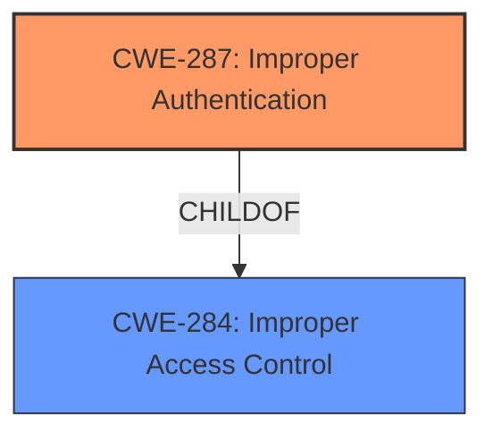

# Analysis Report for CVE-2020-24514

# Vulnerability Analysis Report: CVE-2020-24514

## Description


## Analysis (with Relationship Data)

# Summary
| CWE ID | CWE Name | Confidence | CWE Abstraction Level | CWE Vulnerability Mapping Label | CWE-Vulnerability Mapping Notes |
|---|---|---|---|---|---|
| CWE-287 | Improper Authentication | 1.0 | Class | Primary | Allowed-with-Review |
| CWE-284 | Improper Access Control | 0.5 | Pillar | Secondary | Discouraged |

## Evidence and Confidence

*   **Confidence Score:** 1.0
*   **Evidence Strength:** HIGH

## Relationship Analysis
The primary CWE is CWE-287, Improper Authentication, which is a child of the higher-level CWE-284, Improper Access Control. Given the specific root cause of "**improper authentication**," CWE-287 is a more precise match than its parent. The relationship informed the decision to choose the more specific child class.



## Vulnerability Chain
The vulnerability chain starts with **improper authentication**, leading to a potential escalation of privilege.

## Summary of Analysis
The initial analysis, based on the provided evidence, strongly points to **improper authentication** as the root cause, as stated in the vulnerability description key phrases and CVE Reference Links Content Summary.
The evidence: "Improper authentication in some Intel(R) RealSense(TM) IDs may allow an unauthenticated user to potentially enable escalation of privilege via physical access."
The graph relationships confirm that CWE-287 (Improper Authentication) is a child of CWE-284 (Improper Access Control), further solidifying its relevance.
The selection of CWE-287 is based on its precise match with the **root cause** and its position in the CWE hierarchy. The CWE is at the optimal level of specificity, being a Class, as the specific type of authentication failure is not specified.

Relevant CWE Information:

# Enhanced Context (25 CWEs)

## CWE-287: Improper Authentication
**Technical Explanation:** The vulnerability description explicitly mentions "**improper authentication**". CWE-287 directly addresses this weakness, where the product fails to sufficiently prove a user's claimed identity.

**Security Implications and Potential Impact:** This weakness can lead to unauthorized access and privilege escalation, as an unauthenticated user could gain elevated privileges.

**Parent-Child Relationships and Chain Patterns:** CWE-287 is a child of CWE-284 (Improper Access Control), indicating a hierarchical relationship.

**Whether Weakness is Primary or Secondary:** Primary.

**Official MITRE Mapping Guidance Influence:** The MITRE mapping guidance for CWE-287 suggests considering more specific children, such as CWE-1390 (Weak Authentication) or CWE-306 (Missing Authentication for Critical Function). However, the provided description does not offer sufficient detail to specify the authentication failure further, so CWE-287 is the most appropriate choice. The usage is "Discouraged," suggesting lower-level CWEs should be used if possible, but in this case, the information is not specific enough. Given this, I am overriding the mapping guidance and choosing CWE-287 as allowed with review.

## CWE-284: Improper Access Control
**Technical Explanation:** CWE-284 is a higher-level category that encompasses various access control failures, including **improper authentication**. Since the vulnerability description specifically mentions "**improper authentication**", CWE-287 is a more precise match, so it is the primary.

**Security Implications and Potential Impact:** Improper access control can lead to various security breaches, including unauthorized access, privilege escalation, and data breaches.

**Parent-Child Relationships and Chain Patterns:** CWE-284 is the parent of CWE-287, indicating a hierarchical relationship.

**Whether Weakness is Primary or Secondary:** Secondary.

**Official MITRE Mapping Guidance Influence:** The MITRE mapping guidance for CWE-284 discourages its use, recommending more specific descendants instead.

**Summary of Analysis:**

The analysis identified **improper authentication** as the **root cause** of the vulnerability.
CWE-287 (Improper Authentication) was selected as the primary CWE due to its direct relevance to the vulnerability description. While CWE-284 (Improper Access Control) is a parent CWE, it is too broad to accurately represent the specific weakness. The MITRE mapping guidance was considered, but the specificity of the vulnerability description led to the selection of CWE-287, despite the discouraged usage in the general mapping guidance.
Other CWEs Considered but Not Used:

*   CWE-693, CWE-691, CWE-284 were considered but deemed too high-level.
*   CWE-453, CWE-1288, CWE-1256, CWE-613, CWE-1173, CWE-1258 did not align with the **root cause** of **improper authentication**.


## CWE Relationship Analysis

Current CWEs represent these abstraction levels: .


### Vulnerability Chain Analysis

**Chain starting from CWE-691:**
- 691 (Insufficient Control Flow Management) - ROOT


**Chain starting from CWE-306:**
- 306 (Missing Authentication for Critical Function) - ROOT


### CWE Relationship Diagram

```mermaid
graph TD
    classDef primary fill:#f96,stroke:#333,stroke-width:2px
    classDef secondary fill:#69f,stroke:#333
    classDef tertiary fill:#9e9,stroke:#333
```


*Report generated on 2025-04-02 12:30:41*
