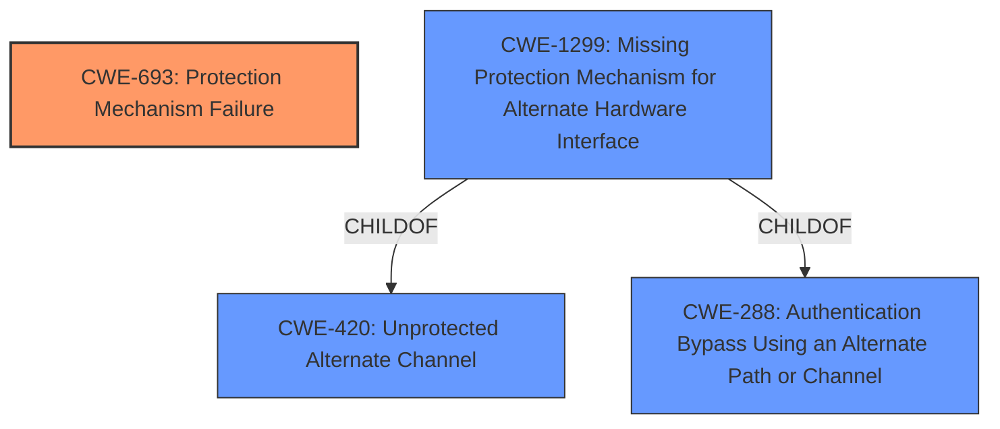

# Raw Analyzer Response for CVE-2020-24515

# Summary
| CWE ID | CWE Name | Confidence | CWE Abstraction Level | CWE Vulnerability Mapping Label | CWE-Vulnerability Mapping Notes |
|---|---|---|---|---|---|
| CWE-693 | Protection Mechanism Failure | 0.9 | Pillar | Allowed-with-Review | Primary CWE |
| CWE-1299 | Missing Protection Mechanism for Alternate Hardware Interface | 0.6 | Base | Allowed | Secondary Candidate |
| CWE-288 | Authentication Bypass Using an Alternate Path or Channel | 0.5 | Base | Allowed | Secondary Candidate |

## Evidence and Confidence

*   **Confidence Score:** 0.7
*   **Evidence Strength:** MEDIUM

## Relationship Analysis
The primary CWE, CWE-693, is a Pillar, which is a high-level abstraction. The retriever results suggest considering more specific CWEs. CWE-1299 is a child of CWE-420 (Unprotected Alternate Channel) and CWE-288 (Authentication Bypass Using an Alternate Path or Channel) indicating a more granular focus on hardware interfaces. The relationships influenced the consideration of these base-level CWEs, although the evidence doesn't strongly support either over CWE-693.

## Vulnerability Chain
The vulnerability chain starts with a **protection mechanism failure** (CWE-693), potentially related to a **missing protection mechanism for alternate hardware interface** (CWE-1299) or an **authentication bypass using an alternate path or channel** (CWE-288). This leads to an **escalation of privilege**.

## Summary of Analysis
The initial analysis pointed towards CWE-693 (Protection Mechanism Failure) due to the vulnerability description explicitly mentioning "**Protection mechanism failure**". However, CWE-693 is a high-level Pillar, and the guidance suggests considering more specific CWEs. The physical access attack vector hints at a potential hardware-related weakness, leading to the consideration of CWE-1299 (Missing Protection Mechanism for Alternate Hardware Interface) and CWE-288 (Authentication Bypass Using an Alternate Path or Channel).

The final decision leans towards CWE-693 as the primary CWE because the evidence directly mentions the failure of a protection mechanism. However, CWE-1299 and CWE-288 are considered as secondary candidates, reflecting the possibility of a hardware-specific vulnerability. The selection is based on the provided evidence, with consideration given to the CWE relationships.

The selected CWEs are at an appropriate level of specificity, given the available evidence. While more granular CWEs might exist, the current information does not provide sufficient details to justify their selection.

Relevant CWE Information:

# Enhanced Context (25 CWEs)
The following CWEs were identified as potentially relevant to this vulnerability:

## CWE-653: Improper Isolation or Compartmentalization
**Abstraction Level**: Class
**Similarity Score**: 0.76
**Source**: dense

**Description**:
The product does not properly compartmentalize or isolate functionality, processes, or resources that require different privilege levels, rights, or permissions.

**Mapping Guidance**:
- Usage: Allowed
- Rationale: This CWE entry is at the Base level of abstraction, which is a preferred level of abstraction for mapping to the root causes of vulnerabilities.

## CWE-691: Insufficient Control Flow Management
**Abstraction Level**: Pillar
**Similarity Score**: 0.76
**Source**: dense

**Description**:
The code does not sufficiently manage its control flow during execution, creating conditions in which the control flow can be modified in unexpected ways.

**Mapping Guidance**:
- Usage: Discouraged
- Rationale: This CWE entry is extremely high-level, a Pillar. However, classification research is limited for weaknesses of this type, so there can be gaps or organizational difficulties within CWE that force use of this weakness, even at such a high level of abstraction.

## CWE-131: Incorrect Calculation of Buffer Size
**Abstraction Level**: Base
**Similarity Score**: 0.76
**Source**: dense

**Description**:
The product does not correctly calculate the size to be used when allocating a buffer, which could lead to a buffer overflow.

**Mapping Guidance**:
- Usage: Allowed
- Rationale: This CWE entry is at the Base level of abstraction, which is a preferred level of abstraction for mapping to the root causes of vulnerabilities.

## CWE-805: Buffer Access with Incorrect Length Value
**Abstraction Level**: Base
**Similarity Score**: 0.75
**Source**: dense

**Description**:
The product uses a sequential operation to read or write a buffer, but it uses an incorrect length value that causes it to access memory that is outside of the bounds of the buffer.

**Mapping Guidance**:
- Usage: Allowed
- Rationale: This CWE entry is at the Base level of abstraction, which is a preferred level of abstraction for mapping to the root causes of vulnerabilities.

## CWE-404: Improper Resource Shutdown or Release
**Abstraction Level**: Class
**Similarity Score**: 0.75
**Source**: dense

**Description**:
The product does not release or incorrectly releases a resource before it is made available for re-use.

**Mapping Guidance**:
- Usage: Allowed-with-Review
- Rationale: This CWE entry is a Class and might have Base-level children that would be more appropriate

## CWE-1299: Missing Protection Mechanism for Alternate Hardware Interface
**Abstraction Level**: Base
**Similarity Score**: 0.75
**Source**: dense

**Description**:
The lack of protections on alternate paths to access
                control-protected assets (such as unprotected shadow registers
                and other external facing unguarded interfaces) allows an
                attacker to bypass existing protections to the asset that are
		only performed against the primary path.

**Mapping Guidance**:
- Usage: Allowed
- Rationale: This CWE entry is at the Base level of abstraction, which is a preferred level of abstraction for mapping to the root causes of vulnerabilities.

## CWE-667: Improper Locking
**Abstraction Level**: Class
**Similarity Score**: 0.75
**Source**: dense

**Description**:
The product does not properly acquire or release a lock on a resource, leading to unexpected resource state changes and behaviors.

**Mapping Guidance**:
- Usage: Allowed-with-Review
- Rationale: This CWE entry is a Class and might have Base-level children that would be more appropriate

## CWE-119: Improper Restriction of Operations within the Bounds of a Memory Buffer
**Abstraction Level**: Class
**Similarity Score**: 0.75
**Source**: dense

**Description**:
The product performs operations on a memory buffer, but it reads from or writes to a memory location outside the buffer's intended boundary. This may result in read or write operations on unexpected memory locations that could be linked to other variables, data structures, or internal program data.

**Mapping Guidance**:
- Usage: Discouraged
- Rationale: CWE-119 is commonly misused in low-information vulnerability reports when lower-level CWEs could be used instead, or when more details about the vulnerability are available.

## CWE-226: Sensitive Information in Resource Not Removed Before Reuse
**Abstraction Level**: Base
**Similarity Score**: 0.75
**Source**: dense

**Description**:
The product releases a resource such as memory or a file so that it can be made available for reuse, but it does not clear or "zeroize" the information contained in the resource before the product performs a critical state transition or makes the resource available for reuse by other entities.

**Mapping Guidance**:
- Usage: Allowed
- Rationale: This CWE entry is at the Base level of abstraction, which is a preferred level of abstraction for mapping to the root causes of vulnerabilities.

## CWE-191: Integer Underflow (Wrap or Wraparound)
**Abstraction Level**: Base
**Similarity Score**: 0.75
**Source**: dense

**Description**:
The product subtracts one value from another, such that the result is less than the minimum allowable integer value, which produces a value that is not equal to the correct result.

**Mapping Guidance**:
- Usage: Allowed
- Rationale: This CWE entry is at the Base level of abstraction, which is a preferred level of abstraction for mapping to the root causes of vulnerabilities.

## CWE-1299: Missing Protection Mechanism for Alternate Hardware Interface
**Abstraction Level**: Base
**Similarity Score**: 5163.43
**Source**: sparse

**Description**:
The lack of protections on alternate paths