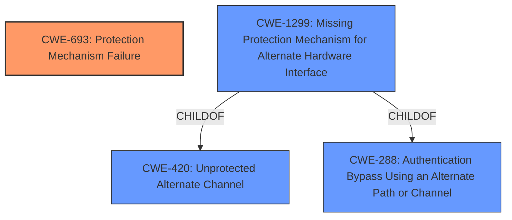

# Analysis for CVE-2020-24515

# Summary
| CWE ID | CWE Name | Confidence | CWE Abstraction Level | CWE Vulnerability Mapping Label | CWE-Vulnerability Mapping Notes |
|---|---|---|---|---|---|
| CWE-693 | Protection Mechanism Failure | 0.9 | Pillar | Allowed-with-Review | Primary CWE |
| CWE-1299 | Missing Protection Mechanism for Alternate Hardware Interface | 0.6 | Base | Allowed | Secondary Candidate |
| CWE-288 | Authentication Bypass Using an Alternate Path or Channel | 0.5 | Base | Allowed | Secondary Candidate |

## Evidence and Confidence

*   **Confidence Score:** 0.7
*   **Evidence Strength:** MEDIUM

## Relationship Analysis
The primary CWE, CWE-693, is a Pillar, which is a high-level abstraction. The retriever results suggest considering more specific CWEs. CWE-1299 is a child of CWE-420 (Unprotected Alternate Channel) and CWE-288 (Authentication Bypass Using an Alternate Path or Channel) indicating a more granular focus on hardware interfaces. The relationships influenced the consideration of these base-level CWEs, although the evidence doesn't strongly support either over CWE-693.

## Vulnerability Chain
The vulnerability chain starts with a **protection mechanism failure** (CWE-693), potentially related to a **missing protection mechanism for alternate hardware interface** (CWE-1299) or an **authentication bypass using an alternate path or channel** (CWE-288). This leads to an **escalation of privilege**.

## Summary of Analysis
The initial analysis pointed towards CWE-693 (Protection Mechanism Failure) due to the vulnerability description explicitly mentioning "**Protection mechanism failure**". However, CWE-693 is a high-level Pillar, and the guidance suggests considering more specific CWEs. The physical access attack vector hints at a potential hardware-related weakness, leading to the consideration of CWE-1299 (Missing Protection Mechanism for Alternate Hardware Interface) and CWE-288 (Authentication Bypass Using an Alternate Path or Channel).

The final decision leans towards CWE-693 as the primary CWE because the evidence directly mentions the failure of a protection mechanism. However, CWE-1299 and CWE-288 are considered as secondary candidates, reflecting the possibility of a hardware-specific vulnerability. The selection is based on the provided evidence, with consideration given to the CWE relationships.

The selected CWEs are at an appropriate level of specificity, given the available evidence. While more granular CWEs might exist, the current information does not provide sufficient details to justify their selection.

Relevant CWE Information:

# Enhanced Context (25 CWEs)
The following CWEs were identified as potentially relevant to this vulnerability:

## CWE-653: Improper Isolation or Compartmentalization
**Abstraction Level**: Class
**Similarity Score**: 0.76
**Source**: dense

**Description**:
The product does not properly compartmentalize or isolate functionality, processes, or resources that require different privilege levels, rights, or permissions.

**Mapping Guidance**:
- Usage: Allowed
- Rationale: This CWE entry is at the Base level of abstraction, which is a preferred level of abstraction for mapping to the root causes of vulnerabilities.

## CWE-691: Insufficient Control Flow Management
**Abstraction Level**: Pillar
**Similarity Score**: 0.76
**Source**: dense

**Description**:
The code does not sufficiently manage its control flow during execution, creating conditions in which the control flow can be modified in unexpected ways.

**Mapping Guidance**:
- Usage: Discouraged
- Rationale: This CWE entry is extremely high-level, a Pillar. However, classification research is limited for weaknesses of this type, so there can be gaps or organizational difficulties within CWE that force use of this weakness, even at such a high level of abstraction.

## CWE-131: Incorrect Calculation of Buffer Size
**Abstraction Level**: Base
**Similarity Score**: 0.76
**Source**: dense

**Description**:
The product does not correctly calculate the size to be used when allocating a buffer, which could lead to a buffer overflow.

**Mapping Guidance**:
- Usage: Allowed
- Rationale: This CWE entry is at the Base level of abstraction, which is a preferred level of abstraction for mapping to the root causes of vulnerabilities.

## CWE-805: Buffer Access with Incorrect Length Value
**Abstraction Level**: Base
**Similarity Score**: 0.75
**Source**: dense

**Description**:
The product uses a sequential operation to read or write a buffer, but it uses an incorrect length value that causes it to access memory that is outside of the bounds of the buffer.

**Mapping Guidance**:
- Usage: Allowed
- Rationale: This CWE entry is at the Base level of abstraction, which is a preferred level of abstraction for mapping to the root causes of vulnerabilities.

## CWE-404: Improper Resource Shutdown or Release
**Abstraction Level**: Class
**Similarity Score**: 0.75
**Source**: dense

**Description**:
The product does not release or incorrectly releases a resource before it is made available for re-use.

**Mapping Guidance**:
- Usage: Allowed-with-Review
- Rationale: This CWE entry is a Class and might have Base-level children that would be more appropriate

## CWE-1299: Missing Protection Mechanism for Alternate Hardware Interface
**Abstraction Level**: Base
**Similarity Score**: 0.75
**Source**: dense

**Description**:
The lack of protections on alternate paths to access
                control-protected assets (such as unprotected shadow registers
                and other external facing unguarded interfaces) allows an
                attacker to bypass existing protections to the asset that are
		only performed against the primary path.

**Mapping Guidance**:
- Usage: Allowed
- Rationale: This CWE entry is at the Base level of abstraction, which is a preferred level of abstraction for mapping to the root causes of vulnerabilities.

## CWE-667: Improper Locking
**Abstraction Level**: Class
**Similarity Score**: 0.75
**Source**: dense

**Description**:
The product does not properly acquire or release a lock on a resource, leading to unexpected resource state changes and behaviors.

**Mapping Guidance**:
- Usage: Allowed-with-Review
- Rationale: This CWE entry is a Class and might have Base-level children that would be more appropriate

## CWE-119: Improper Restriction of Operations within the Bounds of a Memory Buffer
**Abstraction Level**: Class
**Similarity Score**: 0.75
**Source**: dense

**Description**:
The product performs operations on a memory buffer, but it reads from or writes to a memory location outside the buffer's intended boundary. This may result in read or write operations on unexpected memory locations that could be linked to other variables, data structures, or internal program data.

**Mapping Guidance**:
- Usage: Discouraged
- Rationale: CWE-119 is commonly misused in low-information vulnerability reports when lower-level CWEs could be used instead, or when more details about the vulnerability are available.

## CWE-226: Sensitive Information in Resource Not Removed Before Reuse
**Abstraction Level**: Base
**Similarity Score**: 0.75
**Source**: dense

**Description**:
The product releases a resource such as memory or a file so that it can be made available for reuse, but it does not clear or "zeroize" the information contained in the resource before the product performs a critical state transition or makes the resource available for reuse by other entities.

**Mapping Guidance**:
- Usage: Allowed
- Rationale: This CWE entry is at the Base level of abstraction, which is a preferred level of abstraction for mapping to the root causes of vulnerabilities.

## CWE-191: Integer Underflow (Wrap or Wraparound)
**Abstraction Level**: Base
**Similarity Score**: 0.75
**Source**: dense

**Description**:
The product subtracts one value from another, such that the result is less than the minimum allowable integer value, which produces a value that is not equal to the correct result.

**Mapping Guidance**:
- Usage: Allowed
- Rationale: This CWE entry is at the Base level of abstraction, which is a preferred level of abstraction for mapping to the root causes of vulnerabilities.

## CWE-1299: Missing Protection Mechanism for Alternate Hardware Interface
**Abstraction Level**: Base
**Similarity Score**: 5163.43
**Source**: sparse

**Description**:
The lack of protections on alternate paths

# Enhanced Query for CVE-2020-24515

## Vulnerability Description
**Protection mechanism failure** in some Intel(R) RealSense(TM) IDs may allow an unauthenticated user to potentially enable escalation of privilege via physical access.

### Vulnerability Description Key Phrases
- **rootcause:** **Protection mechanism failure**
- **impact:** escalation of privilege
- **vector:** physical access
- **attacker:** unauthenticated user
- **product:** Intel(R) RealSense(TM) IDs

## CVE Reference Links Content Summary
Based on the provided document, here's the information regarding CVE-2020-24515:

**Root Cause of Vulnerability:**
- The vulnerability is due to a "protection mechanism failure" in some Intel RealSense IDs.

**Weaknesses/Vulnerabilities Present:**
- The primary weakness is the failure of a protection mechanism.

**Impact of Exploitation:**
- Successful exploitation allows for "escalation of privilege".

**Attack Vectors:**
- The attack vector is via "physical access."

**Required Attacker Capabilities/Position:**
- The attacker requires physical access to the vulnerable device.
- The attacker does not need to be authenticated (unauthenticated user).
- The attack has a high attack complexity.

**Additional Information:**
- The affected products are Intel® RealSense™ ID F450 and F455.
- Intel recommends updating the firmware to the latest version provided by the system manufacturer.
- The CVSS vector is CVSS:3.1/AV:P/AC:H/PR:N/UI:N/S:C/C:H/I:H/A:H, with a base score of 7.1 (High)

## Retriever Results

### Top Combined Results

| Rank | CWE ID | Name | Abstraction | Usage  | Retrievers | Individual Scores |
|------|--------|------|-------------|-------|------------|-------------------|
| 1 | 693 | Protection Mechanism Failure | Pillar | Discouraged | sparse | 0.275 |
| 2 | 453 | Insecure Default Variable Initialization | Variant | Allowed | sparse | 0.193 |
| 3 | 691 | Insufficient Control Flow Management | Pillar | Discouraged | sparse | 0.178 |
| 4 | 1288 | Improper Validation of Consistency within Input | Base | Allowed | sparse | 0.161 |
| 5 | 1258 | Exposure of Sensitive System Information Due to Uncleared Debug Information | Base | Allowed | sparse | 0.158 |
| 6 | 1314 | Missing Write Protection for Parametric Data Values | Base | Allowed | dense | 0.576 |
| 7 | 1299 | Missing Protection Mechanism for Alternate Hardware Interface | Base | Allowed | graph | 0.002 |
| 8 | 284 | Improper Access Control | Pillar | Discouraged | sparse | 0.158 |
| 9 | 287 | Improper Authentication | Class | Discouraged | sparse | 0.154 |
| 10 | 119 | Improper Restriction of Operations within the Bounds of a Memory Buffer | Class | Discouraged | sparse | 0.152 |

# Complete CWE Specifications

## CWE-693: Protection Mechanism Failure
**Abstraction:** Pillar
**Status:** Draft

### Description
The product does not use or incorrectly uses a protection mechanism that provides sufficient defense against directed attacks against the product.

### Extended Description
This weakness covers three distinct situations. A "missing" protection mechanism occurs when the application does not define any mechanism against a certain class of attack. An "insufficient" protection mechanism might provide some defenses - for example, against the most common attacks - but it does not protect against everything that is intended. Finally, an "ignored" mechanism occurs when a mechanism is available and in active use within the product, but the developer has not applied it in some code path.

### Alternative Terms
None

### Relationships
None

### Mapping Guidance
**Usage:** Discouraged
**Rationale:** This CWE entry is extremely high-level, a Pillar.
**Comments:** Consider children or descendants of this entry instead.
**Reasons:**
- Abstraction

### Additional Notes
**[Research Gap]** The concept of protection mechanisms is well established, but protection mechanism failures have not been studied comprehensively. It is suspected that protection mechanisms can have significantly different types of weaknesses than the weaknesses that they are intended to prevent.

## CWE-453: Insecure Default Variable Initialization
**Abstraction:** Variant
**Status:** Draft

### Description
The product, by default, initializes an internal variable with an insecure or less secure value than is possible.

### Extended Description
Not provided

### Alternative Terms
None

### Relationships
ChildOf -> CWE-1188

### Mapping Guidance
**Usage:** Allowed
**Rationale:** This CWE entry is at the Variant level of abstraction, which is a preferred level of abstraction for mapping to the root causes of vulnerabilities.
**Comments:** Carefully read both the name and description to ensure that this mapping is an appropriate fit. Do not try to 'force' a mapping to a lower-level Base/Variant simply to comply with this preferred level of abstraction.
**Reasons:**
- Acceptable-Use

### Additional Notes
**[Maintenance]** This overlaps other categories, probably should be split into separate items.

### Observed Examples
- **CVE-2022-36349:** insecure default variable initialization in BIOS firmware for a hardware board allows DoS

## CWE-691: Insufficient Control Flow Management
**Abstraction:** Pillar
**Status:** Draft

### Description
The code does not sufficiently manage its control flow during execution, creating conditions in which the control flow can be modified in unexpected ways.

### Extended Description
Not provided

### Alternative Terms
None

### Relationships
None

### Mapping Guidance
**Usage:** Discouraged
**Rationale:** This CWE entry is extremely high-level, a Pillar. However, classification research is limited for weaknesses of this type, so there can be gaps or organizational difficulties within CWE that force use of this weakness, even at such a high level of abstraction.
**Comments:** Where feasible, consider children or descendants of this entry instead.
**Reasons:**
- Abstraction

### Observed Examples
- **CVE-2019-9805:** Chain: Creation of the packet client occurs before initialization is complete (CWE-696) resulting in a read from uninitialized memory (CWE-908), causing memory corruption.
- **CVE-2014-1266:** chain: incorrect "goto" in Apple SSL product bypasses certificate validation, allowing Adversary-in-the-Middle (AITM) attack (Apple "goto fail" bug). CWE-705 (Incorrect Control Flow Scoping) -> CWE-561 (Dead Code) -> CWE-295 (Improper Certificate Validation) -> CWE-393 (Return of Wrong Status Code) -> CWE-300 (Channel Accessible by Non-Endpoint).
- **CVE-2011-1027:** Chain: off-by-one error (CWE-193) leads to infinite loop (CWE-835) using invalid hex-encoded characters.

## CWE-1288: Improper Validation of Consistency within Input
**Abstraction:** Base
**Status:** Incomplete

### Description
The product receives a complex input with multiple elements or fields that must be consistent with each other, but it does not validate or incorrectly validates that the input is actually consistent.

### Extended Description

Some input data can be structured with multiple elements or fields that must be consistent with each other, e.g. a number-of-items field that is followed by the expected number of elements. When such complex inputs are inconsistent, attackers could trigger unexpected errors, cause incorrect actions to take place, or exploit latent vulnerabilities.

### Alternative Terms
None

### Relationships
ChildOf -> CWE-20

### Mapping Guidance
**Usage:** Allowed
**Rationale:** This CWE entry is at the Base level of abstraction, which is a preferred level of abstraction for mapping to the root causes of vulnerabilities.
**Comments:** Carefully read both the name and description to ensure that this mapping is an appropriate fit. Do not try to 'force' a mapping to a lower-level Base/Variant simply to comply with this preferred level of abstraction.
**Reasons:**
- Acceptable-Use

### Additional Notes
**[Maintenance]** This entry is still under development and will continue to see updates and content improvements.

### Observed Examples
- **CVE-2018-16733:** product does not validate that the start block appears before the end block
- **CVE-2006-3790:** size field that is inconsistent with packet size leads to buffer over-read
- **CVE-2008-4114:** system crash with offset value that is inconsistent with packet size

## CWE-1258: Exposure of Sensitive System Information Due to Uncleared Debug Information
**Abstraction:** Base
**Status:** Draft

### Description
The hardware does not fully clear security-sensitive values, such as keys and intermediate values in cryptographic operations, when debug mode is entered.

### Extended Description

Security sensitive values, keys, intermediate steps of cryptographic operations, etc. are stored in temporary registers in the hardware. If these values are not cleared when debug mode is entered they may be accessed by a debugger allowing sensitive information to be accessible by untrusted parties.

### Alternative Terms
None

### Relationships
ChildOf -> CWE-212
ChildOf -> CWE-200

### Mapping Guidance
**Usage:** Allowed
**Rationale:** This CWE entry is at the Base level of abstraction, which is a preferred level of abstraction for mapping to the root causes of vulnerabilities.
**Comments:** Carefully read both the name and description to ensure that this mapping is an appropriate fit. Do not try to 'force' a mapping to a lower-level Base/Variant simply to comply with this preferred level of abstraction.
**Reasons:**
- Acceptable-Use

### Observed Examples
- **CVE-2021-33080:** Uncleared debug information in memory accelerator for SSD product exposes sensitive system information
- **CVE-2022-31162:** Rust library leaks Oauth client details in application debug logs

## CWE-1314: Missing Write Protection for Parametric Data Values
**Abstraction:** Base
**Status:** Draft

### Description
The device does not write-protect the parametric data values for sensors that scale the sensor value, allowing untrusted software to manipulate the apparent result and potentially damage hardware or cause operational failure.

### Extended Description

Various sensors are used by hardware to detect any devices operating outside of the design limits. The threshold limit values are set by hardware fuses or trusted software such as the BIOS. These limits may be related to thermal, power, voltage, current, and frequency. Hardware mechanisms may be used to protect against alteration of the threshold limit values by untrusted software.

The limit values are generally programmed in standard units for the type of value being read. However, the hardware-sensor blocks may report the settings in different units depending upon sensor design and operation. The raw sensor output value is converted to the desired units using a scale conversion based on the parametric data programmed into the sensor. The final converted value is then compared with the previously programmed limits.

While the limit values are usually protected, the sensor parametric data values may not be. By changing the parametric data, safe operational limits may be bypassed.

### Alternative Terms
None

### Relationships
ChildOf -> CWE-862
PeerOf -> CWE-1299

### Mapping Guidance
**Usage:** Allowed
**Rationale:** This CWE entry is at the Base level of abstraction, which is a preferred level of abstraction for mapping to the root causes of vulnerabilities.
**Comments:** Carefully read both the name and description to ensure that this mapping is an appropriate fit. Do not try to 'force' a mapping to a lower-level Base/Variant simply to comply with this preferred level of abstraction.
**Reasons:**
- Acceptable-Use

### Observed Examples
- **CVE-2017-8252:** Kernel can inject faults in computations during the execution of TrustZone leading to information disclosure in Snapdragon Auto, Snapdragon Compute, Snapdragon Connectivity, Snapdragon Consumer Electronics Connectivity, Snapdragon Consumer IOT, Snapdragon Industrial IOT, Snapdragon IoT, Snapdragon Mobile, Snapdragon Voice and Music, Snapdragon Wearables, Snapdragon Wired Infrastructure and Networking.

## CWE-1299: Missing Protection Mechanism for Alternate Hardware Interface
**Abstraction:** Base
**Status:** Draft

### Description
The lack of protections on alternate paths to access
                control-protected assets (such as unprotected shadow registers
                and other external facing unguarded interfaces) allows an
                attacker to bypass existing protections to the asset that are
		only performed against the primary path.

### Extended Description

An asset inside a chip might have access-control protections through one interface. However, if all paths to the asset are not protected, an attacker might compromise the asset through alternate paths. These alternate paths could be through shadow or mirror registers inside the IP core, or could be paths from other external-facing interfaces to the IP core or SoC.

Consider an SoC with various interfaces such as UART, SMBUS, PCIe, USB, etc. If access control is implemented for SoC internal registers only over the PCIe interface, then an attacker could still modify the SoC internal registers through alternate paths by coming through interfaces such as UART, SMBUS, USB, etc. 

Alternatively, attackers might be able to bypass existing protections by exploiting unprotected, shadow registers. Shadow registers and mirror registers typically refer to registers that can be accessed from multiple addresses. Writing to or reading from the aliased/mirrored address has the same effect as writing to the address of the main register. They are typically implemented within an IP core or SoC to temporarily hold certain data. These data will later be updated to the main register, and both registers will be in synch. If the shadow registers are not access-protected, attackers could simply initiate transactions to the shadow registers and compromise system security. 

### Alternative Terms
None

### Relationships
PeerOf -> CWE-1191
ChildOf -> CWE-420
ChildOf -> CWE-288

### Mapping Guidance
**Usage:** Allowed
**Rationale:** This CWE entry is at the Base level of abstraction, which is a preferred level of abstraction for mapping to the root causes of vulnerabilities.
**Comments:** Carefully read both the name and description to ensure that this mapping is an appropriate fit. Do not try to 'force' a mapping to a lower-level Base/Variant simply to comply with this preferred level of abstraction.
**Reasons:**
- Acceptable-Use

### Observed Examples
- **CVE-2022-38399:** Missing protection mechanism on serial connection allows for arbitrary OS command execution.
- **CVE-2020-9285:** Mini-PCI Express slot does not restrict direct memory access.
- **CVE-2020-8004:** When the internal flash is protected by blocking access on the Data Bus (DBUS), it can still be indirectly accessed through the Instruction Bus (IBUS).

## CWE-284: Improper Access Control
**Abstraction:** Pillar
**Status:** Incomplete

### Description
The product does not restrict or incorrectly restricts access to a resource from an unauthorized actor.

### Extended Description

Access control involves the use of several protection mechanisms such as:

  - Authentication (proving the identity of an actor)

  - Authorization (ensuring that a given actor can access a resource), and

  - Accountability (tracking of activities that were performed)

When any mechanism is not applied or otherwise fails, attackers can compromise the security of the product by gaining privileges, reading sensitive information, executing commands, evading detection, etc.

There are two distinct behaviors that can introduce access control weaknesses:

  - Specification: incorrect privileges, permissions, ownership, etc. are explicitly specified for either the user or the resource (for example, setting a password file to be world-writable, or giving administrator capabilities to a guest user). This action could be performed by the program or the administrator.

  - Enforcement: the mechanism contains errors that prevent it from properly enforcing the specified access control requirements (e.g., allowing the user to specify their own privileges, or allowing a syntactically-incorrect ACL to produce insecure settings). This problem occurs within the program itself, in that it does not actually enforce the intended security policy that the administrator specifies.

### Alternative Terms
Authorization: The terms "access control" and "authorization" are often used interchangeably, although many people have distinct definitions. The CWE usage of "access control" is intended as a general term for the various mechanisms that restrict which users can access which resources, and "authorization" is more narrowly defined. It is unlikely that there will be community consensus on the use of these terms.

### Relationships
None

### Mapping Guidance
**Usage:** Discouraged
**Rationale:** CWE-284 is extremely high-level, a Pillar. Its name, "Improper Access Control," is often misused in low-information vulnerability reports [REF-1287] or by active use of the OWASP Top Ten, such as "A01:2021-Broken Access Control". It is not useful for trend analysis.
**Comments:** Consider using descendants of CWE-284 that are more specific to the kind of access control involved, such as those involving authorization (Missing Authorization (CWE-862), Incorrect Authorization (CWE-863), Incorrect Permission Assignment for Critical Resource (CWE-732), etc.); authentication (Missing Authentication (CWE-306) or Weak Authentication (CWE-1390)); Incorrect User Management (CWE-286); Improper Restriction of Communication Channel to Intended Endpoints (CWE-923); etc.
**Reasons:**
- Frequent Misuse
- Abstraction
**Suggested Alternatives:**
- CWE-862: Missing Authorization
- CWE-863: Incorrect Authorization
- CWE-732: Incorrect Permission Assignment for Critical Resource
- CWE-306: Missing Authentication
- CWE-1390: Weak Authentication
- CWE-923: Improper Restriction of Communication Channel to Intended Endpoints

### Additional Notes
**[Maintenance]** 

This entry needs more work. Possible sub-categories include:

  - Trusted group includes undesired entities (partially covered by CWE-286)

  - Group can perform undesired actions

  - ACL parse error does not fail closed

### Observed Examples
- **CVE-2022-24985:** A form hosting website only checks the session authentication status for a single form, making it possible to bypass authentication when there are multiple forms
- **CVE-2022-29238:** Access-control setting in web-based document collaboration tool is not properly implemented by the code, which prevents listing hidden directories but does not prevent direct requests to files in those directories.
- **CVE-2022-23607:** Python-based HTTP library did not scope cookies to a particular domain such that "supercookies" could be sent to any domain on redirect

## CWE-287: Improper Authentication
**Abstraction:** Class
**Status:** Draft

### Description
When an actor claims to have a given identity, the product does not prove or insufficiently proves that the claim is correct.

### Extended Description
Not provided

### Alternative Terms
authentification: An alternate term is "authentification", which appears to be most commonly used by people from non-English-speaking countries.
AuthN: "AuthN" is typically used as an abbreviation of "authentication" within the web application security community. It is also distinct from "AuthZ," which is an abbreviation of "authorization." The use of "Auth" as an abbreviation is discouraged, since it could be used for either authentication or authorization.
AuthC: "AuthC" is used as an abbreviation of "authentication," but it appears to used less frequently than "AuthN."

### Relationships
ChildOf -> CWE-284
ChildOf -> CWE-284

### Mapping Guidance
**Usage:** Discouraged
**Rationale:** This CWE entry might be misused when lower-level CWE entries are likely to be applicable. It is a level-1 Class (i.e., a child of a Pillar).
**Comments:** Consider children or descendants, beginning with CWE-1390: Weak Authentication or CWE-306: Missing Authentication for Critical Function.
**Reasons:**
- Frequent Misuse
**Suggested Alternatives:**
- CWE-1390: Weak Authentication
- CWE-306: Missing Authentication for Critical Function

### Additional Notes
**[Relationship]** This can be resultant from SQL injection vulnerabilities and other issues.

**[Maintenance]** The Taxonomy_Mappings to ISA/IEC 62443 were added in CWE 4.10, but they are still under review and might change in future CWE versions. These draft mappings were performed by members of the "Mapping CWE to 62443" subgroup of the CWE-CAPEC ICS/OT Special Interest Group (SIG), and their work is incomplete as of CWE 4.10. The mappings are included to facilitate discussion and review by the broader ICS/OT community, and they are likely to change in future CWE versions.

### Observed Examples
- **CVE-2022-35248:** Chat application skips validation when Central Authentication Service (CAS) is enabled, effectively removing the second factor from two-factor authentication
- **CVE-2022-36436:** Python-based authentication proxy does not enforce password authentication during the initial handshake, allowing the client to bypass authentication by specifying a 'None' authentication type.
- **CVE-2022-30034:** Chain: Web UI for a Python RPC framework does not use regex anchors to validate user login emails (CWE-777), potentially allowing bypass of OAuth (CWE-1390).

## CWE-119: Improper Restriction of Operations within the Bounds of a Memory Buffer
**Abstraction:** Class
**Status:** Stable

### Description
The product performs operations on a memory buffer, but it reads from or writes to a memory location outside the buffer's intended boundary. This may result in read or write operations on unexpected memory locations that could be linked to other variables, data structures, or internal program data.

### Extended Description
Not provided

### Alternative Terms
Buffer Overflow: This term has many different meanings to different audiences. From a CWE mapping perspective, this term should be avoided where possible. Some researchers, developers, and tools intend for it to mean "write past the end of a buffer," whereas others use the same term to mean "any read or write outside the boundaries of a buffer, whether before the beginning of the buffer or after the end of the buffer." Others could mean "any action after the end of a buffer, whether it is a read or write." Since the term is commonly used for exploitation and for vulnerabilities, it further confuses things.
buffer overrun: Some prominent vendors and researchers use the term "buffer overrun," but most people use "buffer overflow." See the alternate term for "buffer overflow" for context.
memory safety: Generally used for techniques that avoid weaknesses related to memory access, such as those identified by CWE-119 and its descendants. However, the term is not formal, and there is likely disagreement between practitioners as to which weaknesses are implicitly covered by the "memory safety" term.

### Relationships
ChildOf -> CWE-118
ChildOf -> CWE-20

### Mapping Guidance
**Usage:** Discouraged
**Rationale:** CWE-119 is commonly misused in low-information vulnerability reports when lower-level CWEs could be used instead, or when more details about the vulnerability are available.
**Comments:** Look at CWE-119's children and consider mapping to CWEs such as CWE-787: Out-of-bounds Write, CWE-125: Out-of-bounds Read, or others.
**Reasons:**
- Frequent Misuse

### Additional Notes
**[Applicable Platform]** 

It is possible in any programming languages without memory management support to attempt an operation outside of the bounds of a memory buffer, but the consequences will vary widely depending on the language, platform, and chip architecture.

### Observed Examples
- **CVE-2021-22991:** Incorrect URI normalization in application traffic product leads to buffer overflow, as exploited in the wild per CISA KEV.
- **CVE-2020-29557:** Buffer overflow in Wi-Fi router web interface, as exploited in the wild per CISA KEV.
- **CVE-2009-2550:** Classic stack-based buffer overflow in media player using a long entry in a playlist

