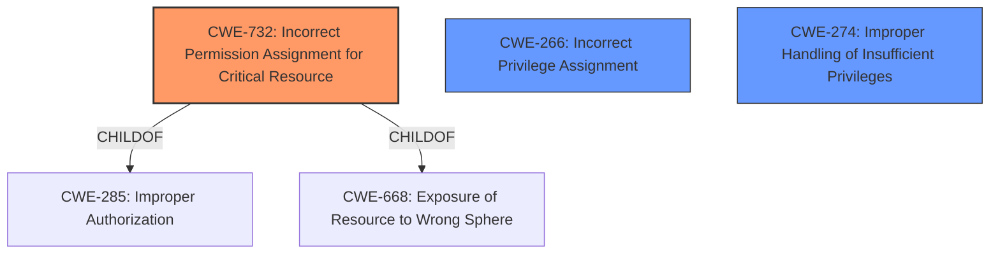

# Analysis for CVE-2020-24557

# Summary
| CWE ID | CWE Name | Confidence | CWE Abstraction Level | CWE Vulnerability Mapping Label | CWE-Vulnerability Mapping Notes |
|---|---|---|---|---|---|
| CWE-732 | Incorrect Permission Assignment for Critical Resource | 0.8 | Class | Allowed-with-Review | The product specifies permissions for a security-critical resource in a way that allows that resource to be read or modified by unintended actors. |
| CWE-266 | Incorrect Privilege Assignment | 0.7 | Base | Allowed | A product incorrectly assigns a privilege to a particular actor, creating an unintended sphere of control for that actor. |
| CWE-274 | Improper Handling of Insufficient Privileges | 0.6 | Base | Discouraged | The product does not handle or incorrectly handles when it has insufficient privileges to perform an operation, leading to resultant weaknesses. |

## Evidence and Confidence

*   **Confidence Score:** 0.8
*   **Evidence Strength:** HIGH

## Relationship Analysis
The primary CWE is CWE-732, "Incorrect Permission Assignment for Critical Resource," which is a Class-level CWE. It has child relationships with CWE-285 and CWE-668. While the description aligns, the mapping guidance suggests reviewing if a more specific authorization weakness exists. The analysis also considered CWE-266 "Incorrect Privilege Assignment" because the vulnerability allows privilege escalation, however, this is a root cause and would be a better fit. CWE-274 was considered because the vulnerability may allow an attacker to perform actions they should not be able to.



## Vulnerability Chain
The vulnerability chain starts with the **improper access control** on the product folder. This allows manipulation of the folder and abuse of a Windows function, leading to privilege escalation and the ability to disable security temporarily.

## Summary of Analysis
The initial assessment focused on the **improper access control** vulnerability in Trend Micro Apex One and Worry-Free Business Security. The primary identified weakness is CWE-732, "Incorrect Permission Assignment for Critical Resource." This aligns with the description indicating that the product folder's permissions are incorrectly set, allowing unauthorized manipulation. The evidence from the "CVE Reference Links Content Summary" explicitly states that the vulnerability exists due to a flaw in the way the Apex One Security Agent manages access permissions to the `Misc` folder. The impact is privilege escalation to the SYSTEM level.

The selection of CWE-732 is further supported by the retriever results, which list it as a highly relevant CWE. However, the mapping guidance for CWE-732 suggests a review, because it is often misused when permissions are not checked, which is an authorization weakness (CWE-285 or descendants). While this is a valid concern, the vulnerability description and summary clearly point to an incorrect assignment of permissions as the root cause.

CWE-266 "Incorrect Privilege Assignment" was considered because the vulnerability allows privilege escalation. It is a base level CWE.

CWE-274 "Improper Handling of Insufficient Privileges" was considered because the vulnerability may allow an attacker to perform actions they should not be able to.

The final decision to map CWE-732 is based on the specific evidence of **improper permission assignment** for a critical resource, leading to privilege escalation. The evidence is strong, and the relationships reinforce this classification.

Relevant CWE Information:
```
## CWE-732: Incorrect Permission Assignment for Critical Resource
**Abstraction:** Class
**Status:** Draft

### Description
The product specifies permissions for a security-critical resource in a way that allows that resource to be read or modified by unintended actors.
```