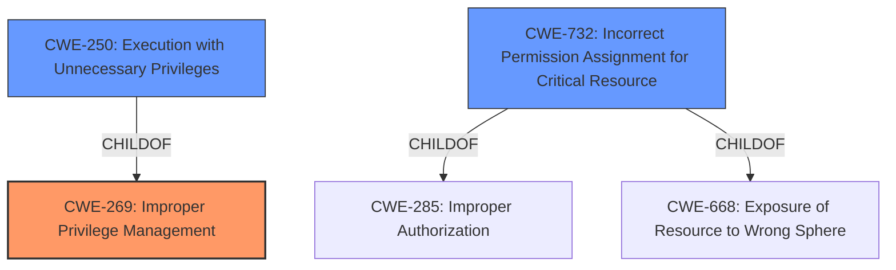

# Analysis for CVE-2020-24576

# Summary
| CWE ID    | CWE Name                                               | Confidence | CWE Abstraction Level | CWE Vulnerability Mapping Label | CWE-Vulnerability Mapping Notes |
| --------- | ------------------------------------------------------ | ---------- | --------------------- | ------------------------------- | ----------------------------- |
| CWE-269   | Improper Privilege Management                          | 0.9        | Class                 | Primary                         | Discouraged                   |
| CWE-250   | Execution with Unnecessary Privileges                | 0.7        | Base                  | Secondary                       | Allowed                       |
| CWE-732   | Incorrect Permission Assignment for Critical Resource | 0.6        | Class                 | Secondary                       | Allowed-with-Review         |

## Evidence and Confidence

*   **Confidence Score:** 0.9
*   **Evidence Strength:** HIGH

## Relationship Analysis

The primary CWE is CWE-269, a Class-level weakness describing **improper privilege management**. CWE-250 (Base) and CWE-732 (Class) are considered as secondary candidates. CWE-250 is a child of CWE-269, representing a more specific scenario of unnecessary privileges. CWE-732, also a child of CWE-285 and CWE-668 is a class of weakness that describes the permissions assigned to critical resources, which is often misused.

## Vulnerability Chain

The vulnerability chain starts with **Improper Privilege Management** (CWE-269), which leads to privilege escalation, allowing low-privileged users to gain NT AUTHORITY\SYSTEM privileges.

## Summary of Analysis

The initial analysis focuses on the **improper privilege management** root cause, as described in the CVE Reference Links Content Summary: "Root cause: **Improper Privilege Management** in the Netskope Windows Client Service (stAgentSvc.exe)." This aligns directly with CWE-269.

The evidence explicitly mentions "Improper Privilege Management" as the root cause.

CWE-269 is a Class-level CWE, and the guidance discourages its use because it can be misused. However, the advisory itself uses the term "Improper Privilege Management," which makes it applicable. The retriever results also list CWE-250 (Execution with Unnecessary Privileges) and CWE-732 (Incorrect Permission Assignment for Critical Resource).

CWE-250 is a child of CWE-269 and represents a more specific scenario. However, the provided information doesn't explicitly state that the Netskope Client is executing with unnecessary privileges, only that there is **improper privilege management**. Therefore, CWE-269 is a better fit.

CWE-732 (Incorrect Permission Assignment for Critical Resource) is also a possibility, but the description doesn't focus on resource permissions; it's about the broader **improper management** of privileges. Therefore, CWE-269 is the primary CWE, but CWE-732 could be considered a secondary factor.

The final decision is based on the explicit mention of **"Improper Privilege Management"** in the advisory, making CWE-269 the most appropriate primary CWE. The weakness enables privilege escalation.

Relevant CWE Information:

# Enhanced Context (25 CWEs)
The following CWEs were identified as potentially relevant to this vulnerability:

## CWE-266: Incorrect Privilege Assignment
**Abstraction Level**: Base
**Similarity Score**: 0.78
**Source**: dense

**Description**:
A product incorrectly assigns a privilege to a particular actor, creating an unintended sphere of control for that actor.

**Mapping Guidance**:
- Usage: Allowed
- Rationale: This CWE entry is at the Base level of abstraction, which is a preferred level of abstraction for mapping to the root causes of vulnerabilities.

## CWE-274: Improper Handling of Insufficient Privileges
**Abstraction Level**: Base
**Similarity Score**: 0.77
**Source**: dense

**Description**:
The product does not handle or incorrectly handles when it has insufficient privileges to perform an operation, leading to resultant weaknesses.

**Mapping Guidance**:
- Usage: Discouraged
- Rationale: This CWE entry could be deprecated in a future version of CWE.

## CWE-280: Improper Handling of Insufficient Permissions or Privileges 
**Abstraction Level**: Base
**Similarity Score**: 0.76
**Source**: dense

**Description**:
The product does not handle or incorrectly handles when it has insufficient privileges to access resources or functionality as specified by their permissions. This may cause it to follow unexpected code paths that may leave the product in an invalid state.

**Mapping Guidance**:
- Usage: Allowed
- Rationale: This CWE entry is at the Base level of abstraction, which is a preferred level of abstraction for mapping to the root causes of vulnerabilities.

## CWE-267: Privilege Defined With Unsafe Actions
**Abstraction Level**: Base
**Similarity Score**: 0.76
**Source**: dense

**Description**:
A particular privilege, role, capability, or right can be used to perform unsafe actions that were not intended, even when it is assigned to the correct entity.

**Mapping Guidance**:
- Usage: Allowed
- Rationale: This CWE entry is at the Base level of abstraction, which is a preferred level of abstraction for mapping to the root causes of vulnerabilities.

## CWE-653: Improper Isolation or Compartmentalization
**Abstraction Level**: Class
**Similarity Score**: 0.76
**Source**: dense

**Description**:
The product does not properly compartmentalize or isolate functionality, processes, or resources that require different privilege levels, rights, or permissions.

**Mapping Guidance**:
- Usage: Allowed
- Rationale: This CWE entry is at the Base level of abstraction, which is a preferred level of abstraction for mapping to the root causes of vulnerabilities.

## CWE-668: Exposure of Resource to Wrong Sphere
**Abstraction Level**: Class
**Similarity Score**: 0.75
**Source**: dense

**Description**:
The product exposes a resource to the wrong control sphere, providing unintended actors with inappropriate access to the resource.

**Mapping Guidance**:
- Usage: Discouraged
- Rationale: CWE-668 is high-level and is often misused as a catch-all when lower-level CWE IDs might be applicable. It is sometimes used for low-information vulnerability reports [REF-1287]. It is a level-1 Class (i.e., a child of a Pillar). It is not useful for trend analysis.

## CWE-59: Improper Link Resolution Before File Access ('Link Following')
**Abstraction Level**: Base
**Similarity Score**: 0.75
**Source**: dense

**Description**:
The product attempts to access a file based on the filename, but it does not properly prevent that filename from identifying a link or shortcut that resolves to an unintended resource.

**Mapping Guidance**:
- Usage: Allowed
- Rationale: This CWE entry is at the Base level of abstraction, which is a preferred level of abstraction for mapping to the root causes of vulnerabilities.

## CWE-276: Incorrect Default Permissions
**Abstraction Level**: Base
**Similarity Score**: 0.74
**Source**: dense

**Description**:
During installation, installed file permissions are set to allow anyone to modify those files.

**Mapping Guidance**:
- Usage: Allowed
- Rationale: This CWE entry is at the Base level of abstraction, which is a preferred level of abstraction for mapping to the root causes of vulnerabilities.

## CWE-1220: Insufficient Granularity of Access Control
**Abstraction Level**: Base
**Similarity Score**: 0.74
**Source**: dense

**Description**:
The product implements access controls via a policy or other feature with the intention to disable or restrict accesses (reads and/or writes) to assets in a system from untrusted agents. However, implemented access controls lack required granularity, which renders the control policy too broad because it allows accesses from unauthorized agents to the security-sensitive assets.

**Mapping Guidance**:
- Usage: Allowed
- Rationale: This CWE entry is at the Base level of abstraction, which is a preferred level of abstraction for mapping to the root causes of vulnerabilities.

## CWE-41: Improper Resolution of Path Equivalence
**Abstraction Level**: Base
**Similarity Score**: 0.74
**Source**: dense

**Description**:
The product