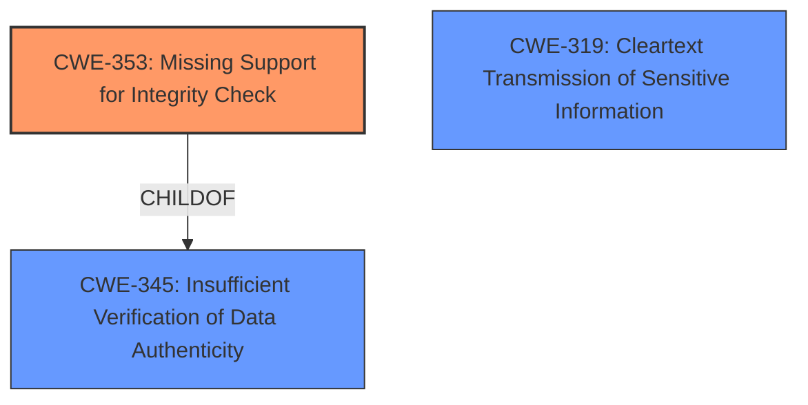

# Enhanced Analysis for CVE-2020-24588

# Summary
| CWE ID | CWE Name | Confidence | CWE Abstraction Level | CWE Vulnerability Mapping Label | CWE-Vulnerability Mapping Notes |
|---|---|---|---|---|---|
| CWE-353 | Missing Support for Integrity Check | 0.8 | Base | Primary | Allowed |
| CWE-319 | Cleartext Transmission of Sensitive Information | 0.6 | Base | Secondary | Allowed |

## Evidence and Confidence

*   **Confidence Score:** 0.7
*   **Evidence Strength:** MEDIUM

## Relationship Analysis
The primary relationship that impacted my decision was the parent-child relationship between CWE-345 (Insufficient Verification of Data Authenticity) and CWE-353 (Missing Support for Integrity Check). Since the vulnerability stems from the **lack of an integrity check** on the A-MSDU flag, the more specific CWE-353 was selected. Another consideration was CWE-319, as the **lack of authentication** allows for the injection of packets, essentially sending sensitive information without protection.



## Vulnerability Chain
The vulnerability chain starts with the **missing integrity check** (CWE-353) on the A-MSDU flag, which allows an attacker to inject arbitrary network packets. This can then lead to traffic interception and potentially the exfiltration of sensitive data.

## Summary of Analysis
The primary CWE is CWE-353, "Missing Support for Integrity Check," because the root cause of the vulnerability is the **lack of authentication** and integrity check on the A-MSDU flag in the 802.11 standard. This allows attackers to inject arbitrary network packets. The retriever results also pointed to CWE-354 "Improper Validation of Integrity Check Value", but the evidence supports the "missing" aspect better than an "improper" validation.

The evidence from the CVE Reference Links Content Summary strongly supports this:

*   "The vulnerability stems from the 802.11 standard not requiring authentication of the 'is aggregated' flag within the Quality of Service (QoS) header of A-MSDU frames."
*   "**Lack of Authentication:** The primary weakness is the missing authentication mechanism for the A-MSDU flag."

While other CWEs such as CWE-319 "Cleartext Transmission of Sensitive Information" were considered, they are impacts of the **missing integrity check** rather than the root cause. The selection of CWE-353 is at the optimal level of specificity, as it directly addresses the **missing integrity check** that leads to the vulnerability.

Relevant CWE Information:

# Enhanced Context (25 CWEs)

## CWE-303: Incorrect Implementation of Authentication Algorithm
**Abstraction Level**: Base
**Similarity Score**: 0.79

This CWE was not selected because the issue isn't an incorrect implementation, but a **lack of implementation** of authentication of the A-MSDU flag.

## CWE-319: Cleartext Transmission of Sensitive Information
**Abstraction Level**: Base
**Similarity Score**: 0.78

This CWE was considered because injecting arbitrary packets means sending information without proper protection. However, it's a consequence of the **lack of integrity check** rather than the root cause itself. The ability to inject packets is the impact, not the root cause. It's listed as a secondary CWE due to its relevance to the vulnerability's consequences.

## CWE-1391: Use of Weak Credentials
**Abstraction Level**: Class
**Similarity Score**: 0.78

This CWE was not selected as the vulnerability doesn't involve the use of weak credentials but rather the **absence of authentication** for a specific flag.

## CWE-300: Channel Accessible by Non-Endpoint
**Abstraction Level**: Class
**Similarity Score**: 0.78

This CWE was not selected because while a man-in-the-middle attack is possible, the core issue is the **lack of authentication** and integrity check of the A-MSDU flag, not that the channel is inherently accessible by a non-endpoint. The **lack of authentication** allows for the possibility of a MITM attack.

## CWE-807: Reliance on Untrusted Inputs in a Security Decision
**Abstraction Level**: Base
**Similarity Score**: 0.77

This CWE was not selected because the vulnerability doesn't involve relying on untrusted inputs but rather the **lack of authentication** and integrity check of the A-MSDU flag.

## CWE-345: Insufficient Verification of Data Authenticity
**Abstraction Level**: Class
**Similarity Score**: 0.77

CWE-345 is a parent of CWE-353. The vulnerability stems from the **lack of authentication** of the "is aggregated" flag within the Quality of Service (QoS) header of A-MSDU frames. Because the more specific child CWE-353 exists, it is the selected primary CWE.

## CWE-288: Authentication Bypass Using an Alternate Path or Channel
**Abstraction Level**: Base
**Similarity Score**: 0.76

This CWE was not selected because the vulnerability doesn't involve bypassing authentication through an alternate path but rather the **lack of authentication** for the A-MSDU flag.

## CWE-294: Authentication Bypass by Capture-replay
**Abstraction Level**: Base
**Similarity Score**: 0.76

This CWE was not selected because the vulnerability is not specifically about capture-replay attacks but rather the **lack of authentication** and integrity check of the A-MSDU flag.

## CWE-1390: Weak Authentication
**Abstraction Level**: Class
**Similarity Score**: 0.76

This CWE was not selected because the vulnerability involves a **complete lack of authentication** rather than a weak authentication mechanism.

## CWE-290: Authentication Bypass by Spoofing
**Abstraction Level**: Base
**Similarity Score**: 0.76

This CWE was not selected because the vulnerability isn't directly about spoofing, but rather the **lack of authentication** and integrity check that *allows* spoofing.

## CWE-327: Use of a Broken or Risky Cryptographic Algorithm
**Abstraction Level**: Class
**Similarity Score**: 6276.18

This CWE was not selected because the vulnerability is not about the use of a broken or risky cryptographic algorithm but the **lack of authentication** and integrity check.

## CWE-295: Improper Certificate Validation
**Abstraction Level**: Base
**Similarity Score**: 5963.72

This CWE was not selected because the vulnerability does not involve certificate validation issues.

## CWE-226: Sensitive Information in Resource Not Removed Before Reuse
**Abstraction Level**: Base
**Similarity Score**: 5901.48

This CWE was not selected because the vulnerability is not related to sensitive information not being removed before resource reuse.

## CWE-201: Insertion of Sensitive Information Into Sent Data
**Abstraction Level**: base
**Similarity Score**: 5.03

While this could be a consequence of the **lack of integrity check**, the root cause is the **missing check** itself, making CWE-353 more appropriate.

## CWE-212: Improper Removal of Sensitive Information Before Storage or Transfer
**Abstraction Level**: base
**Similarity Score**: 4.33

This CWE was not selected as the vulnerability isn't directly related to the improper removal of sensitive information.

## CWE-354: Improper Validation of Integrity Check Value
**Abstraction Level**: base
**Similarity Score**: 3.64

While closely related to CWE-353, the core issue is that there is **no validation** at all, rather than an improper validation. Therefore, CWE-353 is more accurate.

## CWE-209: Generation of Error Message Containing Sensitive Information
**Abstraction Level**: base
**Similarity Score**: 3.64

This CWE was not selected as the vulnerability does not involve generating error messages containing sensitive information.

## CWE-202: Exposure of Sensitive Information Through Data Queries
**Abstraction Level**: base
**Similarity Score**: 3.64

This CWE was not selected as the vulnerability is not related to data queries that expose sensitive information.

## CWE-322: Key Exchange without Entity Authentication
**Abstraction Level**: base
**Similarity Score**: 3.57

This CWE was not selected as the vulnerability is not about key exchange without entity authentication.

## CWE-1272: Sensitive Information Uncleared Before Debug/Power State Transition
**Abstraction Level**: base
**Similarity Score**: 2.87

This CWE was not selected as the vulnerability is not related to sensitive information uncleared before debug/power state transition.


## CWE Relationship Analysis

Current CWEs represent these abstraction levels: .


### Vulnerability Chain Analysis

**Chain starting from CWE-288:**
- 288 (Authentication Bypass Using an Alternate Path or Channel) - ROOT


**Chain starting from CWE-294:**
- 294 (Authentication Bypass by Capture-replay) - ROOT


### CWE Relationship Diagram

```mermaid
graph TD
    classDef primary fill:#f96,stroke:#333,stroke-width:2px
    classDef secondary fill:#69f,stroke:#333
    classDef tertiary fill:#9e9,stroke:#333
```