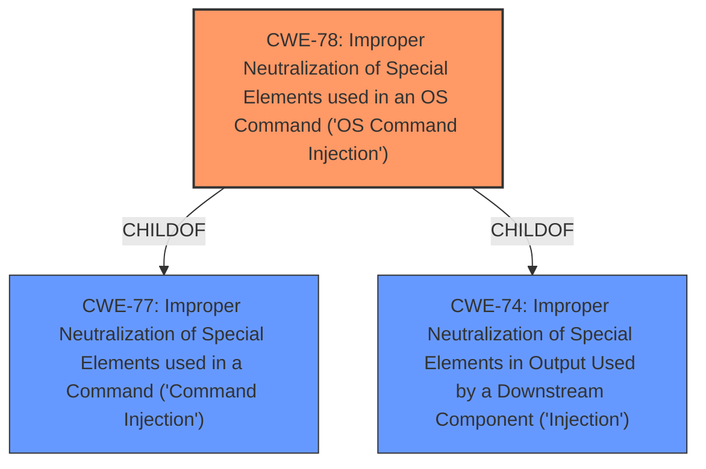

# Analysis Report for CVE-2020-24635

# Vulnerability Analysis Report: CVE-2020-24635

## Description


## Analysis (with Relationship Data)

# Summary
| CWE ID | CWE Name | Confidence | CWE Abstraction Level | CWE Vulnerability Mapping Label | CWE-Vulnerability Mapping Notes |
|---|---|---|---|---|---|
| CWE-78 | Improper Neutralization of Special Elements used in an OS Command ('OS Command Injection') | 1.0 | Base | Allowed | Primary CWE |

## Evidence and Confidence

*   **Confidence Score:** 1.0
*   **Evidence Strength:** HIGH

## Relationship Analysis
The primary relationship influencing the selection was the direct match of the **root cause** with the description of CWE-78. CWE-78 is a base level CWE which is the preferred level of abstraction. CWE-78 is a child of CWE-77 and CWE-74 but those are class level CWEs and less specific.



## Vulnerability Chain
The vulnerability chain starts with the **improper neutralization** of special elements, leading directly to the ability to execute arbitrary commands remotely.

## Summary of Analysis
The analysis is based on the vulnerability description, which clearly indicates a command injection vulnerability. The CVE Reference Links Content Summary section states the **root cause** as "Improper Neutralization of Special Elements used in a Command ('Command Injection')." This perfectly aligns with CWE-78.

The selection of CWE-78 is based on the strong evidence of **command injection** as the **root cause**, as well as the CWE's base level of abstraction, which is preferred for vulnerability mapping. The relationship graph confirms that while CWE-78 has parent CWEs, they are less specific and don't provide a better match for the **root cause**.

Relevant CWE Information:

# Enhanced Context (25 CWEs)
The following CWEs were identified as potentially relevant to this vulnerability:

## CWE-78: Improper Neutralization of Special Elements used in an OS Command ('OS Command Injection')
**Abstraction Level**: Base
**Similarity Score**: 5.03
**Source**: graph

**Description**:
CWE-78: Improper Neutralization of Special Elements used in an OS Command ('OS Command Injection')

**Mapping Guidance**:
- Usage: Allowed
- Rationale: This CWE entry is at the Base level of abstraction, which is a preferred level of abstraction for mapping to the root causes of vulnerabilities.

**Relationships**:
- CANFOLLOW -> CWE-184
- CANALSOBE -> CWE-88
- CHILDOF -> CWE-77
- CHILDOF -> CWE-77
- CHILDOF -> CWE-74

The description for CWE-78 states: "The product constructs all or part of an OS command using externally-influenced input from an upstream component, but it does not neutralize or incorrectly neutralizes special elements that could modify the intended OS command when it is sent to a downstream component." This aligns directly with the vulnerability where arbitrary commands can be executed due to **improper neutralization**.

CWE-77 was considered but not used because it is a Class-level CWE. CWE-78 is more specific, as the vulnerability specifically involves OS commands.

CWE-22 was considered because path traversal can sometimes lead to command execution, but in this case, the vulnerability is directly related to **command injection**, making CWE-78 a more appropriate choice.


## CWE Relationship Analysis

Current CWEs represent these abstraction levels: .


### Vulnerability Chain Analysis

**Chain starting from CWE-88:**
- 88 (Improper Neutralization of Argument Delimiters in a Command ('Argument Injection')) - ROOT


**Chain starting from CWE-78:**
- 78 (Improper Neutralization of Special Elements used in an OS Command ('OS Command Injection')) - ROOT


### CWE Relationship Diagram

```mermaid
graph TD
    classDef primary fill:#f96,stroke:#333,stroke-width:2px
    classDef secondary fill:#69f,stroke:#333
    classDef tertiary fill:#9e9,stroke:#333
```


*Report generated on 2025-04-01 17:32:59*
