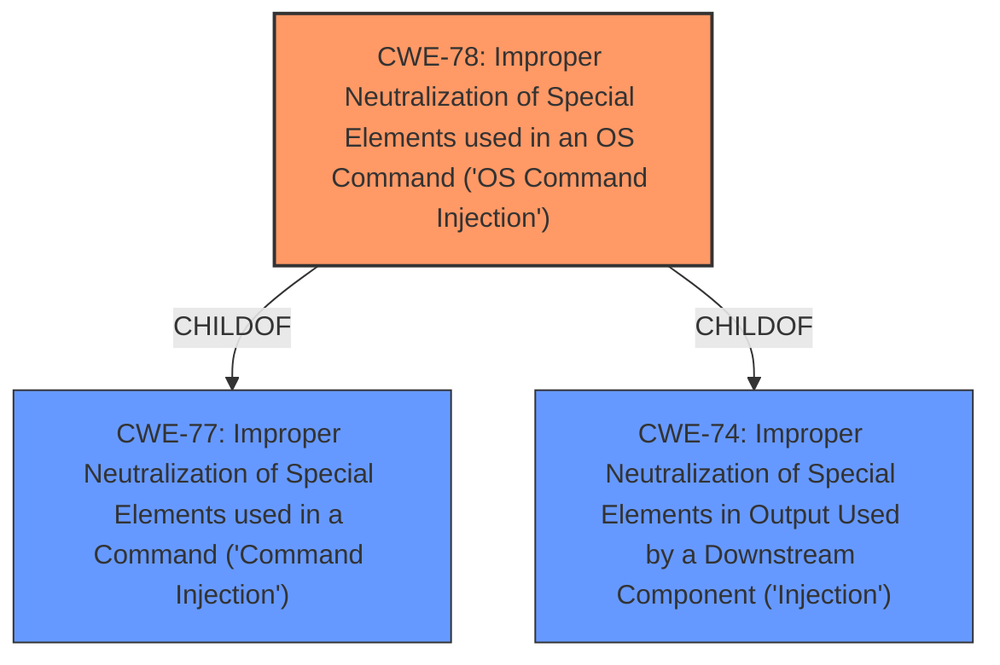

# Raw Analyzer Response for CVE-2020-24636

# Summary
| CWE ID | CWE Name | Confidence | CWE Abstraction Level | CWE Vulnerability Mapping Label | CWE-Vulnerability Mapping Notes |
|---|---|---|---|---|---|
| CWE-78 | Improper Neutralization of Special Elements used in an OS Command ('OS Command Injection') | 1.0 | Base | Allowed | Primary CWE. The vulnerability involves **improper neutralization** leading to command injection.|

## Evidence and Confidence

*   **Confidence Score:** 1.0
*   **Evidence Strength:** HIGH

## Relationship Analysis
The analysis identified CWE-78 as the primary weakness due to **improper neutralization** of elements in a command.

## Vulnerability Chain
The vulnerability chain begins with the **improper neutralization** of special elements in a command, leading directly to OS command injection, and ultimately enabling remote execution of arbitrary commands.

## Summary of Analysis
The initial assessment, based on the vulnerability description and supporting evidence, identified CWE-78 as the most appropriate classification. The "CVE Reference Links Content Summary" explicitly states: "**Root Cause of Vulnerability:** **Improper neutralization** of special elements used in a command, leading to command injection." The primary match in "**CWE for similar CVE Descriptions**" is CWE-78. The "Retriever Results" also lists CWE-78 as the top combined result. This, combined with the CWE description, confirms its suitability. CWE-78 is at the Base level of abstraction, which is a preferred level for mapping.

Other CWEs were considered but ultimately deemed less suitable:

*   CWE-77: This is a parent of CWE-78 and is a more general case of command injection. Since the vulnerability specifically mentions "OS Command Injection", CWE-78 is a more specific and appropriate choice.
*   CWE-22: While path traversal might be a potential secondary attack vector, the primary issue is the command injection itself.
*   CWE-732, CWE-73, CWE-1286, CWE-59, CWE-284, CWE-269, CWE-256: These CWEs were not directly related to the root cause described in the vulnerability details. They represent different types of weaknesses.
*   CWE-74: This is a parent of CWE-78 and describes injection issues in general.
*   CWE-184, CWE-434, CWE-79, CWE-88, CWE-426, CWE-266, CWE-843, CWE-312, CWE-41, CWE-653, CWE-668: These CWEs were not directly related to the root cause described in the vulnerability details. They represent different types of weaknesses.

The selection of CWE-78 is based on the explicit mention of "**improper neutralization**" leading to "command injection," making it the most accurate and specific representation of the vulnerability's root cause.

Relevant CWE Information:

# Enhanced Context (25 CWEs)

## CWE-78: Improper Neutralization of Special Elements used in an OS Command ('OS Command Injection')
**Abstraction Level**: Base
**Similarity Score**: 5.03
**Source**: graph

**Description**:
CWE-78: Improper Neutralization of Special Elements used in an OS Command ('OS Command Injection')

**Mapping Guidance**:
- Usage: Allowed
- Rationale: This CWE entry is at the Base level of abstraction, which is a preferred level of abstraction for mapping to the root causes of vulnerabilities.

**Relationships**:
- CANFOLLOW -> CWE-184
- CANALSOBE -> CWE-88
- CHILDOF -> CWE-77
- CHILDOF -> CWE-77
- CHILDOF -> CWE-74