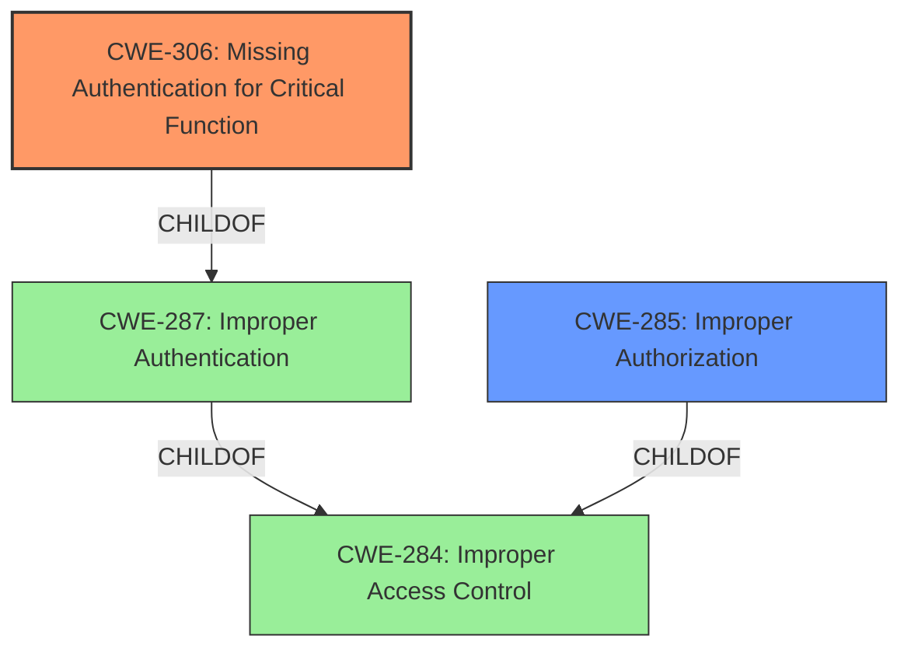

# Raw Analyzer Response for CVE-2020-24771

# Summary
| CWE ID | CWE Name | Confidence | CWE Abstraction Level | CWE Vulnerability Mapping Label | CWE-Vulnerability Mapping Notes |
|---|---|---|---|---|---|
| CWE-306 | Missing Authentication for Critical Function | 1.0 | Base | Primary | Allowed |
| CWE-285 | Improper Authorization | 0.5 | Class | Secondary | Discouraged |

## Evidence and Confidence

*   **Confidence Score:** 0.9
*   **Evidence Strength:** HIGH

## Relationship Analysis
The primary CWE selected is CWE-306 (Missing Authentication for Critical Function), which is a Base level CWE and a child of CWE-287 (Improper Authentication). CWE-287 is itself a child of CWE-284 (Improper Access Control), a Pillar level CWE. Choosing CWE-306 provides the most specific representation of the vulnerability compared to its parent classes. CWE-285 (Improper Authorization) was considered as a secondary CWE because the **incorrect access control** could indicate authorization issues, but the root cause appears to be more directly related to the absence of authentication.

## Vulnerability Chain
The vulnerability chain starts with a **missing login check** in the `fun.php` file (CWE-306). This leads to **unrestricted content publication** and a **lack of publisher tracking**. The final impact is the ability for attackers to inject arbitrary content, leading to potential website defacement, spam, and phishing.

## Summary of Analysis
The initial assessment identified **incorrect access control** as a key phrase from the vulnerability description, which could point to various access control related CWEs. However, after reviewing the CVE Reference Links Content Summary, the **root cause** is specifically a **missing login check** in the `fun.php` file. This clearly indicates CWE-306 (Missing Authentication for Critical Function) as the most appropriate primary CWE.

The vulnerability description states: "**Incorrect access control** in NexusPHP 1.5.beta5.20120707 allows unauthorized attackers to access published content."
The CVE Reference Links Content Summary details: "The vulnerability stems from a **missing login check** in the `fun.php` file of NexusPHP version 1.5." It also states: "The `fun.php` page, responsible for publishing content to the funbox, can be accessed without any login or authentication."

CWE-306 is selected because it directly addresses the identified root cause. The other CWEs, while related to access control, do not specifically capture the **missing authentication** aspect as accurately. For instance, CWE-285 (Improper Authorization) implies that some authorization mechanism exists but is flawed, which is not the case here. The MITRE mapping guidance allows for the use of CWE-306 as it is a Base level of abstraction and directly reflects the **missing authentication** issue.

Relevant CWE Information:

# Enhanced Context (25 CWEs)

## CWE-668: Exposure of Resource to Wrong Sphere
**Abstraction Level**: Class
**Similarity Score**: 0.75
**Source**: dense

**Description**:
The product exposes a resource to the wrong control sphere, providing unintended actors with inappropriate access to the resource.

**Mapping Guidance**:
- Usage: Discouraged
- Rationale: CWE-668 is high-level and is often misused as a catch-all when lower-level CWE IDs might be applicable. It is sometimes used for low-information vulnerability reports [REF-1287]. It is a level-1 Class (i.e., a child of a Pillar). It is not useful for trend analysis.

*Reason for not selecting*: This is too general, the issue is more specifically related to authentication.

## CWE-664: Improper Control of a Resource Through its Lifetime
**Abstraction Level**: Pillar
**Similarity Score**: 0.75
**Source**: dense

**Description**:
The product does not maintain or incorrectly maintains control over a resource throughout its lifetime of creation, use, and release.

**Mapping Guidance**:
- Usage: Discouraged
- Rationale: This CWE entry is high-level when lower-level children are available.

*Reason for not selecting*: This is too general, the issue is more specifically related to authentication.

## CWE-552: Files or Directories Accessible to External Parties
**Abstraction Level**: Base
**Similarity Score**: 0.74
**Source**: dense

**Description**:
The product makes files or directories accessible to unauthorized actors, even though they should not be.

**Mapping Guidance**:
- Usage: Allowed
- Rationale: This CWE entry is at the Base level of abstraction, which is a preferred level of abstraction for mapping to the root causes of vulnerabilities.

*Reason for not selecting*: While this is tangentially related as the `fun.php` file is accessible, the core issue is the **missing authentication**.

## CWE-610: Externally Controlled Reference to a Resource in Another Sphere
**Abstraction Level**: Class
**Similarity Score**: 0.74
**Source**: dense

**Description**:
The product uses an externally controlled name or reference that resolves to a resource that is outside of the intended control sphere.

**Mapping Guidance**:
- Usage: Discouraged
- Rationale: This CWE entry is a level-1 Class (i.e., a child of a Pillar). It might have lower-level children that would be more appropriate

*Reason for not selecting*: This doesn't fit the vulnerability description.

## CWE-1220: Insufficient Granularity of Access Control
**Abstraction Level**: Base
**Similarity Score**: 0.74
**Source**: dense

**Description**:
The product implements access controls via a policy or other feature with the intention to disable or restrict accesses (reads and/or writes) to assets in a system from untrusted agents. However, implemented access controls lack required granularity, which renders the control policy too broad because it allows accesses from unauthorized agents to the security-sensitive assets.

**Mapping Guidance**:
- Usage: Allowed
- Rationale: This CWE entry is at the Base level of abstraction, which is a preferred level of abstraction for mapping to the root causes of vulnerabilities.

*Reason for not selecting*: There is no access control implemented at all, so granularity is irrelevant.

## CWE-653: Improper Isolation or Compartmentalization
**Abstraction Level**: Class
**Similarity Score**: 0.73
**Source**: dense

**Description**:
The product does not properly compartmentalize or isolate functionality, processes, or resources that require different privilege levels, rights, or permissions.

**Mapping Guidance**:
- Usage: Allowed
- Rationale: This CWE entry is at the Base level of abstraction, which is a preferred level of abstraction for mapping to the root causes of vulnerabilities.

*Reason for not selecting*: This doesn't fit the vulnerability description.

## CWE-807: Reliance on Untrusted Inputs in a Security Decision
**Abstraction Level**: Base
**Similarity Score**: 0.73
**Source**: dense

**Description**:
The product uses a protection mechanism that relies on the existence or values of an input, but the input can be modified by an untrusted actor in a way that bypasses the protection mechanism.

**Mapping Guidance**:
- Usage: Allowed
- Rationale: This CWE entry is at the Base level of abstraction, which is a preferred level of abstraction for mapping to the root causes of vulnerabilities.

*Reason for not selecting*: There's no reliance on untrusted inputs for security decisions in this case; it's a straight **missing authentication** issue.

## CWE-669: Incorrect Resource Transfer Between Spheres
**Abstraction Level**: Class
**Similarity Score**: 0.73
**Source**: dense

**Description**:
The product does not properly transfer a resource/behavior to another sphere, or improperly imports a resource/behavior from another sphere, in a manner that provides unintended control over that resource.

**Mapping Guidance**:
- Usage: Allowed-with-Review
- Rationale: This CWE entry is a Class and might have Base-level children that would be more appropriate

*Reason for not selecting*: This doesn't fit the vulnerability description.

## CWE-405: Asymmetric Resource Consumption (Amplification)
**Abstraction Level**: Class
**Similarity Score**: 0.73
**Source**: dense

**Description**:
The product does not properly control