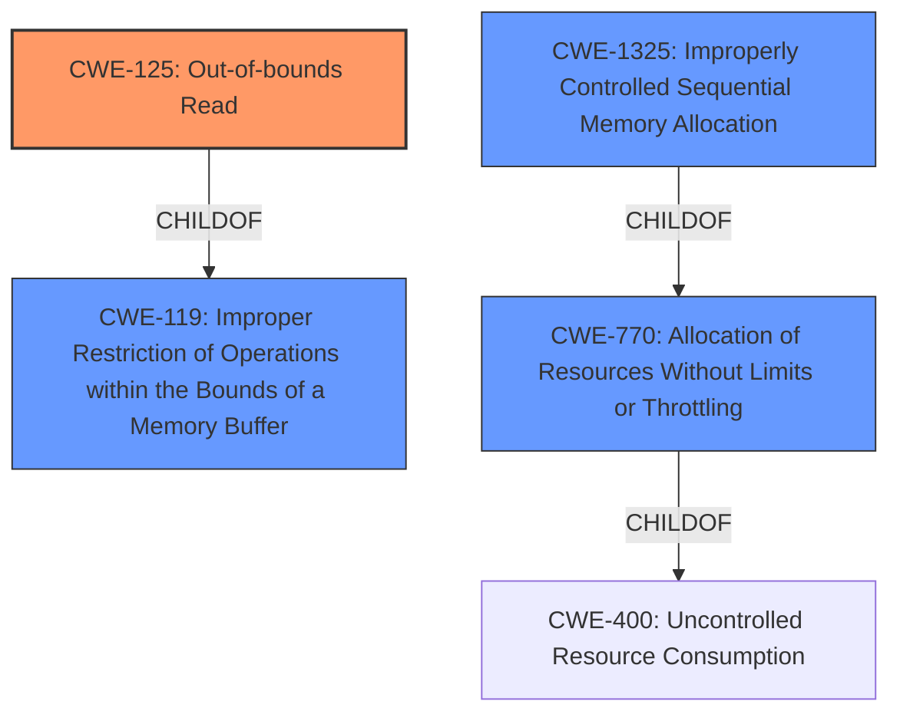

# Analysis for CVE-2020-24822

# Summary
| CWE ID    | CWE Name                                                               | Confidence | CWE Abstraction Level | CWE Vulnerability Mapping Label | CWE-Vulnerability Mapping Notes |
| --------- | ---------------------------------------------------------------------- | ---------- | --------------------- | ------------------------------- | ----------------------------- |
| CWE-125   | Out-of-bounds Read                                                     | 1          | Base                  | Allowed                         | Primary CWE                     |
| CWE-770   | Allocation of Resources Without Limits or Throttling                  | 0.6        | Base                  | Allowed                         | Secondary Candidate           |
| CWE-1325  | Improperly Controlled Sequential Memory Allocation                     | 0.5        | Base                  | Allowed                         | Secondary Candidate           |
| CWE-119   | Improper Restriction of Operations within the Bounds of a Memory Buffer | 0.4        | Class                 | Discouraged                     | Secondary Candidate           |

## Evidence and Confidence

*   **Confidence Score:** 1
*   **Evidence Strength:** HIGH

## Relationship Analysis
The primary relationship influencing the decision is the parent-child relationship between CWE-119 (Improper Restriction of Operations within the Bounds of a Memory Buffer) and CWE-125 (Out-of-bounds Read). CWE-125 is a more specific type of CWE-119, making it a better fit. CWE-770 (Allocation of Resources Without Limits or Throttling) and CWE-1325 (Improperly Controlled Sequential Memory Allocation) are also considered due to the potential for resource exhaustion from a crafted ELF file but they are not as direct a match as CWE-125.

## Vulnerability Chain
The vulnerability chain starts with a crafted ELF file that contains malformed DWARF debug information. This leads to an **out-of-bounds read (CWE-125)** in the `dwarf::cursor::uleb128` function, which then results in a segmentation fault and denial of service. While resource exhaustion via **CWE-770** and **CWE-1325** is possible, the primary and immediate cause is the out-of-bounds read.

## Summary of Analysis
The initial assessment pointed towards a potential code injection vulnerability (CWE-74) based on similar CVE descriptions, but the detailed analysis of the provided content reveals a more specific **out-of-bounds read (CWE-125)**. The CVE Reference Links Content Summary explicitly states that the root cause is an **out-of-bounds read** in the `uleb128` function due to a lack of bounds checking.

The evidence supporting CWE-125 is:

*   "The vulnerability lies in the `dwarf::cursor::uleb128` function... The issue arises when the input data stream does not contain enough bytes to complete the LEB128 decoding, leading to an **out-of-bounds read**."
*   "**Out-of-bounds Read**: The `uleb128` function attempts to read bytes from the input stream without proper bounds checking. If the LEB128 encoded value is truncated or malformed, it can read beyond the allocated buffer."
*   "**Denial of Service (DoS)**: The **out-of-bounds read** results in a segmentation fault (SIGSEGV), causing the application to crash."

CWE-125 is a Base level CWE, providing the right level of specificity. The relationship analysis shows that CWE-125 is a child of CWE-119, which is a more general class of buffer errors. However, mapping to CWE-125 is more precise and aligns with the vulnerability's root cause.

The Retriever results also support CWE-125 as a candidate, along with CWE-770 and CWE-1325, which relate to resource allocation issues. The potential for resource exhaustion exists due to the crafted ELF file, making them secondary considerations.

**CWE Selection Justification:**

*   **CWE-125 (Out-of-bounds Read)**: This is the primary CWE because the vulnerability is a direct result of the `uleb128` function attempting to read beyond the allocated buffer. The **lack of bounds checking** is the root cause, leading to a segmentation fault.
*   **CWE-770 (Allocation of Resources Without Limits or Throttling)**: This is a secondary CWE because the attack vector involves a crafted ELF file, which could potentially lead to excessive resource allocation. However, the primary issue is the **out-of-bounds read**, not the resource allocation itself.
*   **CWE-1325 (Improperly Controlled Sequential Memory Allocation)**: Similar to CWE-770, this is considered a secondary CWE due to the potential for the crafted ELF file to trigger multiple memory allocations. However, the **out-of-bounds read** is the more direct and immediate cause of the vulnerability.
*   **CWE-119 (Improper Restriction of Operations within the Bounds of a Memory Buffer)**: This is a more general class that encompasses out-of-bounds read. Since CWE-125 is a child of CWE-119 and a more precise fit, it's preferred. The MITRE guidance also discourages mapping to CWE-119 when a more specific CWE is available.

**CWEs Considered But Not Used:**

*   **CWE-74 (Improper Neutralization of Special Elements in Output Used by Another System)**: Initially considered due to similar CVE descriptions, but the detailed analysis indicates that the vulnerability is not related to code injection.
*   **CWE-476 (NULL Pointer Dereference)**: Not directly related to the out-of-bounds read vulnerability described. The crash is a result of reading from an invalid memory location, not dereferencing a NULL pointer.
*   **CWE-122 (Heap-based Buffer Overflow) and CWE-121 (Stack-based Buffer Overflow)**: While a buffer overflow could potentially occur as a result of the out-of-bounds read, the evidence focuses on the read itself, not a write operation that causes an overflow.

# Enhanced Query for CVE-2020-24822

## Vulnerability Description
A vulnerability in the dwarfcursoruleb function of Libelfin v0.3 allows attackers to cause a denial of service (DOS) through a segmentation fault via a crafted ELF file.

### Vulnerability Description Key Phrases
- **impact:** denial of service
- **vector:** crafted ELF file
- **attacker:** attackers
- **product:** Libelfin
- **version:** v0.3
- **component:** dwarfcursoruleb function

### CWE for similar CVE Descriptions
### Primary CWE Match
CWE-74

#### Top CWEs
- CWE-74 (Count: 20)
- CWE-NVD-noinfo (Count: 12)

## CVE Reference Links Content Summary
Based on the provided content, here's an analysis of the vulnerability:

**Root Cause:**
- The vulnerability lies in the `dwarf::cursor::uleb128` function within the `libelfin` library. This function is responsible for reading unsigned LEB128 (Little Endian Base 128) encoded values from a DWARF debugging information stream. The issue arises when the input data stream does not contain enough bytes to complete the LEB128 decoding, leading to an out-of-bounds read.

**Weaknesses/Vulnerabilities:**
- **Out-of-bounds Read:** The `uleb128` function attempts to read bytes from the input stream without proper bounds checking. If the LEB128 encoded value is truncated or malformed, it can read beyond the allocated buffer.

**Impact of Exploitation:**
- **Denial of Service (DoS):** The out-of-bounds read results in a segmentation fault (SIGSEGV), causing the application to crash. This can be triggered by a crafted ELF file, leading to a denial of service.

**Attack Vectors:**
- **Malicious ELF File:** An attacker can craft a malicious ELF file containing malformed DWARF debug information that triggers the vulnerable code path during parsing.

**Required Attacker Capabilities/Position:**
- **Ability to Provide Input:** The attacker needs the ability to provide input to the application that uses the vulnerable `libelfin` library. In this case, it's through the ELF file provided to the `dump-tree` example program.

**More Details than CVE Description:**
- The provided content gives a much more detailed picture than a typical CVE description, including the exact function where the vulnerability lies (`dwarf::cursor::uleb128`), the specific type of vulnerability (out-of-bounds read), and the program crash details obtained via Valgrind and AddressSanitizer tools. It also includes the stack trace.

## Retriever Results

### Top Combined Results

| Rank | CWE ID | Name | Abstraction | Usage  | Retrievers | Individual Scores |
|------|--------|------|-------------|-------|------------|-------------------|
| 1 | 770 | Allocation of Resources Without Limits or Throttling | Base | Allowed | sparse | 0.074 |
| 2 | 476 | NULL Pointer Dereference | Base | Allowed | sparse | 0.064 |
| 3 | 125 | Out-of-bounds Read | Base | Allowed | sparse | 0.064 |
| 4 | 122 | Heap-based Buffer Overflow | Variant | Allowed | sparse | 0.059 |
| 5 | 674 | Uncontrolled Recursion | Class | Allowed-with-Review | sparse | 0.056 |
| 6 | 403 | Exposure of File Descriptor to Unintended Control Sphere ('File Descriptor Leak') | Base | Allowed | dense | 0.530 |
| 7 | 1325 | Improperly Controlled Sequential Memory Allocation | Base | Allowed | graph | 0.003 |
| 8 | 119 | Improper Restriction of Operations within the Bounds of a Memory Buffer | Class | Discouraged | sparse | 0.056 |
| 9 | 822 | Untrusted Pointer Dereference | Base | Allowed | sparse | 0.055 |
| 10 | 121 | Stack-based Buffer Overflow | Variant | Allowed | sparse | 0.055 |

# Complete CWE Specifications

## CWE-770: Allocation of Resources Without Limits or Throttling
**Abstraction:** Base
**Status:** Incomplete

### Description
The product allocates a reusable resource or group of resources on behalf of an actor without imposing any restrictions on the size or number of resources that can be allocated, in violation of the intended security policy for that actor.

### Extended Description

Code frequently has to work with limited resources, so programmers must be careful to ensure that resources are not consumed too quickly, or too easily. Without use of quotas, resource limits, or other protection mechanisms, it can be easy for an attacker to consume many resources by rapidly making many requests, or causing larger resources to be used than is needed. When too many resources are allocated, or if a single resource is too large, then it can prevent the code from working correctly, possibly leading to a denial of service.

### Alternative Terms
None

### Relationships
ChildOf -> CWE-400
ChildOf -> CWE-665
ChildOf -> CWE-400

### Mapping Guidance
**Usage:** Allowed
**Rationale:** This CWE entry is at the Base level of abstraction, which is a preferred level of abstraction for mapping to the root causes of vulnerabilities.
**Comments:** Carefully read both the name and description to ensure that this mapping is an appropriate fit. Do not try to 'force' a mapping to a lower-level Base/Variant simply to comply with this preferred level of abstraction.
**Reasons:**
- Acceptable-Use

### Additional Notes
**[Relationship]** This entry is different from uncontrolled resource consumption (CWE-400) in that there are other weaknesses that are related to inability to control resource consumption, such as holding on to a resource too long after use, or not correctly keeping track of active resources so that they can be managed and released when they are finished (CWE-771).

**[Theoretical]** Vulnerability theory is largely about how behaviors and resources interact. "Resource exhaustion" can be regarded as either a consequence or an attack, depending on the perspective. This entry is an attempt to reflect one of the underlying weaknesses that enable these attacks (or consequences) to take place.

### Observed Examples
- **CVE-2022-21668:** Chain: Python library does not limit the resources used to process images that specify a very large number of bands (CWE-1284), leading to excessive memory consumption (CWE-789) or an integer overflow (CWE-190).
- **CVE-2009-4017:** Language interpreter does not restrict the number of temporary files being created when handling a MIME request with a large number of parts..
- **CVE-2009-2726:** Driver does not use a maximum width when invoking sscanf style functions, causing stack consumption.

## CWE-476: NULL Pointer Dereference
**Abstraction:** Base
**Status:** Stable

### Description
The product dereferences a pointer that it expects to be valid but is NULL.

### Extended Description
Not provided

### Alternative Terms
NPD: Common abbreviation for Null Pointer Dereference
null deref: Common abbreviation for Null Pointer Dereference
NPE: Common abbreviation for Null Pointer Exception
nil pointer dereference: used for access of nil in Go programs

### Relationships
ChildOf -> CWE-710
ChildOf -> CWE-754
ChildOf -> CWE-754

### Mapping Guidance
**Usage:** Allowed
**Rationale:** This CWE entry is at the Base level of abstraction, which is a preferred level of abstraction for mapping to the root causes of vulnerabilities.
**Comments:** Carefully read both the name and description to ensure that this mapping is an appropriate fit. Do not try to 'force' a mapping to a lower-level Base/Variant simply to comply with this preferred level of abstraction.
**Reasons:**
- Acceptable-Use

### Observed Examples
- **CVE-2005-3274:** race condition causes a table to be corrupted if a timer activates while it is being modified, leading to resultant NULL dereference; also involves locking.
- **CVE-2002-1912:** large number of packets leads to NULL dereference
- **CVE-2005-0772:** packet with invalid error status value triggers NULL dereference

## CWE-125: Out-of-bounds Read
**Abstraction:** Base
**Status:** Draft

### Description
The product reads data past the end, or before the beginning, of the intended buffer.

### Extended Description
Not provided

### Alternative Terms
OOB read: Shorthand for "Out of bounds" read

### Relationships
ChildOf -> CWE-119
ChildOf -> CWE-119
ChildOf -> CWE-119
ChildOf -> CWE-119

### Mapping Guidance
**Usage:** Allowed
**Rationale:** This CWE entry is at the Base level of abstraction, which is a preferred level of abstraction for mapping to the root causes of vulnerabilities.
**Comments:** Carefully read both the name and description to ensure that this mapping is an appropriate fit. Do not try to 'force' a mapping to a lower-level Base/Variant simply to comply with this preferred level of abstraction.
**Reasons:**
- Acceptable-Use

### Observed Examples
- **CVE-2023-1018:** The reference implementation code for a Trusted Platform Module does not implement length checks on data, allowing for an attacker to read 2 bytes past the end of a buffer.
- **CVE-2020-11899:** Out-of-bounds read in IP stack used in embedded systems, as exploited in the wild per CISA KEV.
- **CVE-2014-0160:** Chain: "Heartbleed" bug receives an inconsistent length parameter (CWE-130) enabling an out-of-bounds read (CWE-126), returning memory that could include private cryptographic keys and other sensitive data.

## CWE-122: Heap-based Buffer Overflow
**Abstraction:** Variant
**Status:** Draft

### Description
A heap overflow condition is a buffer overflow, where the buffer that can be overwritten is allocated in the heap portion of memory, generally meaning that the buffer was allocated using a routine such as malloc().

### Extended Description
Not provided

### Alternative Terms
None

### Relationships
ChildOf -> CWE-788
ChildOf -> CWE-787

### Mapping Guidance
**Usage:** Allowed
**Rationale:** This CWE entry is at the Variant level of abstraction, which is a preferred level of abstraction for mapping to the root causes of vulnerabilities.
**Comments:** Carefully read both the name and description to ensure that this mapping is an appropriate fit. Do not try to 'force' a mapping to a lower-level Base/Variant simply to comply with this preferred level of abstraction.
**Reasons:**
- Acceptable-Use

### Additional Notes
**[Relationship]** Heap-based buffer overflows are usually just as dangerous as stack-based buffer overflows.

### Observed Examples
- **CVE-2021-43537:** Chain: in a web browser, an unsigned 64-bit integer is forcibly cast to a 32-bit integer (CWE-681) and potentially leading to an integer overflow (CWE-190). If an integer overflow occurs, this can cause heap memory corruption (CWE-122)
- **CVE-2007-4268:** Chain: integer signedness error (CWE-195) passes signed comparison, leading to heap overflow (CWE-122)
- **CVE-2009-2523:** Chain: product does not handle when an input string is not NULL terminated (CWE-170), leading to buffer over-read (CWE-125) or heap-based buffer overflow (CWE-122).

## CWE-674: Uncontrolled Recursion
**Abstraction:** Class
**Status:** Draft

### Description
The product does not properly control the amount of recursion that takes place,  consuming excessive resources, such as allocated memory or the program stack.

### Extended Description
Not provided

### Alternative Terms
Stack Exhaustion

### Relationships
ChildOf -> CWE-834

### Mapping Guidance
**Usage:** Allowed-with-Review
**Rationale:** This CWE entry is a Class and might have Base-level children that would be more appropriate
**Comments:** Examine children of this entry to see if there is a better fit
**Reasons:**
- Abstraction

### Observed Examples
- **CVE-2007-1285:** Deeply nested arrays trigger stack exhaustion.
- **CVE-2007-3409:** Self-referencing pointers create infinite loop and resultant stack exhaustion.
- **CVE-2016-10707:** Javascript application accidentally changes input in a way that prevents a recursive call from detecting an exit condition.

## CWE-403: Exposure of File Descriptor to Unintended Control Sphere ('File Descriptor Leak')
**Abstraction:** Base
**Status:** Draft

### Description
A process does not close sensitive file descriptors before invoking a child process, which allows the child to perform unauthorized I/O operations using those descriptors.

### Extended Description
When a new process is forked or executed, the child process inherits any open file descriptors. When the child process has fewer privileges than the parent process, this might introduce a vulnerability if the child process can access the file descriptor but does not have the privileges to access the associated file.

### Alternative Terms
File descriptor leak: While this issue is frequently called a file descriptor leak, the "leak" term is often used in two different ways - exposure of a resource, or consumption of a resource. Use of this term could cause confusion.

### Relationships
ChildOf -> CWE-402

### Mapping Guidance
**Usage:** Allowed
**Rationale:** This CWE entry is at the Base level of abstraction, which is a preferred level of abstraction for mapping to the root causes of vulnerabilities.
**Comments:** Carefully read both the name and description to ensure that this mapping is an appropriate fit. Do not try to 'force' a mapping to a lower-level Base/Variant simply to comply with this preferred level of abstraction.
**Reasons:**
- Acceptable-Use

### Observed Examples
- **CVE-2003-0740:** Server leaks a privileged file descriptor, allowing the server to be hijacked.
- **CVE-2004-1033:** File descriptor leak allows read of restricted files.
- **CVE-2000-0094:** Access to restricted resource using modified file descriptor for stderr.

## CWE-1325: Improperly Controlled Sequential Memory Allocation
**Abstraction:** Base
**Status:** Incomplete

### Description
The product manages a group of objects or resources and performs a separate memory allocation for each object, but it does not properly limit the total amount of memory that is consumed by all of the combined objects.

### Extended Description

While the product might limit the amount of memory that is allocated in a single operation for a single object (such as a malloc of an array), if an attacker can cause multiple objects to be allocated in separate operations, then this might cause higher total memory consumption than the developer intended, leading to a denial of service.

### Alternative Terms
Stack Exhaustion: When a weakness allocates excessive memory on the stack, it is often described as "stack exhaustion," which is a technical impact of the weakness. This technical impact is often encountered as a consequence of CWE-789 and/or CWE-1325.

### Relationships
ChildOf -> CWE-770
PeerOf -> CWE-789
CanPrecede -> CWE-476

### Mapping Guidance
**Usage:** Allowed
**Rationale:** This CWE entry is at the Base level of abstraction, which is a preferred level of abstraction for mapping to the root causes of vulnerabilities.
**Comments:** Carefully read both the name and description to ensure that this mapping is an appropriate fit. Do not try to 'force' a mapping to a lower-level Base/Variant simply to comply with this preferred level of abstraction.
**Reasons:**
- Acceptable-Use

### Observed Examples
- **CVE-2020-36049:** JavaScript-based packet decoder uses concatenation of many small strings, causing out-of-memory (OOM) condition
- **CVE-2019-20176:** Product allocates a new buffer on the stack for each file in a directory, allowing stack exhaustion
- **CVE-2013-1591:** Chain: an integer overflow (CWE-190) in the image size calculation causes an infinite loop (CWE-835) which sequentially allocates buffers without limits (CWE-1325) until the stack is full.

## CWE-119: Improper Restriction of Operations within the Bounds of a Memory Buffer
**Abstraction:** Class
**Status:** Stable

### Description
The product performs operations on a memory buffer, but it reads from or writes to a memory location outside the buffer's intended boundary. This may result in read or write operations on unexpected memory locations that could be linked to other variables, data structures, or internal program data.

### Extended Description
Not provided

### Alternative Terms
Buffer Overflow: This term has many different meanings to different audiences. From a CWE mapping perspective, this term should be avoided where possible. Some researchers, developers, and tools intend for it to mean "write past the end of a buffer," whereas others use the same term to mean "any read or write outside the boundaries of a buffer, whether before the beginning of the buffer or after the end of the buffer." Others could mean "any action after the end of a buffer, whether it is a read or write." Since the term is commonly used for exploitation and for vulnerabilities, it further confuses things.
buffer overrun: Some prominent vendors and researchers use the term "buffer overrun," but most people use "buffer overflow." See the alternate term for "buffer overflow" for context.
memory safety: Generally used for techniques that avoid weaknesses related to memory access, such as those identified by CWE-119 and its descendants. However, the term is not formal, and there is likely disagreement between practitioners as to which weaknesses are implicitly covered by the "memory safety" term.

### Relationships
ChildOf -> CWE-118
ChildOf -> CWE-20

### Mapping Guidance
**Usage:** Discouraged
**Rationale:** CWE-119 is commonly misused in low-information vulnerability reports when lower-level CWEs could be used instead, or when more details about the vulnerability are available.
**Comments:** Look at CWE-119's children and consider mapping to CWEs such as CWE-787: Out-of-bounds Write, CWE-125: Out-of-bounds Read, or others.
**Reasons:**
- Frequent Misuse

### Additional Notes
**[Applicable Platform]** 

It is possible in any programming languages without memory management support to attempt an operation outside of the bounds of a memory buffer, but the consequences will vary widely depending on the language, platform, and chip architecture.

### Observed Examples
- **CVE-2021-22991:** Incorrect URI normalization in application traffic product leads to buffer overflow, as exploited in the wild per CISA KEV.
- **CVE-2020-29557:** Buffer overflow in Wi-Fi router web interface, as exploited in the wild per CISA KEV.
- **CVE-2009-2550:** Classic stack-based buffer overflow in media player using a long entry in a playlist

## CWE-822: Untrusted Pointer Dereference
**Abstraction:** Base
**Status:** Incomplete

### Description
The product obtains a value from an untrusted source, converts this value to a pointer, and dereferences the resulting pointer.

### Extended Description

An attacker can supply a pointer for memory locations that the product is not expecting. If the pointer is dereferenced for a write operation, the attack might allow modification of critical state variables, cause a crash, or execute code. If the dereferencing operation is for a read, then the attack might allow reading of sensitive data, cause a crash, or set a variable to an unexpected value (since the value will be read from an unexpected memory location).

There are several variants of this weakness, including but not necessarily limited to:

  - The untrusted value is directly invoked as a function call.

  - In OS kernels or drivers where there is a boundary between "userland" and privileged memory spaces, an untrusted pointer might enter through an API or system call (see CWE-781 for one such example).

  - Inadvertently accepting the value from an untrusted control sphere when it did not have to be accepted as input at all. This might occur when the code was originally developed to be run by a single user in a non-networked environment, and the code is then ported to or otherwise exposed to a networked environment.

### Alternative Terms
None

### Relationships
ChildOf -> CWE-119
ChildOf -> CWE-119
ChildOf -> CWE-119
CanPrecede -> CWE-125
CanPrecede -> CWE-787

### Mapping Guidance
**Usage:** Allowed
**Rationale:** This CWE entry is at the Base level of abstraction, which is a preferred level of abstraction for mapping to the root causes of vulnerabilities.
**Comments:** Carefully read both the name and description to ensure that this mapping is an appropriate fit. Do not try to 'force' a mapping to a lower-level Base/Variant simply to comply with this preferred level of abstraction.
**Reasons:**
- Acceptable-Use

### Additional Notes
**[Maintenance]** There are close relationships between incorrect pointer dereferences and other weaknesses related to buffer operations. There may not be sufficient community agreement regarding these relationships. Further study is needed to determine when these relationships are chains, composites, perspective/layering, or other types of relationships. As of September 2010, most of the relationships are being captured as chains.

**[Terminology]** Many weaknesses related to pointer dereferences fall under the general term of "memory corruption" or "memory safety." As of September 2010, there is no commonly-used terminology that covers the lower-level variants.

### Observed Examples
- **CVE-2007-5655:** message-passing framework interprets values in packets as pointers, causing a crash.
- **CVE-2010-2299:** labeled as a "type confusion" issue, also referred to as a "stale pointer." However, the bug ID says "contents are simply interpreted as a pointer... renderer ordinarily doesn't supply this pointer directly". The "handle" in the untrusted area is replaced in one function, but not another - thus also, effectively, exposure to wrong sphere (CWE-668).
- **CVE-2009-1719:** Untrusted dereference using undocumented constructor.

## CWE-121: Stack-based Buffer Overflow
**Abstraction:** Variant
**Status:** Draft

### Description
A stack-based buffer overflow condition is a condition where the buffer being overwritten is allocated on the stack (i.e., is a local variable or, rarely, a parameter to a function).

### Extended Description
Not provided

### Alternative Terms
Stack Overflow: "Stack Overflow" is often used to mean the same thing as stack-based buffer overflow, however it is also used on occasion to mean stack exhaustion, usually a result from an excessively recursive function call. Due to the ambiguity of the term, use of stack overflow to describe either circumstance is discouraged.

### Relationships
ChildOf -> CWE-788
ChildOf -> CWE-787

### Mapping Guidance
**Usage:** Allowed
**Rationale:** This CWE entry is at the Variant level of abstraction, which is a preferred level of abstraction for mapping to the root causes of vulnerabilities.
**Comments:** Carefully read both the name and description to ensure that this mapping is an appropriate fit. Do not try to 'force' a mapping to a lower-level Base/Variant simply to comply with this preferred level of abstraction.
**Reasons:**
- Acceptable-Use

### Additional Notes
**[Other]** Stack-based buffer overflows can instantiate in return address overwrites, stack pointer overwrites or frame pointer overwrites. They can also be considered function pointer overwrites, array indexer overwrites or write-what-where condition, etc.

### Observed Examples
- **CVE-2021-35395:** Stack-based buffer overflows in SFK for wifi chipset used for IoT/embedded devices, as exploited in the wild per CISA KEV.

