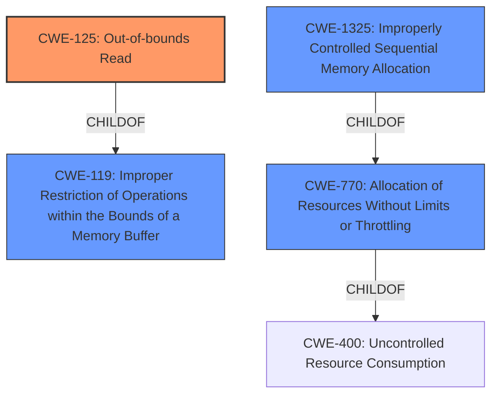

# Analysis Report for CVE-2020-24822

# Vulnerability Analysis Report: CVE-2020-24822

## Description


## Analysis (with Relationship Data)

# Summary
| CWE ID    | CWE Name                                                               | Confidence | CWE Abstraction Level | CWE Vulnerability Mapping Label | CWE-Vulnerability Mapping Notes |
| --------- | ---------------------------------------------------------------------- | ---------- | --------------------- | ------------------------------- | ----------------------------- |
| CWE-125   | Out-of-bounds Read                                                     | 1          | Base                  | Allowed                         | Primary CWE                     |
| CWE-770   | Allocation of Resources Without Limits or Throttling                  | 0.6        | Base                  | Allowed                         | Secondary Candidate           |
| CWE-1325  | Improperly Controlled Sequential Memory Allocation                     | 0.5        | Base                  | Allowed                         | Secondary Candidate           |
| CWE-119   | Improper Restriction of Operations within the Bounds of a Memory Buffer | 0.4        | Class                 | Discouraged                     | Secondary Candidate           |

## Evidence and Confidence

*   **Confidence Score:** 1
*   **Evidence Strength:** HIGH

## Relationship Analysis
The primary relationship influencing the decision is the parent-child relationship between CWE-119 (Improper Restriction of Operations within the Bounds of a Memory Buffer) and CWE-125 (Out-of-bounds Read). CWE-125 is a more specific type of CWE-119, making it a better fit. CWE-770 (Allocation of Resources Without Limits or Throttling) and CWE-1325 (Improperly Controlled Sequential Memory Allocation) are also considered due to the potential for resource exhaustion from a crafted ELF file but they are not as direct a match as CWE-125.



## Vulnerability Chain
The vulnerability chain starts with a crafted ELF file that contains malformed DWARF debug information. This leads to an **out-of-bounds read (CWE-125)** in the `dwarf::cursor::uleb128` function, which then results in a segmentation fault and denial of service. While resource exhaustion via **CWE-770** and **CWE-1325** is possible, the primary and immediate cause is the out-of-bounds read.

## Summary of Analysis
The initial assessment pointed towards a potential code injection vulnerability (CWE-74) based on similar CVE descriptions, but the detailed analysis of the provided content reveals a more specific **out-of-bounds read (CWE-125)**. The CVE Reference Links Content Summary explicitly states that the root cause is an **out-of-bounds read** in the `uleb128` function due to a lack of bounds checking.

The evidence supporting CWE-125 is:

*   "The vulnerability lies in the `dwarf::cursor::uleb128` function... The issue arises when the input data stream does not contain enough bytes to complete the LEB128 decoding, leading to an **out-of-bounds read**."
*   "**Out-of-bounds Read**: The `uleb128` function attempts to read bytes from the input stream without proper bounds checking. If the LEB128 encoded value is truncated or malformed, it can read beyond the allocated buffer."
*   "**Denial of Service (DoS)**: The **out-of-bounds read** results in a segmentation fault (SIGSEGV), causing the application to crash."

CWE-125 is a Base level CWE, providing the right level of specificity. The relationship analysis shows that CWE-125 is a child of CWE-119, which is a more general class of buffer errors. However, mapping to CWE-125 is more precise and aligns with the vulnerability's root cause.

The Retriever results also support CWE-125 as a candidate, along with CWE-770 and CWE-1325, which relate to resource allocation issues. The potential for resource exhaustion exists due to the crafted ELF file, making them secondary considerations.

**CWE Selection Justification:**

*   **CWE-125 (Out-of-bounds Read)**: This is the primary CWE because the vulnerability is a direct result of the `uleb128` function attempting to read beyond the allocated buffer. The **lack of bounds checking** is the root cause, leading to a segmentation fault.
*   **CWE-770 (Allocation of Resources Without Limits or Throttling)**: This is a secondary CWE because the attack vector involves a crafted ELF file, which could potentially lead to excessive resource allocation. However, the primary issue is the **out-of-bounds read**, not the resource allocation itself.
*   **CWE-1325 (Improperly Controlled Sequential Memory Allocation)**: Similar to CWE-770, this is considered a secondary CWE due to the potential for the crafted ELF file to trigger multiple memory allocations. However, the **out-of-bounds read** is the more direct and immediate cause of the vulnerability.
*   **CWE-119 (Improper Restriction of Operations within the Bounds of a Memory Buffer)**: This is a more general class that encompasses out-of-bounds read. Since CWE-125 is a child of CWE-119 and a more precise fit, it's preferred. The MITRE guidance also discourages mapping to CWE-119 when a more specific CWE is available.

**CWEs Considered But Not Used:**

*   **CWE-74 (Improper Neutralization of Special Elements in Output Used by Another System)**: Initially considered due to similar CVE descriptions, but the detailed analysis indicates that the vulnerability is not related to code injection.
*   **CWE-476 (NULL Pointer Dereference)**: Not directly related to the out-of-bounds read vulnerability described. The crash is a result of reading from an invalid memory location, not dereferencing a NULL pointer.
*   **CWE-122 (Heap-based Buffer Overflow) and CWE-121 (Stack-based Buffer Overflow)**: While a buffer overflow could potentially occur as a result of the out-of-bounds read, the evidence focuses on the read itself, not a write operation that causes an overflow.


## CWE Relationship Analysis

Current CWEs represent these abstraction levels: .


### Vulnerability Chain Analysis

**Chain starting from CWE-476:**
- 476 (NULL Pointer Dereference) - ROOT


**Chain starting from CWE-121:**
- 121 (Stack-based Buffer Overflow) - ROOT


### CWE Relationship Diagram

```mermaid
graph TD
    classDef primary fill:#f96,stroke:#333,stroke-width:2px
    classDef secondary fill:#69f,stroke:#333
    classDef tertiary fill:#9e9,stroke:#333
```


*Report generated on 2025-04-02 07:13:45*
