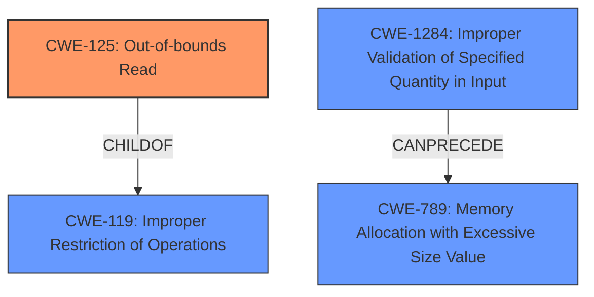

# Analysis Report for CVE-2020-24823

# Vulnerability Analysis Report: CVE-2020-24823

## Description


## Analysis (with Relationship Data)

# Summary
| CWE ID | CWE Name | Confidence | CWE Abstraction Level | CWE Vulnerability Mapping Label | CWE-Vulnerability Mapping Notes |
|---|---|---|---|---|---|
| CWE-125 | Out-of-bounds Read | 0.9 | Base | Allowed | Primary CWE |
| CWE-1284 | Improper Validation of Specified Quantity in Input | 0.7 | Base | Allowed | Secondary Candidate |

## Evidence and Confidence

*   **Confidence Score:** 0.8
*   **Evidence Strength:** HIGH

## Relationship Analysis
The primary relationship influencing the CWE selection is the parent-child relationship where CWE-125 (Out-of-bounds Read) is a child of CWE-119 (Improper Restriction of Operations within the Bounds of a Memory Buffer). Although CWE-119 is a parent, CWE-125 is chosen because it is more specific. The "Retriever Results" lists several potential CWEs, including CWE-787 (Out-of-bounds Write), and CWE-125 (Out-of-bounds Read). The vulnerability description specifically mentions an invalid memory *read*, making CWE-125 a more accurate fit. CWE-1284 (Improper Validation of Specified Quantity in Input) can precede CWE-789 (Memory Allocation with Excessive Size Value)



## Vulnerability Chain
The vulnerability chain starts with a crafted ELF file that is passed as input to the `libelfin` library. The library fails to properly validate the DWARF data structures within the ELF file, leading to an attempt to read memory at an invalid address within the `dwarf::to_string` function. This results in an out-of-bounds read and a segmentation fault, causing a denial of service.
  - Crafted ELF File -> **Improper Input Validation** -> **Out-of-bounds Read** -> Denial of Service

## Summary of Analysis
The initial analysis focused on identifying the root cause and the specific type of memory access violation. The evidence from the "CVE Reference Links Content Summary" clearly points to an invalid memory *read* within the `dwarf::to_string` function. The function attempts to read memory at an address that is not mapped or outside allocated memory ranges, leading to a segmentation fault.

The "Retriever Results" provided a list of candidate CWEs, including CWE-770 (Allocation of Resources Without Limits or Throttling), CWE-476 (NULL Pointer Dereference), and CWE-125 (Out-of-bounds Read). While CWE-770 and CWE-476 were considered, the evidence strongly supports CWE-125 as the primary weakness.

The selection of CWE-125 is further justified by its description, which states, "The product reads data past the end, or before the beginning, of the intended buffer." This aligns precisely with the vulnerability description, where the `dwarf::to_string` function attempts to read memory at an invalid address.

CWE-1284 (Improper Validation of Specified Quantity in Input) is a secondary candidate because the **insufficient input validation** contributes to the **out-of-bounds read** condition.

The selection of CWE-125 at the Base level is appropriate because it accurately represents the specific type of memory access violation. It is more specific than its parent, CWE-119 (Improper Restriction of Operations within the Bounds of a Memory Buffer), which is a more general class of weaknesses.

Relevant CWE Information:

## CWE-191: Integer Underflow (Wrap or Wraparound)
**Abstraction Level**: Base
**Similarity Score**: 0.77
**Source**: dense

**Description**:
The product subtracts one value from another, such that the result is less than the minimum allowable integer value, which produces a value that is not equal to the correct result.

**Mapping Guidance**:
- Usage: Allowed
- Rationale: This CWE entry is at the Base level of abstraction, which is a preferred level of abstraction for mapping to the root causes of vulnerabilities.

## CWE-131: Incorrect Calculation of Buffer Size
**Abstraction Level**: Base
**Similarity Score**: 0.77
**Source**: dense

**Description**:
The product does not correctly calculate the size to be used when allocating a buffer, which could lead to a buffer overflow.

**Mapping Guidance**:
- Usage: Allowed
- Rationale: This CWE entry is at the Base level of abstraction, which is a preferred level of abstraction for mapping to the root causes of vulnerabilities.

## CWE-125: Out-of-bounds Read
**Abstraction Level**: Base
**Similarity Score**: 0.76
**Source**: dense

**Description**:
The product reads data past the end, or before the beginning, of the intended buffer.

**Mapping Guidance**:
- Usage: Allowed
- Rationale: This CWE entry is at the Base level of abstraction, which is a preferred level of abstraction for mapping to the root causes of vulnerabilities.

## CWE-126: Buffer Over-read
**Abstraction Level**: Variant
**Similarity Score**: 0.76
**Source**: dense

**Description**:
The product reads from a buffer using buffer access mechanisms such as indexes or pointers that reference memory locations after the targeted buffer.

**Mapping Guidance**:
- Usage: Allowed
- Rationale: This CWE entry is at the Variant level of abstraction, which is a preferred level of abstraction for mapping to the root causes of vulnerabilities.

## CWE-124: Buffer Underwrite ('Buffer Underflow')
**Abstraction Level**: Base
**Similarity Score**: 0.75
**Source**: dense

**Description**:
The product writes to a buffer using an index or pointer that references a memory location prior to the beginning of the buffer.

**Mapping Guidance**:
- Usage: Allowed
- Rationale: This CWE entry is at the Base level of abstraction, which is a preferred level of abstraction for mapping to the root causes of vulnerabilities.

## CWE-190: Integer Overflow or Wraparound
**Abstraction Level**: Base
**Similarity Score**: 0.75
**Source**: dense

**Description**:
The product performs a calculation that can
         produce an integer overflow or wraparound when the logic
         assumes that the resulting value will always be larger than
         the original value. This occurs when an integer value is
         incremented to a value that is too large to store in the
         associated representation. When this occurs, the value may
         become a very small or negative number.

**Mapping Guidance**:
- Usage: Allowed
- Rationale: This CWE entry is at the Base level of abstraction, which is a preferred level of abstraction for mapping to the root causes of vulnerabilities.

## CWE-1325: Improperly Controlled Sequential Memory Allocation
**Abstraction Level**: Base
**Similarity Score**: 0.75
**Source**: dense

**Description**:
The product manages a group of objects or resources and performs a separate memory allocation for each object, but it does not properly limit the total amount of memory that is consumed by all of the combined objects.

**Mapping Guidance**:
- Usage: Allowed
- Rationale: This CWE entry is at the Base level of abstraction, which is a preferred level of abstraction for mapping to the root causes of vulnerabilities.

## CWE-193: Off-by-one Error
**Abstraction Level**: Base
**Similarity Score**: 0.75
**Source**: dense

**Description**:
A product calculates or uses an incorrect maximum or minimum value that is 1 more, or 1 less, than the correct value.

**Mapping Guidance**:
- Usage: Allowed
- Rationale: This CWE entry is at the Base level of abstraction, which is a preferred level of abstraction for mapping to the root causes of vulnerabilities.

## CWE-805: Buffer Access with Incorrect Length Value
**Abstraction Level**: Base
**Similarity Score**: 0.75
**Source**: dense

**Description**:
The product uses a sequential operation to read or write a buffer, but it uses an incorrect length value that causes it to access memory that is outside of the bounds of the buffer.

**Mapping Guidance**:
- Usage: Allowed
- Rationale: This CWE entry is at the Base level of abstraction, which is a preferred level of abstraction for mapping to the root causes of vulnerabilities.

## CWE-789: Memory Allocation with Excessive Size Value
**Abstraction Level**: Variant
**Similarity Score**: 0.75


## CWE Relationship Analysis

Current CWEs represent these abstraction levels: .


### Vulnerability Chain Analysis

**Chain starting from CWE-476:**
- 476 (NULL Pointer Dereference) - ROOT


**Chain starting from CWE-787:**
- 787 (Out-of-bounds Write) - ROOT


### CWE Relationship Diagram

```mermaid
graph TD
    classDef primary fill:#f96,stroke:#333,stroke-width:2px
    classDef secondary fill:#69f,stroke:#333
    classDef tertiary fill:#9e9,stroke:#333
```


*Report generated on 2025-04-01 23:27:28*
