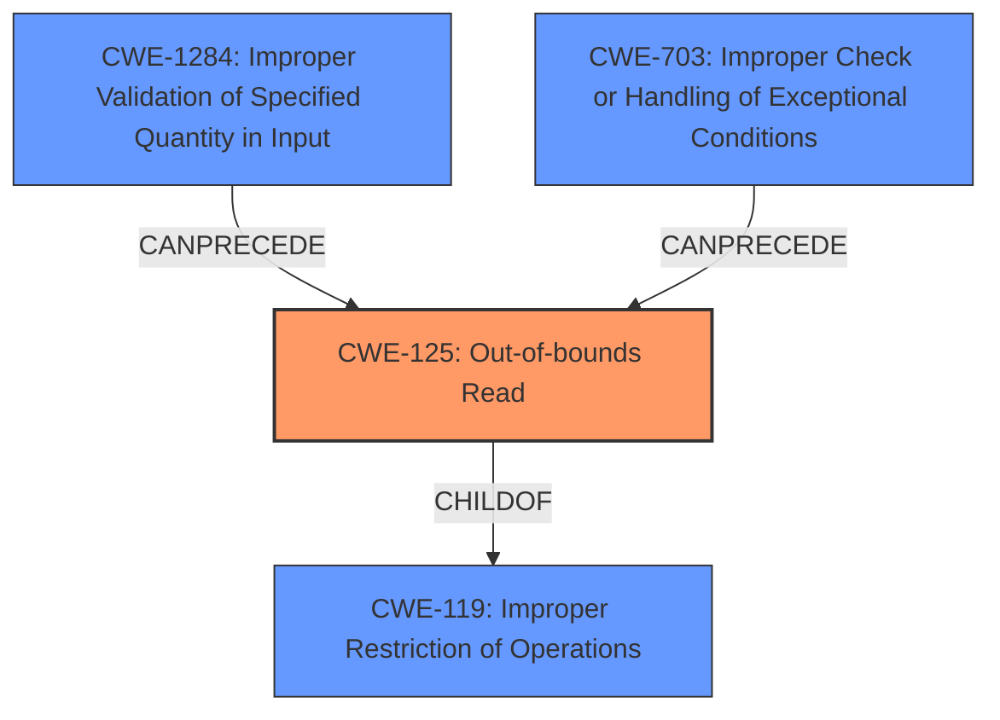

# Raw Analyzer Response for CVE-2020-24826

# Summary
| CWE ID | CWE Name | Confidence | CWE Abstraction Level | CWE Vulnerability Mapping Label | CWE-Vulnerability Mapping Notes |
|---|---|---|---|---|---|
| CWE-125 | Out-of-bounds Read | 0.9 | Base | Allowed | Primary CWE. The vulnerability is caused by reading data past the end of a buffer. |
| CWE-1284 | Improper Validation of Specified Quantity in Input | 0.7 | Base | Allowed | Secondary CWE. The vulnerability is caused by not properly validating input before reading data past the end of a buffer. |
| CWE-703 | Improper Check or Handling of Exceptional Conditions | 0.6 | Base | Allowed | Secondary CWE. The vulnerability is caused by not properly handling exceptional conditions, leading to a denial of service. |

## Evidence and Confidence

*   **Confidence Score:** 0.8
*   **Evidence Strength:** HIGH

## Relationship Analysis
The primary CWE, CWE-125 (Out-of-bounds Read), is a child of CWE-119 (Improper Restriction of Operations within the Bounds of a Memory Buffer), indicating that it is a more specific type of buffer access issue. CWE-1284 (Improper Validation of Specified Quantity in Input) can precede CWE-125 because improper input validation can lead to out-of-bounds reads.

## Vulnerability Chain
The vulnerability chain starts with the **lack of input sanitization**, leading to an **invalid memory access** (out-of-bounds read), and ultimately resulting in a **denial of service**.

## Summary of Analysis
The analysis is based on the provided vulnerability description and the CVE reference links content summary. The evidence clearly indicates an out-of-bounds read due to a **lack of input sanitization**, which causes a segmentation fault and leads to a denial of service.

>   "The issue is an invalid read due to accessing a memory address (0x14) that is not valid, leading to a segmentation fault. The function `as_strtab` is attempting to access data at an invalid offset."

>   "**Lack of input sanitization:** It appears the code is not properly sanitizing or validating the input data before using it to index the string table. This allows an attacker to supply an invalid index that results in the out of bounds access."

The graph relationships influenced the decision by confirming that CWE-125 is a specific type of CWE-119, making it a more appropriate choice.

The selected CWEs are at the optimal level of specificity because CWE-125 directly describes the root cause of the vulnerability (out-of-bounds read), while CWE-1284 describes the reason the vulnerability is occurring (improper input validation), and CWE-703 represents how the exceptional condition is handled (leading to a denial of service).

Relevant CWE Information:

# Enhanced Context (25 CWEs)
The following CWEs were identified as potentially relevant to this vulnerability:

## CWE-131: Incorrect Calculation of Buffer Size
**Abstraction Level**: Base
**Similarity Score**: 0.77
**Source**: dense

**Description**:
The product does not correctly calculate the size to be used when allocating a buffer, which could lead to a buffer overflow.

**Mapping Guidance**:
- Usage: Allowed
- Rationale: This CWE entry is at the Base level of abstraction, which is a preferred level of abstraction for mapping to the root causes of vulnerabilities.

*   **Not Selected:** While buffer size calculation might be related, the primary issue is reading beyond the buffer, not the size calculation itself.

## CWE-125: Out-of-bounds Read
**Abstraction Level**: Base
**Similarity Score**: 0.77
**Source**: dense

**Description**:
The product reads data past the end, or before the beginning, of the intended buffer.

**Mapping Guidance**:
- Usage: Allowed
- Rationale: This CWE entry is at the Base level of abstraction, which is a preferred level of abstraction for mapping to the root causes of vulnerabilities.

*   **Selected:** This is the primary weakness, as the vulnerability involves reading data beyond the intended buffer.

## CWE-191: Integer Underflow (Wrap or Wraparound)
**Abstraction Level**: Base
**Similarity Score**: 0.77
**Source**: dense

**Description**:
The product subtracts one value from another, such that the result is less than the minimum allowable integer value, which produces a value that is not equal to the correct result.

**Mapping Guidance**:
- Usage: Allowed
- Rationale: This CWE entry is at the Base level of abstraction, which is a preferred level of abstraction for mapping to the root causes of vulnerabilities.

*   **Not Selected:** Integer underflow is not the root cause of this vulnerability.

## CWE-1325: Improperly Controlled Sequential Memory Allocation
**Abstraction Level**: Base
**Similarity Score**: 0.76
**Source**: dense

**Description**:
The product manages a group of objects or resources and performs a separate memory allocation for each object, but it does not properly limit the total amount of memory that is consumed by all of the combined objects.

**Mapping Guidance**:
- Usage: Allowed
- Rationale: This CWE entry is at the Base level of abstraction, which is a preferred level of abstraction for mapping to the root causes of vulnerabilities.

*   **Not Selected:** This is not related to the vulnerability description.

## CWE-126: Buffer Over-read
**Abstraction Level**: Variant
**Similarity Score**: 0.76
**Source**: dense

**Description**:
The product reads from a buffer using buffer access mechanisms such as indexes or pointers that reference memory locations after the targeted buffer.

**Mapping Guidance**:
- Usage: Allowed
- Rationale: This CWE entry is at the Variant level of abstraction, which is a preferred level of abstraction for mapping to the root causes of vulnerabilities.

*   **Not Selected:** While similar to CWE-125, CWE-125 is more general and accurate for this case.

## CWE-789: Memory Allocation with Excessive Size Value
**Abstraction Level**: Variant
**Similarity Score**: 0.76
**Source**: dense

**Description**:
The product allocates memory based on an untrusted, large size value, but it does not ensure that the size is within expected limits, allowing arbitrary amounts of memory to be allocated.

**Mapping Guidance**:
- Usage: Allowed
- Rationale: This CWE entry is at the Variant level of abstraction, which is a preferred level of abstraction for mapping to the root causes of vulnerabilities.

*   **Not Selected:** This is not related to the vulnerability description.

## CWE-193: Off-by-one Error
**Abstraction Level**: Base
**Similarity Score**: 0.76
**Source**: dense

**Description**:
A product calculates or uses an incorrect maximum or minimum value that is 1 more, or 1 less, than the correct value.

**Mapping Guidance**:
- Usage: Allowed
- Rationale: This CWE entry is at the Base level of abstraction, which is a preferred level of abstraction for mapping to the root causes of vulnerabilities.

*   **Not Selected:** While an off-by-one error *could* contribute, the primary issue is not related to an off-by-one error.

## CWE-667: Improper Locking
**Abstraction Level**: Class
**Similarity Score**: 0.76
**Source**: dense

**Description**:
The product does not properly acquire or release a lock on a resource, leading to unexpected resource state changes and behaviors.

**Mapping Guidance**:
- Usage: Allowed-with-Review
- Rationale: This CWE entry is a Class and might have Base-level children that would be more appropriate

*   **Not Selected:** This is not related to the vulnerability description.

## CWE-824: Access of Uninitialized Pointer
**Abstraction Level**: Base
**Similarity Score**: 0.75
**Source**: dense

**Description**:
The product accesses or uses a pointer that has not been initialized.

**Mapping Guidance**:
- Usage: Allowed
- Rationale: This CWE entry is at the Base level of abstraction, which is a preferred level of abstraction for mapping to the root causes of vulnerabilities.

*   **Not Selected:** The vulnerability is not due to an uninitialized pointer