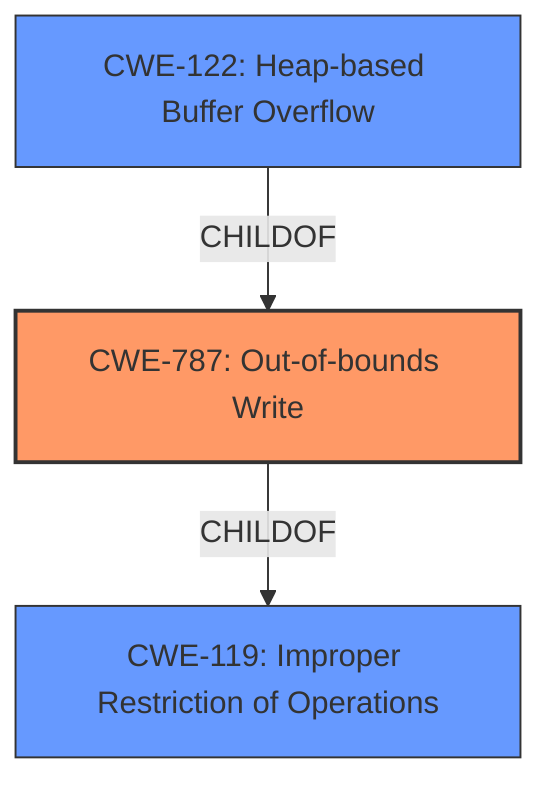

# Analysis for CVE-2020-24829

# Summary
| CWE ID | CWE Name | Confidence | CWE Abstraction Level | CWE Vulnerability Mapping Label | CWE-Vulnerability Mapping Notes |
|---|---|---|---|---|---|
| CWE-787 | Out-of-bounds Write | 1.0 | Base | Allowed | Primary CWE. The vulnerability description explicitly mentions a heap-based buffer overflow, which is a specific type of out-of-bounds write. |
| CWE-122 | Heap-based Buffer Overflow | 0.8 | Variant | Allowed | Secondary CWE. This is a more specific type of out-of-bounds write, but the description already captures the essence of the vulnerability. |
| CWE-119 | Improper Restriction of Operations within the Bounds of a Memory Buffer | 0.6 | Class | Discouraged | Secondary CWE. This is a broader category that includes out-of-bounds writes, but is less specific than CWE-787. |

## Evidence and Confidence

*   **Confidence Score:** 0.9
*   **Evidence Strength:** HIGH

## Relationship Analysis
The primary CWE is CWE-787 (Out-of-bounds Write), which is a parent of CWE-122 (Heap-based Buffer Overflow). CWE-119 (Improper Restriction of Operations within the Bounds of a Memory Buffer) is a more general class of weakness that encompasses both CWE-787 and other buffer-related vulnerabilities. Choosing CWE-787 offers a balance between specificity and accuracy based on the available evidence.

## Vulnerability Chain
The vulnerability chain starts with a malformed MP4 file being processed by GPAC. This leads to a **heap-based buffer overflow** (CWE-787) in the `gf_m2ts_section_complete` function, resulting in a denial of service (DOS).

## Summary of Analysis
The initial analysis identified CWE-787 as the primary weakness due to the explicit mention of a **heap-based buffer overflow** in the vulnerability description. The **CVE Reference Links Content Summary** further confirms this by stating that the root cause is a **heap-buffer-overflow** in the `gf_m2ts_section_complete` function. The overflow occurs due to an out-of-bounds write at `media_tools/mpegts.c:1471`.

The choice of CWE-787 is based on the following evidence:

*   **Vulnerability Description:** "An issue was discovered in GPAC v0.8.0, as demonstrated by MP4Box. It contains a **heap-based buffer overflow** in gf_m2ts_section_complete in media_tools/mpegts.c that can cause a denial of service (DOS) via a crafted MP4 file."
*   **CVE Reference Links Content Summary:** "The root cause is a **heap-buffer-overflow** in the `gf_m2ts_section_complete` function within the `media_tools/mpegts.c` file of the GPAC project."
*   **CVE Reference Links Content Summary:** "Specifically, the overflow occurs due to an out-of-bounds read access at `media_tools/mpegts.c:1471` inside the `gf_m2ts_section_complete` function, which is triggered during the processing of an incomplete or malformed MPEG-TS section."

CWE-122 (Heap-based Buffer Overflow) was considered as a more specific alternative. However, since CWE-787 accurately captures the **out-of-bounds write** condition, it was chosen as the primary CWE. CWE-122 is included as a secondary CWE to provide additional context.

CWE-119 (Improper Restriction of Operations within the Bounds of a Memory Buffer) was also considered, but it is a more general category. While it is technically correct, it does not provide the same level of specificity as CWE-787. The MITRE mapping guidance discourages the use of CWE-119 when lower-level CWEs are available.

Other CWEs considered but not used:

*   CWE-190 (Integer Overflow or Wraparound): While integer overflows can sometimes lead to buffer overflows, there is no evidence of an integer overflow in this vulnerability description.
*   CWE-125 (Out-of-bounds Read): While the CVE summary mentions "out-of-bounds read access," the core issue is a **write** beyond buffer boundaries, making CWE-787 more appropriate.
*   CWE-193 (Off-by-one Error): There is no evidence of an off-by-one error in the vulnerability description.

The selection of CWE-787 is at the optimal level of specificity because it directly addresses the root cause of the vulnerability: a **heap-based buffer overflow** caused by an **out-of-bounds write**.