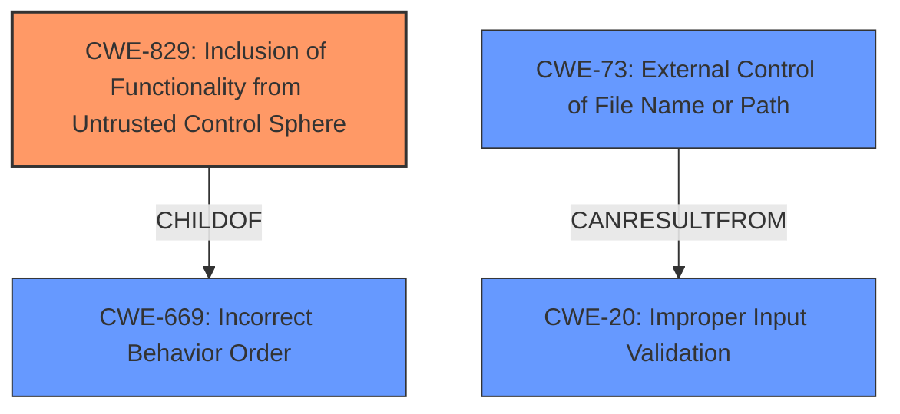

# Raw Analyzer Response for CVE-2020-24985

# Summary
| CWE ID | CWE Name | Confidence | CWE Abstraction Level | CWE Vulnerability Mapping Label | CWE-Vulnerability Mapping Notes |
|---|---|---|---|---|---|
| CWE-829 | Inclusion of Functionality from Untrusted Control Sphere | 0.9 | Base | Allowed | Primary CWE |
| CWE-20 | Improper Input Validation | 0.6 | Class | Discouraged | Secondary CWE |
| CWE-73 | External Control of File Name or Path | 0.5 | Base | Allowed | Secondary CWE |

## Evidence and Confidence

*   **Confidence Score:** 0.7
*   **Evidence Strength:** MEDIUM

## Relationship Analysis
The primary CWE selected, CWE-829, has a ChildOf relationship to CWE-669 (Incorrect Behavior Order). CWE-20 (Improper Input Validation) and CWE-73 (External Control of File Name or Path) are related because **improper input validation** can lead to external control of file names. These relationships highlight a potential chain where **missing or improper validation** allows for the inclusion of untrusted functionality, leading to arbitrary code execution. The abstraction levels are chosen to be as specific as possible, with CWE-829 at the Base level and CWE-20 at the Class level (due to its broad nature).

## Vulnerability Chain
The vulnerability chain starts with the **lack of proper input validation (CWE-20)**, which allows an authenticated user to **modify the `frmsrc` parameter (CWE-73)**. This then leads to the **inclusion of functionality from an untrusted control sphere (CWE-829)**, allowing the execution of external files or payloads.

## Summary of Analysis
Initially, the analysis focused on identifying the root cause of the vulnerability, which appears to be the ability to include and execute external files due to the **manipulation of the `frmsrc` parameter**. The description states that "An authenticated user is able to navigate to the MenuPage section of the application, and **change the frmsrc parameter value to retrieve and execute external files or payloads**." This led to the selection of CWE-829 (Inclusion of Functionality from Untrusted Control Sphere) as the primary CWE because the **frmsrc parameter**, which dictates which functionality to include, is being controlled by an untrusted actor (the user).

The Retriever Results also suggested CWE-20 (Improper Input Validation) and CWE-73 (External Control of File Name or Path). These were considered as contributing factors. The **lack of proper input validation** on the `frmsrc` parameter enables the user to control the included functionality, making CWE-20 a relevant, though secondary, concern. CWE-73 is applicable because the **`frmsrc` parameter** directly controls the file that is included, but the primary issue is the inclusion of untrusted functionality, making it a secondary concern.

The final decision was based on the evidence available in the vulnerability description, the retriever results, and the CWE specifications. The selected CWEs are at the optimal level of specificity because they accurately represent the root cause and contributing factors of the vulnerability.

Relevant CWE Information:

# Enhanced Context (25 CWEs)
The following CWEs were identified as potentially relevant to this vulnerability:

## CWE-611: Improper Restriction of XML External Entity Reference
**Abstraction Level**: Base
**Similarity Score**: 0.79
**Source**: dense

**Description**:
The product processes an XML document that can contain XML entities with URIs that resolve to documents outside of the intended sphere of control, causing the product to embed incorrect documents into its output.

**Mapping Guidance**:
- Usage: Allowed
- Rationale: This CWE entry is at the Base level of abstraction, which is a preferred level of abstraction for mapping to the root causes of vulnerabilities.

## CWE-41: Improper Resolution of Path Equivalence
**Abstraction Level**: Base
**Similarity Score**: 0.77
**Source**: dense

**Description**:
The product is vulnerable to file system contents disclosure through path equivalence. Path equivalence involves the use of special characters in file and directory names. The associated manipulations are intended to generate multiple names for the same object.

**Mapping Guidance**:
- Usage: Allowed
- Rationale: This CWE entry is at the Base level of abstraction, which is a preferred level of abstraction for mapping to the root causes of vulnerabilities.

## CWE-23: Relative Path Traversal
**Abstraction Level**: Base
**Similarity Score**: 0.77
**Source**: dense

**Description**:
The product uses external input to construct a pathname that should be within a restricted directory, but it does not properly neutralize sequences such as ".." that can resolve to a location that is outside of that directory.

**Mapping Guidance**:
- Usage: Allowed
- Rationale: This CWE entry is at the Base level of abstraction, which is a preferred level of abstraction for mapping to the root causes of vulnerabilities.

## CWE-610: Externally Controlled Reference to a Resource in Another Sphere
**Abstraction Level**: Class
**Similarity Score**: 0.77
**Source**: dense

**Description**:
The product uses an externally controlled name or reference that resolves to a resource that is outside of the intended control sphere.

**Mapping Guidance**:
- Usage: Discouraged
- Rationale: This CWE entry is a level-1 Class (i.e., a child of a Pillar). It might have lower-level children that would be more appropriate

## CWE-668: Exposure of Resource to Wrong Sphere
**Abstraction Level**: Class
**Similarity Score**: 0.76
**Source**: dense

**Description**:
The product exposes a resource to the wrong control sphere, providing unintended actors with inappropriate access to the resource.

**Mapping Guidance**:
- Usage: Discouraged
- Rationale: CWE-668 is high-level and is often misused as a catch-all when lower-level CWE IDs might be applicable. It is sometimes used for low-information vulnerability reports [REF-1287]. It is a level-1 Class (i.e., a child of a Pillar). It is not useful for trend analysis.

## CWE-73: External Control of File Name or Path
**Abstraction Level**: Base
**Similarity Score**: 0.76
**Source**: dense

**Description**:
The product allows user input to control or influence paths or file names that are used in filesystem operations.

**Mapping Guidance**:
- Usage: Allowed
- Rationale: This CWE entry is at the Base level of abstraction, which is a preferred level of abstraction for mapping to the root causes of vulnerabilities.

## CWE-552: Files or Directories Accessible to External Parties
**Abstraction Level**: Base
**Similarity Score**: 0.76
**Source**: dense

**Description**:
The product makes files or directories accessible to unauthorized actors, even though they should not be.

**Mapping Guidance**:
- Usage: Allowed
- Rationale: This CWE entry is at the Base level of abstraction, which is a preferred level of abstraction for mapping to the root causes of vulnerabilities.

## CWE-74: Improper Neutralization of Special Elements in Output Used by a Downstream Component ('Injection')
**Abstraction Level**: Class
**Similarity Score**: 0.76
**Source**: dense

**Description**:
The product constructs all or part of a command, data structure, or record using externally-influenced input from an upstream component, but it does not neutralize or incorrectly neutralizes special elements that could modify how it is parsed or interpreted when it is sent to a downstream component.

**Mapping Guidance**:
- Usage: Discouraged
- Rationale: CWE-74 is high-level and often misused when lower-level weaknesses are more appropriate.

## CWE-807: Reliance on Untrusted Inputs in a Security Decision
**Abstraction Level**: Base
**Similarity Score**: 0.76
**Source**: dense

**Description**:
The product uses a protection mechanism that relies on the existence or values of an input, but the input can be modified by an untrusted actor in a way that bypasses the protection mechanism.

**Mapping Guidance**:
- Usage: Allowed
- Rationale: This CWE entry is at the Base level of abstraction, which is a preferred level of abstraction for mapping to the root causes of vulnerabilities.

## CWE-184: Incomplete List of Disallowed Inputs
**Abstraction Level**: Base
**Similarity Score**: 0.76
**Source**: dense

**Description**:
The product implements a protection mechanism that relies on a list of inputs (or properties of inputs) that are