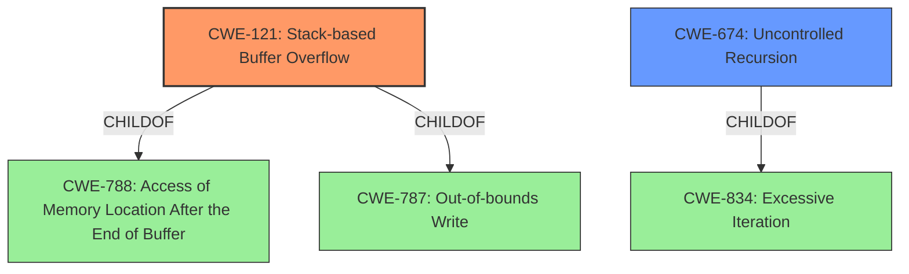

# Analysis Report for CVE-2020-24994

# Vulnerability Analysis Report: CVE-2020-24994

## Description


## Analysis (with Relationship Data)

# Summary
| CWE ID | CWE Name | Confidence | CWE Abstraction Level | CWE Vulnerability Mapping Label | CWE-Vulnerability Mapping Notes |
|---|---|---|---|---|---|
| CWE-121 | Stack-based Buffer Overflow | 1.0 | Variant | Allowed | Primary CWE |
| CWE-674 | Uncontrolled Recursion | 0.7 | Class | Allowed-with-Review | Secondary Candidate |

## Evidence and Confidence

*   **Confidence Score:** 0.9
*   **Evidence Strength:** HIGH

## Relationship Analysis
The primary relationship influencing the decision is the child-of relationship, where CWE-121 is a specific type of buffer overflow that occurs on the stack, making it more descriptive than its parent CWE-787 (which is a broader category). CWE-674 is a related but distinct weakness. It describes uncontrolled recursion, which can lead to stack exhaustion, a condition that can manifest as a stack overflow. The can-precede relationship between CWE-674 and other CWEs (like CWE-119) suggests that uncontrolled recursion might set the stage for other vulnerabilities. The abstraction levels guided the selection, favoring the variant (CWE-121) for precision when the evidence supported it, and a Class (CWE-674) to identify a related but distinct weakness.



## Vulnerability Chain
The vulnerability chain starts with a **crafted file** containing deeply nested `\t()` tags. This leads to **Uncontrolled Recursion (CWE-674)** within the `parse_tag` function. The excessive recursion consumes stack memory, ultimately resulting in a **Stack-based Buffer Overflow (CWE-121)**, causing a denial of service or potentially remote code execution.

## Summary of Analysis
The initial assessment focused on the **stack overflow** reported in the vulnerability description. The primary CWE, CWE-121, accurately captures the nature of the vulnerability as a stack-based buffer overflow. The evidence for this comes from the "Vulnerability Description Key Phrases" which identifies a "**stack overflow**" and the "CVE Reference Links Content Summary" which describes the overflow occurring due to deeply nested tags in the `parse_tag` function.

The retriever results strongly support CWE-121. The provided evidence explicitly states that the **weakness** is a "**Stack overflow**" in the parse_tag function, and the crafted file allows remote attackers to cause a denial of service or remote code execution.

CWE-674 was also considered because the root cause involved deeply nested tags causing excessive recursion. The recursive calls within `parse_tag` lead to stack exhaustion, which then manifests as the stack overflow.

The graph relationships reinforce this understanding. CWE-121 is a child of CWE-787 ("Out-of-bounds Write") and CWE-788 ("Access of Memory Location After the End of Buffer"), indicating a more specific type of out-of-bounds write occurring on the stack. CWE-674 is a child of CWE-834 ("Excessive Iteration"), suggesting that the uncontrolled recursion is a form of excessive iteration.

The selected CWEs are at the optimal level of specificity because they accurately describe the technical details of the vulnerability. CWE-121 precisely identifies the stack-based nature of the buffer overflow, while CWE-674 highlights the uncontrolled recursion as a contributing factor.

Relevant CWE Information:

# Enhanced Context (25 CWEs)

## CWE-191: Integer Underflow (Wrap or Wraparound)
**Abstraction Level**: Base
**Similarity Score**: 0.78
**Source**: dense

**Description**:
The product subtracts one value from another, such that the result is less than the minimum allowable integer value, which produces a value that is not equal to the correct result.

**Mapping Guidance**:
- Usage: Allowed
- Rationale: This CWE entry is at the Base level of abstraction, which is a preferred level of abstraction for mapping to the root causes of vulnerabilities.

## CWE-131: Incorrect Calculation of Buffer Size
**Abstraction Level**: Base
**Similarity Score**: 0.77
**Source**: dense

**Description**:
The product does not correctly calculate the size to be used when allocating a buffer, which could lead to a buffer overflow.

**Mapping Guidance**:
- Usage: Allowed
- Rationale: This CWE entry is at the Base level of abstraction, which is a preferred level of abstraction for mapping to the root causes of vulnerabilities.

## CWE-193: Off-by-one Error
**Abstraction Level**: Base
**Similarity Score**: 0.77
**Source**: dense

**Description**:
A product calculates or uses an incorrect maximum or minimum value that is 1 more, or 1 less, than the correct value.

**Mapping Guidance**:
- Usage: Allowed
- Rationale: This CWE entry is at the Base level of abstraction, which is a preferred level of abstraction for mapping to the root causes of vulnerabilities.

## CWE-805: Buffer Access with Incorrect Length Value
**Abstraction Level**: Base
**Similarity Score**: 0.76
**Source**: dense

**Description**:
The product uses a sequential operation to read or write a buffer, but it uses an incorrect length value that causes it to access memory that is outside of the bounds of the buffer.

**Mapping Guidance**:
- Usage: Allowed
- Rationale: This CWE entry is at the Base level of abstraction, which is a preferred level of abstraction for mapping to the root causes of vulnerabilities.

## CWE-197: Numeric Truncation Error
**Abstraction Level**: Base
**Similarity Score**: 0.75
**Source**: dense

**Description**:
Truncation errors occur when a primitive is cast to a primitive of a smaller size and data is lost in the conversion.

**Mapping Guidance**:
- Usage: Allowed
- Rationale: This CWE entry is at the Base level of abstraction, which is a preferred level of abstraction for mapping to the root causes of vulnerabilities.

## CWE-125: Out-of-bounds Read
**Abstraction Level**: Base
**Similarity Score**: 0.75
**Source**: dense

**Description**:
The product reads data past the end, or before the beginning, of the intended buffer.

**Mapping Guidance**:
- Usage: Allowed
- Rationale: This CWE entry is at the Base level of abstraction, which is a preferred level of abstraction for mapping to the root causes of vulnerabilities.

## CWE-124: Buffer Underwrite ('Buffer Underflow')
**Abstraction Level**: Base
**Similarity Score**: 0.75
**Source**: dense

**Description**:
The product writes to a buffer using an index or pointer that references a memory location prior to the beginning of the buffer.

**Mapping Guidance**:
- Usage: Allowed
- Rationale: This CWE entry is at the Base level of abstraction, which is a preferred level of abstraction for mapping to the root causes of vulnerabilities.

## CWE-126: Buffer Over-read
**Abstraction Level**: Variant
**Similarity Score**: 0.75
**Source**: dense

**Description**:
The product reads from a buffer using buffer access mechanisms such as indexes or pointers that reference memory locations after the targeted buffer.

**Mapping Guidance**:
- Usage: Allowed
- Rationale: This CWE entry is at the Variant level of abstraction, which is a preferred level of abstraction for mapping to the root causes of vulnerabilities.

## CWE-681: Incorrect Conversion between Numeric Types
**Abstraction Level**: Base
**Similarity Score**: 0.74
**Source**: dense

**Description**:
When converting from one data type to another, such as long to integer, data can be omitted or translated in a way that produces unexpected values. If the resulting values are used in a sensitive context, then dangerous behaviors may occur.

**Mapping Guidance**:
- Usage: Allowed
- Rationale: This CWE entry is at the Base level of abstraction, which is a preferred level of abstraction for mapping to the root causes of vulnerabilities.

## CWE-1325: Improperly Controlled Sequential Memory Allocation
**Abstraction Level**: Base
**Similarity Score**: 0.74
**Source**: dense

**Description**:
The product manages a group of objects or resources


## CWE Relationship Analysis

Current CWEs represent these abstraction levels: .


### Vulnerability Chain Analysis

**Chain starting from CWE-121:**
- 121 (Stack-based Buffer Overflow) - ROOT


**Chain starting from CWE-787:**
- 787 (Out-of-bounds Write) - ROOT


### CWE Relationship Diagram

```mermaid
graph TD
    classDef primary fill:#f96,stroke:#333,stroke-width:2px
    classDef secondary fill:#69f,stroke:#333
    classDef tertiary fill:#9e9,stroke:#333
```


*Report generated on 2025-04-02 07:29:45*
