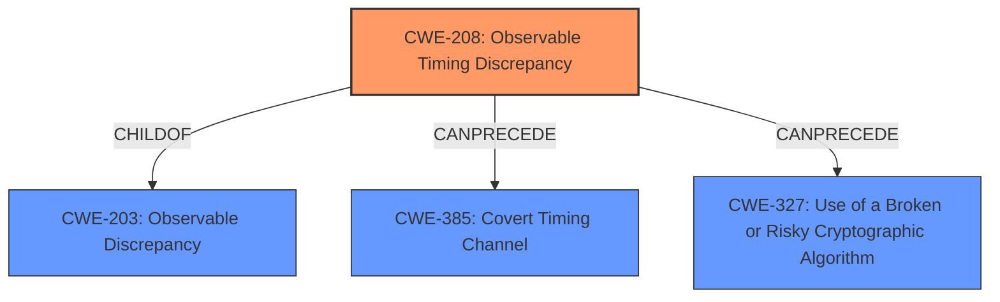

# Raw Analyzer Response for CVE-2020-25082

# Summary
| CWE ID | CWE Name | Confidence | CWE Abstraction Level | CWE Vulnerability Mapping Label | CWE-Vulnerability Mapping Notes |
|---|---|---|---|---|---|
| CWE-208 | Observable Timing Discrepancy | 1.0 | Base | Allowed | Primary CWE |

## Evidence and Confidence

*   **Confidence Score:** 1.0
*   **Evidence Strength:** HIGH

## Relationship Analysis
The primary CWE is CWE-208, which is a base-level CWE. It is a child of CWE-203 (Observable Discrepancy), indicating that timing discrepancies are a specific type of observable discrepancy. The relationships indicate that CWE-208 can precede CWE-385 (Covert Timing Channel) and CWE-327 (Use of a Broken or Risky Cryptographic Algorithm). The abstraction level influenced the selection as it is at the base level.

## Vulnerability Chain
The vulnerability chain starts with the **Observable Timing Discrepancy** (CWE-208) in the implementation of ECC. This allows for a side-channel attack. The impact of this is the ability to extract the ECC private key, leading to information disclosure.

## Summary of Analysis
The initial analysis identified the **Observable Timing Discrepancy** as the root cause, which aligns with the vulnerability description. The evidence directly supports CWE-208 as the primary weakness. The relationship graph highlights the connections between timing discrepancies and other potential vulnerabilities. The selection of CWE-208 is at the optimal level of specificity because it precisely describes the timing-related nature of the side-channel vulnerability.

The primary basis of this assessment is the vulnerability description and the "CVE Reference Links Content Summary", quoting from it:
*   Vulnerability Description Key Phrases:
    *   **rootcause:** **Observable Timing Discrepancy**
*   CVE Reference Links Content Summary:
    *   **Root Cause:**
        *   Observable timing discrepancy in the implementation of Elliptic Curve Cryptography (ECC) algorithms.
    *   **Weaknesses/Vulnerabilities:**
        *   The vulnerability is a side-channel attack due to a timing discrepancy in the execution of ECC operations.

Relevant CWE Information:

*   **CWE-208: Observable Timing Discrepancy**
    *   Two separate operations in a product require different amounts of time to complete, in a way that is observable to an actor and reveals security-relevant information about the state of the product, such as whether a particular operation was successful or not.
    *   Usage: Allowed
    *   Rationale: This CWE entry is at the Base level of abstraction, which is a preferred level of abstraction for mapping to the root causes of vulnerabilities.

Other CWEs Considered and Rejected:

*   CWE-203: Observable Discrepancy - While this is a parent of CWE-208, CWE-208 is more specific about the timing aspect, which is the core of this vulnerability.
*   CWE-1300: Improper Protection of Physical Side Channels - While a side-channel attack is the vector, the root cause is the timing discrepancy.
*   CWE-259: Use of Hard-coded Password - This is not relevant as the vulnerability involves timing discrepancies in cryptographic operations, not hard-coded credentials.
*   CWE-327: Use of a Broken or Risky Cryptographic Algorithm - While ECC is used, the vulnerability is not about the algorithm itself being broken, but the timing discrepancy in its implementation.
*   CWE-325: Missing Cryptographic Step - The vulnerability is due to timing differences not a missing step.