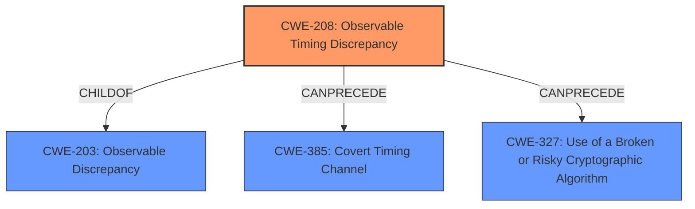

# Analysis for CVE-2020-25082

# Summary
| CWE ID | CWE Name | Confidence | CWE Abstraction Level | CWE Vulnerability Mapping Label | CWE-Vulnerability Mapping Notes |
|---|---|---|---|---|---|
| CWE-208 | Observable Timing Discrepancy | 1.0 | Base | Allowed | Primary CWE |

## Evidence and Confidence

*   **Confidence Score:** 1.0
*   **Evidence Strength:** HIGH

## Relationship Analysis
The primary CWE is CWE-208, which is a base-level CWE. It is a child of CWE-203 (Observable Discrepancy), indicating that timing discrepancies are a specific type of observable discrepancy. The relationships indicate that CWE-208 can precede CWE-385 (Covert Timing Channel) and CWE-327 (Use of a Broken or Risky Cryptographic Algorithm). The abstraction level influenced the selection as it is at the base level.



## Vulnerability Chain
The vulnerability chain starts with the **Observable Timing Discrepancy** (CWE-208) in the implementation of ECC. This allows for a side-channel attack. The impact of this is the ability to extract the ECC private key, leading to information disclosure.

## Summary of Analysis
The initial analysis identified the **Observable Timing Discrepancy** as the root cause, which aligns with the vulnerability description. The evidence directly supports CWE-208 as the primary weakness. The relationship graph highlights the connections between timing discrepancies and other potential vulnerabilities. The selection of CWE-208 is at the optimal level of specificity because it precisely describes the timing-related nature of the side-channel vulnerability.

The primary basis of this assessment is the vulnerability description and the "CVE Reference Links Content Summary", quoting from it:
*   Vulnerability Description Key Phrases:
    *   **rootcause:** **Observable Timing Discrepancy**
*   CVE Reference Links Content Summary:
    *   **Root Cause:**
        *   Observable timing discrepancy in the implementation of Elliptic Curve Cryptography (ECC) algorithms.
    *   **Weaknesses/Vulnerabilities:**
        *   The vulnerability is a side-channel attack due to a timing discrepancy in the execution of ECC operations.

Relevant CWE Information:

*   **CWE-208: Observable Timing Discrepancy**
    *   Two separate operations in a product require different amounts of time to complete, in a way that is observable to an actor and reveals security-relevant information about the state of the product, such as whether a particular operation was successful or not.
    *   Usage: Allowed
    *   Rationale: This CWE entry is at the Base level of abstraction, which is a preferred level of abstraction for mapping to the root causes of vulnerabilities.

Other CWEs Considered and Rejected:

*   CWE-203: Observable Discrepancy - While this is a parent of CWE-208, CWE-208 is more specific about the timing aspect, which is the core of this vulnerability.
*   CWE-1300: Improper Protection of Physical Side Channels - While a side-channel attack is the vector, the root cause is the timing discrepancy.
*   CWE-259: Use of Hard-coded Password - This is not relevant as the vulnerability involves timing discrepancies in cryptographic operations, not hard-coded credentials.
*   CWE-327: Use of a Broken or Risky Cryptographic Algorithm - While ECC is used, the vulnerability is not about the algorithm itself being broken, but the timing discrepancy in its implementation.
*   CWE-325: Missing Cryptographic Step - The vulnerability is due to timing differences not a missing step.

# Enhanced Query for CVE-2020-25082

## Vulnerability Description
An attacker with physical access to Nuvoton Trusted Platform Module (NPCT75x 7.2.x before 7.2.2.0) could extract an Elliptic Curve Cryptography (ECC) private key via a side-channel attack against ECDSA, because of an **Observable Timing Discrepancy**.

### Vulnerability Description Key Phrases
- **rootcause:** **Observable Timing Discrepancy**
- **impact:** extract an Elliptic Curve Cryptography (ECC) private key
- **vector:** side-channel attack
- **attacker:** attacker with physical access
- **product:** Nuvoton Trusted Platform Module
- **version:** NPCT75x 7.2.x before 7.2.2.0

## CVE Reference Links Content Summary
Based on the provided content, here's a breakdown of the vulnerability:

**Root Cause:**
- Observable timing discrepancy in the implementation of Elliptic Curve Cryptography (ECC) algorithms.

**Weaknesses/Vulnerabilities:**
- The vulnerability is a side-channel attack due to a timing discrepancy in the execution of ECC operations.
- The vulnerable algorithms include Elliptic Curve Digital Signature Algorithm (ECDSA), Elliptic Curve Schnorr (EC SCHNORR) and Elliptic Curve Direct Anonymous Attestation (ECDAA).

**Impact of Exploitation:**
- Information Disclosure: An attacker can potentially extract the ECC private key from the affected device.

**Attack Vectors:**
- Physical access to the Nuvoton Trusted Platform Module NPCT75x (versions 7.2.0.1, 7.2.0.2, and 7.2.1.0).

**Required Attacker Capabilities/Position:**
- Physical presence to carry out the side-channel attack.
- Ability to observe and measure timing differences during cryptographic operations on the device.

**Additional Notes:**
- The vulnerability is identified as CVE-2020-25082.
- The affected product is Nuvoton's NPCT75x Trusted Platform Module with firmware versions 7.2.0.1, 7.2.0.2 and 7.2.1.0.
- A fixed firmware version 7.2.2.0 addresses the issue.
- The severity is rated as medium.
- This advisory is linked to research presented at http://tpm.fail and researchers from Masaryk University.
- The attack type is categorized as physical.

## Retriever Results

### Top Combined Results

| Rank | CWE ID | Name | Abstraction | Usage  | Retrievers | Individual Scores |
|------|--------|------|-------------|-------|------------|-------------------|
| 1 | 203 | Observable Discrepancy | Base | Allowed | sparse | 0.410 |
| 2 | 208 | Observable Timing Discrepancy | Base | Allowed | sparse | 0.397 |
| 3 | 204 | Observable Response Discrepancy | Base | Allowed | sparse | 0.228 |
| 4 | 205 | Observable Behavioral Discrepancy | Base | Allowed | sparse | 0.206 |
| 5 | 295 | Improper Certificate Validation | Base | Allowed | sparse | 0.203 |
| 6 | 1300 | Improper Protection of Physical Side Channels | Base | Allowed | dense | 0.603 |
| 7 | 259 | Use of Hard-coded Password | Variant | Allowed | graph | 0.002 |
| 8 | 1256 | Improper Restriction of Software Interfaces to Hardware Features | Base | Allowed | sparse | 0.198 |
| 9 | 327 | Use of a Broken or Risky Cryptographic Algorithm | Class | Allowed-with-Review | sparse | 0.185 |
| 10 | 325 | Missing Cryptographic Step | Base | Allowed | sparse | 0.185 |


# Complete CWE Specifications


## CWE-203: Observable Discrepancy
**Abstraction:** Base
**Status:** Incomplete

### Description
The product behaves differently or sends different responses under different circumstances in a way that is observable to an unauthorized actor, which exposes security-relevant information about the state of the product, such as whether a particular operation was successful or not.

### Extended Description
Discrepancies can take many forms, and variations may be detectable in timing, control flow, communications such as replies or requests, or general behavior. These discrepancies can reveal information about the product's operation or internal state to an unauthorized actor. In some cases, discrepancies can be used by attackers to form a side channel.

### Alternative Terms
Side Channel Attack: Observable Discrepancies are at the root of side channel attacks.

### Relationships
ChildOf -> CWE-200
ChildOf -> CWE-200

### Mapping Guidance
**Usage:** Allowed
**Rationale:** This CWE entry is at the Base level of abstraction, which is a preferred level of abstraction for mapping to the root causes of vulnerabilities.
**Comments:** Carefully read both the name and description to ensure that this mapping is an appropriate fit. Do not try to 'force' a mapping to a lower-level Base/Variant simply to comply with this preferred level of abstraction.
**Reasons:**
- Acceptable-Use


### Observed Examples
- **CVE-2020-8695:** Observable discrepancy in the RAPL interface for some Intel processors allows information disclosure.
- **CVE-2019-14353:** Crypto hardware wallet's power consumption relates to total number of pixels illuminated, creating a side channel in the USB connection that allows attackers to determine secrets displayed such as PIN numbers and passwords
- **CVE-2019-10071:** Java-oriented framework compares HMAC signatures using String.equals() instead of a constant-time algorithm, causing timing discrepancies


## CWE-208: Observable Timing Discrepancy
**Abstraction:** Base
**Status:** Incomplete

### Description
Two separate operations in a product require different amounts of time to complete, in a way that is observable to an actor and reveals security-relevant information about the state of the product, such as whether a particular operation was successful or not.

### Extended Description
In security-relevant contexts, even small variations in timing can be exploited by attackers to indirectly infer certain details about the product's internal operations. For example, in some cryptographic algorithms, attackers can use timing differences to infer certain properties about a private key, making the key easier to guess. Timing discrepancies effectively form a timing side channel.

### Alternative Terms
None

### Relationships
ChildOf -> CWE-203
CanPrecede -> CWE-385
CanPrecede -> CWE-327

### Mapping Guidance
**Usage:** Allowed
**Rationale:** This CWE entry is at the Base level of abstraction, which is a preferred level of abstraction for mapping to the root causes of vulnerabilities.
**Comments:** Carefully read both the name and description to ensure that this mapping is an appropriate fit. Do not try to 'force' a mapping to a lower-level Base/Variant simply to comply with this preferred level of abstraction.
**Reasons:**
- Acceptable-Use


### Additional Notes
**[Relationship]** Often primary in cryptographic applications and algorithms.

**[Maintenance]** CWE 4.16 removed a demonstrative example for a hardware module because it was inaccurate and unable to be adapted. The CWE team is developing an alternative.


### Observed Examples
- **CVE-2019-10071:** Java-oriented framework compares HMAC signatures using String.equals() instead of a constant-time algorithm, causing timing discrepancies
- **CVE-2019-10482:** Smartphone OS uses comparison functions that are not in constant time, allowing side channels
- **CVE-2014-0984:** Password-checking function in router terminates validation of a password entry when it encounters the first incorrect character, which allows remote attackers to obtain passwords via a brute-force attack that relies on timing differences in responses to incorrect password guesses, aka a timing side-channel attack.


## CWE-204: Observable Response Discrepancy
**Abstraction:** Base
**Status:** Incomplete

### Description
The product provides different responses to incoming requests in a way that reveals internal state information to an unauthorized actor outside of the intended control sphere.

### Extended Description
This issue frequently occurs during authentication, where a difference in failed-login messages could allow an attacker to determine if the username is valid or not. These exposures can be inadvertent (bug) or intentional (design).

### Alternative Terms
None

### Relationships
ChildOf -> CWE-203

### Mapping Guidance
**Usage:** Allowed
**Rationale:** This CWE entry is at the Base level of abstraction, which is a preferred level of abstraction for mapping to the root causes of vulnerabilities.
**Comments:** Carefully read both the name and description to ensure that this mapping is an appropriate fit. Do not try to 'force' a mapping to a lower-level Base/Variant simply to comply with this preferred level of abstraction.
**Reasons:**
- Acceptable-Use


### Additional Notes
**[Relationship]** can overlap errors related to escalated privileges


### Observed Examples
- **CVE-2002-2094:** This, and others, use ".." attacks and monitor error responses, so there is overlap with directory traversal.
- **CVE-2001-1483:** Enumeration of valid usernames based on inconsistent responses
- **CVE-2001-1528:** Account number enumeration via inconsistent responses.


## CWE-205: Observable Behavioral Discrepancy
**Abstraction:** Base
**Status:** Incomplete

### Description
The product's behaviors indicate important differences that may be observed by unauthorized actors in a way that reveals (1) its internal state or decision process, or (2) differences from other products with equivalent functionality.

### Extended Description
Ideally, a product should provide as little information about its internal operations as possible. Otherwise, attackers could use knowledge of these internal operations to simplify or optimize their attack. In some cases, behavioral discrepancies can be used by attackers to form a side channel.

### Alternative Terms
None

### Relationships
ChildOf -> CWE-203
CanPrecede -> CWE-514

### Mapping Guidance
**Usage:** Allowed
**Rationale:** This CWE entry is at the Base level of abstraction, which is a preferred level of abstraction for mapping to the root causes of vulnerabilities.
**Comments:** Carefully read both the name and description to ensure that this mapping is an appropriate fit. Do not try to 'force' a mapping to a lower-level Base/Variant simply to comply with this preferred level of abstraction.
**Reasons:**
- Acceptable-Use


### Observed Examples
- **CVE-2002-0208:** Product modifies TCP/IP stack and ICMP error messages in unusual ways that show the product is in use.
- **CVE-2004-2252:** Behavioral infoleak by responding to SYN-FIN packets.


## CWE-295: Improper Certificate Validation
**Abstraction:** Base
**Status:** Draft

### Description
The product does not validate, or incorrectly validates, a certificate.

### Extended Description
When a certificate is invalid or malicious, it might allow an attacker to spoof a trusted entity by interfering in the communication path between the host and client. The product might connect to a malicious host while believing it is a trusted host, or the product might be deceived into accepting spoofed data that appears to originate from a trusted host.

### Alternative Terms
None

### Relationships
ChildOf -> CWE-287
ChildOf -> CWE-287
PeerOf -> CWE-322

### Mapping Guidance
**Usage:** Allowed
**Rationale:** This CWE entry is at the Base level of abstraction, which is a preferred level of abstraction for mapping to the root causes of vulnerabilities.
**Comments:** Carefully read both the name and description to ensure that this mapping is an appropriate fit. Do not try to 'force' a mapping to a lower-level Base/Variant simply to comply with this preferred level of abstraction.
**Reasons:**
- Acceptable-Use


### Observed Examples
- **CVE-2019-12496:** A Go framework for robotics, drones, and IoT devices skips verification of root CA certificates by default.
- **CVE-2014-1266:** chain: incorrect "goto" in Apple SSL product bypasses certificate validation, allowing Adversary-in-the-Middle (AITM) attack (Apple "goto fail" bug). CWE-705 (Incorrect Control Flow Scoping) -> CWE-561 (Dead Code) -> CWE-295 (Improper Certificate Validation) -> CWE-393 (Return of Wrong Status Code) -> CWE-300 (Channel Accessible by Non-Endpoint).
- **CVE-2021-22909:** Chain: router's firmware update procedure uses curl with "-k" (insecure) option that disables certificate validation (CWE-295), allowing adversary-in-the-middle (AITM) compromise with a malicious firmware image (CWE-494).


## CWE-1300: Improper Protection of Physical Side Channels
**Abstraction:** Base
**Status:** Stable

### Description
The device does not contain sufficient protection
	mechanisms to prevent physical side channels from exposing
	sensitive information due to patterns in physically observable
	phenomena such as variations in power consumption,
	electromagnetic emissions (EME), or acoustic emissions.

### Extended Description


An adversary could monitor and measure physical phenomena to detect patterns and make inferences, even if it is not possible to extract the information in the digital domain.


Physical side channels have been well-studied for decades in the context of breaking implementations of cryptographic algorithms or other attacks against security features. These side channels may be easily observed by an adversary with physical access to the device, or using a tool that is in close proximity. If the adversary can monitor hardware operation and correlate its data processing with power, EME, and acoustic measurements, the adversary might be able to recover of secret keys and data.


### Alternative Terms
None

### Relationships
ChildOf -> CWE-203
ChildOf -> CWE-203

### Mapping Guidance
**Usage:** Allowed
**Rationale:** This CWE entry is at the Base level of abstraction, which is a preferred level of abstraction for mapping to the root causes of vulnerabilities.
**Comments:** Carefully read both the name and description to ensure that this mapping is an appropriate fit. Do not try to 'force' a mapping to a lower-level Base/Variant simply to comply with this preferred level of abstraction.
**Reasons:**
- Acceptable-Use


### Observed Examples
- **CVE-2022-35888:** Power side-channels leak secret information from processor
- **CVE-2021-3011:** electromagnetic-wave side-channel in security-related microcontrollers allows extraction of private key
- **CVE-2019-14353:** Crypto hardware wallet's power consumption relates to total number of pixels illuminated, creating a side channel in the USB connection that allows attackers to determine secrets displayed such as PIN numbers and passwords


## CWE-259: Use of Hard-coded Password
**Abstraction:** Variant
**Status:** Draft

### Description
The product contains a hard-coded password, which it uses for its own inbound authentication or for outbound communication to external components.

### Extended Description


A hard-coded password typically leads to a significant authentication failure that can be difficult for the system administrator to detect. Once detected, it can be difficult to fix, so the administrator may be forced into disabling the product entirely. There are two main variations:

```
		Inbound: the product contains an authentication mechanism that checks for a hard-coded password.
		Outbound: the product connects to another system or component, and it contains hard-coded password for connecting to that component.
```
In the Inbound variant, a default administration account is created, and a simple password is hard-coded into the product and associated with that account. This hard-coded password is the same for each installation of the product, and it usually cannot be changed or disabled by system administrators without manually modifying the program, or otherwise patching the product. If the password is ever discovered or published (a common occurrence on the Internet), then anybody with knowledge of this password can access the product. Finally, since all installations of the product will have the same password, even across different organizations, this enables massive attacks such as worms to take place.

The Outbound variant applies to front-end systems that authenticate with a back-end service. The back-end service may require a fixed password which can be easily discovered. The programmer may simply hard-code those back-end credentials into the front-end product. Any user of that program may be able to extract the password. Client-side systems with hard-coded passwords pose even more of a threat, since the extraction of a password from a binary is usually very simple.


### Alternative Terms
None

### Relationships
ChildOf -> CWE-798
ChildOf -> CWE-798
ChildOf -> CWE-798
PeerOf -> CWE-321
PeerOf -> CWE-257

### Mapping Guidance
**Usage:** Allowed
**Rationale:** This CWE entry is at the Variant level of abstraction, which is a preferred level of abstraction for mapping to the root causes of vulnerabilities.
**Comments:** Carefully read both the name and description to ensure that this mapping is an appropriate fit. Do not try to 'force' a mapping to a lower-level Base/Variant simply to comply with this preferred level of abstraction.
**Reasons:**
- Acceptable-Use


### Additional Notes
**[Maintenance]** This entry could be split into multiple variants: an inbound variant (as seen in the second demonstrative example) and an outbound variant (as seen in the first demonstrative example). These variants are likely to have different consequences, detectability, etc. More importantly, from a vulnerability theory perspective, they could be characterized as different behaviors.


### Observed Examples
- **CVE-2022-29964:** Distributed Control System (DCS) has hard-coded passwords for local shell access
- **CVE-2021-37555:** Telnet service for IoT feeder for dogs and cats has hard-coded password [REF-1288]
- **CVE-2021-35033:** Firmware for a WiFi router uses a hard-coded password for a BusyBox shell, allowing bypass of authentication through the UART port


## CWE-1256: Improper Restriction of Software Interfaces to Hardware Features
**Abstraction:** Base
**Status:** Stable

### Description
The product provides software-controllable
			device functionality for capabilities such as power and
			clock management, but it does not properly limit
			functionality that can lead to modification of
			hardware memory or register bits, or the ability to
			observe physical side channels.

### Extended Description


It is frequently assumed that physical attacks such as fault injection and side-channel analysis require an attacker to have physical access to the target device. This assumption may be false if the device has improperly secured power management features, or similar features. For mobile devices, minimizing power consumption is critical, but these devices run a wide variety of applications with different performance requirements. Software-controllable mechanisms to dynamically scale device voltage and frequency and monitor power consumption are common features in today's chipsets, but they also enable attackers to mount fault injection and side-channel attacks without having physical access to the device.


Fault injection attacks involve strategic manipulation of bits in a device to achieve a desired effect such as skipping an authentication step, elevating privileges, or altering the output of a cryptographic operation. Manipulation of the device clock and voltage supply is a well-known technique to inject faults and is cheap to implement with physical device access. Poorly protected power management features allow these attacks to be performed from software. Other features, such as the ability to write repeatedly to DRAM at a rapid rate from unprivileged software, can result in bit flips in other memory locations (Rowhammer, [REF-1083]).


Side channel analysis requires gathering measurement traces of physical quantities such as power consumption. Modern processors often include power metering capabilities in the hardware itself (e.g., Intel RAPL) which if not adequately protected enable attackers to gather measurements necessary for performing side-channel attacks from software.


### Alternative Terms
None

### Relationships
ChildOf -> CWE-285

### Mapping Guidance
**Usage:** Allowed
**Rationale:** This CWE entry is at the Base level of abstraction, which is a preferred level of abstraction for mapping to the root causes of vulnerabilities.
**Comments:** Carefully read both the name and description to ensure that this mapping is an appropriate fit. Do not try to 'force' a mapping to a lower-level Base/Variant simply to comply with this preferred level of abstraction.
**Reasons:**
- Acceptable-Use


### Observed Examples
- **CVE-2019-11157:** Plundervolt: Improper conditions check in voltage settings for some Intel(R) Processors may allow a privileged user to potentially enable escalation of privilege and/or information disclosure via local access [REF-1081].
- **CVE-2020-8694:** PLATYPUS Attack: Insufficient access control in the Linux kernel driver for some Intel processors allows information disclosure.
- **CVE-2020-8695:** Observable discrepancy in the RAPL interface for some Intel processors allows information disclosure.


## CWE-327: Use of a Broken or Risky Cryptographic Algorithm
**Abstraction:** Class
**Status:** Draft

### Description
The product uses a broken or risky cryptographic algorithm or protocol.

### Extended Description


Cryptographic algorithms are the methods by which data is scrambled to prevent observation or influence by unauthorized actors. Insecure cryptography can be exploited to expose sensitive information, modify data in unexpected ways, spoof identities of other users or devices, or other impacts.


It is very difficult to produce a secure algorithm, and even high-profile algorithms by accomplished cryptographic experts have been broken. Well-known techniques exist to break or weaken various kinds of cryptography. Accordingly, there are a small number of well-understood and heavily studied algorithms that should be used by most products. Using a non-standard or known-insecure algorithm is dangerous because a determined adversary may be able to break the algorithm and compromise whatever data has been protected.


Since the state of cryptography advances so rapidly, it is common for an algorithm to be considered "unsafe" even if it was once thought to be strong. This can happen when new attacks are discovered, or if computing power increases so much that the cryptographic algorithm no longer provides the amount of protection that was originally thought.


For a number of reasons, this weakness is even more challenging to manage with hardware deployment of cryptographic algorithms as opposed to software implementation. First, if a flaw is discovered with hardware-implemented cryptography, the flaw cannot be fixed in most cases without a recall of the product, because hardware is not easily replaceable like software. Second, because the hardware product is expected to work for years, the adversary's computing power will only increase over time.


### Alternative Terms
None

### Relationships
ChildOf -> CWE-693
PeerOf -> CWE-311

### Mapping Guidance
**Usage:** Allowed-with-Review
**Rationale:** This CWE entry is a Class and might have Base-level children that would be more appropriate
**Comments:** Examine children of this entry to see if there is a better fit
**Reasons:**
- Abstraction


### Additional Notes
**[Maintenance]** Since CWE 4.4, various cryptography-related entries, including CWE-327 and CWE-1240, have been slated for extensive research, analysis, and community consultation to define consistent terminology, improve relationships, and reduce overlap or duplication. As of CWE 4.6, this work is still ongoing.

**[Maintenance]** The Taxonomy_Mappings to ISA/IEC 62443 were added in CWE 4.10, but they are still under review and might change in future CWE versions. These draft mappings were performed by members of the "Mapping CWE to 62443" subgroup of the CWE-CAPEC ICS/OT Special Interest Group (SIG), and their work is incomplete as of CWE 4.10. The mappings are included to facilitate discussion and review by the broader ICS/OT community, and they are likely to change in future CWE versions.


### Observed Examples
- **CVE-2022-30273:** SCADA-based protocol supports a legacy encryption mode that uses Tiny Encryption Algorithm (TEA) in ECB mode, which leaks patterns in messages and cannot protect integrity
- **CVE-2022-30320:** Programmable Logic Controller (PLC) uses a protocol with a cryptographically insecure hashing algorithm for passwords.
- **CVE-2008-3775:** Product uses "ROT-25" to obfuscate the password in the registry.


## CWE-325: Missing Cryptographic Step
**Abstraction:** Base
**Status:** Draft

### Description
The product does not implement a required step in a cryptographic algorithm, resulting in weaker encryption than advertised by the algorithm.

### Extended Description
Not provided

### Alternative Terms
None

### Relationships
ChildOf -> CWE-573
PeerOf -> CWE-358

### Mapping Guidance
**Usage:** Allowed
**Rationale:** This CWE entry is at the Base level of abstraction, which is a preferred level of abstraction for mapping to the root causes of vulnerabilities.
**Comments:** Carefully read both the name and description to ensure that this mapping is an appropriate fit. Do not try to 'force' a mapping to a lower-level Base/Variant simply to comply with this preferred level of abstraction.
**Reasons:**
- Acceptable-Use


### Additional Notes
**[Relationship]** Overlaps incomplete/missing security check.

**[Relationship]** Can be resultant.


### Observed Examples
- **CVE-2001-1585:** Missing challenge-response step allows authentication bypass using public key.

