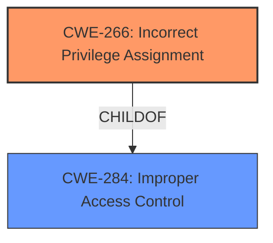

# Analysis for CVE-2020-25160

# Summary
| CWE ID | CWE Name | Confidence | CWE Abstraction Level | CWE Vulnerability Mapping Label | CWE-Vulnerability Mapping Notes |
|---|---|---|---|---|---|
| CWE-266 | Incorrect Privilege Assignment | 0.85 | Base | Allowed | Primary CWE |
| CWE-284 | Improper Access Control | 0.7 | Pillar | Discouraged | Secondary Candidate |

## Evidence and Confidence

*   **Confidence Score:** 0.80
*   **Evidence Strength:** MEDIUM

## Relationship Analysis
The primary relationship influencing the choice of CWE-266 is its position as a base-level weakness, which is preferred. CWE-266 is a child of CWE-284, indicating a more specific form of access control issue related to privilege assignment. Choosing CWE-266 allows for a finer-grained classification than the more general CWE-284.

## Vulnerability Chain
The vulnerability chain starts with the **improper access controls** (CWE-266), which leads to the ability for attackers to extract and tamper with the devices' network configuration. The root cause is the incorrect assignment of privileges, and the impact is unauthorized modification of network settings.

## Summary of Analysis
The initial analysis identified several potential CWEs, including CWE-284 (Improper Access Control), CWE-269 (Improper Privilege Management), and CWE-266 (Incorrect Privilege Assignment).

The vulnerability description states: "**Improper access controls** in the B. Braun Melsungen AG SpaceCom Version L81/U61 and earlier, and the Data module compactplus Versions A10 and A11 enables attackers to extract and tamper with the devices network configuration." The key phrase is "**Improper access controls**" leading to attackers being able to "extract and tamper with the devices network configuration." The "CVE Reference Links Content Summary" section confirms the "**Root cause of vulnerability: Improper access controls** in the B. Braun Melsungen AG SpaceCom and Data module compactplus" and "**Weaknesses/vulnerabilities present: Improper access control**, which allows attackers to extract and tamper with the devices' network configuration."

CWE-284 is a high-level Pillar, which is generally discouraged. CWE-269 is a Class and is also discouraged due to frequent misuse.

CWE-266 (Incorrect Privilege Assignment) is a Base-level CWE that more specifically addresses the root cause: the system incorrectly assigns privileges, leading to unauthorized access. This is a more precise classification than the broader "Improper Access Control."

Therefore, the final decision is to select CWE-266 (Incorrect Privilege Assignment) as the primary CWE, as it accurately reflects the root cause of the vulnerability. CWE-284 is retained as a secondary candidate due to the general language in the vulnerability description, but it is less specific and at a higher level of abstraction.

Relevant CWE Information:

# Enhanced Context (25 CWEs)

## CWE-23: Relative Path Traversal
**Abstraction Level**: Base
**Similarity Score**: 0.82
**Source**: dense

**Description**:
The product uses external input to construct a pathname that should be within a restricted directory, but it does not properly neutralize sequences such as ".." that can resolve to a location that is outside of that directory.

**Mapping Guidance**:
- Usage: Allowed
- Rationale: This CWE entry is at the Base level of abstraction, which is a preferred level of abstraction for mapping to the root causes of vulnerabilities.

## CWE-41: Improper Resolution of Path Equivalence
**Abstraction Level**: Base
**Similarity Score**: 0.81
**Source**: dense

**Description**:
The product is vulnerable to file system contents disclosure through path equivalence. Path equivalence involves the use of special characters in file and directory names. The associated manipulations are intended to generate multiple names for the same object.

**Mapping Guidance**:
- Usage: Allowed
- Rationale: This CWE entry is at the Base level of abstraction, which is a preferred level of abstraction for mapping to the root causes of vulnerabilities.

## CWE-36: Absolute Path Traversal
**Abstraction Level**: Base
**Similarity Score**: 0.80
**Source**: dense

**Description**:
The product uses external input to construct a pathname that should be within a restricted directory, but it does not properly neutralize absolute path sequences such as "/abs/path" that can resolve to a location that is outside of that directory.

**Mapping Guidance**:
- Usage: Allowed
- Rationale: This CWE entry is at the Base level of abstraction, which is a preferred level of abstraction for mapping to the root causes of vulnerabilities.

## CWE-73: External Control of File Name or Path
**Abstraction Level**: Base
**Similarity Score**: 0.80
**Source**: dense

**Description**:
The product allows user input to control or influence paths or file names that are used in filesystem operations.

**Mapping Guidance**:
- Usage: Allowed
- Rationale: This CWE entry is at the Base level of abstraction, which is a preferred level of abstraction for mapping to the root causes of vulnerabilities.

## CWE-59: Improper Link Resolution Before File Access ('Link Following')
**Abstraction Level**: Base
**Similarity Score**: 0.79
**Source**: dense

**Description**:
The product attempts to access a file based on the filename, but it does not properly prevent that filename from identifying a link or shortcut that resolves to an unintended resource.

**Mapping Guidance**:
- Usage: Allowed
- Rationale: This CWE entry is at the Base level of abstraction, which is a preferred level of abstraction for mapping to the root causes of vulnerabilities.

## CWE-24: Path Traversal: '../filedir'
**Abstraction Level**: Variant
**Similarity Score**: 0.79
**Source**: dense

**Description**:
The product uses external input to construct a pathname that should be within a restricted directory, but it does not properly neutralize "../" sequences that can resolve to a location that is outside of that directory.

**Mapping Guidance**:
- Usage: Allowed
- Rationale: This CWE entry is at the Variant level of abstraction, which is a preferred level of abstraction for mapping to the root causes of vulnerabilities.

## CWE-552: Files or Directories Accessible to External Parties
**Abstraction Level**: Base
**Similarity Score**: 0.78
**Source**: dense

**Description**:
The product makes files or directories accessible to unauthorized actors, even though they should not be.

**Mapping Guidance**:
- Usage: Allowed
- Rationale: This CWE entry is at the Base level of abstraction, which is a preferred level of abstraction for mapping to the root causes of vulnerabilities.

## CWE-668: Exposure of Resource to Wrong Sphere
**Abstraction Level**: Class
**Similarity Score**: 0.78
**Source**: dense

**Description**:
The product exposes a resource to the wrong control sphere, providing unintended actors with inappropriate access to the resource.

**Mapping Guidance**:
- Usage: Discouraged
- Rationale: CWE-668 is high-level and is often misused as a catch-all when lower-level CWE IDs might be applicable. It is sometimes used for low-information vulnerability reports [REF-1287]. It is a level-1 Class (i.e., a child of a Pillar). It is not useful for trend analysis.

## CWE-427: Uncontrolled Search Path Element
**Abstraction Level**: Base
**Similarity Score**: 0.77
**Source**: dense

**Description**:
The product uses a fixed or controlled search path to find resources, but one or more locations in that path can be under the control of unintended actors.

**Mapping Guidance**:
- Usage: Allowed
- Rationale: This CWE entry is at the Base level of abstraction, which is a preferred level of abstraction for mapping to the root causes of vulnerabilities.

## CWE-424: Improper Protection of Alternate Path
**Abstraction Level**: Class
**Similarity Score**: 0.77
**Source**: dense

**Description**:
The product does not sufficiently protect all possible paths that a user can take to access restricted functionality or resources.

**Mapping Guidance**:
- Usage: Allowed-with-Review
- Rationale: This CWE entry is a Class and might have Base-level children that would be more appropriate

## CWE-22: Improper Limitation of a Pathname to a Restricted Directory ('Path Traversal')
**Abstraction Level**: Base
**Similarity Score**: 5565.15
**Source**: sparse

**Description**:
The product uses external input to construct a pathname that is intended to identify a file or directory that is located underneath a restricted parent directory, but the product does not properly neutralize special elements within the pathname that can cause the pathname to resolve to a location that is outside of the restricted directory.

**Mapping Guidance**:
- Usage: Allowed