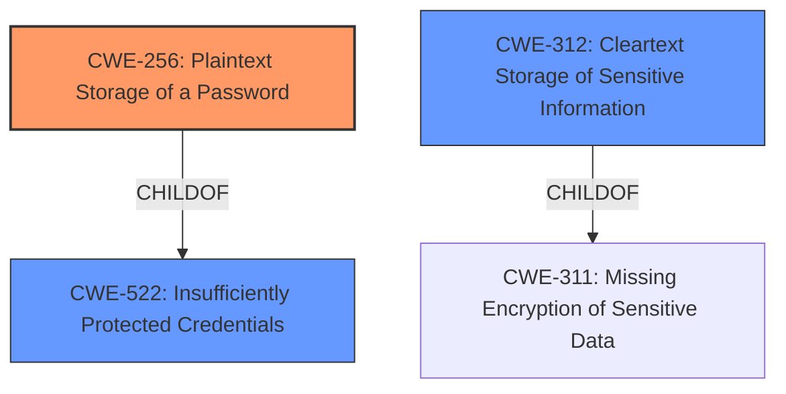

# Analysis for CVE-2020-25184

# Summary
| CWE ID | CWE Name | Confidence | CWE Abstraction Level | CWE Vulnerability Mapping Label | CWE-Vulnerability Mapping Notes |
|---|---|---|---|---|---|
| CWE-256 | Plaintext Storage of a Password | 1.0 | Base | Allowed | Primary CWE |
| CWE-312 | Cleartext Storage of Sensitive Information | 0.7 | Base | Allowed | Secondary Candidate |
| CWE-522 | Insufficiently Protected Credentials | 0.6 | Class | Allowed-with-Review | Secondary Candidate |

## Evidence and Confidence

*   **Confidence Score:** 0.9
*   **Evidence Strength:** HIGH

## Relationship Analysis
The primary CWE is CWE-256, which is a Base level weakness and a child of CWE-522. CWE-522 is a Class level weakness which indicates that it is more abstract than CWE-256. The vulnerability description and key phrases strongly indicate that the password is being stored in plaintext, making CWE-256 the most appropriate.

## Vulnerability Chain
The chain of root cause and weaknesses that followed for the Vulnerability Description:
  - **Root Cause:** CWE-256 (Plaintext Storage of a Password)
  - **Impact:** Information Disclosure

## Summary of Analysis
The initial analysis correctly identified the **plaintext storage of the password** as the root cause, leading to potential information disclosure. The primary CWE selected, CWE-256 (Plaintext Storage of a Password), is well-supported by the evidence. The vulnerability description explicitly states that the password is stored in plaintext, and the CVE Reference Links Content Summary reinforces this.

The graph relationships show that CWE-256 is a child of CWE-522 (Insufficiently Protected Credentials). While CWE-522 is a related weakness, CWE-256 is more specific and accurately captures the root cause.

CWE-312 (Cleartext Storage of Sensitive Information) was also considered, but CWE-256 is more specific because it explicitly refers to passwords.

The selection of CWE-256 is at the optimal level of specificity because it directly addresses the core issue of storing passwords in plaintext, as stated in the vulnerability description.

Relevant CWE Information:

# Enhanced Context (25 CWEs)
The following CWEs were identified as potentially relevant to this vulnerability:

## CWE-916: Use of Password Hash With Insufficient Computational Effort
**Abstraction Level**: Base
**Similarity Score**: 0.80
**Source**: dense

**Description**:
The product generates a hash for a password, but it uses a scheme that does not provide a sufficient level of computational effort that would make password cracking attacks infeasible or expensive.

**Mapping Guidance**:
- Usage: Allowed
- Rationale: This CWE entry is at the Base level of abstraction, which is a preferred level of abstraction for mapping to the root causes of vulnerabilities.

## CWE-312: Cleartext Storage of Sensitive Information
**Abstraction Level**: Base
**Similarity Score**: 0.78
**Source**: dense

**Description**:
The product stores sensitive information in cleartext within a resource that might be accessible to another control sphere.

**Mapping Guidance**:
- Usage: Allowed
- Rationale: This CWE entry is at the Base level of abstraction, which is a preferred level of abstraction for mapping to the root causes of vulnerabilities.

## CWE-328: Use of Weak Hash
**Abstraction Level**: Base
**Similarity Score**: 0.76
**Source**: dense

**Description**:
The product uses an algorithm that produces a digest (output value) that does not meet security expectations for a hash function that allows an adversary to reasonably determine the original input (preimage attack), find another input that can produce the same hash (2nd preimage attack), or find multiple inputs that evaluate to the same hash (birthday attack).

**Mapping Guidance**:
- Usage: Allowed
- Rationale: This CWE entry is at the Base level of abstraction, which is a preferred level of abstraction for mapping to the root causes of vulnerabilities.

## CWE-1391: Use of Weak Credentials
**Abstraction Level**: Class
**Similarity Score**: 0.75
**Source**: dense

**Description**:
The product uses weak credentials (such as a default key or hard-coded password) that can be calculated, derived, reused, or guessed by an attacker.

**Mapping Guidance**:
- Usage: Allowed-with-Review
- Rationale: This CWE entry is a Class and might have Base-level children that would be more appropriate

## CWE-1240: Use of a Cryptographic Primitive with a Risky Implementation
**Abstraction Level**: Base
**Similarity Score**: 0.74
**Source**: dense

**Description**:
To fulfill the need for a cryptographic primitive, the product implements a cryptographic algorithm using a non-standard, unproven, or disallowed/non-compliant cryptographic implementation.

**Mapping Guidance**:
- Usage: Allowed
- Rationale: This CWE entry is at the Base level of abstraction, which is a preferred level of abstraction for mapping to the root causes of vulnerabilities.

## CWE-319: Cleartext Transmission of Sensitive Information
**Abstraction Level**: Base
**Similarity Score**: 0.74
**Source**: dense

**Description**:
The product transmits sensitive or security-critical data in cleartext in a communication channel that can be sniffed by unauthorized actors.

**Mapping Guidance**:
- Usage: Allowed
- Rationale: This CWE entry is at the Base level of abstraction, which is a preferred level of abstraction for mapping to the root causes of vulnerabilities.

## CWE-836: Use of Password Hash Instead of Password for Authentication
**Abstraction Level**: Base
**Similarity Score**: 0.74
**Source**: dense

**Description**:
The product records password hashes in a data store, receives a hash of a password from a client, and compares the supplied hash to the hash obtained from the data store.

**Mapping Guidance**:
- Usage: Allowed
- Rationale: This CWE entry is at the Base level of abstraction, which is a preferred level of abstraction for mapping to the root causes of vulnerabilities.

## CWE-798: Use of Hard-coded Credentials
**Abstraction Level**: Base
**Similarity Score**: 0.74
**Source**: dense

**Description**:
The product contains hard-coded credentials, such as a password or cryptographic key.

**Mapping Guidance**:
- Usage: Allowed
- Rationale: This CWE entry is at the Base level of abstraction, which is a preferred level of abstraction for mapping to the root causes of vulnerabilities.

## CWE-257: Storing Passwords in a Recoverable Format
**Abstraction Level**: Base
**Similarity Score**: 0.74
**Source**: dense

**Description**:
The storage of passwords in a recoverable format makes them subject to password reuse attacks by malicious users. In fact, it should be noted that recoverable encrypted passwords provide no significant benefit over plaintext passwords since they are subject not only to reuse by malicious attackers but also by malicious insiders. If a system administrator can recover a password directly, or use a brute force search on the available information, the administrator can use the password on other accounts.

**Mapping Guidance**:
- Usage: Allowed
- Rationale: This CWE entry is at the Base level of abstraction, which is a preferred level of abstraction for mapping to the root causes of vulnerabilities.

## CWE-311: Missing Encryption of Sensitive Data
**Abstraction Level**: Class
**Similarity Score**: 0.73
**Source**: dense

**Description**:
The product does not encrypt sensitive or critical information before storage or transmission.

**Mapping Guidance**:
- Usage: Discouraged
- Rationale: CWE-311 is high-level with more precise children available. It is a level-1 Class (i.e., a child of a Pillar).

## CWE-916: Use of Password Hash With Insufficient Computational Effort
**Abstraction Level**: Base
**Similarity Score**: 6313.49
**Source**: sparse

**Description**:
The product generates a hash for a password, but it uses a scheme that does not provide a sufficient level of computational effort that would make password cracking attacks infeasible or expensive.

**Mapping Guidance**:
- Usage: Allowed
- Rationale: This CWE entry is at the Base level of abstraction, which is a preferred level of abstraction for mapping to the root causes of vulnerabilities.

## CWE-327: Use of a Broken or Risky Cryptographic Algorithm
**Abstraction Level**: Class

# Enhanced Query for CVE-2020-25184

## Vulnerability Description
Rockwell Automation ISaGRAF Runtime Versions 4.x and 5.x stores the password in plaintext in a file that is in the same directory as the executable file. ISaGRAF Runtime reads the file and saves the data in a variable without any additional modification. A local, unauthenticated attacker could compromise the user passwords, resulting in information disclosure.

### Vulnerability Description Key Phrases
- **rootcause:** **plaintext storage of sensitive information**
- **impact:** information disclosure
- **attacker:** local unauthenticated attacker
- **product:** Rockwell Automation ISaGRAF Runtime
- **version:** 4.x and 5.x

## CVE Reference Links Content Summary
Based on the provided content, here's a breakdown of the vulnerability:

**Root Cause of Vulnerability:**

*   The vulnerability exists within the ISaGRAF Runtime v5.x software, specifically when enabled on certain devices.

**Weaknesses/Vulnerabilities Present:**

*   The advisory mentions multiple CVEs (CVE-2020-25182, CVE-2020-25176, CVE-2020-25178, CVE-2020-25184, CVE-2020-25180), implying multiple distinct vulnerabilities are present within ISaGRAF Runtime v5.x. The specific weaknesses associated with CVE-2020-25184 are not detailed in this content.
*   The primary weakness is that if ISaGRAF is enabled on affected devices, it could allow unauthorized users to perform actions they shouldn't be able to.

**Impact of Exploitation:**

*   Unauthorized users could potentially read, download, or delete content from the affected device. This indicates a potential for information disclosure, data manipulation, and denial of service or system availability.

**Attack Vectors:**

*   The attack vector involves network access to the affected devices.
*   The vulnerability is only exploitable if the ISaGRAF feature is enabled.

**Required Attacker Capabilities/Position:**

*   The attacker needs to have network access to the vulnerable MultiSmart device.
*   The attacker must be unauthorized, implying they are external to the trusted user base or have bypassed authentication mechanisms.
*   The attacker would need the capabilities to exploit the specific vulnerabilities within ISaGRAF Runtime v5.x.

**Additional Notes:**

*   The affected devices are primarily MultiSmart Gen-1 and MultiSmart Gen-2 devices running firmware versions prior to 3.2.0.
*   The vulnerability is not present in devices purchased since 2014, devices with firmware 3.2.0 or later, or devices where the ISaGRAF feature is not enabled.
*   The vendor (Xylem) recommends upgrading the firmware to version 3.2.0 or later and employing a defense-in-depth strategy.
*   The content explicitly states that this is a Rockwell Automation software vulnerability.
*   The content mentions ICSA-20-280-01 - CISA ICS-CERT Advisory, which likely provides more details on this vulnerability and other related vulnerabilities.

## Retriever Results

### Top Combined Results

| Rank | CWE ID | Name | Abstraction | Usage  | Retrievers | Individual Scores |
|------|--------|------|-------------|-------|------------|-------------------|
| 1 | 256 | Plaintext Storage of a Password | Base | Allowed | sparse | 0.487 |
| 2 | 522 | Insufficiently Protected Credentials | Class | Allowed-with-Review | sparse | 0.385 |
| 3 | 312 | Cleartext Storage of Sensitive Information | Base | Allowed | sparse | 0.364 |
| 4 | 732 | Incorrect Permission Assignment for Critical Resource | Class | Allowed-with-Review | sparse | 0.360 |
| 5 | 532 | Insertion of Sensitive Information into Log File | Base | Allowed | sparse | 0.348 |
| 6 | 260 | Password in Configuration File | Base | Allowed | dense | 0.484 |
| 7 | 386 | Symbolic Name not Mapping to Correct Object | Base | Allowed | graph | 0.002 |
| 8 | 327 | Use of a Broken or Risky Cryptographic Algorithm | Class | Allowed-with-Review | sparse | 0.348 |
| 9 | 319 | Cleartext Transmission of Sensitive Information | Base | Allowed | sparse | 0.343 |
| 10 | 916 | Use of Password Hash With Insufficient Computational Effort | Base | Allowed | sparse | 0.342 |

# Complete CWE Specifications

## CWE-256: Plaintext Storage of a Password
**Abstraction:** Base
**Status:** Incomplete

### Description
Storing a password in plaintext may result in a system compromise.

### Extended Description
Password management issues occur when a password is stored in plaintext in an application's properties, configuration file, or memory. Storing a plaintext password in a configuration file allows anyone who can read the file access to the password-protected resource. In some contexts, even storage of a plaintext password in memory is considered a security risk if the password is not cleared immediately after it is used.

### Alternative Terms
None

### Relationships
ChildOf -> CWE-522

### Mapping Guidance
**Usage:** Allowed
**Rationale:** This CWE entry is at the Base level of abstraction, which is a preferred level of abstraction for mapping to the root causes of vulnerabilities.
**Comments:** Carefully read both the name and description to ensure that this mapping is an appropriate fit. Do not try to 'force' a mapping to a lower-level Base/Variant simply to comply with this preferred level of abstraction.
**Reasons:**
- Acceptable-Use

### Observed Examples
- **CVE-2022-30275:** Remote Terminal Unit (RTU) uses a driver that relies on a password stored in plaintext.

## CWE-522: Insufficiently Protected Credentials
**Abstraction:** Class
**Status:** Incomplete

### Description
The product transmits or stores authentication credentials, but it uses an insecure method that is susceptible to unauthorized interception and/or retrieval.

### Extended Description
Not provided

### Alternative Terms
None

### Relationships
ChildOf -> CWE-1390
ChildOf -> CWE-287
ChildOf -> CWE-668

### Mapping Guidance
**Usage:** Allowed-with-Review
**Rationale:** This CWE entry is a Class and might have Base-level children that would be more appropriate
**Comments:** Examine children of this entry to see if there is a better fit
**Reasons:**
- Abstraction

### Observed Examples
- **CVE-2022-30018:** A messaging platform serializes all elements of User/Group objects, making private information available to adversaries
- **CVE-2022-29959:** Initialization file contains credentials that can be decoded using a "simple string transformation"
- **CVE-2022-35411:** Python-based RPC framework enables pickle functionality by default, allowing clients to unpickle untrusted data.

## CWE-312: Cleartext Storage of Sensitive Information
**Abstraction:** Base
**Status:** Draft

### Description
The product stores sensitive information in cleartext within a resource that might be accessible to another control sphere.

### Extended Description

Because the information is stored in cleartext (i.e., unencrypted), attackers could potentially read it. Even if the information is encoded in a way that is not human-readable, certain techniques could determine which encoding is being used, then decode the information.

When organizations adopt cloud services, it can be easier for attackers to access the data from anywhere on the Internet.

In some systems/environments such as cloud, the use of "double encryption" (at both the software and hardware layer) might be required, and the developer might be solely responsible for both layers, instead of shared responsibility with the administrator of the broader system/environment.

### Alternative Terms
None

### Relationships
ChildOf -> CWE-311
ChildOf -> CWE-311
ChildOf -> CWE-922

### Mapping Guidance
**Usage:** Allowed
**Rationale:** This CWE entry is at the Base level of abstraction, which is a preferred level of abstraction for mapping to the root causes of vulnerabilities.
**Comments:** Carefully read both the name and description to ensure that this mapping is an appropriate fit. Do not try to 'force' a mapping to a lower-level Base/Variant simply to comply with this preferred level of abstraction.
**Reasons:**
- Acceptable-Use

### Additional Notes
**[Terminology]** Different people use "cleartext" and "plaintext" to mean the same thing: the lack of encryption. However, within cryptography, these have more precise meanings. Plaintext is the information just before it is fed into a cryptographic algorithm, including already-encrypted text. Cleartext is any information that is unencrypted, although it might be in an encoded form that is not easily human-readable (such as base64 encoding).

### Observed Examples
- **CVE-2022-30275:** Remote Terminal Unit (RTU) uses a driver that relies on a password stored in plaintext.
- **CVE-2009-2272:** password and username stored in cleartext in a cookie
- **CVE-2009-1466:** password stored in cleartext in a file with insecure permissions

## CWE-732: Incorrect Permission Assignment for Critical Resource
**Abstraction:** Class
**Status:** Draft

### Description
The product specifies permissions for a security-critical resource in a way that allows that resource to be read or modified by unintended actors.

### Extended Description
When a resource is given a permission setting that provides access to a wider range of actors than required, it could lead to the exposure of sensitive information, or the modification of that resource by unintended parties. This is especially dangerous when the resource is related to program configuration, execution, or sensitive user data. For example, consider a misconfigured storage account for the cloud that can be read or written by a public or anonymous user.

### Alternative Terms
None

### Relationships
ChildOf -> CWE-285
ChildOf -> CWE-668

### Mapping Guidance
**Usage:** Allowed-with-Review
**Rationale:** While the name itself indicates an assignment of permissions for resources, this is often misused for vulnerabilities in which "permissions" are not checked, which is an "authorization" weakness (CWE-285 or descendants) within CWE's model [REF-1287].
**Comments:** Closely analyze the specific mistake that is allowing the resource to be exposed, and perform a CWE mapping for that mistake.
**Reasons:**
- Frequent Misuse

### Additional Notes
**[Maintenance]** The relationships between privileges, permissions, and actors (e.g. users and groups) need further refinement within the Research view. One complication is that these concepts apply to two different pillars, related to control of resources (CWE-664) and protection mechanism failures (CWE-693).

### Observed Examples
- **CVE-2022-29527:** Go application for cloud management creates a world-writable sudoers file that allows local attackers to inject sudo rules and escalate privileges to root by winning a race condition.
- **CVE-2009-3482:** Anti-virus product sets insecure "Everyone: Full Control" permissions for files under the "Program Files" folder, allowing attackers to replace executables with Trojan horses.
- **CVE-2009-3897:** Product creates directories with 0777 permissions at installation, allowing users to gain privileges and access a socket used for authentication.

## CWE-532: Insertion of Sensitive Information into Log File
**Abstraction:** Base
**Status:** Incomplete

### Description
The product writes sensitive information to a log file.

### Extended Description
Not provided

### Alternative Terms
None

### Relationships
ChildOf -> CWE-538
ChildOf -> CWE-200

### Mapping Guidance
**Usage:** Allowed
**Rationale:** This CWE entry is at the Base level of abstraction, which is a preferred level of abstraction for mapping to the root causes of vulnerabilities.
**Comments:** Carefully read both the name and description to ensure that this mapping is an appropriate fit. Do not try to 'force' a mapping to a lower-level Base/Variant simply to comply with this preferred level of abstraction.
**Reasons:**
- Acceptable-Use

### Observed Examples
- **CVE-2017-9615:** verbose logging stores admin credentials in a world-readable log file
- **CVE-2018-1999036:** SSH password for private key stored in build log

## CWE-260: Password in Configuration File
**Abstraction:** Base
**Status:** Incomplete

### Description
The product stores a password in a configuration file that might be accessible to actors who do not know the password.

### Extended Description
This can result in compromise of the system for which the password is used. An attacker could gain access to this file and learn the stored password or worse yet, change the password to one of their choosing.

### Alternative Terms
None

### Relationships
ChildOf -> CWE-522

### Mapping Guidance
**Usage:** Allowed
**Rationale:** This CWE entry is at the Base level of abstraction, which is a preferred level of abstraction for mapping to the root causes of vulnerabilities.
**Comments:** Carefully read both the name and description to ensure that this mapping is an appropriate fit. Do not try to 'force' a mapping to a lower-level Base/Variant simply to comply with this preferred level of abstraction.
**Reasons:**
- Acceptable-Use

### Observed Examples
- **CVE-2022-38665:** A continuous delivery pipeline management tool stores an unencypted password in a configuration file.

## CWE-386: Symbolic Name not Mapping to Correct Object
**Abstraction:** Base
**Status:** Draft

### Description
A constant symbolic reference to an object is used, even though the reference can resolve to a different object over time.

### Extended Description
Not provided

### Alternative Terms
None

### Relationships
ChildOf -> CWE-706
PeerOf -> CWE-367
PeerOf -> CWE-610
PeerOf -> CWE-486

### Mapping Guidance
**Usage:** Allowed
**Rationale:** This CWE entry is at the Base level of abstraction, which is a preferred level of abstraction for mapping to the root causes of vulnerabilities.
**Comments:** Carefully read both the name and description to ensure that this mapping is an appropriate fit. Do not try to 'force' a mapping to a lower-level Base/Variant simply to comply with this preferred level of abstraction.
**Reasons:**
- Acceptable-Use

## CWE-327: Use of a Broken or Risky Cryptographic Algorithm
**Abstraction:** Class
**Status:** Draft

### Description
The product uses a broken or risky cryptographic algorithm or protocol.

### Extended Description

Cryptographic algorithms are the methods by which data is scrambled to prevent observation or influence by unauthorized actors. Insecure cryptography can be exploited to expose sensitive information, modify data in unexpected ways, spoof identities of other users or devices, or other impacts.

It is very difficult to produce a secure algorithm, and even high-profile algorithms by accomplished cryptographic experts have been broken. Well-known techniques exist to break or weaken various kinds of cryptography. Accordingly, there are a small number of well-understood and heavily studied algorithms that should be used by most products. Using a non-standard or known-insecure algorithm is dangerous because a determined adversary may be able to break the algorithm and compromise whatever data has been protected.

Since the state of cryptography advances so rapidly, it is common for an algorithm to be considered "unsafe" even if it was once thought to be strong. This can happen when new attacks are discovered, or if computing power increases so much that the cryptographic algorithm no longer provides the amount of protection that was originally thought.

For a number of reasons, this weakness is even more challenging to manage with hardware deployment of cryptographic algorithms as opposed to software implementation. First, if a flaw is discovered with hardware-implemented cryptography, the flaw cannot be fixed in most cases without a recall of the product, because hardware is not easily replaceable like software. Second, because the hardware product is expected to work for years, the adversary's computing power will only increase over time.

### Alternative Terms
None

### Relationships
ChildOf -> CWE-693
PeerOf -> CWE-311

### Mapping Guidance
**Usage:** Allowed-with-Review
**Rationale:** This CWE entry is a Class and might have Base-level children that would be more appropriate
**Comments:** Examine children of this entry to see if there is a better fit
**Reasons:**
- Abstraction

### Additional Notes
**[Maintenance]** Since CWE 4.4, various cryptography-related entries, including CWE-327 and CWE-1240, have been slated for extensive research, analysis, and community consultation to define consistent terminology, improve relationships, and reduce overlap or duplication. As of CWE 4.6, this work is still ongoing.

**[Maintenance]** The Taxonomy_Mappings to ISA/IEC 62443 were added in CWE 4.10, but they are still under review and might change in future CWE versions. These draft mappings were performed by members of the "Mapping CWE to 62443" subgroup of the CWE-CAPEC ICS/OT Special Interest Group (SIG), and their work is incomplete as of CWE 4.10. The mappings are included to facilitate discussion and review by the broader ICS/OT community, and they are likely to change in future CWE versions.

### Observed Examples
- **CVE-2022-30273:** SCADA-based protocol supports a legacy encryption mode that uses Tiny Encryption Algorithm (TEA) in ECB mode, which leaks patterns in messages and cannot protect integrity
- **CVE-2022-30320:** Programmable Logic Controller (PLC) uses a protocol with a cryptographically insecure hashing algorithm for passwords.
- **CVE-2008-3775:** Product uses "ROT-25" to obfuscate the password in the registry.

## CWE-319: Cleartext Transmission of Sensitive Information
**Abstraction:** Base
**Status:** Draft

### Description
The product transmits sensitive or security-critical data in cleartext in a communication channel that can be sniffed by unauthorized actors.

### Extended Description

Many communication channels can be "sniffed" (monitored) by adversaries during data transmission. For example, in networking, packets can traverse many intermediary nodes from the source to the destination, whether across the internet, an internal network, the cloud, etc. Some actors might have privileged access to a network interface or any link along the channel, such as a router, but they might not be authorized to collect the underlying data. As a result, network traffic could be sniffed by adversaries, spilling security-critical data.

Applicable communication channels are not limited to software products. Applicable channels include hardware-specific technologies such as internal hardware networks and external debug channels, supporting remote JTAG debugging. When mitigations are not applied to combat adversaries within the product's threat model, this weakness significantly lowers the difficulty of exploitation by such adversaries.

When full communications are recorded or logged, such as with a packet dump, an adversary could attempt to obtain the dump long after the transmission has occurred and try to "sniff" the cleartext from the recorded communications in the dump itself. Even if the information is encoded in a way that is not human-readable, certain techniques could determine which encoding is being used, then decode the information. 

### Alternative Terms
None

### Relationships
ChildOf -> CWE-311
ChildOf -> CWE-311

### Mapping Guidance
**Usage:** Allowed
**Rationale:** This CWE entry is at the Base level of abstraction, which is a preferred level of abstraction for mapping to the root causes of vulnerabilities.
**Comments:** Carefully read both the name and description to ensure that this mapping is an appropriate fit. Do not try to 'force' a mapping to a lower-level Base/Variant simply to comply with this preferred level of abstraction.
**Reasons:**
- Acceptable-Use

### Additional Notes
**[Maintenance]** The Taxonomy_Mappings to ISA/IEC 62443 were added in CWE 4.10, but they are still under review and might change in future CWE versions. These draft mappings were performed by members of the "Mapping CWE to 62443" subgroup of the CWE-CAPEC ICS/OT Special Interest Group (SIG), and their work is incomplete as of CWE 4.10. The mappings are included to facilitate discussion and review by the broader ICS/OT community, and they are likely to change in future CWE versions.

### Observed Examples
- **CVE-2022-29519:** Programmable Logic Controller (PLC) sends sensitive information in plaintext, including passwords and session tokens.
- **CVE-2022-30312:** Building Controller uses a protocol that transmits authentication credentials in plaintext.
- **CVE-2022-31204:** Programmable Logic Controller (PLC) sends password in plaintext.

## CWE-916: Use of Password Hash With Insufficient Computational Effort
**Abstraction:** Base
**Status:** Incomplete

### Description
The product generates a hash for a password, but it uses a scheme that does not provide a sufficient level of computational effort that would make password cracking attacks infeasible or expensive.

### Extended Description

Many password storage mechanisms compute a hash and store the hash, instead of storing the original password in plaintext. In this design, authentication involves accepting an incoming password, computing its hash, and comparing it to the stored hash.

Many hash algorithms are designed to execute quickly with minimal overhead, even cryptographic hashes. However, this efficiency is a problem for password storage, because it can reduce an attacker's workload for brute-force password cracking. If an attacker can obtain the hashes through some other method (such as SQL injection on a database that stores hashes), then the attacker can store the hashes offline and use various techniques to crack the passwords by computing hashes efficiently. Without a built-in workload, modern attacks can compute large numbers of hashes, or even exhaust the entire space of all possible passwords, within a very short amount of time, using massively-parallel computing (such as cloud computing) and GPU, ASIC, or FPGA hardware. In such a scenario, an efficient hash algorithm helps the attacker.

There are several properties of a hash scheme that are relevant to its strength against an offline, massively-parallel attack:

  - The amount of CPU time required to compute the hash ("stretching")

  - The amount of memory required to compute the hash ("memory-hard" operations)

  - Including a random value, along with the password, as input to the hash computation ("salting")

  - Given a hash, there is no known way of determining an input (e.g., a password) that produces this hash value, other than by guessing possible inputs ("one-way" hashing)

  - Relative to the number of all possible hashes that can be generated by the scheme, there is a low likelihood of producing the same hash for multiple different inputs ("collision resistance")

Note that the security requirements for the product may vary depending on the environment and the value of the passwords. Different schemes might not provide all of these properties, yet may still provide sufficient security for the environment. Conversely, a solution might be very strong in preserving one property, which still being very weak for an attack against another property, or it might not be able to significantly reduce the efficiency of a massively-parallel attack.

### Alternative Terms
None

### Relationships
ChildOf -> CWE-328
ChildOf -> CWE-327

### Mapping Guidance
**Usage:** Allowed
**Rationale:** This CWE entry is at the Base level of abstraction, which is a preferred level of abstraction for mapping to the root causes of vulnerabilities.
**Comments:** Carefully read both the name and description to ensure that this mapping is an appropriate fit. Do not try to 'force' a mapping to a lower-level Base/Variant simply to comply with this preferred level of abstraction.
**Reasons:**
- Acceptable-Use

### Observed Examples
- **CVE-2008-1526:** Router does not use a salt with a hash, making it easier to crack passwords.
- **CVE-2006-1058:** Router does not use a salt with a hash, making it easier to crack passwords.
- **CVE-2008-4905:** Blogging software uses a hard-coded salt when calculating a password hash.

