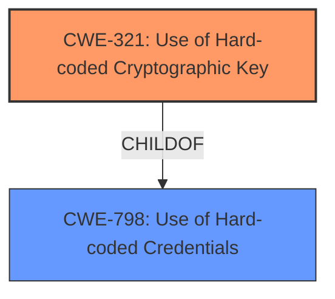

# Analysis for CVE-2020-25193

# Summary
| CWE ID | CWE Name | Confidence | CWE Abstraction Level | CWE Vulnerability Mapping Label | CWE-Vulnerability Mapping Notes |
|---|---|---|---|---|---|
| CWE-321 | Use of Hard-coded Cryptographic Key | 1 | Variant | Allowed | Primary CWE |
| CWE-798 | Use of Hard-coded Credentials | 0.7 | Base | Allowed | Secondary Candidate |

## Evidence and Confidence

*   **Confidence Score:** 0.9
*   **Evidence Strength:** HIGH

## Relationship Analysis
The primary CWE is CWE-321, which is a variant of CWE-798. CWE-798 is a base CWE and a parent of CWE-321. This means that CWE-321 is a more specific type of CWE-798. The vulnerability description specifically mentions a **hard-coded cryptographic key**, making CWE-321 the more appropriate choice.



## Vulnerability Chain
The vulnerability chain is straightforward:
1.  **Root Cause:** The application uses a **hard-coded cryptographic key** (CWE-321).
2.  **Impact:** Attackers can intercept and decrypt encrypted traffic.

## Summary of Analysis
The initial analysis correctly identified CWE-321 as a strong candidate due to the presence of a **hard-coded cryptographic key**. The relationship analysis confirms that CWE-321 is a more specific variant of CWE-798, which deals with hard-coded credentials in general. Since the vulnerability description explicitly mentions a cryptographic key, CWE-321 is the most appropriate choice.

The selection of CWE-321 is based on the following evidence from the vulnerability description:

*   "By having access to the **hard-coded cryptographic key** for GE Reason RT430, RT431 & RT434 GNSS clocks in firmware versions prior to version 08A06, attackers would be able to intercept and decrypt encrypted traffic through an HTTPS connection."

This statement clearly indicates the presence of a **hard-coded cryptographic key**, which directly aligns with the description of CWE-321.

The analysis also considered CWE-798, but since CWE-321 is a more specific variant, it was chosen as the primary CWE.

The final selection of CWE-321 is at the optimal level of specificity because it directly addresses the root cause of the vulnerability, which is the use of a **hard-coded cryptographic key**.

Relevant CWE Information:

# Enhanced Context (25 CWEs)
The following CWEs were identified as potentially relevant to this vulnerability:

## CWE-1204: Generation of Weak Initialization Vector (IV)
**Abstraction Level**: Base
**Similarity Score**: 0.83
**Source**: dense

**Description**:
The product uses a cryptographic primitive that uses an Initialization
			Vector (IV), but the product does not generate IVs that are
			sufficiently unpredictable or unique according to the expected
			cryptographic requirements for that primitive.

## CWE-1240: Use of a Cryptographic Primitive with a Risky Implementation
**Abstraction Level**: Base
**Similarity Score**: 0.80
**Source**: dense

**Description**:
To fulfill the need for a cryptographic primitive, the product implements a cryptographic algorithm using a non-standard, unproven, or disallowed/non-compliant cryptographic implementation.

## CWE-1391: Use of Weak Credentials
**Abstraction Level**: Class
**Similarity Score**: 0.79
**Source**: dense

**Description**:
The product uses weak credentials (such as a default key or hard-coded password) that can be calculated, derived, reused, or guessed by an attacker.

## CWE-331: Insufficient Entropy
**Abstraction Level**: Base
**Similarity Score**: 0.78
**Source**: dense

**Description**:
The product uses an algorithm or scheme that produces insufficient entropy, leaving patterns or clusters of values that are more likely to occur than others.

## CWE-330: Use of Insufficiently Random Values
**Abstraction Level**: Class
**Similarity Score**: 0.78
**Source**: dense

**Description**:
The product uses insufficiently random numbers or values in a security context that depends on unpredictable numbers.

## CWE-656: Reliance on Security Through Obscurity
**Abstraction Level**: Class
**Similarity Score**: 0.76
**Source**: dense

**Description**:
The product uses a protection mechanism whose strength depends heavily on its obscurity, such that knowledge of its algorithms or key data is sufficient to defeat the mechanism.

## CWE-335: Incorrect Usage of Seeds in Pseudo-Random Number Generator (PRNG)
**Abstraction Level**: Base
**Similarity Score**: 0.76
**Source**: dense

**Description**:
The product uses a Pseudo-Random Number Generator (PRNG) but does not correctly manage seeds.

## CWE-321: Use of Hard-coded Cryptographic Key
**Abstraction Level**: Variant
**Similarity Score**: 0.75
**Source**: dense

**Description**:
The use of a hard-coded cryptographic key significantly increases the possibility that encrypted data may be recovered.

## CWE-1394: Use of Default Cryptographic Key
**Abstraction Level**: Base
**Similarity Score**: 0.75
**Source**: dense

**Description**:
The product uses a default cryptographic key for potentially critical functionality.

## CWE-798: Use of Hard-coded Credentials
**Abstraction Level**: Base
**Similarity Score**: 0.75
**Source**: dense

**Description**:
The product contains hard-coded credentials, such as a password or cryptographic key.

## CWE-798: Use of Hard-coded Credentials
**Abstraction Level**: Base
**Similarity Score**: 6473.26
**Source**: sparse

**Description**:
The product contains hard-coded credentials, such as a password or cryptographic key.

## CWE-1391: Use of Weak Credentials
**Abstraction Level**: Class
**Similarity Score**: 6469.15
**Source**: sparse

**Description**:
The product uses weak credentials (such as a default key or hard-coded password) that can be calculated, derived, reused, or guessed by an attacker.

## CWE-259: Use of Hard-coded Password
**Abstraction Level**: Variant
**Similarity Score**: 6319.64
**Source**: sparse

**Description**:
The product contains a hard-coded password, which it uses for its own inbound authentication or for outbound communication to external components.

## CWE-321: Use of Hard-coded Cryptographic Key
**Abstraction Level**: Variant
**Similarity Score**: 6203.83
**Source**: sparse

**Description**:
The use of a hard-coded cryptographic key significantly increases the possibility that encrypted data may be recovered.

## CWE-327: Use of a Broken or Risky Cryptographic Algorithm
**Abstraction Level**: Class
**Similarity Score**: 5928.95
**Source**: sparse

**Description**:
The product uses a broken or risky cryptographic algorithm or protocol.

## CWE-259: Use of Hard-coded Password
**Abstraction Level**: variant
**Similarity Score**: 4.53
**Source**: graph

**Description**:
CWE-259: Use of Hard-coded Password

## CWE-472: External Control of Assumed-Immutable Web Parameter
**Abstraction Level**: base
**Similarity Score**: 4.33
**Source**: graph

**Description**:
CWE-472: External Control of Assumed-Immutable Web Parameter

## CWE-603: Use of Client-Side Authentication
**Abstraction Level**: base
**Similarity Score**: 3.64
**Source**: graph

**Description**:
CWE-603: Use of Client-Side Authentication

## CWE-257: Storing Passwords in a Recoverable Format
**Abstraction Level**: base
**Similarity Score**: 3.64
**Source**: graph

**Description**:
CWE-257: Storing Passwords in a Recoverable Format

## CWE-321: Use of Hard-coded Cryptographic Key
**Abstraction Level**: Variant
**Similarity Score**: 3.02
**Source**: graph

**Description**:
The use of a hard-coded cryptographic key significantly increases the possibility that encrypted data may be recovered.

## CWE-804: Guessable CAPTCHA
**Abstraction Level**: base
**Similarity Score**: 2.87
**Source**: graph

**Description**:
CWE-804: Guessable CAPTCHA

## CWE-471: Modification of Assumed-Immutable Data (MAID)

# Enhanced Query for CVE-2020-25193

## Vulnerability Description
By having access to the **hard-coded cryptographic key** for GE Reason RT430, RT431 & RT434 GNSS clocks in firmware versions prior to version 08A06, attackers would be able to intercept and decrypt encrypted traffic through an HTTPS connection.

### Vulnerability Description Key Phrases
- **rootcause:** **hard-coded cryptographic key**
- **impact:** intercept and decrypt encrypted traffic
- **attacker:** attackers
- **product:** GE Reason RT430, RT431 & RT434 GNSS clocks
- **version:** prior to version 08A06

## CVE Reference Links Content Summary
UNRELATED

## Retriever Results

### Top Combined Results

| Rank | CWE ID | Name | Abstraction | Usage  | Retrievers | Individual Scores |
|------|--------|------|-------------|-------|------------|-------------------|
| 1 | 321 | Use of Hard-coded Cryptographic Key | Variant | Allowed | sparse | 0.405 |
| 2 | 798 | Use of Hard-coded Credentials | Base | Allowed | sparse | 0.275 |
| 3 | 259 | Use of Hard-coded Password | Variant | Allowed | sparse | 0.270 |
| 4 | 1391 | Use of Weak Credentials | Class | Allowed-with-Review | sparse | 0.260 |
| 5 | 327 | Use of a Broken or Risky Cryptographic Algorithm | Class | Allowed-with-Review | sparse | 0.247 |
| 6 | 326 | Inadequate Encryption Strength | Class | Allowed-with-Review | dense | 0.567 |
| 7 | 472 | External Control of Assumed-Immutable Web Parameter | Base | Allowed | graph | 0.002 |
| 8 | 656 | Reliance on Security Through Obscurity | Class | Allowed-with-Review | sparse | 0.225 |
| 9 | 1188 | Initialization of a Resource with an Insecure Default | Base | Allowed | sparse | 0.224 |
| 10 | 1204 | Generation of Weak Initialization Vector (IV) | Base | Allowed | sparse | 0.223 |


# Complete CWE Specifications


## CWE-321: Use of Hard-coded Cryptographic Key
**Abstraction:** Variant
**Status:** Draft

### Description
The use of a hard-coded cryptographic key significantly increases the possibility that encrypted data may be recovered.

### Extended Description
Not provided

### Alternative Terms
None

### Relationships
ChildOf -> CWE-798
ChildOf -> CWE-798
ChildOf -> CWE-798

### Mapping Guidance
**Usage:** Allowed
**Rationale:** This CWE entry is at the Variant level of abstraction, which is a preferred level of abstraction for mapping to the root causes of vulnerabilities.
**Comments:** Carefully read both the name and description to ensure that this mapping is an appropriate fit. Do not try to 'force' a mapping to a lower-level Base/Variant simply to comply with this preferred level of abstraction.
**Reasons:**
- Acceptable-Use


### Additional Notes
**[Other]** The main difference between the use of hard-coded passwords and the use of hard-coded cryptographic keys is the false sense of security that the former conveys. Many people believe that simply hashing a hard-coded password before storage will protect the information from malicious users. However, many hashes are reversible (or at least vulnerable to brute force attacks) -- and further, many authentication protocols simply request the hash itself, making it no better than a password.

**[Maintenance]** The Taxonomy_Mappings to ISA/IEC 62443 were added in CWE 4.10, but they are still under review and might change in future CWE versions. These draft mappings were performed by members of the "Mapping CWE to 62443" subgroup of the CWE-CAPEC ICS/OT Special Interest Group (SIG), and their work is incomplete as of CWE 4.10. The mappings are included to facilitate discussion and review by the broader ICS/OT community, and they are likely to change in future CWE versions.


### Observed Examples
- **CVE-2022-29960:** Engineering Workstation uses hard-coded cryptographic keys that could allow for unathorized filesystem access and privilege escalation
- **CVE-2022-30271:** Remote Terminal Unit (RTU) uses a hard-coded SSH private key that is likely to be used by default.
- **CVE-2020-10884:** WiFi router service has a hard-coded encryption key, allowing root access


## CWE-798: Use of Hard-coded Credentials
**Abstraction:** Base
**Status:** Draft

### Description
The product contains hard-coded credentials, such as a password or cryptographic key.

### Extended Description


There are two main variations:


  - Inbound: the product contains an authentication mechanism that checks the input credentials against a hard-coded set of credentials. In this variant, a default administration account is created, and a simple password is hard-coded into the product and associated with that account. This hard-coded password is the same for each installation of the product, and it usually cannot be changed or disabled by system administrators without manually modifying the program, or otherwise patching the product. It can also be difficult for the administrator to detect.

  - Outbound: the product connects to another system or component, and it contains hard-coded credentials for connecting to that component. This variant applies to front-end systems that authenticate with a back-end service. The back-end service may require a fixed password that can be easily discovered. The programmer may simply hard-code those back-end credentials into the front-end product.


### Alternative Terms
None

### Relationships
ChildOf -> CWE-1391
ChildOf -> CWE-287
ChildOf -> CWE-344
ChildOf -> CWE-671
PeerOf -> CWE-257

### Mapping Guidance
**Usage:** Allowed
**Rationale:** This CWE entry is at the Base level of abstraction, which is a preferred level of abstraction for mapping to the root causes of vulnerabilities.
**Comments:** Carefully read both the name and description to ensure that this mapping is an appropriate fit. Do not try to 'force' a mapping to a lower-level Base/Variant simply to comply with this preferred level of abstraction.
**Reasons:**
- Acceptable-Use


### Additional Notes
**[Maintenance]** The Taxonomy_Mappings to ISA/IEC 62443 were added in CWE 4.10, but they are still under review and might change in future CWE versions. These draft mappings were performed by members of the "Mapping CWE to 62443" subgroup of the CWE-CAPEC ICS/OT Special Interest Group (SIG), and their work is incomplete as of CWE 4.10. The mappings are included to facilitate discussion and review by the broader ICS/OT community, and they are likely to change in future CWE versions.


### Observed Examples
- **CVE-2022-29953:** Condition Monitor firmware has a maintenance interface with hard-coded credentials
- **CVE-2022-29960:** Engineering Workstation uses hard-coded cryptographic keys that could allow for unathorized filesystem access and privilege escalation
- **CVE-2022-29964:** Distributed Control System (DCS) has hard-coded passwords for local shell access


## CWE-259: Use of Hard-coded Password
**Abstraction:** Variant
**Status:** Draft

### Description
The product contains a hard-coded password, which it uses for its own inbound authentication or for outbound communication to external components.

### Extended Description


A hard-coded password typically leads to a significant authentication failure that can be difficult for the system administrator to detect. Once detected, it can be difficult to fix, so the administrator may be forced into disabling the product entirely. There are two main variations:

```
		Inbound: the product contains an authentication mechanism that checks for a hard-coded password.
		Outbound: the product connects to another system or component, and it contains hard-coded password for connecting to that component.
```
In the Inbound variant, a default administration account is created, and a simple password is hard-coded into the product and associated with that account. This hard-coded password is the same for each installation of the product, and it usually cannot be changed or disabled by system administrators without manually modifying the program, or otherwise patching the product. If the password is ever discovered or published (a common occurrence on the Internet), then anybody with knowledge of this password can access the product. Finally, since all installations of the product will have the same password, even across different organizations, this enables massive attacks such as worms to take place.

The Outbound variant applies to front-end systems that authenticate with a back-end service. The back-end service may require a fixed password which can be easily discovered. The programmer may simply hard-code those back-end credentials into the front-end product. Any user of that program may be able to extract the password. Client-side systems with hard-coded passwords pose even more of a threat, since the extraction of a password from a binary is usually very simple.


### Alternative Terms
None

### Relationships
ChildOf -> CWE-798
ChildOf -> CWE-798
ChildOf -> CWE-798
PeerOf -> CWE-321
PeerOf -> CWE-257

### Mapping Guidance
**Usage:** Allowed
**Rationale:** This CWE entry is at the Variant level of abstraction, which is a preferred level of abstraction for mapping to the root causes of vulnerabilities.
**Comments:** Carefully read both the name and description to ensure that this mapping is an appropriate fit. Do not try to 'force' a mapping to a lower-level Base/Variant simply to comply with this preferred level of abstraction.
**Reasons:**
- Acceptable-Use


### Additional Notes
**[Maintenance]** This entry could be split into multiple variants: an inbound variant (as seen in the second demonstrative example) and an outbound variant (as seen in the first demonstrative example). These variants are likely to have different consequences, detectability, etc. More importantly, from a vulnerability theory perspective, they could be characterized as different behaviors.


### Observed Examples
- **CVE-2022-29964:** Distributed Control System (DCS) has hard-coded passwords for local shell access
- **CVE-2021-37555:** Telnet service for IoT feeder for dogs and cats has hard-coded password [REF-1288]
- **CVE-2021-35033:** Firmware for a WiFi router uses a hard-coded password for a BusyBox shell, allowing bypass of authentication through the UART port


## CWE-1391: Use of Weak Credentials
**Abstraction:** Class
**Status:** Incomplete

### Description
The product uses weak credentials (such as a default key or hard-coded password) that can be calculated, derived, reused, or guessed by an attacker.

### Extended Description


By design, authentication protocols try to ensure that attackers must perform brute force attacks if they do not know the credentials such as a key or password. However, when these credentials are easily predictable or even fixed (as with default or hard-coded passwords and keys), then the attacker can defeat the mechanism without relying on brute force.


Credentials may be weak for different reasons, such as:


  - Hard-coded (i.e., static and unchangeable by the administrator)

  - Default (i.e., the same static value across different deployments/installations, but able to be changed by the administrator)

  - Predictable (i.e., generated in a way that produces unique credentials across deployments/installations, but can still be guessed with reasonable efficiency)

Even if a new, unique credential is intended to be generated for each product installation, if the generation is predictable, then that may also simplify guessing attacks.

### Alternative Terms
None

### Relationships
ChildOf -> CWE-1390

### Mapping Guidance
**Usage:** Allowed-with-Review
**Rationale:** This CWE entry is a Class and might have Base-level children that would be more appropriate
**Comments:** Examine children of this entry to see if there is a better fit
**Reasons:**
- Abstraction


### Observed Examples
- **[REF-1374]:** Chain: JavaScript-based cryptocurrency library can fall back to the insecure Math.random() function instead of reporting a failure (CWE-392), thus reducing the entropy (CWE-332) and leading to generation of non-unique cryptographic keys for Bitcoin wallets (CWE-1391)
- **CVE-2022-30270:** Remote Terminal Unit (RTU) uses default credentials for some SSH accounts
- **CVE-2022-29965:** Distributed Control System (DCS) uses a deterministic algorithm to generate utility passwords


## CWE-327: Use of a Broken or Risky Cryptographic Algorithm
**Abstraction:** Class
**Status:** Draft

### Description
The product uses a broken or risky cryptographic algorithm or protocol.

### Extended Description


Cryptographic algorithms are the methods by which data is scrambled to prevent observation or influence by unauthorized actors. Insecure cryptography can be exploited to expose sensitive information, modify data in unexpected ways, spoof identities of other users or devices, or other impacts.


It is very difficult to produce a secure algorithm, and even high-profile algorithms by accomplished cryptographic experts have been broken. Well-known techniques exist to break or weaken various kinds of cryptography. Accordingly, there are a small number of well-understood and heavily studied algorithms that should be used by most products. Using a non-standard or known-insecure algorithm is dangerous because a determined adversary may be able to break the algorithm and compromise whatever data has been protected.


Since the state of cryptography advances so rapidly, it is common for an algorithm to be considered "unsafe" even if it was once thought to be strong. This can happen when new attacks are discovered, or if computing power increases so much that the cryptographic algorithm no longer provides the amount of protection that was originally thought.


For a number of reasons, this weakness is even more challenging to manage with hardware deployment of cryptographic algorithms as opposed to software implementation. First, if a flaw is discovered with hardware-implemented cryptography, the flaw cannot be fixed in most cases without a recall of the product, because hardware is not easily replaceable like software. Second, because the hardware product is expected to work for years, the adversary's computing power will only increase over time.


### Alternative Terms
None

### Relationships
ChildOf -> CWE-693
PeerOf -> CWE-311

### Mapping Guidance
**Usage:** Allowed-with-Review
**Rationale:** This CWE entry is a Class and might have Base-level children that would be more appropriate
**Comments:** Examine children of this entry to see if there is a better fit
**Reasons:**
- Abstraction


### Additional Notes
**[Maintenance]** Since CWE 4.4, various cryptography-related entries, including CWE-327 and CWE-1240, have been slated for extensive research, analysis, and community consultation to define consistent terminology, improve relationships, and reduce overlap or duplication. As of CWE 4.6, this work is still ongoing.

**[Maintenance]** The Taxonomy_Mappings to ISA/IEC 62443 were added in CWE 4.10, but they are still under review and might change in future CWE versions. These draft mappings were performed by members of the "Mapping CWE to 62443" subgroup of the CWE-CAPEC ICS/OT Special Interest Group (SIG), and their work is incomplete as of CWE 4.10. The mappings are included to facilitate discussion and review by the broader ICS/OT community, and they are likely to change in future CWE versions.


### Observed Examples
- **CVE-2022-30273:** SCADA-based protocol supports a legacy encryption mode that uses Tiny Encryption Algorithm (TEA) in ECB mode, which leaks patterns in messages and cannot protect integrity
- **CVE-2022-30320:** Programmable Logic Controller (PLC) uses a protocol with a cryptographically insecure hashing algorithm for passwords.
- **CVE-2008-3775:** Product uses "ROT-25" to obfuscate the password in the registry.


## CWE-326: Inadequate Encryption Strength
**Abstraction:** Class
**Status:** Draft

### Description
The product stores or transmits sensitive data using an encryption scheme that is theoretically sound, but is not strong enough for the level of protection required.

### Extended Description
A weak encryption scheme can be subjected to brute force attacks that have a reasonable chance of succeeding using current attack methods and resources.

### Alternative Terms
None

### Relationships
ChildOf -> CWE-693

### Mapping Guidance
**Usage:** Allowed-with-Review
**Rationale:** This CWE entry is a Class and might have Base-level children that would be more appropriate
**Comments:** Examine children of this entry to see if there is a better fit
**Reasons:**
- Abstraction


### Observed Examples
- **CVE-2001-1546:** Weak encryption
- **CVE-2004-2172:** Weak encryption (chosen plaintext attack)
- **CVE-2002-1682:** Weak encryption


## CWE-472: External Control of Assumed-Immutable Web Parameter
**Abstraction:** Base
**Status:** Draft

### Description
The web application does not sufficiently verify inputs that are assumed to be immutable but are actually externally controllable, such as hidden form fields.

### Extended Description


If a web product does not properly protect assumed-immutable values from modification in hidden form fields, parameters, cookies, or URLs, this can lead to modification of critical data. Web applications often mistakenly make the assumption that data passed to the client in hidden fields or cookies is not susceptible to tampering. Improper validation of data that are user-controllable can lead to the application processing incorrect, and often malicious, input.


For example, custom cookies commonly store session data or persistent data across sessions. This kind of session data is normally involved in security related decisions on the server side, such as user authentication and access control. Thus, the cookies might contain sensitive data such as user credentials and privileges. This is a dangerous practice, as it can often lead to improper reliance on the value of the client-provided cookie by the server side application.


### Alternative Terms
Assumed-Immutable Parameter Tampering

### Relationships
ChildOf -> CWE-642
ChildOf -> CWE-471

### Mapping Guidance
**Usage:** Allowed
**Rationale:** This CWE entry is at the Base level of abstraction, which is a preferred level of abstraction for mapping to the root causes of vulnerabilities.
**Comments:** Carefully read both the name and description to ensure that this mapping is an appropriate fit. Do not try to 'force' a mapping to a lower-level Base/Variant simply to comply with this preferred level of abstraction.
**Reasons:**
- Acceptable-Use


### Additional Notes
**[Relationship]** This is a primary weakness for many other weaknesses and functional consequences, including XSS, SQL injection, path disclosure, and file inclusion.

**[Theoretical]** This is a technology-specific MAID problem.


### Observed Examples
- **CVE-2002-0108:** Forum product allows spoofed messages of other users via hidden form fields for name and e-mail address.
- **CVE-2000-0253:** Shopping cart allows price modification via hidden form field.
- **CVE-2000-0254:** Shopping cart allows price modification via hidden form field.


## CWE-656: Reliance on Security Through Obscurity
**Abstraction:** Class
**Status:** Draft

### Description
The product uses a protection mechanism whose strength depends heavily on its obscurity, such that knowledge of its algorithms or key data is sufficient to defeat the mechanism.

### Extended Description
This reliance on "security through obscurity" can produce resultant weaknesses if an attacker is able to reverse engineer the inner workings of the mechanism. Note that obscurity can be one small part of defense in depth, since it can create more work for an attacker; however, it is a significant risk if used as the primary means of protection.

### Alternative Terms
Never Assuming your secrets are safe

### Relationships
ChildOf -> CWE-657
ChildOf -> CWE-693
CanPrecede -> CWE-259
CanPrecede -> CWE-321
CanPrecede -> CWE-472

### Mapping Guidance
**Usage:** Allowed-with-Review
**Rationale:** This CWE entry is a Class and might have Base-level children that would be more appropriate
**Comments:** Examine children of this entry to see if there is a better fit
**Reasons:**
- Abstraction


### Additional Notes
**[Relationship]** Note that there is a close relationship between this weakness and CWE-603 (Use of Client-Side Authentication). If developers do not believe that a user can reverse engineer a client, then they are more likely to choose client-side authentication in the belief that it is safe.


### Observed Examples
- **CVE-2006-6588:** Reliance on hidden form fields in a web application. Many web application vulnerabilities exist because the developer did not consider that "hidden" form fields can be processed using a modified client.
- **CVE-2006-7142:** Hard-coded cryptographic key stored in executable program.
- **CVE-2005-4002:** Hard-coded cryptographic key stored in executable program.


## CWE-1188: Initialization of a Resource with an Insecure Default
**Abstraction:** Base
**Status:** Incomplete

### Description
The product initializes or sets a resource with a default that is intended to be changed by the administrator, but the default is not secure.

### Extended Description


Developers often choose default values that leave the product as open and easy to use as possible out-of-the-box, under the assumption that the administrator can (or should) change the default value. However, this ease-of-use comes at a cost when the default is insecure and the administrator does not change it.


### Alternative Terms
None

### Relationships
ChildOf -> CWE-1419
ChildOf -> CWE-665

### Mapping Guidance
**Usage:** Allowed
**Rationale:** This CWE entry is at the Base level of abstraction, which is a preferred level of abstraction for mapping to the root causes of vulnerabilities.
**Comments:** Carefully read both the name and description to ensure that this mapping is an appropriate fit. Do not try to 'force' a mapping to a lower-level Base/Variant simply to comply with this preferred level of abstraction.
**Reasons:**
- Acceptable-Use


### Additional Notes
**[Maintenance]** This entry improves organization of concepts under initialization. The typical CWE model is to cover "Missing" and "Incorrect" behaviors. Arguably, this entry could be named as "Incorrect" instead of "Insecure." This might be changed in the near future.


### Observed Examples
- **CVE-2022-36349:** insecure default variable initialization in BIOS firmware for a hardware board allows DoS
- **CVE-2022-42467:** A generic database browser interface has a default mode that exposes a web server to the network, allowing queries to the database.


## CWE-1204: Generation of Weak Initialization Vector (IV)
**Abstraction:** Base
**Status:** Incomplete

### Description
The product uses a cryptographic primitive that uses an Initialization
			Vector (IV), but the product does not generate IVs that are
			sufficiently unpredictable or unique according to the expected
			cryptographic requirements for that primitive.
			

### Extended Description
By design, some cryptographic primitives (such as block ciphers) require that IVs must have certain properties for the uniqueness and/or unpredictability of an IV. Primitives may vary in how important these properties are. If these properties are not maintained, e.g. by a bug in the code, then the cryptography may be weakened or broken by attacking the IVs themselves.

### Alternative Terms
None

### Relationships
ChildOf -> CWE-330

### Mapping Guidance
**Usage:** Allowed
**Rationale:** This CWE entry is at the Base level of abstraction, which is a preferred level of abstraction for mapping to the root causes of vulnerabilities.
**Comments:** Carefully read both the name and description to ensure that this mapping is an appropriate fit. Do not try to 'force' a mapping to a lower-level Base/Variant simply to comply with this preferred level of abstraction.
**Reasons:**
- Acceptable-Use


### Additional Notes
**[Maintenance]** As of CWE 4.5, terminology related to randomness, entropy, and predictability can vary widely. Within the developer and other communities, "randomness" is used heavily. However, within cryptography, "entropy" is distinct, typically implied as a measurement. There are no commonly-used definitions, even within standards documents and cryptography papers. Future versions of CWE will attempt to define these terms and, if necessary, distinguish between them in ways that are appropriate for different communities but do not reduce the usability of CWE for mapping, understanding, or other scenarios.


### Observed Examples
- **CVE-2020-1472:** ZeroLogon vulnerability - use of a static IV of all zeroes in AES-CFB8 mode
- **CVE-2011-3389:** BEAST attack in SSL 3.0 / TLS 1.0. In CBC mode, chained initialization vectors are non-random, allowing decryption of HTTPS traffic using a chosen plaintext attack.
- **CVE-2001-0161:** wireless router does not use 6 of the 24 bits for WEP encryption, making it easier for attackers to decrypt traffic

