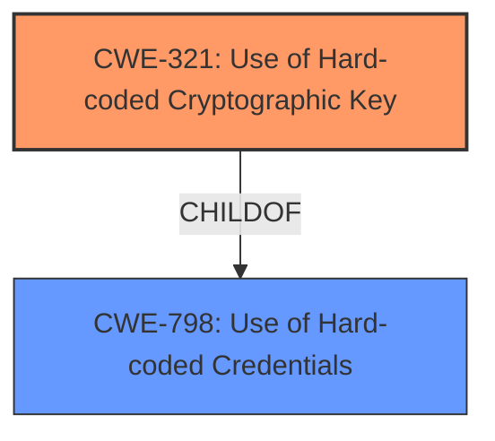

# Analysis Report for CVE-2020-25193

# Vulnerability Analysis Report: CVE-2020-25193

## Description


## Analysis (with Relationship Data)

# Summary
| CWE ID | CWE Name | Confidence | CWE Abstraction Level | CWE Vulnerability Mapping Label | CWE-Vulnerability Mapping Notes |
|---|---|---|---|---|---|
| CWE-321 | Use of Hard-coded Cryptographic Key | 1 | Variant | Allowed | Primary CWE |
| CWE-798 | Use of Hard-coded Credentials | 0.7 | Base | Allowed | Secondary Candidate |

## Evidence and Confidence

*   **Confidence Score:** 0.9
*   **Evidence Strength:** HIGH

## Relationship Analysis
The primary CWE is CWE-321, which is a variant of CWE-798. CWE-798 is a base CWE and a parent of CWE-321. This means that CWE-321 is a more specific type of CWE-798. The vulnerability description specifically mentions a **hard-coded cryptographic key**, making CWE-321 the more appropriate choice.



## Vulnerability Chain
The vulnerability chain is straightforward:
1.  **Root Cause:** The application uses a **hard-coded cryptographic key** (CWE-321).
2.  **Impact:** Attackers can intercept and decrypt encrypted traffic.

## Summary of Analysis
The initial analysis correctly identified CWE-321 as a strong candidate due to the presence of a **hard-coded cryptographic key**. The relationship analysis confirms that CWE-321 is a more specific variant of CWE-798, which deals with hard-coded credentials in general. Since the vulnerability description explicitly mentions a cryptographic key, CWE-321 is the most appropriate choice.

The selection of CWE-321 is based on the following evidence from the vulnerability description:

*   "By having access to the **hard-coded cryptographic key** for GE Reason RT430, RT431 & RT434 GNSS clocks in firmware versions prior to version 08A06, attackers would be able to intercept and decrypt encrypted traffic through an HTTPS connection."

This statement clearly indicates the presence of a **hard-coded cryptographic key**, which directly aligns with the description of CWE-321.

The analysis also considered CWE-798, but since CWE-321 is a more specific variant, it was chosen as the primary CWE.

The final selection of CWE-321 is at the optimal level of specificity because it directly addresses the root cause of the vulnerability, which is the use of a **hard-coded cryptographic key**.

Relevant CWE Information:

# Enhanced Context (25 CWEs)
The following CWEs were identified as potentially relevant to this vulnerability:

## CWE-1204: Generation of Weak Initialization Vector (IV)
**Abstraction Level**: Base
**Similarity Score**: 0.83
**Source**: dense

**Description**:
The product uses a cryptographic primitive that uses an Initialization
			Vector (IV), but the product does not generate IVs that are
			sufficiently unpredictable or unique according to the expected
			cryptographic requirements for that primitive.

## CWE-1240: Use of a Cryptographic Primitive with a Risky Implementation
**Abstraction Level**: Base
**Similarity Score**: 0.80
**Source**: dense

**Description**:
To fulfill the need for a cryptographic primitive, the product implements a cryptographic algorithm using a non-standard, unproven, or disallowed/non-compliant cryptographic implementation.

## CWE-1391: Use of Weak Credentials
**Abstraction Level**: Class
**Similarity Score**: 0.79
**Source**: dense

**Description**:
The product uses weak credentials (such as a default key or hard-coded password) that can be calculated, derived, reused, or guessed by an attacker.

## CWE-331: Insufficient Entropy
**Abstraction Level**: Base
**Similarity Score**: 0.78
**Source**: dense

**Description**:
The product uses an algorithm or scheme that produces insufficient entropy, leaving patterns or clusters of values that are more likely to occur than others.

## CWE-330: Use of Insufficiently Random Values
**Abstraction Level**: Class
**Similarity Score**: 0.78
**Source**: dense

**Description**:
The product uses insufficiently random numbers or values in a security context that depends on unpredictable numbers.

## CWE-656: Reliance on Security Through Obscurity
**Abstraction Level**: Class
**Similarity Score**: 0.76
**Source**: dense

**Description**:
The product uses a protection mechanism whose strength depends heavily on its obscurity, such that knowledge of its algorithms or key data is sufficient to defeat the mechanism.

## CWE-335: Incorrect Usage of Seeds in Pseudo-Random Number Generator (PRNG)
**Abstraction Level**: Base
**Similarity Score**: 0.76
**Source**: dense

**Description**:
The product uses a Pseudo-Random Number Generator (PRNG) but does not correctly manage seeds.

## CWE-321: Use of Hard-coded Cryptographic Key
**Abstraction Level**: Variant
**Similarity Score**: 0.75
**Source**: dense

**Description**:
The use of a hard-coded cryptographic key significantly increases the possibility that encrypted data may be recovered.

## CWE-1394: Use of Default Cryptographic Key
**Abstraction Level**: Base
**Similarity Score**: 0.75
**Source**: dense

**Description**:
The product uses a default cryptographic key for potentially critical functionality.

## CWE-798: Use of Hard-coded Credentials
**Abstraction Level**: Base
**Similarity Score**: 0.75
**Source**: dense

**Description**:
The product contains hard-coded credentials, such as a password or cryptographic key.

## CWE-798: Use of Hard-coded Credentials
**Abstraction Level**: Base
**Similarity Score**: 6473.26
**Source**: sparse

**Description**:
The product contains hard-coded credentials, such as a password or cryptographic key.

## CWE-1391: Use of Weak Credentials
**Abstraction Level**: Class
**Similarity Score**: 6469.15
**Source**: sparse

**Description**:
The product uses weak credentials (such as a default key or hard-coded password) that can be calculated, derived, reused, or guessed by an attacker.

## CWE-259: Use of Hard-coded Password
**Abstraction Level**: Variant
**Similarity Score**: 6319.64
**Source**: sparse

**Description**:
The product contains a hard-coded password, which it uses for its own inbound authentication or for outbound communication to external components.

## CWE-321: Use of Hard-coded Cryptographic Key
**Abstraction Level**: Variant
**Similarity Score**: 6203.83
**Source**: sparse

**Description**:
The use of a hard-coded cryptographic key significantly increases the possibility that encrypted data may be recovered.

## CWE-327: Use of a Broken or Risky Cryptographic Algorithm
**Abstraction Level**: Class
**Similarity Score**: 5928.95
**Source**: sparse

**Description**:
The product uses a broken or risky cryptographic algorithm or protocol.

## CWE-259: Use of Hard-coded Password
**Abstraction Level**: variant
**Similarity Score**: 4.53
**Source**: graph

**Description**:
CWE-259: Use of Hard-coded Password

## CWE-472: External Control of Assumed-Immutable Web Parameter
**Abstraction Level**: base
**Similarity Score**: 4.33
**Source**: graph

**Description**:
CWE-472: External Control of Assumed-Immutable Web Parameter

## CWE-603: Use of Client-Side Authentication
**Abstraction Level**: base
**Similarity Score**: 3.64
**Source**: graph

**Description**:
CWE-603: Use of Client-Side Authentication

## CWE-257: Storing Passwords in a Recoverable Format
**Abstraction Level**: base
**Similarity Score**: 3.64
**Source**: graph

**Description**:
CWE-257: Storing Passwords in a Recoverable Format

## CWE-321: Use of Hard-coded Cryptographic Key
**Abstraction Level**: Variant
**Similarity Score**: 3.02
**Source**: graph

**Description**:
The use of a hard-coded cryptographic key significantly increases the possibility that encrypted data may be recovered.

## CWE-804: Guessable CAPTCHA
**Abstraction Level**: base
**Similarity Score**: 2.87
**Source**: graph

**Description**:
CWE-804: Guessable CAPTCHA

## CWE-471: Modification of Assumed-Immutable Data (MAID)


## CWE Relationship Analysis

Current CWEs represent these abstraction levels: .


### Vulnerability Chain Analysis

**Chain starting from CWE-321:**
- 321 (Use of Hard-coded Cryptographic Key) - ROOT


**Chain starting from CWE-331:**
- 331 (Insufficient Entropy) - ROOT


### CWE Relationship Diagram

```mermaid
graph TD
    classDef primary fill:#f96,stroke:#333,stroke-width:2px
    classDef secondary fill:#69f,stroke:#333
    classDef tertiary fill:#9e9,stroke:#333
```


*Report generated on 2025-04-02 14:16:33*
