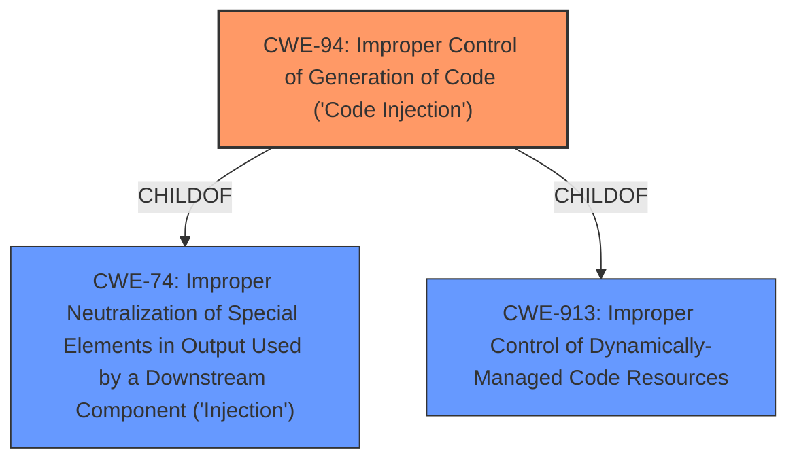

# Enhanced Analysis for CVE-2020-25197

# Summary
| CWE ID | CWE Name | Confidence | CWE Abstraction Level | CWE Vulnerability Mapping Label | CWE-Vulnerability Mapping Notes |
|---|---|---|---|---|---|
| CWE-94 | Improper Control of Generation of Code ('Code Injection') | 0.9 | Base | Allowed-with-Review | Primary CWE |

## Evidence and Confidence

*   **Confidence Score:** 0.9
*   **Evidence Strength:** HIGH

## Relationship Analysis
The primary relationship influencing this decision is the ChildOf relationship between CWE-94 and CWE-74. While CWE-74 is a broader "Injection" class, the vulnerability description explicitly mentions "**code injection**", making CWE-94 a more specific and appropriate choice. The other relationships (CanFollow, ParentOf, PeerOf) don't directly apply but were considered to ensure no other closely-related CWEs were more suitable. The base abstraction level of CWE-94 is also ideal, representing a specific type of **injection**.



## Vulnerability Chain
The vulnerability chain starts with the **improper control** of code generation (CWE-94). An attacker can inject malicious code into the system because the application **fails to neutralize** special elements. This leads to the execution of arbitrary code on the system, causing a significant security breach.

## Summary of Analysis
The initial assessment strongly points to CWE-94. The vulnerability description explicitly states "**code injection**", and the impact is the ability to "execute arbitrary code."

> A **code injection** vulnerability exists in one of the webpages in GE Reason RT430, RT431 & RT434 GNSS clocks in firmware versions prior to version 08A06 that could allow an authenticated remote attacker to execute arbitrary code on the system.

CWE-94's description aligns perfectly: "The product constructs all or part of a code segment using externally-influenced input from an upstream component, but it does not neutralize or incorrectly neutralizes special elements that could modify the syntax or behavior of the intended code segment."

The MITRE mapping guidance for CWE-94 notes "This entry is frequently misused for vulnerabilities with a technical impact of 'code execution,' which does not by itself indicate a root cause weakness, since dozens of weaknesses can enable code execution." However, in this case, the description explicitly mentions **code injection**, making CWE-94 appropriate.

The evidence explicitly points to **code injection** as the weakness, making CWE-94 the most specific and accurate classification.

Relevant CWE Information:

# Enhanced Context (25 CWEs)
The following CWEs were identified as potentially relevant to this vulnerability:

## CWE-74: Improper Neutralization of Special Elements in Output Used by a Downstream Component ('Injection')
**Abstraction Level**: Class
**Similarity Score**: 0.77
**Source**: dense

**Description**:
The product constructs all or part of a command, data structure, or record using externally-influenced input from an upstream component, but it does not neutralize or incorrectly neutralizes special elements that could modify how it is parsed or interpreted when it is sent to a downstream component.

**Mapping Guidance**:
- Usage: Discouraged
- Rationale: CWE-74 is high-level and often misused when lower-level weaknesses are more appropriate.

## CWE-78: Improper Neutralization of Special Elements used in an OS Command ('OS Command Injection')
**Abstraction Level**: base
**Similarity Score**: 5.03
**Source**: graph

**Description**:
CWE-78: Improper Neutralization of Special Elements used in an OS Command ('OS Command Injection')

**Mapping Guidance**:
- Usage: Allowed
- Rationale: This CWE entry is at the Base level of abstraction, which is a preferred level of abstraction for mapping to the root causes of vulnerabilities.

**Relationships**:
- CANFOLLOW -> CWE-184
- CANALSOBE -> CWE-88
- CHILDOF -> CWE-77
- CHILDOF -> CWE-77
- CHILDOF -> CWE-74

## CWE-121: Stack-based Buffer Overflow
**Abstraction Level**: Variant
**Similarity Score**: 0.74
**Source**: dense

**Description**:
A stack-based buffer overflow condition is a condition where the buffer being overwritten is allocated on the stack (i.e., is a local variable or, rarely, a parameter to a function).

**Mapping Guidance**:
- Usage: Allowed
- Rationale: This CWE entry is at the Variant level of abstraction, which is a preferred level of abstraction for mapping to the root causes of vulnerabilities.

## CWE-88: Improper Neutralization of Argument Delimiters in a Command ('Argument Injection')
**Abstraction Level**: Base
**Similarity Score**: 8182.26
**Source**: sparse

**Description**:
The product constructs a string for a command to be executed by a separate component
in another control sphere, but it does not properly delimit the
intended arguments, options, or switches within that command string.

**Mapping Guidance**:
- Usage: Allowed
- Rationale: This CWE entry is at the Base level of abstraction, which is a preferred level of abstraction for mapping to the root causes of vulnerabilities.

## CWE-259: Use of Hard-coded Password
**Abstraction Level**: Variant
**Similarity Score**: 4.01
**Source**: graph

**Description**:
CWE-259: Use of Hard-coded Password

**Mapping Guidance**:
- Usage: Allowed
- Rationale: This CWE entry is at the Variant level of abstraction, which is a preferred level of abstraction for mapping to the root causes of vulnerabilities.

## CWE-79: Improper Neutralization of Input During Web Page Generation ('Cross-site Scripting')
**Abstraction Level**: Base
**Similarity Score**: 5.03
**Source**: graph

**Description**:
CWE-79: Improper Neutralization of Input During Web Page Generation ('Cross-site Scripting')

**Mapping Guidance**:
- Usage: Allowed
- Rationale: This CWE entry is at the Base level of abstraction, which is a preferred level of abstraction for mapping to the root causes of vulnerabilities.

## CWE-502: Deserialization of Untrusted Data
**Abstraction Level**: Base
**Similarity Score**: 0.74
**Source**: dense

**Description**:
The product deserializes untrusted data without sufficiently ensuring that the resulting data will be valid.

**Mapping Guidance**:
- Usage: Allowed
- Rationale: This CWE entry is at the Base level of abstraction, which is a preferred level of abstraction for mapping to the root causes of vulnerabilities.

**CWEs Considered but Not Used:**

*   **CWE-78: Improper Neutralization of Special Elements used in an OS Command ('OS Command Injection')**: While related to command execution, the description doesn't specifically indicate that it's an OS command being injected, but rather arbitrary code.
*   **CWE-121: Stack-based Buffer Overflow**: The description focuses on code injection, not memory corruption.
*   **CWE-88: Improper Neutralization of Argument Delimiters in a Command ('Argument Injection')**: Similar to CWE-78, this is more specific than the general **code injection** described.
*   **CWE-259: Use of Hard-coded Password**: This is unrelated to code injection.
*   **CWE-79: Improper Neutralization of Input During Web Page Generation ('Cross-site Scripting')**: The vulnerability is not specifically related to web page generation or cross-site scripting.
*   **CWE-502: Deserialization of Untrusted Data**: There is no mention of deserialization.


## CWE Relationship Analysis

Current CWEs represent these abstraction levels: .


### Vulnerability Chain Analysis

**Chain starting from CWE-502:**
- 502 (Deserialization of Untrusted Data) - ROOT


**Chain starting from CWE-121:**
- 121 (Stack-based Buffer Overflow) - ROOT


### CWE Relationship Diagram

```mermaid
graph TD
    classDef primary fill:#f96,stroke:#333,stroke-width:2px
    classDef secondary fill:#69f,stroke:#333
    classDef tertiary fill:#9e9,stroke:#333
```