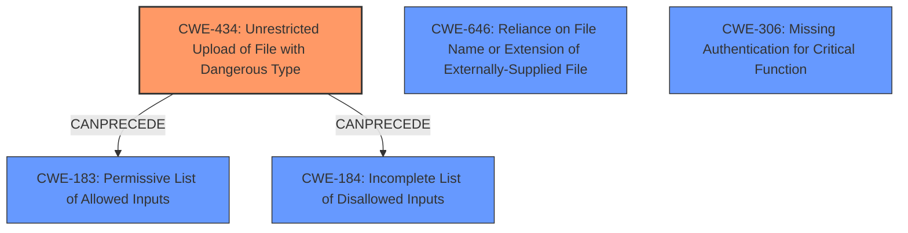

# Enhanced Analysis for CVE-2020-25213

# Summary
| CWE ID | CWE Name | Confidence | CWE Abstraction Level | CWE Vulnerability Mapping Label | CWE-Vulnerability Mapping Notes |
|---|---|---|---|---|---|
| CWE-434 | Unrestricted Upload of File with Dangerous Type | 1.0 | Base | Allowed | Primary CWE |
| CWE-646 | Reliance on File Name or Extension of Externally-Supplied File | 0.75 | Variant | Allowed | Secondary Candidate |
| CWE-306 | Missing Authentication for Critical Function | 0.5 | Base | Allowed | Secondary Candidate |

## Evidence and Confidence

*   **Confidence Score:** 0.85
*   **Evidence Strength:** HIGH

## Relationship Analysis
The primary relationship is between CWE-434 and its potential chaining with incomplete allowlist/denylist errors (CWE-183, CWE-184). CWE-646 is related as the file extension is relied on but isn't the root cause. CWE-306 is related due to the missing authentication allowing unrestricted access.



## Vulnerability Chain
The vulnerability chain starts with **improper file handling** resulting in an unrestricted file upload, then allowing for remote code execution.
  - **Root Cause:** **Improper file handling** (deployment of unsafe example file with .php extension)
  - **Weakness:** Unrestricted file upload (CWE-434)
  - **Impact:** Remote code execution

## Summary of Analysis
The primary CWE is CWE-434, "Unrestricted Upload of File with Dangerous Type," because the core issue is the ability to upload and execute arbitrary PHP code due to the **improper handling** of a file. The `CVE Reference Links Content Summary` states: "Attackers could upload malicious files (e.g., web shells) and execute arbitrary code on affected WordPress sites." This aligns directly with the description of CWE-434: "The product allows the upload or transfer of dangerous file types that are automatically processed within its environment."

The `Vulnerability Description Key Phrases` also mentions the **rootcause** as **improper file handling**.

CWE-646, "Reliance on File Name or Extension of Externally-Supplied File," is considered as a secondary CWE, because the plugin relies on the `.php` extension to process the file, but the bigger issue is allowing the upload of a dangerous file type in the first place. The `CVE Reference Links Content Summary` shows evidence of this: "The File Manager plugin for WordPress included an elFinder library's example file (connector.minimal.php.dist) renamed to .php, making it directly accessible without authentication."

CWE-306 "Missing Authentication for Critical Function" is also considered as a secondary CWE because the uploaded file can be accessed without authentication. The `CVE Reference Links Content Summary` shows evidence of this: "This file allowed execution of elFinder commands, including file uploads, without any access restrictions."

I considered CWE-22 "Improper Limitation of a Pathname to a Restricted Directory ('Path Traversal')" and CWE-23 "Relative Path Traversal", but these are less relevant because the vulnerability doesn't primarily involve traversing directories outside of intended locations. The elFinder library has protection against directory traversal. The issue is uploading and executing the PHP file in the first place, not escaping the upload directory.

I considered CWE-79 "Improper Neutralization of Input During Web Page Generation ('Cross-site Scripting')", but this is not relevant because the vulnerability doesn't primarily involve injecting malicious scripts into web pages served to other users. The issue is direct code execution via uploaded PHP files.

I am confident in my selection of CWE-434 as the primary CWE because it directly addresses the root cause of the vulnerability: the unrestricted upload of a dangerous file type. The supporting evidence from the vulnerability description and CVE details strongly supports this classification.


## CWE Relationship Analysis

Current CWEs represent these abstraction levels: .


### Vulnerability Chain Analysis

**Chain starting from CWE-646:**
- 646 (Reliance on File Name or Extension of Externally-Supplied File) - ROOT


**Chain starting from CWE-306:**
- 306 (Missing Authentication for Critical Function) - ROOT


### CWE Relationship Diagram

```mermaid
graph TD
    classDef primary fill:#f96,stroke:#333,stroke-width:2px
    classDef secondary fill:#69f,stroke:#333
    classDef tertiary fill:#9e9,stroke:#333
```