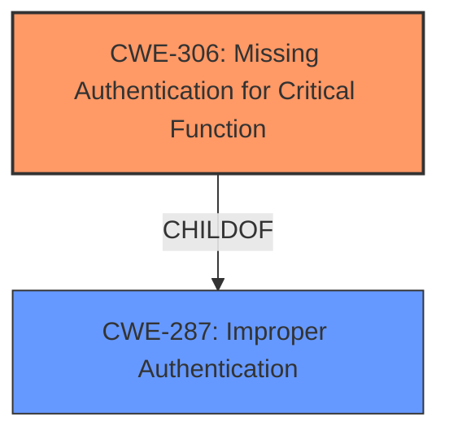

# Analysis for CVE-2020-25218

# Summary
| CWE ID | CWE Name | Confidence | CWE Abstraction Level | CWE Vulnerability Mapping Label | CWE-Vulnerability Mapping Notes |
|---|---|---|---|---|---|
| CWE-306 | Missing Authentication for Critical Function | 1.0 | Base | Primary | Allowed |

## Evidence and Confidence

*   **Confidence Score:** 1.0
*   **Evidence Strength:** HIGH

## Relationship Analysis
The primary relationship that impacted my decision was the ChildOf relationship between CWE-306 and CWE-287 (Improper Authentication). While CWE-287 is a broader class, CWE-306 specifically addresses the scenario where authentication is entirely missing for critical functions, which aligns precisely with the vulnerability description. The Retriever results also support this, listing CWE-306 as the top candidate.

## Vulnerability Chain
The vulnerability chain is straightforward:

1.  **Root Cause:** **Missing authentication** for the `/cgi-bin/direct-login` URL.
2.  **Weakness:** Authentication Bypass
3.  **Impact:** Unauthenticated access to the administrative web interface, potentially leading to remote code execution and device compromise.

## Summary of Analysis
Initially, I considered other CWEs such as CWE-287 (Improper Authentication) and CWE-288 (Authentication Bypass Using an Alternate Path or Channel). However, the vulnerability description explicitly states that authentication is **missing** for a critical function (accessing the administrative web interface via the `/cgi-bin/direct-login` URL). This indicates that there is no authentication mechanism in place for this specific functionality, which is best captured by CWE-306.

The "CVE Reference Links Content Summary" provides direct evidence: "The Grandstream Networks GRP261x VoIP phone firmware version 1.0.3.6 (Base) processes HTTP GET requests to the `/cgi-bin/direct-login` URL **without requiring authentication**."

CWE-287 is a more general class of authentication flaws, and CWE-288 implies that there is some form of authentication present, but it can be bypassed via an alternate channel. In this case, there's no authentication at all on the affected path.

CWE-306 is a Base level CWE, which is the preferred level of abstraction, and the mapping guidance explicitly allows its use. I am confident that CWE-306 accurately reflects the root cause of this vulnerability.