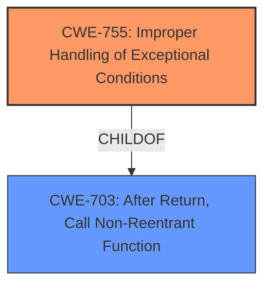

# Enhanced Analysis for CVE-2020-25236

# Summary
| CWE ID | CWE Name | Confidence | CWE Abstraction Level | CWE Vulnerability Mapping Label | CWE-Vulnerability Mapping Notes |
|---|---|---|---|---|---|
| CWE-755 | Improper Handling of Exceptional Conditions | 1.0 | Class | Primary | Allowed-with-Review |

## Evidence and Confidence

*   **Confidence Score:** 1.0
*   **Evidence Strength:** HIGH

## Relationship Analysis
The primary CWE selected is CWE-755, which is a Class-level CWE. While normally this would be cause for concern, in this case the description of CWE-755 directly mirrors the stated root cause of the vulnerability. CWE-755 is a child of CWE-703, but the additional information provided by CWE-703 does not further enhance the classification, so CWE-755 is the best choice.



## Vulnerability Chain
The vulnerability chain starts with the manipulation of the control logic (CL) which then leads to the **improper handling of exceptional conditions** (CWE-755), and ends with the device crashing.

## Summary of Analysis
The analysis is based on the evidence that the root cause of the vulnerability is the **improper handling of exceptional conditions**.

> **Root cause of vulnerability:**
> The vulnerability lies in the way the LOGO! 8 device handles manipulated control logic (CL). Specifically, the device does not properly handle exceptional conditions that arise from the manipulation of the control logic.

> **Weaknesses/vulnerabilities present:**
> - Improper handling of exceptional conditions (CWE-755).

The graph relationships confirm that selecting CWE-755 is the most appropriate, even though it is a Class-level CWE, due to the direct match with the vulnerability's root cause.
The selected CWE is at the optimal level of specificity because the description of CWE-755 aligns directly with the vulnerability description.

Relevant CWE Information:

# Enhanced Context (25 CWEs)
The following CWEs were identified as potentially relevant to this vulnerability:

## CWE-807: Reliance on Untrusted Inputs in a Security Decision
**Abstraction Level**: Base
**Similarity Score**: 0.77

**Description**:
The product uses a protection mechanism that relies on the existence or values of an input, but the input can be modified by an untrusted actor in a way that bypasses the protection mechanism.

**Mapping Guidance**:
- Usage: Allowed
- Rationale: This CWE entry is at the Base level of abstraction, which is a preferred level of abstraction for mapping to the root causes of vulnerabilities.
*This was not selected because the vulnerability is not about relying on untrusted inputs, but rather the **improper handling of exceptional conditions**.*

## CWE-1289: Improper Validation of Unsafe Equivalence in Input
**Abstraction Level**: Base
**Similarity Score**: 0.77

**Description**:
The product receives an input value that is used as a resource identifier or other type of reference, but it does not validate or incorrectly validates that the input is equivalent to a potentially-unsafe value.

**Mapping Guidance**:
- Usage: Allowed
- Rationale: This CWE entry is at the Base level of abstraction, which is a preferred level of abstraction for mapping to the root causes of vulnerabilities.
*This was not selected because the vulnerability is not about the improper validation of unsafe equivalence in input, but rather the **improper handling of exceptional conditions**.*

## CWE-345: Insufficient Verification of Data Authenticity
**Abstraction Level**: Class
**Similarity Score**: 0.77

**Description**:
The product does not sufficiently verify the origin or authenticity of data, in a way that causes it to accept invalid data.

**Mapping Guidance**:
- Usage: Discouraged
- Rationale: This CWE entry is a level-1 Class (i.e., a child of a Pillar). It might have lower-level children that would be more appropriate
*This was not selected because the vulnerability is not about insufficient verification of data authenticity, but rather the **improper handling of exceptional conditions**.*

## CWE-667: Improper Locking
**Abstraction Level**: Class
**Similarity Score**: 0.76

**Description**:
The product does not properly acquire or release a lock on a resource, leading to unexpected resource state changes and behaviors.

**Mapping Guidance**:
- Usage: Allowed-with-Review
- Rationale: This CWE entry is a Class and might have Base-level children that would be more appropriate
*This was not selected because the vulnerability is not about improper locking, but rather the **improper handling of exceptional conditions**.*

## CWE-1391: Use of Weak Credentials
**Abstraction Level**: Class
**Similarity Score**: 0.76

**Description**:
The product uses weak credentials (such as a default key or hard-coded password) that can be calculated, derived, reused, or guessed by an attacker.

**Mapping Guidance**:
- Usage: Allowed-with-Review
- Rationale: This CWE entry is a Class and might have Base-level children that would be more appropriate
*This was not selected because the vulnerability is not about the use of weak credentials, but rather the **improper handling of exceptional conditions**.*

## CWE-280: Improper Handling of Insufficient Permissions or Privileges 
**Abstraction Level**: Base
**Similarity Score**: 0.76

**Description**:
The product does not handle or incorrectly handles when it has insufficient privileges to access resources or functionality as specified by their permissions. This may cause it to follow unexpected code paths that may leave the product in an invalid state.

**Mapping Guidance**:
- Usage: Allowed
- Rationale: This CWE entry is at the Base level of abstraction, which is a preferred level of abstraction for mapping to the root causes of vulnerabilities.
*This was not selected because the vulnerability is not about improper handling of insufficient permissions or privileges, but rather the **improper handling of exceptional conditions**.*

## CWE-303: Incorrect Implementation of Authentication Algorithm
**Abstraction Level**: Base
**Similarity Score**: 0.76

**Description**:
The requirements for the product dictate the use of an established authentication algorithm, but the implementation of the algorithm is incorrect.

**Mapping Guidance**:
- Usage: Allowed
- Rationale: This CWE entry is at the Base level of abstraction, which is a preferred level of abstraction for mapping to the root causes of vulnerabilities.
*This was not selected because the vulnerability is not about the incorrect implementation of an authentication algorithm, but rather the **improper handling of exceptional conditions**.*

## CWE-1220: Insufficient Granularity of Access Control
**Abstraction Level**: Base
**Similarity Score**: 0.76

**Description**:
The product implements access controls via a policy or other feature with the intention to disable or restrict accesses (reads and/or writes) to assets in a system from untrusted agents. However, implemented access controls lack required granularity, which renders the control policy too broad because it allows accesses from unauthorized agents to the security-sensitive assets.

**Mapping Guidance**:
- Usage: Allowed
- Rationale: This CWE entry is at the Base level of abstraction, which is a preferred level of abstraction for mapping to the root causes of vulnerabilities.
*This was not selected because the vulnerability is not about insufficient granularity of access control, but rather the **improper handling of exceptional conditions**.*

## CWE-639: Authorization Bypass Through User-Controlled Key
**Abstraction Level**: Base
**Similarity Score**: 0.76

**Description**:
The system's authorization functionality does not prevent one user from gaining access to another user's data or record by modifying the key value identifying the data.

**Mapping Guidance**:
- Usage: Allowed
- Rationale: This CWE entry is at the Base level of abstraction, which is a preferred level of abstraction for mapping to the root causes of vulnerabilities.
*This was not selected because the vulnerability is not about authorization bypass through a user-controlled key, but rather the **improper handling of exceptional conditions**.*

## CWE-798: Use of Hard-coded Credentials
**Abstraction Level**: Base
**Similarity Score**: 0.76

**Description**:
The product contains hard-coded credentials, such as a password or cryptographic key.

**Mapping Guidance**:
- Usage: Allowed
- Rationale: This CWE entry is at the Base level of abstraction, which is a preferred level of abstraction for mapping to the root causes of vulnerabilities.
*This was not selected because the vulnerability is not about the use of hard-coded credentials, but rather the **improper handling of exceptional conditions**.*

## CWE-1285: Improper Validation of Specified Index, Position, or Offset in Input
**Abstraction Level**: Base
**Similarity Score**: 6246.11

**Description


## CWE Relationship Analysis

Current CWEs represent these abstraction levels: .


### Vulnerability Chain Analysis

**Chain starting from CWE-667:**
- 667 (Improper Locking) - ROOT


**Chain starting from CWE-303:**
- 303 (Incorrect Implementation of Authentication Algorithm) - ROOT


### CWE Relationship Diagram

```mermaid
graph TD
    classDef primary fill:#f96,stroke:#333,stroke-width:2px
    classDef secondary fill:#69f,stroke:#333
    classDef tertiary fill:#9e9,stroke:#333
```