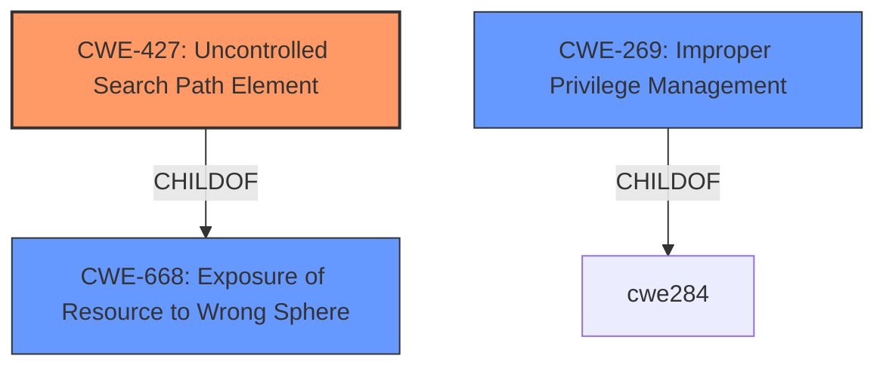

# Analysis for CVE-2020-25238

# Summary
| CWE ID | CWE Name | Confidence | CWE Abstraction Level | CWE Vulnerability Mapping Label | CWE-Vulnerability Mapping Notes |
|---|---|---|---|---|---|
| CWE-427 | Uncontrolled Search Path Element | 0.9 | Base | Allowed | Primary CWE |
| CWE-269 | Improper Privilege Management | 0.5 | Class | Discouraged | Secondary Candidate |

## Evidence and Confidence

*   **Confidence Score:** 0.9
*   **Evidence Strength:** HIGH

## Relationship Analysis
The primary relationship that influenced the decision was the ChildOf relationship between CWE-427 and CWE-668. CWE-427 is a Base level CWE that more specifically describes the **uncontrolled search path element** that leads to the vulnerability, while CWE-668 is a Class level CWE that is too broad. CWE-269 was considered because the vulnerability leads to privilege escalation, however, it is a Class level CWE and is also commonly misused, so it was not selected as the primary CWE.

## Vulnerability Chain
The chain of root cause and weaknesses for this vulnerability is:
1.  **Root Cause:** The Node.js application does not properly set the module search path, leading it to search in `C:\node_modules\`.
2.  **Weakness:** Unprivileged users can create directories and files under the system root (C:\), leading to an **uncontrolled search path element**.
3.  **Impact:** An attacker can place a malicious `.js` file in `C:\node_modules\` which gets executed with SYSTEM privileges when the server starts, leading to arbitrary code execution with SYSTEM privileges and privilege escalation.

## Summary of Analysis
The primary CWE selected was CWE-427, Uncontrolled Search Path Element. This selection is based on the evidence provided in the "CVE Reference Links Content Summary" section, which explicitly states that the Node.js server does not restrict its module search path, leading it to look in a user-writable location (C:\node_modules). The root cause is the **improper configuration of the module search path**, allowing an attacker to place malicious code in a location where it will be executed with elevated privileges.

> The Siemens TIA (Totally Integrated Automation) Portal and PCS neo administration console's Node.js component fails to properly set the module search path. Specifically, the Node.js server searches for modules in `C:\node_modules\` by default when the server is started.
> **Improper Access Control:** Unprivileged Windows users can create directories and files under the system root (C:\).
> **Insecure Module Loading:** The Node.js server doesn't restrict its module search path, leading it to look in a user-writable location (C:\node_modules).

CWE-427 accurately captures this weakness, as it describes a scenario where the product uses a fixed search path, but one or more locations in that path can be under the control of unintended actors.

Other CWEs were considered, but ultimately deemed less appropriate. CWE-269 (Improper Privilege Management) was considered due to the privilege escalation aspect, but the root cause is not directly related to privilege management, but rather the **uncontrolled search path**. Similarly, CWE-200 (Exposure of Sensitive Information to an Unauthorized Actor) was not selected because the vulnerability does not directly involve the exposure of sensitive information.

The final decision to select CWE-427 is based on the specific details of the vulnerability, the relationship analysis, and the mapping guidance provided by MITRE. CWE-427 is at the Base level of abstraction, which is a preferred level for mapping, and accurately represents the **root cause of the vulnerability**.

Relevant CWE Information:

# Enhanced Context (25 CWEs)
The following CWEs were identified as potentially relevant to this vulnerability:

## CWE-668: Exposure of Resource to Wrong Sphere
**Abstraction Level**: Class
**Similarity Score**: 0.76
**Source**: dense

**Description**:
The product exposes a resource to the wrong control sphere, providing unintended actors with inappropriate access to the resource.

**Mapping Guidance**:
- Usage: Discouraged
- Rationale: CWE-668 is high-level and is often misused as a catch-all when lower-level CWE IDs might be applicable. It is sometimes used for low-information vulnerability reports [REF-1287]. It is a level-1 Class (i.e., a child of a Pillar). It is not useful for trend analysis.

## CWE-538: Insertion of Sensitive Information into Externally-Accessible File or Directory
**Abstraction Level**: Base
**Similarity Score**: 0.76
**Source**: dense

**Description**:
The product places sensitive information into files or directories that are accessible to actors who are allowed to have access to the files, but not to the sensitive information.

**Mapping Guidance**:
- Usage: Allowed
- Rationale: This CWE entry is at the Base level of abstraction, which is a preferred level of abstraction for mapping to the root causes of vulnerabilities.

## CWE-74: Improper Neutralization of Special Elements in Output Used by a Downstream Component ('Injection')
**Abstraction Level**: Class
**Similarity Score**: 0.75
**Source**: dense

**Description**:
The product constructs all or part of a command, data structure, or record using externally-influenced input from an upstream component, but it does not neutralize or incorrectly neutralizes special elements that could modify how it is parsed or interpreted when it is sent to a downstream component.

**Mapping Guidance**:
- Usage: Discouraged
- Rationale: CWE-74 is high-level and often misused when lower-level weaknesses are more appropriate.

## CWE-807: Reliance on Untrusted Inputs in a Security Decision
**Abstraction Level**: Base
**Similarity Score**: 0.75
**Source**: dense

**Description**:
The product uses a protection mechanism that relies on the existence or values of an input, but the input can be modified by an untrusted actor in a way that bypasses the protection mechanism.

**Mapping Guidance**:
- Usage: Allowed
- Rationale: This CWE entry is at the Base level of abstraction, which is a preferred level of abstraction for mapping to the root causes of vulnerabilities.

## CWE-653: Improper Isolation or Compartmentalization
**Abstraction Level**: Class
**Similarity Score**: 0.75
**Source**: dense

**Description**:
The product does not properly compartmentalize or isolate functionality, processes, or resources that require different privilege levels, rights, or permissions.

**Mapping Guidance**:
- Usage: Allowed
- Rationale: This CWE entry is at the Base level of abstraction, which is a preferred level of abstraction for mapping to the root causes of vulnerabilities.

## CWE-274: Improper Handling of Insufficient Privileges
**Abstraction Level**: Base
**Similarity Score**: 0.75
**Source**: dense

**Description**:
The product does not handle or incorrectly handles when it has insufficient privileges to perform an operation, leading to resultant weaknesses.

**Mapping Guidance**:
- Usage: Discouraged
- Rationale: This CWE entry could be deprecated in a future version of CWE.

## CWE-41: Improper Resolution of Path Equivalence
**Abstraction Level**: Base
**Similarity Score**: 0.75
**Source**: dense

**Description**:
The product is vulnerable to file system contents disclosure through path equivalence. Path equivalence involves the use of special characters in file and directory names. The associated manipulations are intended to generate multiple names for the same object.

**Mapping Guidance**:
- Usage: Allowed
- Rationale: This CWE entry is at the Base level of abstraction, which is a preferred level of abstraction for mapping to the root causes of vulnerabilities.

## CWE-552: Files or Directories Accessible to External Parties
**Abstraction Level**: Base
**Similarity Score**: 0.75
**Source**: dense

**Description**:
The product makes files or directories accessible to unauthorized actors, even though they should not be.

**Mapping Guidance**:
- Usage: Allowed
- Rationale: This CWE entry is at the Base level of abstraction, which is a preferred level of abstraction for mapping to the root causes of vulnerabilities.

## CWE-345: Insufficient Verification of Data Authenticity
**Abstraction Level**: Class
**Similarity Score**: 0.75
**Source**: dense

**Description**:
The product does not sufficiently verify the origin or authenticity of data, in a way that causes it to accept invalid data.

**Mapping Guidance**:
- Usage: Discouraged
- Rationale: This CWE

# Enhanced Query for CVE-2020-25238

## Vulnerability Description
A vulnerability has been identified in PCS neo (Administration Console) (All versions < V3.1), TIA Portal (V15, V15.1 and V16). Manipulating certain files in specific folders could allow a local attacker to execute code with SYSTEM privileges. The security vulnerability could be exploited by an attacker with a valid account and limited access rights on the system.

### Vulnerability Description Key Phrases
- **impact:** execute code with SYSTEM privileges
- **vector:** Manipulating certain files in specific folders
- **attacker:** local attacker
- **product:** PCS neo and TIA Portal
- **version:** All versions < V3.1 and V15, V15.1 and V16
- **component:** Administration Console and Teamcenter

## CVE Reference Links Content Summary
Based on the provided information, here's an analysis of CVE-2020-25238:

**Root Cause of Vulnerability:**
- The Siemens TIA (Totally Integrated Automation) Portal and PCS neo administration console's Node.js component fails to properly set the module search path.
- Specifically, the Node.js server searches for modules in `C:\node_modules\` by default when the server is started.

**Weaknesses/Vulnerabilities Present:**
- **Improper Access Control:** Unprivileged Windows users can create directories and files under the system root (C:\).
- **Insecure Module Loading:** The Node.js server doesn't restrict its module search path, leading it to look in a user-writable location (C:\node_modules).

**Impact of Exploitation:**
- **Arbitrary Code Execution with SYSTEM privileges:** An attacker can create the `C:\node_modules\` directory and place a malicious `.js` file within it. When the vulnerable server starts, it loads and executes this file, resulting in code execution with SYSTEM privileges.
- **Privilege Escalation:** An unprivileged user gains SYSTEM level access to the system.

**Attack Vectors:**
- **Local Attack:** The vulnerability can be exploited by an attacker with a valid account and limited access rights on the system.
- **File System Manipulation:** The attacker needs to create a directory and place a file in a specific location within the file system.

**Required Attacker Capabilities/Position:**
- An attacker needs a valid, but unprivileged, local account on the Windows system.
- The attacker must have write access to create folders and files under the system root.
- The attacker needs to create a malicious JavaScript file.

**Summary of Technical Details:**
The vulnerability lies in the Node.js application not properly setting the module search path. When the Node.js component starts, it searches for modules in the `C:\node_modules\` directory. Since standard users can create this directory and its contents, they can inject malicious JavaScript that gets executed with SYSTEM privileges when the Node.js application starts up. This allows for privilege escalation from unprivileged user to SYSTEM.

The Siemens Security Advisory (SSA-428051) confirms the information in the CERT vulnerability note. It states that the vulnerability allows local users to escalate privileges and execute code as local SYSTEM user and that the CVSS v3.1 Base Score is 7.8, with the vector `CVSS:3.1/AV:L/AC:L/PR:L/UI:N/S:U/C:H/I:H/A:H/E:P/RL:O/RC:C` and the CWE being `CWE-284: Improper Access Control`.

## Retriever Results

### Top Combined Results

| Rank | CWE ID | Name | Abstraction | Usage  | Retrievers | Individual Scores |
|------|--------|------|-------------|-------|------------|-------------------|
| 1 | 427 | Uncontrolled Search Path Element | Base | Allowed | sparse | 0.113 |
| 2 | 538 | Insertion of Sensitive Information into Externally-Accessible File or Directory | Base | Allowed | sparse | 0.110 |
| 3 | 755 | Improper Handling of Exceptional Conditions | Class | Discouraged | sparse | 0.106 |
| 4 | 732 | Incorrect Permission Assignment for Critical Resource | Class | Allowed-with-Review | sparse | 0.104 |
| 5 | 269 | Improper Privilege Management | Class | Discouraged | sparse | 0.100 |
| 6 | 200 | Exposure of Sensitive Information to an Unauthorized Actor | Class | Discouraged | dense | 0.557 |
| 7 | 98 | Improper Control of Filename for Include/Require Statement in PHP Program ('PHP Remote File Inclusion') | Variant | Allowed | graph | 0.002 |
| 8 | 285 | Improper Authorization | Class | Discouraged | sparse | 0.099 |
| 9 | 287 | Improper Authentication | Class | Discouraged | sparse | 0.099 |
| 10 | 502 | Deserialization of Untrusted Data | Base | Allowed | sparse | 0.099 |

# Complete CWE Specifications

## CWE-427: Uncontrolled Search Path Element
**Abstraction:** Base
**Status:** Draft

### Description
The product uses a fixed or controlled search path to find resources, but one or more locations in that path can be under the control of unintended actors.

### Extended Description

Although this weakness can occur with any type of resource, it is frequently introduced when a product uses a directory search path to find executables or code libraries, but the path contains a directory that can be modified by an attacker, such as "/tmp" or the current working directory.

In Windows-based systems, when the LoadLibrary or LoadLibraryEx function is called with a DLL name that does not contain a fully qualified path, the function follows a search order that includes two path elements that might be uncontrolled:

  - the directory from which the program has been loaded

  - the current working directory

In some cases, the attack can be conducted remotely, such as when SMB or WebDAV network shares are used.

One or more locations in that path could include the Windows drive root or its subdirectories. This often exists in Linux-based code assuming the controlled nature of the root directory (/) or its subdirectories (/etc, etc), or a code that recursively accesses the parent directory. In Windows, the drive root and some of its subdirectories have weak permissions by default, which makes them uncontrolled.

In some Unix-based systems, a PATH might be created that contains an empty element, e.g. by splicing an empty variable into the PATH. This empty element can be interpreted as equivalent to the current working directory, which might be an untrusted search element.

In software package management frameworks (e.g., npm, RubyGems, or PyPi), the framework may identify dependencies on third-party libraries or other packages, then consult a repository that contains the desired package. The framework may search a public repository before a private repository. This could be exploited by attackers by placing a malicious package in the public repository that has the same name as a package from the private repository. The search path might not be directly under control of the developer relying on the framework, but this search order effectively contains an untrusted element.

### Alternative Terms
DLL preloading: This term is one of several that are used to describe exploitation of untrusted search path elements in Windows systems, which received wide attention in August 2010. From a weakness perspective, the term is imprecise because it can apply to both CWE-426 and CWE-427.
Binary planting: This term is one of several that are used to describe exploitation of untrusted search path elements in Windows systems, which received wide attention in August 2010. From a weakness perspective, the term is imprecise because it can apply to both CWE-426 and CWE-427.
Insecure library loading: This term is one of several that are used to describe exploitation of untrusted search path elements in Windows systems, which received wide attention in August 2010. From a weakness perspective, the term is imprecise because it can apply to both CWE-426 and CWE-427.
Dependency confusion: As of February 2021, this term is used to describe CWE-427 in the context of managing installation of software package dependencies, in which attackers release packages on public sites where the names are the same as package names used by private repositories, and the search for the dependent package tries the public site first, downloading untrusted code. It may also be referred to as a "substitution attack."

### Relationships
ChildOf -> CWE-668
ChildOf -> CWE-668

### Mapping Guidance
**Usage:** Allowed
**Rationale:** This CWE entry is at the Base level of abstraction, which is a preferred level of abstraction for mapping to the root causes of vulnerabilities.
**Comments:** Carefully read both the name and description to ensure that this mapping is an appropriate fit. Do not try to 'force' a mapping to a lower-level Base/Variant simply to comply with this preferred level of abstraction.
**Reasons:**
- Acceptable-Use

### Additional Notes
**[Relationship]** Unlike untrusted search path (CWE-426), which inherently involves control over the definition of a control sphere (i.e., modification of a search path), this entry concerns a fixed control sphere in which some part of the sphere may be under attacker control (i.e., the search path cannot be modified by an attacker, but one element of the path can be under attacker control).

**[Theoretical]** This weakness is not a clean fit under CWE-668 or CWE-610, which suggests that the control sphere model might need enhancement or clarification.

### Observed Examples
- **CVE-2023-25815:** chain: a change in an underlying package causes the gettext function to use implicit initialization with a hard-coded path (CWE-1419) under the user-writable C:\ drive, introducing an untrusted search path element (CWE-427) that enables spoofing of messages.
- **CVE-2022-4826:** Go-based git extension on Windows can search for and execute a malicious "..exe" in a repository because Go searches the current working directory if git.exe is not found in the PATH
- **CVE-2020-26284:** A Static Site Generator built in Go, when running on Windows, searches the current working directory for a command, possibly allowing code execution using a malicious .exe or .bat file with the name being searched

## CWE-538: Insertion of Sensitive Information into Externally-Accessible File or Directory
**Abstraction:** Base
**Status:** Draft

### Description
The product places sensitive information into files or directories that are accessible to actors who are allowed to have access to the files, but not to the sensitive information.

### Extended Description
Not provided

### Alternative Terms
None

### Relationships
ChildOf -> CWE-200

### Mapping Guidance
**Usage:** Allowed
**Rationale:** This CWE entry is at the Base level of abstraction, which is a preferred level of abstraction for mapping to the root causes of vulnerabilities.
**Comments:** Carefully read both the name and description to ensure that this mapping is an appropriate fit. Do not try to 'force' a mapping to a lower-level Base/Variant simply to comply with this preferred level of abstraction.
**Reasons:**
- Acceptable-Use

### Additional Notes
**[Maintenance]** Depending on usage, this could be a weakness or a category. Further study of all its children is needed, and the entire sub-tree may need to be clarified. The current organization is based primarily on the exposure of sensitive information as a consequence, instead of as a primary weakness.

**[Maintenance]** There is a close relationship with CWE-552, which is more focused on weaknesses. As a result, it may be more appropriate to convert CWE-538 to a category.

### Observed Examples
- **CVE-2018-1999036:** SSH password for private key stored in build log

## CWE-755: Improper Handling of Exceptional Conditions
**Abstraction:** Class
**Status:** Incomplete

### Description
The product does not handle or incorrectly handles an exceptional condition.

### Extended Description
Not provided

### Alternative Terms
None

### Relationships
ChildOf -> CWE-703

### Mapping Guidance
**Usage:** Discouraged
**Rationale:** This CWE entry is a level-1 Class (i.e., a child of a Pillar). It might have lower-level children that would be more appropriate
**Comments:** Examine children of this entry to see if there is a better fit
**Reasons:**
- Abstraction

### Observed Examples
- **CVE-2023-41151:** SDK for OPC Unified Architecture (OPC UA) server has uncaught exception when a socket is blocked for writing but the server tries to send an error
- **[REF-1374]:** Chain: JavaScript-based cryptocurrency library can fall back to the insecure Math.random() function instead of reporting a failure (CWE-392), thus reducing the entropy (CWE-332) and leading to generation of non-unique cryptographic keys for Bitcoin wallets (CWE-1391)
- **CVE-2021-3011:** virtual interrupt controller in a virtualization product allows crash of host by writing a certain invalid value to a register, which triggers a fatal error instead of returning an error code

## CWE-732: Incorrect Permission Assignment for Critical Resource
**Abstraction:** Class
**Status:** Draft

### Description
The product specifies permissions for a security-critical resource in a way that allows that resource to be read or modified by unintended actors.

### Extended Description
When a resource is given a permission setting that provides access to a wider range of actors than required, it could lead to the exposure of sensitive information, or the modification of that resource by unintended parties. This is especially dangerous when the resource is related to program configuration, execution, or sensitive user data. For example, consider a misconfigured storage account for the cloud that can be read or written by a public or anonymous user.

### Alternative Terms
None

### Relationships
ChildOf -> CWE-285
ChildOf -> CWE-668

### Mapping Guidance
**Usage:** Allowed-with-Review
**Rationale:** While the name itself indicates an assignment of permissions for resources, this is often misused for vulnerabilities in which "permissions" are not checked, which is an "authorization" weakness (CWE-285 or descendants) within CWE's model [REF-1287].
**Comments:** Closely analyze the specific mistake that is allowing the resource to be exposed, and perform a CWE mapping for that mistake.
**Reasons:**
- Frequent Misuse

### Additional Notes
**[Maintenance]** The relationships between privileges, permissions, and actors (e.g. users and groups) need further refinement within the Research view. One complication is that these concepts apply to two different pillars, related to control of resources (CWE-664) and protection mechanism failures (CWE-693).

### Observed Examples
- **CVE-2022-29527:** Go application for cloud management creates a world-writable sudoers file that allows local attackers to inject sudo rules and escalate privileges to root by winning a race condition.
- **CVE-2009-3482:** Anti-virus product sets insecure "Everyone: Full Control" permissions for files under the "Program Files" folder, allowing attackers to replace executables with Trojan horses.
- **CVE-2009-3897:** Product creates directories with 0777 permissions at installation, allowing users to gain privileges and access a socket used for authentication.

## CWE-269: Improper Privilege Management
**Abstraction:** Class
**Status:** Draft

### Description
The product does not properly assign, modify, track, or check privileges for an actor, creating an unintended sphere of control for that actor.

### Extended Description
Not provided

### Alternative Terms
None

### Relationships
ChildOf -> CWE-284

### Mapping Guidance
**Usage:** Discouraged
**Rationale:** CWE-269 is commonly misused. It can be conflated with "privilege escalation," which is a technical impact that is listed in many low-information vulnerability reports [REF-1287]. It is not useful for trend analysis.
**Comments:** If an error or mistake allows privilege escalation, then use the CWE ID for that mistake. Avoid using CWE-269 when only phrases such as "privilege escalation" or "gain privileges" are available, as these indicate technical impact of the vulnerability - not the root cause weakness. If the root cause seems to be directly related to privileges, then examine the children of CWE-269 for additional hints, such as Execution with Unnecessary Privileges (CWE-250) or Incorrect Privilege Assignment (CWE-266).
**Reasons:**
- Frequent Misuse

### Additional Notes
**[Maintenance]** The relationships between privileges, permissions, and actors (e.g. users and groups) need further refinement within the Research view. One complication is that these concepts apply to two different pillars, related to control of resources (CWE-664) and protection mechanism failures (CWE-693).

### Observed Examples
- **CVE-2001-1555:** Terminal privileges are not reset when a user logs out.
- **CVE-2001-1514:** Does not properly pass security context to child processes in certain cases, allows privilege escalation.
- **CVE-2001-0128:** Does not properly compute roles.

## CWE-200: Exposure of Sensitive Information to an Unauthorized Actor
**Abstraction:** Class
**Status:** Draft

### Description
The product exposes sensitive information to an actor that is not explicitly authorized to have access to that information.

### Extended Description

There are many different kinds of mistakes that introduce information exposures. The severity of the error can range widely, depending on the context in which the product operates, the type of sensitive information that is revealed, and the benefits it may provide to an attacker. Some kinds of sensitive information include:

  - private, personal information, such as personal messages, financial data, health records, geographic location, or contact details

  - system status and environment, such as the operating system and installed packages

  - business secrets and intellectual property

  - network status and configuration

  - the product's own code or internal state

  - metadata, e.g. logging of connections or message headers

  - indirect information, such as a discrepancy between two internal operations that can be observed by an outsider

Information might be sensitive to different parties, each of which may have their own expectations for whether the information should be protected. These parties include:

  - the product's own users

  - people or organizations whose information is created or used by the product, even if they are not direct product users

  - the product's administrators, including the admins of the system(s) and/or networks on which the product operates

  - the developer

Information exposures can occur in different ways:

  - the code  **explicitly inserts**  sensitive information into resources or messages that are intentionally made accessible to unauthorized actors, but should not contain the information - i.e., the information should have been "scrubbed" or "sanitized"

  - a different weakness or mistake  **indirectly inserts**  the sensitive information into resources, such as a web script error revealing the full system path of the program.

  - the code manages resources that intentionally contain sensitive information, but the resources are  **unintentionally made accessible**  to unauthorized actors. In this case, the information exposure is resultant - i.e., a different weakness enabled the access to the information in the first place.

It is common practice to describe any loss of confidentiality as an "information exposure," but this can lead to overuse of CWE-200 in CWE mapping. From the CWE perspective, loss of confidentiality is a technical impact that can arise from dozens of different weaknesses, such as insecure file permissions or out-of-bounds read. CWE-200 and its lower-level descendants are intended to cover the mistakes that occur in behaviors that explicitly manage, store, transfer, or cleanse sensitive information.

### Alternative Terms
Information Disclosure: This term is frequently used in vulnerability advisories to describe a consequence or technical impact, for any vulnerability that has a loss of confidentiality. Often, CWE-200 can be misused to represent the loss of confidentiality, even when the mistake - i.e., the weakness - is not directly related to the mishandling of the information itself, such as an out-of-bounds read that accesses sensitive memory contents; here, the out-of-bounds read is the primary weakness, not the disclosure of the memory. In addition, this phrase is also used frequently in policies and legal documents, but it does not refer to any disclosure of security-relevant information.
Information Leak: This is a frequently used term, however the "leak" term has multiple uses within security. In some cases it deals with the accidental exposure of information from a different weakness, but in other cases (such as "memory leak"), this deals with improper tracking of resources, which can lead to exhaustion. As a result, CWE is actively avoiding usage of the "leak" term.

### Relationships
ChildOf -> CWE-668

### Mapping Guidance
**Usage:** Discouraged
**Rationale:** CWE-200 is commonly misused to represent the loss of confidentiality in a vulnerability, but confidentiality loss is a technical impact - not a root cause error. As of CWE 4.9, over 400 CWE entries can lead to a loss of confidentiality. Other options are often available. [REF-1287].
**Comments:** If an error or mistake causes information to be disclosed, then use the CWE ID for that error. Consider starting with improper authorization (CWE-285), insecure permissions (CWE-732), improper authentication (CWE-287), etc. Also consider children such as Insertion of Sensitive Information Into Sent Data (CWE-201), Observable Discrepancy (CWE-203), Insertion of Sensitive Information into Externally-Accessible File or Directory (CWE-538), or others.
**Reasons:**
- Frequent Misuse

### Additional Notes
**[Maintenance]** As a result of mapping analysis in the 2020 Top 25 and more recent versions, this weakness is under review, since it is frequently misused in mapping to cover many problems that lead to loss of confidentiality. See Mapping Notes, Extended Description, and Alternate Terms.

### Observed Examples
- **CVE-2022-31162:** Rust library leaks Oauth client details in application debug logs
- **CVE-2021-25476:** Digital Rights Management (DRM) capability for mobile platform leaks pointer information, simplifying ASLR bypass
- **CVE-2001-1483:** Enumeration of valid usernames based on inconsistent responses

## CWE-98: Improper Control of Filename for Include/Require Statement in PHP Program ('PHP Remote File Inclusion')
**Abstraction:** Variant
**Status:** Draft

### Description
The PHP application receives input from an upstream component, but it does not restrict or incorrectly restricts the input before its usage in "require," "include," or similar functions.

### Extended Description
In certain versions and configurations of PHP, this can allow an attacker to specify a URL to a remote location from which the product will obtain the code to execute. In other cases in association with path traversal, the attacker can specify a local file that may contain executable statements that can be parsed by PHP.

### Alternative Terms
Remote file include
RFI: The Remote File Inclusion (RFI) acronym is often used by vulnerability researchers.
Local file inclusion: This term is frequently used in cases in which remote download is disabled, or when the first part of the filename is not under the attacker's control, which forces use of relative path traversal (CWE-23) attack techniques to access files that may contain previously-injected PHP code, such as web access logs.

### Relationships
ChildOf -> CWE-706
ChildOf -> CWE-829
CanPrecede -> CWE-94
CanAlsoBe -> CWE-426

### Mapping Guidance
**Usage:** Allowed
**Rationale:** This CWE entry is at the Variant level of abstraction, which is a preferred level of abstraction for mapping to the root causes of vulnerabilities.
**Comments:** Carefully read both the name and description to ensure that this mapping is an appropriate fit. Do not try to 'force' a mapping to a lower-level Base/Variant simply to comply with this preferred level of abstraction.
**Reasons:**
- Acceptable-Use

### Additional Notes
**[Relationship]** 

This is frequently a functional consequence of other weaknesses. It is usually multi-factor with other factors (e.g. MAID), although not all inclusion bugs involve assumed-immutable data. Direct request weaknesses frequently play a role.

Can overlap directory traversal in local inclusion problems.

### Observed Examples
- **CVE-2004-0285:** Modification of assumed-immutable configuration variable in include file allows file inclusion via direct request.
- **CVE-2004-0030:** Modification of assumed-immutable configuration variable in include file allows file inclusion via direct request.
- **CVE-2004-0068:** Modification of assumed-immutable configuration variable in include file allows file inclusion via direct request.

## CWE-285: Improper Authorization
**Abstraction:** Class
**Status:** Draft

### Description
The product does not perform or incorrectly performs an authorization check when an actor attempts to access a resource or perform an action.

### Extended Description

Assuming a user with a given identity, authorization is the process of determining whether that user can access a given resource, based on the user's privileges and any permissions or other access-control specifications that apply to the resource.

When access control checks are not applied consistently - or not at all - users are able to access data or perform actions that they should not be allowed to perform. This can lead to a wide range of problems, including information exposures, denial of service, and arbitrary code execution.

### Alternative Terms
AuthZ: "AuthZ" is typically used as an abbreviation of "authorization" within the web application security community. It is distinct from "AuthN" (or, sometimes, "AuthC") which is an abbreviation of "authentication." The use of "Auth" as an abbreviation is discouraged, since it could be used for either authentication or authorization.

### Relationships
ChildOf -> CWE-284
ChildOf -> CWE-284

### Mapping Guidance
**Usage:** Discouraged
**Rationale:** CWE-285 is high-level and lower-level CWEs can frequently be used instead. It is a level-1 Class (i.e., a child of a Pillar).
**Comments:** Look at CWE-285's children and consider mapping to CWEs such as CWE-862: Missing Authorization, CWE-863: Incorrect Authorization, CWE-732: Incorrect Permission Assignment for Critical Resource, or others.
**Reasons:**
- Abstraction
**Suggested Alternatives:**
- CWE-862: Missing Authorization
- CWE-863: Incorrect Authorization
- CWE-732: Incorrect Permission Assignment for Critical Resource

### Observed Examples
- **CVE-2022-24730:** Go-based continuous deployment product does not check that a user has certain privileges to update or create an app, allowing adversaries to read sensitive repository information
- **CVE-2009-3168:** Web application does not restrict access to admin scripts, allowing authenticated users to reset administrative passwords.
- **CVE-2009-2960:** Web application does not restrict access to admin scripts, allowing authenticated users to modify passwords of other users.

## CWE-287: Improper Authentication
**Abstraction:** Class
**Status:** Draft

### Description
When an actor claims to have a given identity, the product does not prove or insufficiently proves that the claim is correct.

### Extended Description
Not provided

### Alternative Terms
authentification: An alternate term is "authentification", which appears to be most commonly used by people from non-English-speaking countries.
AuthN: "AuthN" is typically used as an abbreviation of "authentication" within the web application security community. It is also distinct from "AuthZ," which is an abbreviation of "authorization." The use of "Auth" as an abbreviation is discouraged, since it could be used for either authentication or authorization.
AuthC: "AuthC" is used as an abbreviation of "authentication," but it appears to used less frequently than "AuthN."

### Relationships
ChildOf -> CWE-284
ChildOf -> CWE-284

### Mapping Guidance
**Usage:** Discouraged
**Rationale:** This CWE entry might be misused when lower-level CWE entries are likely to be applicable. It is a level-1 Class (i.e., a child of a Pillar).
**Comments:** Consider children or descendants, beginning with CWE-1390: Weak Authentication or CWE-306: Missing Authentication for Critical Function.
**Reasons:**
- Frequent Misuse
**Suggested Alternatives:**
- CWE-1390: Weak Authentication
- CWE-306: Missing Authentication for Critical Function

### Additional Notes
**[Relationship]** This can be resultant from SQL injection vulnerabilities and other issues.

**[Maintenance]** The Taxonomy_Mappings to ISA/IEC 62443 were added in CWE 4.10, but they are still under review and might change in future CWE versions. These draft mappings were performed by members of the "Mapping CWE to 62443" subgroup of the CWE-CAPEC ICS/OT Special Interest Group (SIG), and their work is incomplete as of CWE 4.10. The mappings are included to facilitate discussion and review by the broader ICS/OT community, and they are likely to change in future CWE versions.

### Observed Examples
- **CVE-2022-35248:** Chat application skips validation when Central Authentication Service (CAS) is enabled, effectively removing the second factor from two-factor authentication
- **CVE-2022-36436:** Python-based authentication proxy does not enforce password authentication during the initial handshake, allowing the client to bypass authentication by specifying a 'None' authentication type.
- **CVE-2022-30034:** Chain: Web UI for a Python RPC framework does not use regex anchors to validate user login emails (CWE-777), potentially allowing bypass of OAuth (CWE-1390).

## CWE-502: Deserialization of Untrusted Data
**Abstraction:** Base
**Status:** Draft

### Description
The product deserializes untrusted data without sufficiently ensuring that the resulting data will be valid.

### Extended Description
Not provided

### Alternative Terms
Marshaling, Unmarshaling: Marshaling and unmarshaling are effectively synonyms for serialization and deserialization, respectively.
Pickling, Unpickling: In Python, the "pickle" functionality is used to perform serialization and deserialization.
PHP Object Injection: Some PHP application researchers use this term when attacking unsafe use of the unserialize() function; but it is also used for CWE-915.

### Relationships
ChildOf -> CWE-913
ChildOf -> CWE-913
PeerOf -> CWE-915

### Mapping Guidance
**Usage:** Allowed
**Rationale:** This CWE entry is at the Base level of abstraction, which is a preferred level of abstraction for mapping to the root causes of vulnerabilities.
**Comments:** Carefully read both the name and description to ensure that this mapping is an appropriate fit. Do not try to 'force' a mapping to a lower-level Base/Variant simply to comply with this preferred level of abstraction.
**Reasons:**
- Acceptable-Use

### Additional Notes
**[Maintenance]** The relationships between CWE-502 and CWE-915 need further exploration. CWE-915 is more narrowly scoped to object modification, and is not necessarily used for deserialization.

### Observed Examples
- **CVE-2019-12799:** chain: bypass of untrusted deserialization issue (CWE-502) by using an assumed-trusted class (CWE-183)
- **CVE-2015-8103:** Deserialization issue in commonly-used Java library allows remote execution.
- **CVE-2015-4852:** Deserialization issue in commonly-used Java library allows remote execution.

