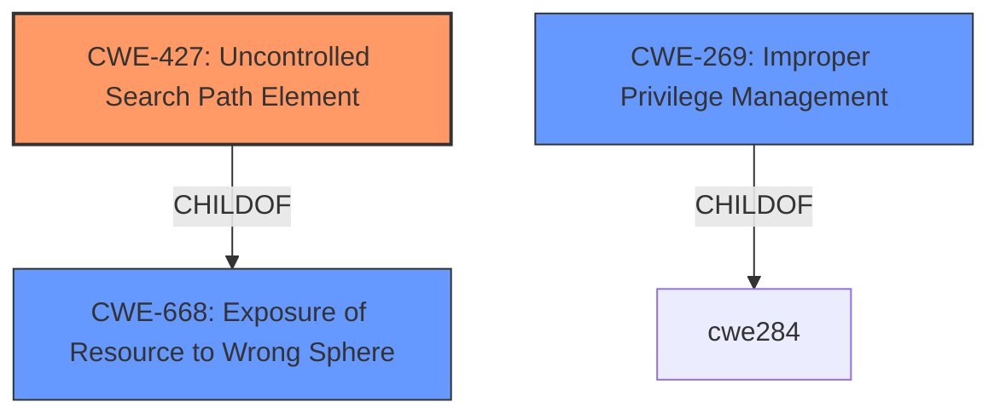

# Analysis Report for CVE-2020-25238

# Vulnerability Analysis Report: CVE-2020-25238

## Description


## Analysis (with Relationship Data)

# Summary
| CWE ID | CWE Name | Confidence | CWE Abstraction Level | CWE Vulnerability Mapping Label | CWE-Vulnerability Mapping Notes |
|---|---|---|---|---|---|
| CWE-427 | Uncontrolled Search Path Element | 0.9 | Base | Allowed | Primary CWE |
| CWE-269 | Improper Privilege Management | 0.5 | Class | Discouraged | Secondary Candidate |

## Evidence and Confidence

*   **Confidence Score:** 0.9
*   **Evidence Strength:** HIGH

## Relationship Analysis
The primary relationship that influenced the decision was the ChildOf relationship between CWE-427 and CWE-668. CWE-427 is a Base level CWE that more specifically describes the **uncontrolled search path element** that leads to the vulnerability, while CWE-668 is a Class level CWE that is too broad. CWE-269 was considered because the vulnerability leads to privilege escalation, however, it is a Class level CWE and is also commonly misused, so it was not selected as the primary CWE.



## Vulnerability Chain
The chain of root cause and weaknesses for this vulnerability is:
1.  **Root Cause:** The Node.js application does not properly set the module search path, leading it to search in `C:\node_modules\`.
2.  **Weakness:** Unprivileged users can create directories and files under the system root (C:\), leading to an **uncontrolled search path element**.
3.  **Impact:** An attacker can place a malicious `.js` file in `C:\node_modules\` which gets executed with SYSTEM privileges when the server starts, leading to arbitrary code execution with SYSTEM privileges and privilege escalation.

## Summary of Analysis
The primary CWE selected was CWE-427, Uncontrolled Search Path Element. This selection is based on the evidence provided in the "CVE Reference Links Content Summary" section, which explicitly states that the Node.js server does not restrict its module search path, leading it to look in a user-writable location (C:\node_modules). The root cause is the **improper configuration of the module search path**, allowing an attacker to place malicious code in a location where it will be executed with elevated privileges.

> The Siemens TIA (Totally Integrated Automation) Portal and PCS neo administration console's Node.js component fails to properly set the module search path. Specifically, the Node.js server searches for modules in `C:\node_modules\` by default when the server is started.
> **Improper Access Control:** Unprivileged Windows users can create directories and files under the system root (C:\).
> **Insecure Module Loading:** The Node.js server doesn't restrict its module search path, leading it to look in a user-writable location (C:\node_modules).

CWE-427 accurately captures this weakness, as it describes a scenario where the product uses a fixed search path, but one or more locations in that path can be under the control of unintended actors.

Other CWEs were considered, but ultimately deemed less appropriate. CWE-269 (Improper Privilege Management) was considered due to the privilege escalation aspect, but the root cause is not directly related to privilege management, but rather the **uncontrolled search path**. Similarly, CWE-200 (Exposure of Sensitive Information to an Unauthorized Actor) was not selected because the vulnerability does not directly involve the exposure of sensitive information.

The final decision to select CWE-427 is based on the specific details of the vulnerability, the relationship analysis, and the mapping guidance provided by MITRE. CWE-427 is at the Base level of abstraction, which is a preferred level for mapping, and accurately represents the **root cause of the vulnerability**.

Relevant CWE Information:

# Enhanced Context (25 CWEs)
The following CWEs were identified as potentially relevant to this vulnerability:

## CWE-668: Exposure of Resource to Wrong Sphere
**Abstraction Level**: Class
**Similarity Score**: 0.76
**Source**: dense

**Description**:
The product exposes a resource to the wrong control sphere, providing unintended actors with inappropriate access to the resource.

**Mapping Guidance**:
- Usage: Discouraged
- Rationale: CWE-668 is high-level and is often misused as a catch-all when lower-level CWE IDs might be applicable. It is sometimes used for low-information vulnerability reports [REF-1287]. It is a level-1 Class (i.e., a child of a Pillar). It is not useful for trend analysis.


## CWE-538: Insertion of Sensitive Information into Externally-Accessible File or Directory
**Abstraction Level**: Base
**Similarity Score**: 0.76
**Source**: dense

**Description**:
The product places sensitive information into files or directories that are accessible to actors who are allowed to have access to the files, but not to the sensitive information.

**Mapping Guidance**:
- Usage: Allowed
- Rationale: This CWE entry is at the Base level of abstraction, which is a preferred level of abstraction for mapping to the root causes of vulnerabilities.


## CWE-74: Improper Neutralization of Special Elements in Output Used by a Downstream Component ('Injection')
**Abstraction Level**: Class
**Similarity Score**: 0.75
**Source**: dense

**Description**:
The product constructs all or part of a command, data structure, or record using externally-influenced input from an upstream component, but it does not neutralize or incorrectly neutralizes special elements that could modify how it is parsed or interpreted when it is sent to a downstream component.

**Mapping Guidance**:
- Usage: Discouraged
- Rationale: CWE-74 is high-level and often misused when lower-level weaknesses are more appropriate.


## CWE-807: Reliance on Untrusted Inputs in a Security Decision
**Abstraction Level**: Base
**Similarity Score**: 0.75
**Source**: dense

**Description**:
The product uses a protection mechanism that relies on the existence or values of an input, but the input can be modified by an untrusted actor in a way that bypasses the protection mechanism.

**Mapping Guidance**:
- Usage: Allowed
- Rationale: This CWE entry is at the Base level of abstraction, which is a preferred level of abstraction for mapping to the root causes of vulnerabilities.


## CWE-653: Improper Isolation or Compartmentalization
**Abstraction Level**: Class
**Similarity Score**: 0.75
**Source**: dense

**Description**:
The product does not properly compartmentalize or isolate functionality, processes, or resources that require different privilege levels, rights, or permissions.

**Mapping Guidance**:
- Usage: Allowed
- Rationale: This CWE entry is at the Base level of abstraction, which is a preferred level of abstraction for mapping to the root causes of vulnerabilities.


## CWE-274: Improper Handling of Insufficient Privileges
**Abstraction Level**: Base
**Similarity Score**: 0.75
**Source**: dense

**Description**:
The product does not handle or incorrectly handles when it has insufficient privileges to perform an operation, leading to resultant weaknesses.

**Mapping Guidance**:
- Usage: Discouraged
- Rationale: This CWE entry could be deprecated in a future version of CWE.


## CWE-41: Improper Resolution of Path Equivalence
**Abstraction Level**: Base
**Similarity Score**: 0.75
**Source**: dense

**Description**:
The product is vulnerable to file system contents disclosure through path equivalence. Path equivalence involves the use of special characters in file and directory names. The associated manipulations are intended to generate multiple names for the same object.

**Mapping Guidance**:
- Usage: Allowed
- Rationale: This CWE entry is at the Base level of abstraction, which is a preferred level of abstraction for mapping to the root causes of vulnerabilities.


## CWE-552: Files or Directories Accessible to External Parties
**Abstraction Level**: Base
**Similarity Score**: 0.75
**Source**: dense

**Description**:
The product makes files or directories accessible to unauthorized actors, even though they should not be.

**Mapping Guidance**:
- Usage: Allowed
- Rationale: This CWE entry is at the Base level of abstraction, which is a preferred level of abstraction for mapping to the root causes of vulnerabilities.


## CWE-345: Insufficient Verification of Data Authenticity
**Abstraction Level**: Class
**Similarity Score**: 0.75
**Source**: dense

**Description**:
The product does not sufficiently verify the origin or authenticity of data, in a way that causes it to accept invalid data.

**Mapping Guidance**:
- Usage: Discouraged
- Rationale: This CWE


## CWE Relationship Analysis

Current CWEs represent these abstraction levels: .


### Vulnerability Chain Analysis

**Chain starting from CWE-41:**
- 41 (Improper Resolution of Path Equivalence) - ROOT


**Chain starting from CWE-653:**
- 653 (Improper Isolation or Compartmentalization) - ROOT


### CWE Relationship Diagram

```mermaid
graph TD
    classDef primary fill:#f96,stroke:#333,stroke-width:2px
    classDef secondary fill:#69f,stroke:#333
    classDef tertiary fill:#9e9,stroke:#333
```


*Report generated on 2025-04-02 12:24:58*
