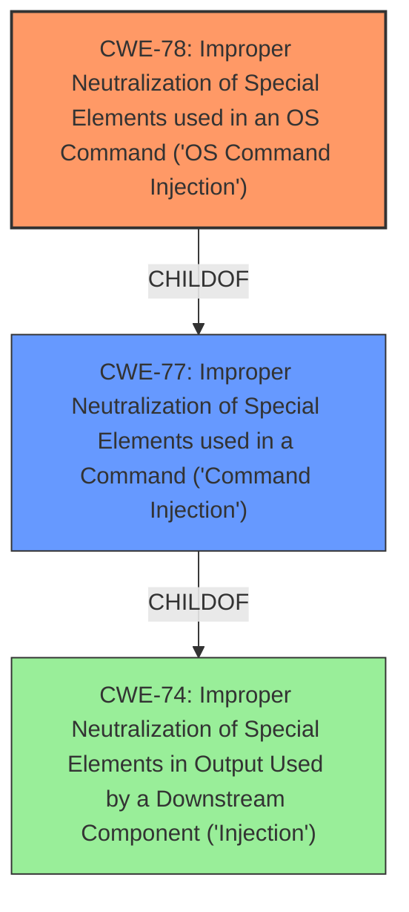

# Raw Analyzer Response for CVE-2020-25368

# Summary
| CWE ID | CWE Name | Confidence | CWE Abstraction Level | CWE Vulnerability Mapping Label | CWE-Vulnerability Mapping Notes |
|---|---|---|---|---|---|
| CWE-78 | Improper Neutralization of Special Elements used in an OS Command ('OS Command Injection') | 1.0 | Base | Allowed | Primary CWE |
| CWE-77 | Improper Neutralization of Special Elements used in a Command ('Command Injection') | 0.7 | Class | Allowed-with-Review | Secondary Candidate |

## Evidence and Confidence

*   **Confidence Score:** 1.0
*   **Evidence Strength:** HIGH

## Relationship Analysis
The primary relationship influencing the selection is the child-of relationship between CWE-78 and CWE-77. CWE-78 is a base variant of the more general class CWE-77. The evidence strongly supports OS command injection, making CWE-78 the more specific and accurate choice.

## Vulnerability Chain
The vulnerability chain starts with the **improper sanitization** of the `PrivateLogin` field. This leads directly to **command injection**, allowing an attacker to **execute arbitrary commands** on the system.

## Summary of Analysis
The initial assessment based on the vulnerability description and CVE reference links clearly points to a **command injection** vulnerability. The key phrase "shell metacharacters in PrivateLogin field to Login" and the statement "The `PrivateLogin` field in the SOAP request is not properly sanitized" strongly indicate that the root cause is an **improper neutralization** of special elements used in a command.

The Retriever Results further support this, with CWE-78 being a top match.

The evidence from "CVE Reference Links Content Summary" section:
- "The root cause is a **command injection** vulnerability in the D-Link DIR-823G router's HNAP1 (Home Network Administration Protocol) implementation. The `PrivateLogin` field in the SOAP request is **not properly sanitized**."
- "**Command Injection:** The primary vulnerability is **command injection**. The router's software takes user-controlled input from the `PrivateLogin` field and uses it in a system call **without proper sanitization**."
- "The software **does not sanitize** the `PrivateLogin` field, allowing an attacker to inject shell metacharacters."
- "Successful exploitation allows an attacker to **execute arbitrary system commands** on the router with root privileges. This could lead to a complete compromise of the device."
- "The vulnerability is present in the `/bin/goahead` binary, where the HNAP API function triggers a call to the system function using user-controlled input."
- "The provided code snippet `la  $v0, aEchoSVarHnaplo ... jal system`  shows that the router is taking the **unsanitized input**, formatting it with `snprintf` into a string, then passing it directly to `system()` for execution."

Based on the information, **CWE-78 (Improper Neutralization of Special Elements used in an OS Command ('OS Command Injection'))** is the most accurate and specific classification. It directly addresses the root cause: the failure to properly sanitize input before using it in a system command.

CWE-77 is considered as a secondary candidate because it is a more general class of command injection, but the evidence is strong that this is OS command injection, so CWE-78 is preferred.

Relevant CWE Information:

# Enhanced Context (25 CWEs)
The following CWEs were identified as potentially relevant to this vulnerability:

## CWE-74: Improper Neutralization of Special Elements in Output Used by a Downstream Component ('Injection')
**Abstraction Level**: Class
**Similarity Score**: 0.78
**Source**: dense

**Description**:
The product constructs all or part of a command, data structure, or record using externally-influenced input from an upstream component, but it does not neutralize or incorrectly neutralizes special elements that could modify how it is parsed or interpreted when it is sent to a downstream component.

**Mapping Guidance**:
- Usage: Discouraged
- Rationale: CWE-74 is high-level and often misused when lower-level weaknesses are more appropriate.

## CWE-184: Incomplete List of Disallowed Inputs
**Abstraction Level**: Base
**Similarity Score**: 0.77
**Source**: dense

**Description**:
The product implements a protection mechanism that relies on a list of inputs (or properties of inputs) that are not allowed by policy or otherwise require other action to neutralize before additional processing takes place, but the list is incomplete.

## CWE-88: Improper Neutralization of Argument Delimiters in a Command ('Argument Injection')
**Abstraction Level**: Base
**Similarity Score**: 0.77
**Source**: dense

**Description**:
The product constructs a string for a command to be executed by a separate component
in another control sphere, but it does not properly delimit the
intended arguments, options, or switches within that command string.

## CWE-138: Improper Neutralization of Special Elements
**Abstraction Level**: Class
**Similarity Score**: 0.76
**Source**: dense

**Description**:
The product receives input from an upstream component, but it does not neutralize or incorrectly neutralizes special elements that could be interpreted as control elements or syntactic markers when they are sent to a downstream component.

## CWE-917: Improper Neutralization of Special Elements used in an Expression Language Statement ('Expression Language Injection')
**Abstraction Level**: Base
**Similarity Score**: 0.75
**Source**: dense

**Description**:
The product constructs all or part of an expression language (EL) statement in a framework such as a Java Server Page (JSP) using externally-influenced input from an upstream component, but it does not neutralize or incorrectly neutralizes special elements that could modify the intended EL statement before it is executed.

## CWE-41: Improper Resolution of Path Equivalence
**Abstraction Level**: Base
**Similarity Score**: 0.75
**Source**: dense

**Description**:
The product is vulnerable to file system contents disclosure through path equivalence. Path equivalence involves the use of special characters in file and directory names. The associated manipulations are intended to generate multiple names for the same object.

## CWE-73: External Control of File Name or Path
**Abstraction Level**: Base
**Similarity Score**: 0.75
**Source**: dense

**Description**:
The product allows user input to control or influence paths or file names that are used in filesystem operations.

## CWE-134: Use of Externally-Controlled Format String
**Abstraction Level**: Base
**Similarity Score**: 0.74
**Source**: dense

**Description**:
The product uses a function that accepts a format string as an argument, but the format string originates from an external source.

## CWE-1289: Improper Validation of Unsafe Equivalence in Input
**Abstraction Level**: Base
**Similarity Score**: 0.74
**Source**: dense

**Description**:
The product receives an input value that is used as a resource identifier or other type of reference, but it does not validate or incorrectly validates that the input is equivalent to a potentially-unsafe value.

## CWE-183: Permissive List of Allowed Inputs
**Abstraction Level**: Base
**Similarity Score**: 0.74
**Source**: dense

**Description**:
The product implements a protection mechanism that relies on a list of inputs (or properties of inputs) that are explicitly allowed by policy because the inputs are assumed to be safe, but the list is too permissive - that is, it allows an input that is unsafe, leading to resultant weaknesses.

## CWE-88: Improper Neutralization of Argument Delimiters in a Command ('Argument Injection')
**Abstraction Level**: Base
**Similarity Score**: 8251.32
**Source**: sparse

**Description**:
The product constructs a string for a command to be executed by a separate component
in another control sphere, but it does not properly delimit the
intended arguments, options, or switches within that command string.

## CWE-116: Improper Encoding or Escaping of Output
**Abstraction Level**: Class
**Similarity Score**: 8239.92
**Source**: sparse

**Description**:
The product prepares a structured message for communication with another component, but encoding or escaping of the data is either missing or done incorrectly. As a result, the intended structure of the message is not preserved.

## CWE-184: Incomplete List of Disallowed Inputs
**Abstraction Level**: Base