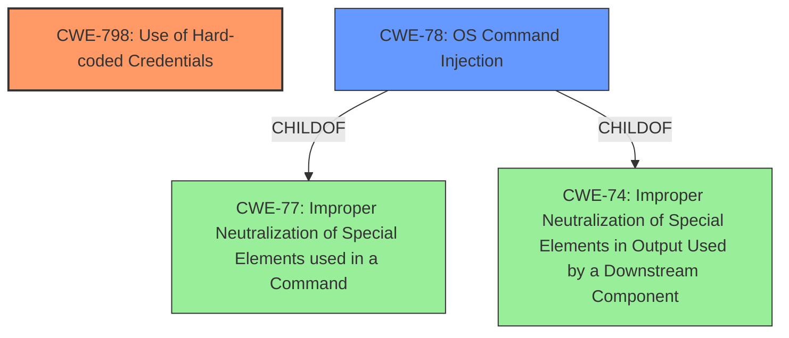

# Analysis for CVE-2020-25560

# Summary
| CWE ID    | CWE Name                                                                                                                                     | Confidence | CWE Abstraction Level | CWE Vulnerability Mapping Label | CWE-Vulnerability Mapping Notes |
| :-------- | :------------------------------------------------------------------------------------------------------------------------------------------- | :--------- | :---------------------- | :------------------------------ | :------------------------------ |
| CWE-798   | Use of Hard-coded Credentials                                                                                                                | 1          | Base                    | Primary                         | Allowed                       |
| CWE-78    | Improper Neutralization of Special Elements used in an OS Command ('OS Command Injection')                                                   | 1          | Base                    | Secondary                       | Allowed                       |

## Evidence and Confidence

*   **Confidence Score:** 1
*   **Evidence Strength:** HIGH

## Relationship Analysis
The primary weakness is the use of hardcoded credentials (CWE-798), which allows unauthorized access. Once authenticated (or bypassing authentication altogether), an attacker can inject OS commands (CWE-78). CWE-798 is a base-level weakness, which is appropriate here. CWE-78 is also a base-level weakness and accurately reflects the command injection vulnerability. CWE-78 is a child of CWE-77 (Improper Neutralization of Special Elements used in a Command) and CWE-74 (Improper Neutralization of Special Elements in Output Used by a Downstream Component ('Injection')). This relationship highlights the broader category of injection vulnerabilities.

## Vulnerability Chain
The chain of events begins with the **hardcoded credentials** (CWE-798) allowing access, followed by the **command injection** vulnerability (CWE-78).

## Summary of Analysis
The vulnerability description clearly states the use of **hardcoded credentials** in SapphireIMS 5.0, enabling access to the portal. Once inside, an attacker can inject malicious OS commands. The CVE reference links content summary confirms the **hardcoded credentials** and **command injection** as key weaknesses.

The selection of CWE-798 is based on the direct evidence of **hardcoded credentials** being used. CWE-78 is chosen because the attacker can inject malicious OS commands once they have access. Both CWEs are at the Base level of abstraction, which is the preferred level.

CWE-259 (Use of Hard-coded Password) and CWE-321 (Use of Hard-coded Cryptographic Key) were considered as more specific variants of CWE-798. However, since the description explicitly mentions both username and password, CWE-798 is the most appropriate choice as it encompasses both types of credentials. CWE-287 (Improper Authentication) was also considered, but CWE-798 is more specific to the root cause of the vulnerability. CWE-1392 (Use of Default Credentials) was considered, but **hardcoded credentials** are not necessarily default credentials, they are embedded directly in the application's code so CWE-798 is a better fit.

Relevant CWE Information:

# Enhanced Context (25 CWEs)
The following CWEs were identified as potentially relevant to this vulnerability:

## CWE-74: Improper Neutralization of Special Elements in Output Used by a Downstream Component ('Injection')
**Abstraction Level**: Class
**Similarity Score**: 0.77
**Source**: dense

**Description**:
The product constructs all or part of a command, data structure, or record using externally-influenced input from an upstream component, but it does not neutralize or incorrectly neutralizes special elements that could modify how it is parsed or interpreted when it is sent to a downstream component.

**Mapping Guidance**:
- Usage: Discouraged
- Rationale: CWE-74 is high-level and often misused when lower-level weaknesses are more appropriate.

## CWE-915: Improperly Controlled Modification of Dynamically-Determined Object Attributes
**Abstraction Level**: Base
**Similarity Score**: 0.74
**Source**: dense

**Description**:
The product receives input from an upstream component that specifies multiple attributes, properties, or fields that are to be initialized or updated in an object, but it does not properly control which attributes can be modified.

**Mapping Guidance**:
- Usage: Allowed
- Rationale: This CWE entry is at the Base level of abstraction, which is a preferred level of abstraction for mapping to the root causes of vulnerabilities.

## CWE-807: Reliance on Untrusted Inputs in a Security Decision
**Abstraction Level**: Base
**Similarity Score**: 0.74
**Source**: dense

**Description**:
The product uses a protection mechanism that relies on the existence or values of an input, but the input can be modified by an untrusted actor in a way that bypasses the protection mechanism.

**Mapping Guidance**:
- Usage: Allowed
- Rationale: This CWE entry is at the Base level of abstraction, which is a preferred level of abstraction for mapping to the root causes of vulnerabilities.

## CWE-99: Improper Control of Resource Identifiers ('Resource Injection')
**Abstraction Level**: Class
**Similarity Score**: 0.74
**Source**: dense

**Description**:
The product receives input from an upstream component, but it does not restrict or incorrectly restricts the input before it is used as an identifier for a resource that may be outside the intended sphere of control.

**Mapping Guidance**:
- Usage: Allowed-with-Review
- Rationale: This CWE entry is a Class and might have Base-level children that would be more appropriate

## CWE-470: Use of Externally-Controlled Input to Select Classes or Code ('Unsafe Reflection')
**Abstraction Level**: Base
**Similarity Score**: 0.74
**Source**: dense

**Description**:
The product uses external input with reflection to select which classes or code to use, but it does not sufficiently prevent the input from selecting improper classes or code.

**Mapping Guidance**:
- Usage: Allowed
- Rationale: This CWE entry is at the Base level of abstraction, which is a preferred level of abstraction for mapping to the root causes of vulnerabilities.

## CWE-502: Deserialization of Untrusted Data
**Abstraction Level**: Base
**Similarity Score**: 0.74
**Source**: dense

**Description**:
The product deserializes untrusted data without sufficiently ensuring that the resulting data will be valid.

**Mapping Guidance**:
- Usage: Allowed
- Rationale: This CWE entry is at the Base level of abstraction, which is a preferred level of abstraction for mapping to the root causes of vulnerabilities.

## CWE-138: Improper Neutralization of Special Elements
**Abstraction Level**: Class
**Similarity Score**: 0.73
**Source**: dense

**Description**:
The product receives input from an upstream component, but it does not neutralize or incorrectly neutralizes special elements that could be interpreted as control elements or syntactic markers when they are sent to a downstream component.

**Mapping Guidance**:
- Usage: Discouraged
- Rationale: This CWE entry is a level-1 Class (i.e., a child of a Pillar). It might have lower-level children that would be more appropriate

## CWE-917: Improper Neutralization of Special Elements used in an Expression Language Statement ('Expression Language Injection')
**Abstraction Level**: Base
**Similarity Score**: 0.73
**Source**: dense

**Description**:
The product constructs all or part of an expression language (EL) statement in a framework such as a Java Server Page (JSP) using externally-influenced input from an upstream component, but it does not neutralize or incorrectly neutralizes special elements that could modify the intended EL statement before it is executed.

**Mapping Guidance**:
- Usage: Allowed
- Rationale: This CWE entry is at the Base level of abstraction, which is a preferred level of abstraction for mapping to the root causes of vulnerabilities.

## CWE-1391: Use of Weak Credentials
**Abstraction Level**: Class
**Similarity Score**: 0.73
**Source**: dense

**Description**:
The product uses weak credentials (such as a default key or hard-coded password) that can be calculated, derived, reused, or guessed by an attacker.

**Mapping Guidance**:
- Usage: Allowed-with-Review
- Rationale: This CWE entry is a Class and might have Base-level children that would be more appropriate

## CWE-184: Incomplete List of Disallowed Inputs
**Abstraction Level**: Base
**Similarity Score**: 0.73
**Source**: dense

**Description**:
The product implements a protection mechanism that relies